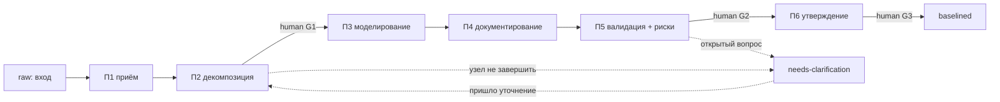

# ADR-009: Многоуровневый процесс формирования BCREQ — подпроцессы, human gates, механизм незавершённых подпроцессов

> **Статус:** Proposed · **Дата:** 2026-06-16 · **Issue:**
> <https://github.com/G-Ivan-A/mango_ba_prompts/issues/97> · **Стандарт-контракт:**
> <https://github.com/G-Ivan-A/mango_ba_prompts/blob/main/standards/bcreq-process-standard.md>

> **Numbering note.** ADR-009 — трёхзначная дорожка стандартов. См.
> [ADR-002](002-pattern-standard.md).

## Контекст

Issue #97 (ФТ-7) требует предложить **многоуровневый процесс формирования
BCREQ**: многоуровневый процесс (Исполнитель выбирает **оптимальное количество
подпроцессов**), **human gates в ключевых точках**, **жёсткое требование** —
механизм для работы с незавершёнными подпроцессами, и **доказательство** —
**пример реального процесса**.

Три слоя для этого уже зафиксированы предыдущими ADR, но сам процесс отсутствует:

1. **Вертикальная многоуровневость артефакта** — схема ID
   `BCREQ-<NNN>[.<k>[.<m>]]` и правило N8 ([ADR-005](005-artifact-team-naming.md),
   [artifact-naming-standard.md §4](../../standards/artifact-naming-standard.md));
2. **Состояния жизненного цикла** — `needs-clarification` и правила С5/С6 как
   точка подключения механизма незавершённости
   ([ADR-003](003-ba-ontology.md), [ba-ontology.md §5](../../standards/ba-ontology.md));
3. **Карта процессов и операций** — 9 процессов БА, 13 операций и их исполнители
   ([docs/ba-processes/00-index.md](../ba-processes/00-index.md),
   [taxonomy.md](../taxonomy.md), [ADR-004](004-operations-taxonomy.md)).

Не хватает связующего процесса: как из сырого входа получается **многоуровневый**
BCREQ, где стоят **human gates** и как процесс ведёт себя, когда **часть дерева
не может быть завершена**. Файл также снимает висячие ссылки на `ADR-009`,
которые уже есть в [team-directory.md](../../standards/team-directory.md) и
[artifact-naming-standard.md](../../standards/artifact-naming-standard.md).

> Примечание о роли. Режим `Creative`+`Research` даёт право предложить процесс и
> выбрать оптимальное число подпроцессов при обосновании. Процесс **не вводит
> новых операций** и **не отменяет** `risk_analysis` — он связывает уже
> утверждённые сущности (НФТ совместимости).

## Решение

Вводим контракт
[bcreq-process-standard.md](../../standards/bcreq-process-standard.md).

### 1. «Многоуровневый» = две ортогональные оси

| Ось | Что декомпозируется | Источник |
| --- | --- | --- |
| **Вертикаль** (дерево требования) | BCREQ → под-требования dotted-нотацией (`BCREQ-014` → `.3` → `.3.2`) | N4/N8 ([ADR-005](005-artifact-team-naming.md)) |
| **Горизонталь** (конвейер формирования) | каждый узел дерева | подпроцессы П1-П6 (§2) |

Конвейер **фрактален** (правило B1): корень и каждый под-уровень проходят один и
тот же конвейер. Это согласует требование «многоуровневый процесс» с уже
существующей многоуровневостью идентификатора и опирается на декомпозицию
требований BABOK (RADD/RLCM) и иерархию требований ISO/IEC/IEEE 29148.

### 2. Конвейер подпроцессов (выбрано оптимальное число — 6)

| № | Подпроцесс | Операции | Процесс | Переход ЖЦ | Gate |
| --- | --- | --- | --- | --- | --- |
| П1 | Приём и нормализация контекста | `ingestion`, `understanding` | 1, 6 | `raw` → `draft` | operation |
| П2 | Декомпозиция на уровни BCREQ | `understanding`, `modeling` | 1, 4 | `draft` → `draft` | **human G1** |
| П3 | Моделирование сценариев | `modeling` | 4 | `draft` → `draft` | operation |
| П4 | Документирование (бизнес + коммерческий слой) | `documentation`, `solution_design` | 1 | `draft` → `in-review` | operation |
| П5 | Валидация и риски | `validation`, `quality`, `risk_analysis` | 2, 9 | `in-review` → `validated` | **human G2** |
| П6 | Утверждение и baselining | `governance`, `release_readiness` | governance | `validated` → `approved` → `baselined` | **human G3** |

**Почему 6 — оптимум (обоснование выбора Исполнителя):**

- **Нижняя граница.** Нужно ≥3 различных границы, чтобы разместить три
  обязательных human gate (структура декомпозиции, приёмка рисков, утверждение).
- **Верхняя граница.** ФТ-8 объявляет «> 20 подпроцессов» порогом UX-сложности
  (требует дерева в интерфейсе); governance-overhead растёт с числом gate — число
  держим на порядок ниже порога.
- **Совместимость.** Подпроцессы переиспользуют существующие 13 операций (новые
  **не вводятся**), которые естественно кластеризуются в 6 фаз: приём →
  декомпозиция → моделирование → документирование → валидация+риски → утверждение.
- **Вывод.** 6 — минимальный набор, покрывающий жизненный цикл `raw` →
  `baselined`, несущий все human gate на различных границах и остающийся далеко
  ниже UX-порога. Исполнитель **МОЖЕТ** сворачивать необязательные подпроцессы
  (П3 при отсутствии сценариев), но не подпроцессы с human gate (B2).



### 3. Human gates в ключевых точках

Три обязательных human gate привязаны к операциям-исполнителям `человек`
([ba-ontology.md §3](../../standards/ba-ontology.md), С3) и governance-модели
«молчание = согласие» ([ADR-0003](0003-creative-mode-governance.md)). Понятие
«gate» соответствует gateway/точке решения процессной нотации OMG BPMN 2.0.

- **G1 @ конец П2** — согласование структуры уровней BCREQ (необратимое решение о
  декомпозиции).
- **G2 @ конец П5** — `risk_analysis` (исполнитель `человек`): high/compliance-
  риски имеют owner-review.
- **G3 @ конец П6** — утверждение и baselining: переход `validated` → `approved`
  → `baselined` (С6).

Правило B3: G1/G2/G3 **НЕ ДОЛЖНЫ** проходиться автоматически LLM; прочие
границы — operation gate.

### 4. Механизм незавершённых подпроцессов (жёсткое требование)

Опирается на состояние `needs-clarification` (С5) — оно вводилось в
[ADR-003](003-ba-ontology.md) именно как точка подключения этого механизма.

- **B4 (пометка).** Узел, который нельзя завершить, → `needs-clarification` с
  {причина, owner, ссылка на `customer-questions` (A08), подпроцесс-точка
  останова}.
- **B5 (неблокирование).** Узел в `needs-clarification` **НЕ блокирует**
  независимые узлы дерева; зависимые помечаются явной зависимостью (R12).
- **B6 (частичный baseline).** Родитель **МОЖЕТ** достигнуть `validated` частично
  (манифест children: `validated`/`needs-clarification`), но **НЕ** `approved`/
  `baselined`, пока блокирующий ребёнок открыт (gate G3).
- **B7 (возобновление).** Уточнение → `needs-clarification` → `draft`/`in-review`,
  узел повторно входит в конвейер с точки останова; трассируемость сохраняется.

## Доказательная база

- **Декомпозиция требований и трассировка** — BABOK Guide v3 (RADD, RLCM —
  Trace Requirements):
  <https://www.iiba.org/career-resources/a-business-analysis-professionals-foundation-for-success/babok/>
- **Иерархия требований, атрибут статуса/жизненного цикла, traceability** —
  ISO/IEC/IEEE 29148:2018: <https://www.iso.org/standard/72089.html>
- **Структура ТЗ — целевой документ BCREQ** — ГОСТ 34.602-2020:
  <https://docs.cntd.ru/document/1200181804>
- **Gateways/gates как точки решения процесса** — OMG BPMN 2.0:
  <https://www.omg.org/spec/BPMN/2.0/>
- **Внутренние основания** — `needs-clarification` и С5/С6
  ([ba-ontology.md §5](../../standards/ba-ontology.md)); исполнители-`человек`
  ([§3](../../standards/ba-ontology.md), С3); governance
  ([ADR-0003](0003-creative-mode-governance.md)).
- **Пример реального процесса (доказательство ФТ-7)** — §Примеры ниже.

## Примеры

### Пример реального процесса: дерево `BCREQ-014` (маршрутизация callback)

Реальный сценарий из карты процессов
([00-index.md](../ba-processes/00-index.md), направление `internal-product`):
**«улучшить маршрутизацию callback в контакт-центре»**. Команда-владелец —
`BCREQ`; корневой артефакт в namespace-форме — `BCREQ:BCREQ-014`.

**Дерево уровней (результат П2, после human gate G1):**

```text
BCREQ-014                 Улучшение маршрутизации callback (корень)
├── BCREQ-014.1           Приоритизация callback по SLA
├── BCREQ-014.2           Контекст звонящего из CRM
└── BCREQ-014.3           Skill-based routing
    ├── BCREQ-014.3.1     Матрица навыков операторов
    └── BCREQ-014.3.2     Алгоритм выбора оператора  ← needs-clarification
```

**Прогон узлов по конвейеру (горизонтальная ось):**

| Узел | П1 | П2/G1 | П3 | П4 | П5/G2 | П6/G3 | Итоговое состояние |
| --- | --- | --- | --- | --- | --- | --- | --- |
| `BCREQ-014.1` | ✓ | ✓ | ✓ | ✓ | ✓ | ✓ | `baselined` |
| `BCREQ-014.2` | ✓ | ✓ | ✓ | ✓ | ✓ | — | `validated` |
| `BCREQ-014.3.1` | ✓ | ✓ | ✓ | ✓ | ✓ | — | `validated` |
| `BCREQ-014.3.2` | ✓ | ✓ | — | — | — | — | **`needs-clarification`** |
| `BCREQ-014` (корень) | ✓ | ✓ | ✓ | ✓ | частично | — | `in-review` (частичный baseline) |

**Срабатывание механизма незавершённости (B4-B7):**

- На П3 узла `BCREQ-014.3.2` возникает **открытый вопрос**: критерий выбора при
  равных навыках операторов (например, «по нагрузке» vs «по рейтингу») — это
  продуктовое решение Пользователя/PO, а не домысел LLM. Узел переводится в
  `needs-clarification` (B4): причина = «не задан критерий приоритета», owner =
  PO, ссылка = `BCREQ:QST-014` (`customer-questions`, A08), точка останова = П3.
- **Неблокирование (B5):** независимые узлы `014.1`, `014.2`, `014.3.1`
  продолжают конвейер. `014.1` доходит до `baselined`; `014.2` и `014.3.1` — до
  `validated` и ждут общего утверждения релиза.
- **Частичный baseline (B6):** корень `BCREQ-014` собирает манифест детей и
  остаётся в `in-review`; **не** уходит в `approved`/`baselined`, потому что
  блокирующий ребёнок `014.3.2` открыт (gate G3 не пройден для всего дерева).
- **Возобновление (B7):** PO отвечает «приоритет по текущей нагрузке оператора».
  `014.3.2` переходит `needs-clarification` → `draft`, повторно входит в конвейер
  с **П3** (точка останова), проходит П4-П6; затем gate G3 закрывается для корня,
  и `BCREQ-014` целиком уходит в `baselined`.

### Пример именования и трассируемости (B8)

- ID узла: `BCREQ-014.3.2`; namespace-форма с командой-владельцем:
  `BCREQ:BCREQ-014.3.2` (роль команды и тип артефакта разведены, T2).
- Трассировка (R12): `BCREQ-014.3.2` ← `BCREQ:UC-003` (use-case) ←
  `BCREQ:GLO-014` (task-glossary) ← `BCREQ:ASR-014` (asr-transcript-raw).

## Self-test

1. **Дано:** в одном под-узле BCREQ — открытый вопрос. **Ожидаемо:** узел →
   `needs-clarification`, независимые узлы продолжаются, корень не `baselined`.
   **Acceptance:** B4-B6 + таблица прогона.
2. **Дано:** LLM пытается перевести BCREQ в `approved` без человека. **Ожидаемо:**
   заблокировано gate G3 (С6). **Acceptance:** B3.
3. **Дано:** простой BCREQ без сценариев. **Ожидаемо:** П3 свёрнут, П2/П5/П6
   сохранены. **Acceptance:** B2.

Локально: `python3 scripts/validate_issue_97_ontology_standards.py`.

## Последствия

**Положительные:**

- Исполняемый, проверяемый многоуровневый процесс с явными human gate на
  необратимых решениях (структура, риск, утверждение) — НФТ трассируемости.
- Механизм незавершённости **не блокирует** поток: независимые ветви идут вперёд,
  частичный baseline возможен (прямое выполнение жёсткого требования ФТ-7).
- Снимает висячие ссылки на ADR-009 из team-directory и artifact-naming-standard.

**Отрицательные / технический долг:**

- Манифест частичного baseline нужно где-то хранить (пока — поле в BCREQ или
  `traceability-matrix` A27); формат манифеста — кандидат на отдельный issue.
- Конвейер из 6 подпроцессов нужно отразить в UX GitHub Pages
  ([ADR-010](010-pages-ux.md), ФТ-8).
- Число подпроцессов — обоснованная рекомендация, требует калибровки на практике.

## Альтернативы (отклонены)

1. **Плоский (одноуровневый) процесс без дерева.** Отклонено: BCREQ по
   определению многоуровневый (A30, N4) — потеряли бы декомпозицию и частичный
   baseline.
2. **Блокировать весь BCREQ при любом незавершённом под-узле.** Отклонено:
   нарушает С5 (не блокировать остальной процесс) и убивает параллельность ветвей.
3. **Разрешить LLM автоутверждение ради скорости.** Отклонено: нарушает С3/С6 и
   governance [ADR-0003](0003-creative-mode-governance.md); отменять `risk_analysis`
   запрещено issue.
4. **Очень дробный конвейер (> 20 подпроцессов).** Отклонено: ФТ-8 объявляет это
   UX-порогом; рост governance-overhead без выигрыша в качестве.

## Связанные артефакты

- Issue #97: <https://github.com/G-Ivan-A/mango_ba_prompts/issues/97>
- PR #98: <https://github.com/G-Ivan-A/mango_ba_prompts/pull/98>
- Контракт (подпроцессы, gate'ы, механизм незавершённости):
  <https://github.com/G-Ivan-A/mango_ba_prompts/blob/main/standards/bcreq-process-standard.md>
- ADR-003 (онтология, `needs-clarification`, С5/С6):
  <https://github.com/G-Ivan-A/mango_ba_prompts/blob/main/docs/adr/003-ba-ontology.md>
- ADR-005 (нейминг BCREQ, N4/N8):
  <https://github.com/G-Ivan-A/mango_ba_prompts/blob/main/docs/adr/005-artifact-team-naming.md>
- Карта 9 процессов:
  <https://github.com/G-Ivan-A/mango_ba_prompts/blob/main/docs/ba-processes/00-index.md>

### Международные стандарты (полные URL, сверено)

- BABOK Guide v3: <https://www.iiba.org/career-resources/a-business-analysis-professionals-foundation-for-success/babok/>
- ISO/IEC/IEEE 29148:2018: <https://www.iso.org/standard/72089.html> · <https://standards.ieee.org/ieee/29148/6937/>
- ГОСТ 34.602-2020: <https://docs.cntd.ru/document/1200181804>
- ГОСТ 34.601-90 (стадии создания АС): <https://docs.cntd.ru/document/1200006921>
- OMG BPMN 2.0: <https://www.omg.org/spec/BPMN/2.0/>
- RFC 2119 / BCP 14: <https://www.rfc-editor.org/info/bcp14>
