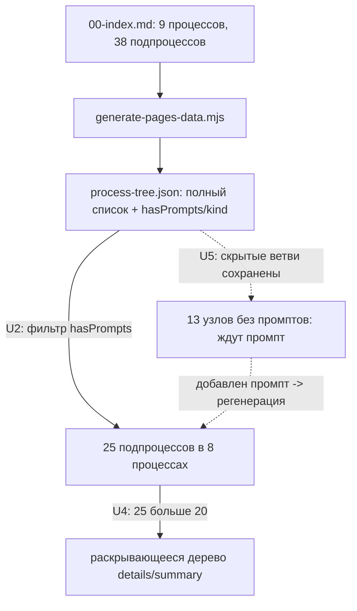
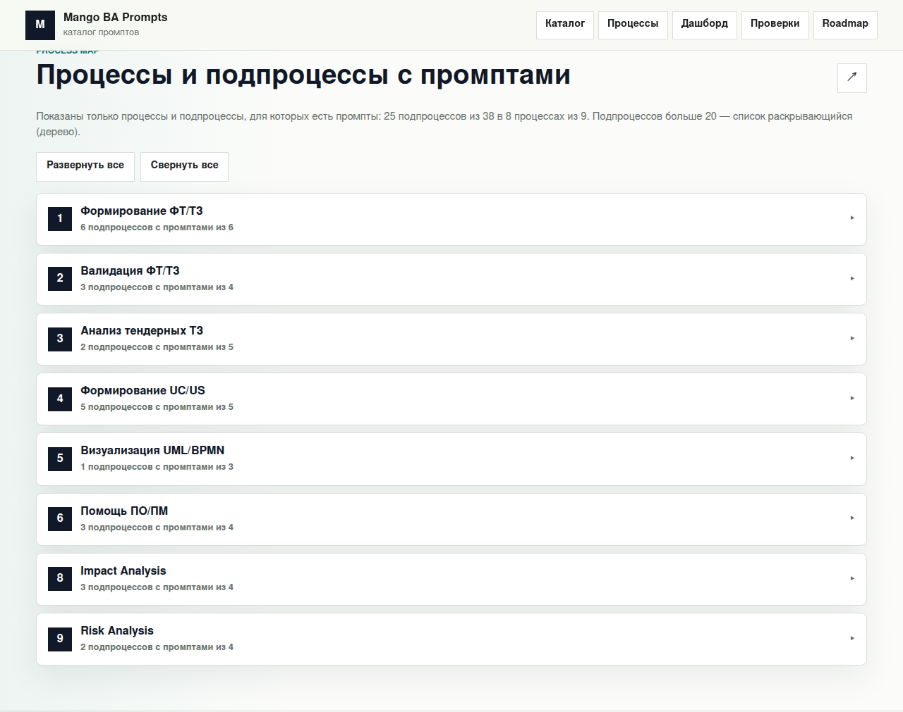
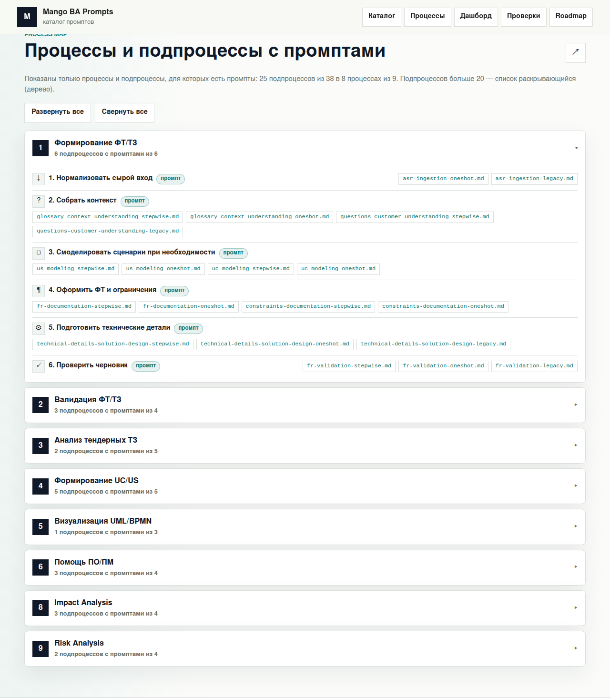

# ADR-010: UX GitHub Pages — дерево процессов/подпроцессов, показывающее только элементы с промптами

> **Статус:** Proposed · **Дата:** 2026-06-16 · **Issue:**
> <https://github.com/G-Ivan-A/mango_ba_prompts/issues/97> · **Стандарт-контракт:**
> <https://github.com/G-Ivan-A/mango_ba_prompts/blob/main/standards/pages-ux-standard.md>

> **Numbering note.** ADR-010 — трёхзначная дорожка стандартов (как ADR-003…009).
> Четырёхзначная дорожка (ADR-0001…) — governance/исторические записи. См.
> [ADR-002](002-pattern-standard.md).

## Контекст

Issue #97 (ФТ-8) требует **предложить UX-решения для GitHub Pages**:

1. **«Сформировать полный список процессов и подпроцессов».**
2. **Жёсткое требование:** «В интерфейс GitHub Pages вывести **только те
   процессы/подпроцессы, для которых есть промпты**».
3. «Если подпроцессов **> 20** → использовать **дерево** (раскрывающийся список)».
4. **Доказательство:** «Прототип интерфейса (скриншоты или описание)».

Контекст уже частично готов, но процессного вида в нём нет:

- **GitHub Pages-сайт** существует (каталог промптов, дашборд, проверки, roadmap)
  и собирается генератором
  [scripts/generate-pages-data.mjs](../../scripts/generate-pages-data.mjs) из
  markdown в `site/data/*.json` (issues #74/#91/#92).
- **Карта процессов** — 9 процессов БА и их детальные пошаговые карты
  ([docs/ba-processes/00-index.md](../ba-processes/00-index.md)); подпроцесс =
  строка-шаг в детальной карте (`<процесс>.<шаг>`).
- **Онтология/таксономия** — 13 операций, состояния ЖЦ, исполнители
  ([ADR-003](003-ba-ontology.md), [ADR-004](004-operations-taxonomy.md)).

Чего не хватает: вида «процесс → подпроцессы → промпты», который (а) строит
полный список, но (б) по жёсткому требованию показывает **только узлы с
промптами**, (в) переключается на дерево при > 20 видимых подпроцессах и
(г) не ломается, когда подпроцесс ещё **не покрыт** промптом (механизм
незавершённости, ФТ-7).

> Примечание о роли. Режим `Creative`+`Research` даёт право предложить UX и
> обосновать пороги. Решение **не меняет и не создаёт промпты**, **не вводит
> выдуманных команд** и **не отменяет** `risk_analysis` — оно лишь визуализирует
> уже существующую карту процессов (НФТ совместимости).

## Решение

Вводим контракт
[pages-ux-standard.md](../../standards/pages-ux-standard.md) и реализуем его на
сайте. Решение разделено на **слой данных** (полный список, прослеживаемость) и
**слой отображения** (жёсткое требование «только с промптами»).

### 1. Слой данных: полный список в `site/data/process-tree.json` (U1)

Генератор парсит **детальные карты** 00-index.md и строит полный список **всех**
процессов и подпроцессов. Каждому подпроцессу присваивается флаг `hasPrompts` и
тип покрытия `kind`:

| `kind` | Что значит | `hasPrompts` | Видимость |
| --- | --- | --- | --- |
| `direct` | шаг выполняет активный промпт | да | показан |
| `support` | ручной шаг, опирающийся на активный промпт | да | показан |
| `gap` | помечен «Требуется разработка промпта» | нет | скрыт |
| `archive` | ссылка только на `prompts/archive/` | нет | скрыт |
| `manual` | «Выполняется вручную», промпта нет | нет | скрыт |

«Есть промпт» (U3) = есть **хотя бы одна** ссылка на активный файл в `prompts/`
(не в `prompts/archive/`). Полный список (включая скрытые ветви) остаётся в JSON —
это даёт прослеживаемость (НФТ) и пред-RAG-индекс
([ADR-007](007-kb-standard.md)): структура «подпроцесс → промпт» — ровно тот
машиночитаемый источник, который позже потребляет RAG.

### 2. Жёсткое требование: показываем только узлы с промптами (U2)

Слой отображения ([site/app.js](../../site/app.js), `renderProcessTree`/
`processNode`) фильтрует:

- подпроцесс показывается **тогда и только тогда**, когда `hasPrompts === true`;
- процесс показывается, только если у него ≥ 1 видимый подпроцесс
  (`subprocessShown > 0`); процесс без промптов **скрывается целиком**.

Это «defense-in-depth»: фильтрация видна и в счётчиках данных, и в рендере.

**Фактические числа (сверено генератором, 2026-06-16):**

| Метрика | Значение |
| --- | --- |
| Процессов всего / показано | 9 / **8** (процесс 7 «Статистика» скрыт — 0 промптов) |
| Подпроцессов всего / показано | 38 / **25** |
| Из них `direct` / `support` | 20 / 5 |
| Скрыто (`manual` / `archive`) | 11 / 2 |

Подробно по процессам: #1 6/6, #2 3/4, #3 2/5, #4 5/5, #5 1/3, #6 3/4,
**#7 0/3 (скрыт)**, #8 3/4, #9 2/4 (показано/всего).

### 3. Порог дерева: > 20 → раскрывающийся список (U4)

Показано **25** подпроцессов, `25 > 20` → `useTree = true`. Дерево —
нативные `
`/`
` (раскрывающийся список): узлы по умолчанию
**свёрнуты**, добавлены кнопки «Развернуть все» / «Свернуть все». Порог `20` —
не выдуманная константа, он задан **самим ФТ-8**; принцип «прятать детали за
раскрытием» — прогрессивное раскрытие (NN/g) и паттерн Disclosure/TreeView
(W3C ARIA APG). При ≤ 20 видимых подпроцессах список рендерится развёрнутым и
кнопки скрыты (одна кодовая ветвь масштабируется в обе стороны).

### 4. Механизм незавершённых подпроцессов на уровне Pages (U5, ФТ-7)

Незавершённый подпроцесс (нет промпта: `gap`/`manual`/`archive`) **не удаляется**
из данных — он остаётся в `process-tree.json` со своим `kind`. Когда для него
позже добавляют промпт (правка 00-index.md), **регенерация автоматически**
переводит узел в `direct`/`support` и он появляется в интерфейсе — **без правки
кода UI**. Это Pages-проекция процессного механизма незавершённости
([ADR-009](009-bcreq-formation-process.md), B4-B7: `needs-clarification`,
неблокирование, возобновление).

### 5. Масштабируемость и совместимость (U6, U7)

- Источник истины — только markdown ([00-index.md](../ba-processes/00-index.md));
  дерево **не содержит** рукописных процессов/подпроцессов/промптов (U6,
  анти-фабрикация). Ссылки на промпты разрешаются в реальные файлы `prompts/`.
- Добавление процесса/подпроцесса/промпта/команды = правка markdown +
  регенерация; **код UI не меняется** (U7). Это поддерживает рост 9 → больше
  процессов и 2 → 10+ команд (НФТ масштабируемости).

## Доказательная база

- **Прогрессивное раскрытие (прятать вторичное за раскрытием)** — Nielsen Norman
  Group, «Progressive Disclosure»:
  <https://www.nngroup.com/articles/progressive-disclosure/>
- **«Показывать только релевантное» / минимализм** — NN/g, 10 Usability
  Heuristics (#6 Recognition rather than recall, #8 Aesthetic and minimalist
  design): <https://www.nngroup.com/articles/ten-usability-heuristics/>
- **Паттерн Disclosure (Show/Hide)** — W3C WAI-ARIA Authoring Practices Guide:
  <https://www.w3.org/WAI/ARIA/apg/patterns/disclosure/>
- **Паттерн Tree View** — W3C WAI-ARIA APG:
  <https://www.w3.org/WAI/ARIA/apg/patterns/treeview/>
- **Нативный раскрывающийся виджет** — WHATWG HTML Living Standard, элемент
  `
`:
  <https://html.spec.whatwg.org/multipage/interactive-elements.html#the-details-element>
  · MDN: <https://developer.mozilla.org/en-US/docs/Web/HTML/Reference/Elements/details>
- **Доступность (info & relationships, keyboard)** — WCAG 2.1:
  <https://www.w3.org/TR/WCAG21/>
- **Внутренние основания** — карта процессов
  ([00-index.md](../ba-processes/00-index.md)); генератор и данные
  ([generate-pages-data.mjs](../../scripts/generate-pages-data.mjs),
  `site/data/process-tree.json`); механизм незавершённости
  ([ADR-009](009-bcreq-formation-process.md)); пред-RAG-индекс
  ([ADR-007](007-kb-standard.md)).
- **Прототип (доказательство ФТ-8)** — §Примеры ниже (скриншоты).
- **Порог `> 20`** — задан issue #97 (ФТ-8), не выдуман:
  <https://github.com/G-Ivan-A/mango_ba_prompts/issues/97>

## Примеры

### Прототип интерфейса (скриншоты)

**Свёрнутое дерево** (8 процессов, у каждого — счётчик «N подпроцессов с
промптами из M»; процесс 7 отсутствует, кнопки «Развернуть/Свернуть все» видны,
т.к. `useTree`):

**Развёрнутый процесс #1 «Формирование ФТ/ТЗ» (6/6):** каждый подпроцесс — иконка
операции, название шага, бейдж типа (`промпт`/`поддержка`) и ссылки на файлы
промптов в GitHub:

### Как жёсткое требование видно на данных

- **Процесс #7 «Статистика» (0/3)** — все 3 подпроцесса без активного промпта
  (`tz-stats-prototype` — эксперимент, не активный промпт) → процесс **скрыт
  целиком**.
- **Процесс #3 «Анализ тендерных ТЗ» (2/5)** — показаны 2 подпроцесса с
  промптами; 3 (`manual`/`gap`) скрыты, но **сохранены** в `process-tree.json`.
- **Процесс #1 (6/6)** — полностью покрыт, все шаги показаны.

### Механизм незавершённости (U5) на практике

Подпроцесс «Анализ тендерных ТЗ» без промпта сегодня имеет `kind: "manual"` и
скрыт. Когда команда добавит для него активный промпт и впишет ссылку в
[00-index.md](../ba-processes/00-index.md), следующая регенерация (`node
scripts/generate-pages-data.mjs`) пересчитает `kind → direct`, `hasPrompts →
true`, увеличит `subprocessShown`, и узел появится в дереве **без изменения кода
UI**. Если рост видимых подпроцессов перешагнёт 20 в обратную сторону — `useTree`
сам переключит представление.

## Self-test

1. **Дано:** процесс без единого промпта (#7). **Ожидаемо:** не отображается
   (`subprocessShown === 0`). **Acceptance:** U2.
2. **Дано:** подпроцесс со ссылкой только на `prompts/archive/`. **Ожидаемо:**
   `hasPrompts === false`, скрыт. **Acceptance:** U3.
3. **Дано:** показано 25 > 20 подпроцессов. **Ожидаемо:** `useTree === true`,
   дерево свёрнуто, есть «Развернуть/Свернуть все». **Acceptance:** U4.
4. **Дано:** для скрытого подпроцесса добавлен активный промпт. **Ожидаемо:**
   после регенерации узел виден, код UI не менялся. **Acceptance:** U5/U7.

Локально: `node scripts/generate-pages-data.mjs` →
`python3 scripts/validate_issue_97_ontology_standards.py`.

## Последствия

**Положительные:**

- Жёсткое требование выполнено доказуемо: показываются только узлы с промптами
  (25/38 подпроцессов, 8/9 процессов), что видно и в данных, и в рендере.
- Порог `> 20` обработан нативным деревом (`
`), доступным с клавиатуры,
  без сторонних библиотек.
- Полный список и скрытые ветви сохранены → прослеживаемость и пред-RAG-индекс
  ([ADR-007](007-kb-standard.md)).
- Масштабируется правкой markdown без изменения кода (НФТ гибкости/совместимости).

**Отрицательные / технический долг:**

- Классификация `support` vs `direct` опирается на формулировку «Выполняется
  вручную» в 00-index.md; при изменении формулировок нужна калибровка эвристики
  (`subprocessKind`).
- «Подпроцесс» определён как строка-шаг детальной карты; единая нумерация
  подпроцессов (`<процесс>.<шаг>`) как явных ID — кандидат на отдельный issue.
- Скриншоты — статический PNG-снимок прототипа; при изменении вёрстки их нужно
  перегенерировать.

## Альтернативы (отклонены)

1. **Показывать все 38 подпроцессов (с пустыми ветвями).** Отклонено: нарушает
   жёсткое требование ФТ-8.
2. **Удалять подпроцессы без промптов из данных.** Отклонено: теряются
   прослеживаемость и механизм незавершённости (U5, ФТ-7); RAG-индекс беднеет.
3. **Всегда плоский список без дерева.** Отклонено: при 25 > 20 нарушает
   требование «> 20 → дерево» (ФТ-8) и перегружает экран.
4. **Сторонняя tree-библиотека.** Отклонено: лишняя зависимость; нативные
   `
`/`
` дают доступность и порог входа ноль (НФТ
   совместимости со статическим сайтом).
5. **Хардкод списка процессов в HTML.** Отклонено: ломает масштабируемость (U7) и
   запрет на выдуманные данные (U6) — источник истины только 00-index.md.

## Связанные артефакты

- Issue #97: <https://github.com/G-Ivan-A/mango_ba_prompts/issues/97>
- PR #98: <https://github.com/G-Ivan-A/mango_ba_prompts/pull/98>
- Контракт (правила U1-U9, DoD):
  <https://github.com/G-Ivan-A/mango_ba_prompts/blob/main/standards/pages-ux-standard.md>
- Генератор данных:
  <https://github.com/G-Ivan-A/mango_ba_prompts/blob/main/scripts/generate-pages-data.mjs>
- Реализация UI:
  <https://github.com/G-Ivan-A/mango_ba_prompts/blob/main/site/app.js> ·
  <https://github.com/G-Ivan-A/mango_ba_prompts/blob/main/site/index.html>
- Карта 9 процессов:
  <https://github.com/G-Ivan-A/mango_ba_prompts/blob/main/docs/ba-processes/00-index.md>
- ADR-009 (механизм незавершённости):
  <https://github.com/G-Ivan-A/mango_ba_prompts/blob/main/docs/adr/009-bcreq-formation-process.md>
- ADR-007 (пред-RAG KB):
  <https://github.com/G-Ivan-A/mango_ba_prompts/blob/main/docs/adr/007-kb-standard.md>

### Международные стандарты и источники (полные URL, сверено)

- NN/g «Progressive Disclosure»: <https://www.nngroup.com/articles/progressive-disclosure/>
- NN/g «10 Usability Heuristics»: <https://www.nngroup.com/articles/ten-usability-heuristics/>
- W3C WAI-ARIA APG — Disclosure: <https://www.w3.org/WAI/ARIA/apg/patterns/disclosure/>
- W3C WAI-ARIA APG — Tree View: <https://www.w3.org/WAI/ARIA/apg/patterns/treeview/>
- WHATWG HTML — `
`: <https://html.spec.whatwg.org/multipage/interactive-elements.html#the-details-element>
- MDN — `
`: <https://developer.mozilla.org/en-US/docs/Web/HTML/Reference/Elements/details>
- W3C WCAG 2.1: <https://www.w3.org/TR/WCAG21/>
