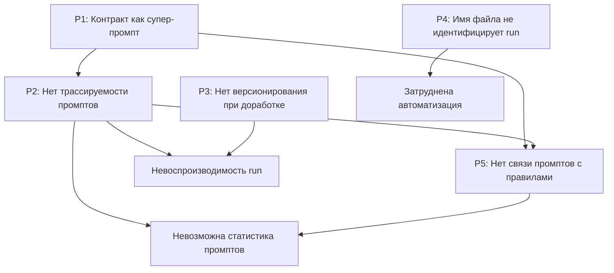
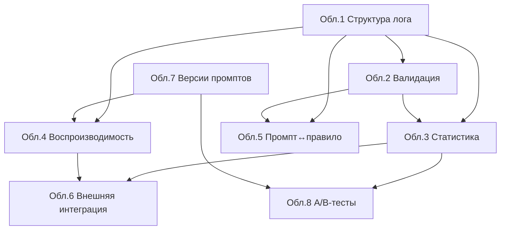

# Исследование трассируемости промптов в runs и внешних практик контроля проходов

> Research-документ по issue
> [#229](https://github.com/G-Ivan-A/mango_ba_prompts/issues/229).
> Это **только анализ и рекомендации**: документ **не корректирует** контракт
> `runs/CONTRACT.md`, **не принимает решений** и **не изменяет** существующие
> run-артефакты. Все рекомендации — материал для последующей отдельной задачи
> по корректировке контракта.

## 1. Введение

### 1.1. Цель исследования

Зафиксировать и систематизировать проблемы трассируемости промптов в записях
`runs/`, сопоставить их с внешними индустриальными практиками observability и
tracing, разобрать граничные кейсы, очертить области дополнительного анализа и
сформулировать обоснованные рекомендации для последующей корректировки контракта
`runs/CONTRACT.md`.

Триггер исследования — лог
[`runs/2026/RUN-0014/logs/business-task-log.md`](../../runs/2026/RUN-0014/logs/business-task-log.md):
в нём зафиксировано «Применён контракт `governance/bcreq-fr-generation-contract.md`»,
но не зафиксирована последовательность конкретных промптов, их результаты и
мета-данные. Контракт применяется как единый непрозрачный «супер-промпт».

### 1.2. Методология

Исследование выполнено в режиме `Creative` (Deep Dive / Think Max) командой из
трёх экспертных ролей, применённых последовательно:

| Роль | Зона ответственности | Критерий качества |
| --- | --- | --- |
| **Архитектор процессов** | Анализ применения контракта в RUN-0014, потери трассируемости, граничные кейсы. | Выявлены все проблемы P1–P5 с доказательствами. |
| **AI-инженер** | Внешние практики observability, experiment tracking, distributed tracing, prompt engineering, contract testing. | Приведены ≥ 5 внешних практик с источниками. |
| **BA-эксперт** | Бизнес-ценность контроля и статистики промптов, приоритизация областей анализа. | Определены ≥ 8 областей дополнительного анализа с обоснованием. |

Каждый факт сопровождается доказательством — ссылкой на файл и наблюдаемый
фрагмент. Источники внешних практик приведены ссылками в разделе
[«Источники»](#источники).

### 1.3. Объекты анализа

| Артефакт | Роль в анализе |
| --- | --- |
| [`runs/CONTRACT.md`](../../runs/CONTRACT.md) | Целевой контракт для последующей корректировки. |
| [`standards/runs-contract-standard.md`](../../standards/runs-contract-standard.md) | Стандарт, к которому отсылает контракт. |
| [`governance/bcreq-fr-generation-contract.md`](../../governance/bcreq-fr-generation-contract.md) | Эталонный L1-контракт, применённый в RUN-0014. |
| [`runs/2026/RUN-0014/logs/business-task-log.md`](../../runs/2026/RUN-0014/logs/business-task-log.md) | Пример проблемы (отсутствие трассируемости промптов). |
| [`governance/contracts-registry.md`](../../governance/contracts-registry.md) | Реестр контрактов (контекст governance). |
| [`docs/analysis/2026-06-24-runs-contract-log-policy-audit.md`](2026-06-24-runs-contract-log-policy-audit.md) | Предыдущий аудит контракта runs (issue #217). |

### 1.4. Терминология

| Термин | Значение в контексте документа |
| --- | --- |
| **run** | Запись в `runs/YYYY/RUN-XXXX/` — единичный факт прохода (эксперимента, генерации, валидации, бизнес-задачи). |
| **промпт (prompt)** | Конкретная инструкция к LLM, реализующая одно или несколько правил контракта. |
| **операция (operation)** | Шаг процесса генерации, на котором применяется один или несколько промптов. |
| **правило (rule)** | Машиночитаемое требование контракта (например, `BCREQ-FR-GEN-SCOPE-01`). |
| **трассируемость (traceability)** | Возможность восстановить связь «правило → промпт → операция → результат» постфактум. |
| **trace / span** | Заимствованные из distributed tracing понятия: trace — весь проход, span — отдельная операция внутри прохода. |

---

## 2. Выявленные проблемы

Раздел детализирует проблемы P1–P5: для каждой приведены симптом, причина,
влияние и доказательство (ссылка на файл/фрагмент). Связи и приоритеты — в
§[2.6](#26-связи-и-приоритеты-проблем).

### 2.1. P1: Контракт применяется как промпт, а не как последовательность операций

| Атрибут | Значение |
| --- | --- |
| **Симптом** | В логе указано «Применён контракт `governance/bcreq-fr-generation-contract.md`», но не указаны конкретные промпты и порядок их применения. |
| **Причина** | Контракт описывает процесс генерации (§4) и правила (§3), но не задаёт *исполнимую последовательность промптов*. AI-агент интерпретирует весь контракт как единый промпт. |
| **Влияние** | Невозможно отследить, какие промпты применялись; невозможно переиспользовать промпты в других задачах; невозможно статистически анализировать эффективность отдельных промптов; контракт становится «чёрным ящиком». |
| **Доказательство** | Сравнить процесс в [`governance/bcreq-fr-generation-contract.md`](../../governance/bcreq-fr-generation-contract.md) с логом [`runs/2026/RUN-0014/logs/business-task-log.md`](../../runs/2026/RUN-0014/logs/business-task-log.md): лог содержит фразу «Применён контракт» (раздел «Ход выполнения»), но не содержит ни одного `prompt_id`. |

**Комментарий архитектора процессов.** Контракт — это спецификация (что должно
быть), а не промпт (как это получить от LLM). Когда спецификация подаётся LLM
целиком, агент сам решает внутреннюю декомпозицию на промпты, и эта декомпозиция
нигде не фиксируется. Это эквивалентно вызову «чёрного ящика» в терминах
distributed tracing — есть вход и выход, но нет внутренних span'ов.

### 2.2. P2: Отсутствие трассируемости промптов

| Атрибут | Значение |
| --- | --- |
| **Симптом** | В логе нет списка применённых промптов с мета-данными (версия, модель, температура, токены, время выполнения, результат). |
| **Причина** | В [`runs/CONTRACT.md`](../../runs/CONTRACT.md) нет правила обязательности фиксации промптов. Раздел «Обязательное логирование» требует фиксировать «ход выполнения, ключевые действия, блокеры и итоговый статус», но не требует структуру промптов. |
| **Влияние** | Невозможно воспроизвести run; невозможно контролировать версии промптов; невозможно отлаживать ошибки (какой именно промпт дал сбой). |
| **Доказательство** | В [`runs/CONTRACT.md`](../../runs/CONTRACT.md), раздел «Обязательное логирование», правило фиксации промптов отсутствует. В `metadata.yaml` фиксируется единственная `model` на весь run (см. таблицу полей в контракте), без привязки к отдельным промптам. |

**Комментарий AI-инженера.** Это центральная проблема. Все внешние практики
observability (см. §3) строятся вокруг структурированной записи единичного
вызова LLM. Без такой записи невозможны ни воспроизводимость, ни агрегированная
статистика, ни отладка регрессий.

### 2.3. P3: Отсутствие версионирования runs при доработке

| Атрибут | Значение |
| --- | --- |
| **Симптом** | При доработке артефакта существующий run перезаписывается, история изменений теряется. |
| **Причина** | В [`runs/CONTRACT.md`](../../runs/CONTRACT.md) нет правила версионирования run при доработке и нет поля связи с предыдущим run. |
| **Влияние** | Теряется история изменений; невозможно отследить эволюцию артефакта; невозможно сравнить версии. |
| **Доказательство** | В перечне дополнительных полей `metadata.yaml` контракт допускает `related_runs`, но не вводит обязательного `previous_run_id` и не описывает семантику доработки. Ни один существующий `runs/2026/RUN-XXXX/metadata.yaml` не содержит `previous_run_id`. |

**Комментарий BA-эксперта.** Доработка артефакта — типовой бизнес-сценарий
(заказчик уточнил требования → раздел 4 ФТ пересобирается). Без версионирования
теряется аудиторский след, который для BA-артефактов критичен: невозможно
показать заказчику «что изменилось и почему».

### 2.4. P4: Именование файлов не идентифицирует runs

| Атрибут | Значение |
| --- | --- |
| **Симптом** | Файл `business-task-log.md` не содержит идентификатора run. При скачивании файла невозможно определить, к какому run он относится. |
| **Причина** | В [`runs/CONTRACT.md`](../../runs/CONTRACT.md) имя основного лога задаётся по `run_type` (`logs/<run-type>-log.md`) без префикса `RUN-XXXX`. Идентификация держится исключительно на пути каталога. |
| **Влияние** | При скачивании файла вне контекста каталога невозможно определить принадлежность к run; затруднена автоматическая обработка логов; нет различения типов файлов внутри run (лог/результат/анализ) по имени. |
| **Доказательство** | Структура [`runs/2026/RUN-0014/logs/`](../../runs/2026/RUN-0014/logs/) — имя `business-task-log.md` информативно только в связке с путём `RUN-0014`. Таблица «Канонический Markdown-лог» в [`runs/CONTRACT.md`](../../runs/CONTRACT.md) фиксирует имена без `run_id`. |

**Комментарий архитектора процессов.** В distributed tracing идентификатор
(trace ID) переносится вместе с каждым артефактом, а не выводится из контекста.
Имя файла без `RUN-XXXX` нарушает принцип «идентификатор путешествует с данными».

### 2.5. P5: Отсутствие связи промптов с правилами контракта

| Атрибут | Значение |
| --- | --- |
| **Симптом** | В логе указано применение правил `BCREQ-FR-GEN-SCOPE-01/02` и блока валидации `BCREQ-FR-VAL-01…10`, но не указано, какой промпт реализует какое правило. |
| **Причина** | Контракт не разделяет уровни «правило» (что должно быть) и «промпт» (как это получить), поэтому маппинг `rule_id → prompt_id` негде зафиксировать. |
| **Влияние** | Невозможно отследить, какое правило реализовано каким промптом; невозможно анализировать эффективность отдельных правил; невозможно проверить полноту покрытия правил промптами. |
| **Доказательство** | Лог [`runs/2026/RUN-0014/logs/business-task-log.md`](../../runs/2026/RUN-0014/logs/business-task-log.md) упоминает `BCREQ-FR-GEN-SCOPE-01/02` и `BCREQ-FR-VAL-01…10` без привязки к промптам; машиночитаемый индекс правил §3 контракта [`governance/bcreq-fr-generation-contract.md`](../../governance/bcreq-fr-generation-contract.md) не содержит поля `prompt_id`. |

**Комментарий AI-инженера.** P5 — это «недостающее ребро» графа трассируемости.
P2 даёт узлы «промпт», §3 контракта даёт узлы «правило», но ребро `rule ↔ prompt`
не материализовано. Это прямой аналог проблемы coverage в contract testing
(см. §3.5): без связи provider↔contract нельзя проверить, что все правила
покрыты исполнением.

### 2.6. Связи и приоритеты проблем

| Проблема | Приоритет | Зависит от | Обоснование приоритета |
| --- | --- | --- | --- |
| **P1** | P1 (корневая) | — | Корень всех проблем трассируемости: пока контракт применяется как единый промпт, P2 и P5 нерешаемы по построению. |
| **P2** | P1 | P1 | Без структурной записи промптов невозможны воспроизводимость, отладка и статистика. |
| **P5** | P2 | P1, P2 | «Недостающее ребро» графа трассируемости; ценно, но требует наличия узлов P2. |
| **P3** | P2 | — | Критично для аудита доработок; технически независимо от P1/P2. |
| **P4** | P3 | — | Удобство и автоматизация; самая дешёвая в исправлении, низкий риск. |

**Ключевой вывод раздела.** P1 — корневая. Декомпозиция контракта на явную
последовательность промптов (operations) разблокирует P2 и P5. P3 и P4 —
независимые улучшения метаданных run, решаемые параллельно.

---

## 3. Внешние практики

Раздел приводит пять классов индустриальных практик с описанием сути, тем, что
можно применить к `runs/`, и источниками. Сопоставление с проблемами P1–P5 —
в §[3.6](#36-сводное-сопоставление-практик-и-проблем).

### 3.1. LLM Observability (Langfuse, LangSmith, Arize Phoenix)

**Суть.** Специализированные инструменты для трассировки LLM-проходов. Базовая
единица — **trace**, содержащая иерархию **observations** (spans / generations /
events). Каждый вызов LLM фиксируется как `generation` со структурой: `name`,
`model`, `input`, `output`, `model_parameters` (включая `temperature`),
`usage` (`prompt_tokens`, `completion_tokens`, `total_tokens`), `latency`,
`level` (статус), `metadata`. Langfuse и LangSmith поддерживают версионируемый
**prompt registry**: промпт хранится отдельно от кода, имеет имя и версию, а
вызов ссылается на конкретную версию.

**Что можно применить к `runs/`:**

- Структура записи единичного промпта: `prompt_id`, `version`, `model`,
  `temperature`, `input_ref`, `output_ref`, `tokens`, `latency`, `status`.
- Иерархия `trace → generation`: run как trace, каждая операция как generation.
- Идея prompt registry: промпты как версионируемые объекты, на которые run
  ссылается по `prompt_id@version`.
- Поле `level`/`status` для фиксации неуспешных и частично успешных вызовов
  (прямой ответ на граничный кейс 2, §4.2).

**Источники:** [Langfuse Tracing](https://langfuse.com/docs/tracing),
[Langfuse Prompt Management](https://langfuse.com/docs/prompts/get-started),
[LangSmith Tracing](https://docs.smith.langchain.com/observability),
[Arize Phoenix Tracing](https://docs.arize.com/phoenix/tracing/llm-traces).

### 3.2. Experiment Tracking (MLflow, Weights & Biases)

**Суть.** Инструменты управления экспериментами в ML. Базовая единица —
**run** как фиксированный набор `params` (гиперпараметры), `metrics`
(измеримые результаты), `artifacts` (входы/выходы/модели) и `tags`. Runs
группируются в **experiments**; поддерживаются сравнение runs, версии и
происхождение (lineage). MLflow дополнительно ведёт реестр моделей с версиями и
стадиями; W&B — артефакты с автоматическим версионированием и графом
происхождения.

**Что можно применить к `runs/`:**

- Концепт «run = эксперимент» уже совпадает с `runs/RUN-XXXX/` — стоит явно
  заимствовать разделение `params` (модель, температура, версии промптов) и
  `metrics` (токены, латентность, стоимость).
- Версионирование промптов по аналогии с реестром моделей: `prompt_id` +
  семантическая или дата-версия.
- Lineage / `previous_run_id` для доработок (прямой ответ на P3 и граничный
  кейс 4, §4.4).
- Сравнение runs как основа A/B-тестирования промптов (область 8, §5.8).

**Источники:** [MLflow Tracking](https://mlflow.org/docs/latest/tracking.html),
[MLflow Model Registry](https://mlflow.org/docs/latest/model-registry.html),
[W&B Experiment Tracking](https://docs.wandb.ai/guides/track),
[W&B Artifacts](https://docs.wandb.ai/guides/artifacts).

### 3.3. Distributed Tracing (OpenTelemetry, Jaeger)

**Суть.** Стандарт трассировки распределённых систем. Базовые понятия:
**trace** (весь проход, идентифицируется `trace_id`), **span** (операция,
`span_id`), `parent_span_id` (связь операций в дерево), `start_time`/`end_time`,
**attributes** (структурированные мета-данные), **events** (точечные логи внутри
span), **status** (`ok` / `error`). OpenTelemetry ввёл семантические соглашения
для GenAI (`gen_ai.*`: `gen_ai.request.model`, `gen_ai.usage.input_tokens`,
`gen_ai.usage.output_tokens` и др.), что делает модель данных прямо применимой к
LLM-проходам.

**Что можно применить к `runs/`:**

- Модель `trace → span`: run = trace (`run_id` как `trace_id`), операция = span.
- `parent_span_id` для условных и вложенных операций (ответ на граничные кейсы 1
  и 3, §4.1 и §4.3).
- `status` (`ok`/`error`) на уровне span — единый способ фиксировать сбои.
- GenAI semantic conventions как готовый словарь полей для метаданных промпта —
  совместимость с будущим экспортом во внешние инструменты (область 6, §5.6).
- Принцип «идентификатор путешествует с данными»: переносить `run_id` в имена
  файлов (ответ на P4).

**Источники:**
[OpenTelemetry Traces](https://opentelemetry.io/docs/concepts/signals/traces/),
[OpenTelemetry GenAI Semantic Conventions](https://opentelemetry.io/docs/specs/semconv/gen-ai/),
[Jaeger Architecture](https://www.jaegertracing.io/docs/latest/architecture/).

### 3.4. Prompt Engineering Best Practices (Anthropic, OpenAI)

**Суть.** Рекомендации вендоров по управлению промптами как версионируемыми,
тестируемыми и мониторируемыми артефактами. Ключевые идеи: хранить промпты
отдельно и версионировать; тестировать на наборах кейсов (eval-наборы), включая
граничные; вести метрики качества и стоимости; A/B-сравнивать версии; разделять
системные инструкции и переменные входы.

**Что можно применить к `runs/`:**

- Версионирование промптов (`prompt_id` + `version`) как обязательный атрибут
  записи (ответ на P2).
- Eval-наборы и граничные кейсы как основа регрессионного контроля промптов
  (область 2, §5.2; граничные кейсы §4).
- Разделение «правило ↔ промпт ↔ переменный вход» — концептуальная основа для
  разрешения P1 и P5.
- Метрики стоимости/токенов как стандартный атрибут (ответ на P2, область 3).

**Источники:**
[Anthropic Prompt Engineering](https://docs.anthropic.com/en/docs/build-with-claude/prompt-engineering/overview),
[Anthropic Prompt Improver / versions](https://docs.anthropic.com/en/docs/build-with-claude/prompt-engineering/prompt-templates-and-variables),
[OpenAI Prompt Engineering Guide](https://platform.openai.com/docs/guides/prompt-engineering),
[OpenAI Evals](https://platform.openai.com/docs/guides/evals).

### 3.5. Contract Testing (Pact, Spring Cloud Contract)

**Суть.** Тестирование контрактов между потребителем (consumer) и поставщиком
(provider). Контракт фиксирует ожидания; provider верифицируется против
контракта; **coverage** показывает, какие пункты контракта покрыты реальными
взаимодействиями. Ключевая идея для нас — *явная связь между спецификацией и её
исполнением* и *проверка полноты покрытия*.

**Что можно применить к `runs/`:**

- Концепт «контракт как спецификация, run как верификация»: правила контракта =
  пункты, исполнение промптов = верификация.
- Маппинг `rule_id → prompt_id` как «контрактное покрытие» (прямой ответ на P5).
- Validation-блок контракта (`BCREQ-FR-VAL-01…10`) как набор verifications,
  результаты которых должны фиксироваться структурно в run.
- Автоматическая проверка полноты покрытия правил промптами (область 5, §5.5).

**Источники:** [Pact: Contract Testing](https://docs.pact.io/),
[Pact Verification](https://docs.pact.io/getting_started/verifying_pacts),
[Spring Cloud Contract](https://docs.spring.io/spring-cloud-contract/reference/).

### 3.6. Сводное сопоставление практик и проблем

| Практика | P1 | P2 | P3 | P4 | P5 |
| --- | :---: | :---: | :---: | :---: | :---: |
| 3.1 LLM Observability | ◐ | ● | ○ | ○ | ◐ |
| 3.2 Experiment Tracking | ○ | ◐ | ● | ○ | ○ |
| 3.3 Distributed Tracing | ● | ● | ◐ | ● | ◐ |
| 3.4 Prompt Engineering | ● | ● | ○ | ○ | ◐ |
| 3.5 Contract Testing | ◐ | ○ | ○ | ○ | ● |

Легенда: ● — прямой ответ, ◐ — частичный вклад, ○ — слабая связь.

**Вывод раздела.** Ни одна практика не покрывает все пять проблем. Наиболее
универсальна модель distributed tracing (`trace → span` + `status` + attributes),
дополненная prompt registry из LLM observability (P2), lineage из experiment
tracking (P3) и coverage-моделью из contract testing (P5).

---

## 4. Граничные кейсы

Для каждого кейса приведены сценарий, вопрос, варианты решения, риски и
предварительная приоритизация. Решения **не принимаются** — это материал для
корректировки контракта.

### 4.1. Кейс 1: Один промпт применяется несколько раз

- **Сценарий.** Промпт `prompt-scope-filter` применяется к разделам 2, 3, 4, 6.
- **Вопрос.** Как фиксировать в логе?
  - Вариант A: одна запись на каждый вызов (4 записи).
  - Вариант B: одна запись с указанием применений (1 запись + список разделов).
- **Риски.** A раздувает лог; B теряет детализацию (нельзя сравнить токены/
  латентность по разделам).
- **Связь с практиками.** В distributed tracing каждый вызов — отдельный span с
  общим `parent_span_id`; это вариант A, но с группировкой по родителю, что
  снимает дилемму (детализация сохраняется, группировка читаема).
- **Приоритет.** Высокий — типовой случай для BCREQ-FR.

### 4.2. Кейс 2: Промпт не дал результата (ошибка, галлюцинация)

- **Сценарий.** Промпт `prompt-taxonomy-binding` не нашёл node, вернул
  `mapping_gap` (реально наблюдалось в RUN-0014, см. блок «Блокеры» лога).
- **Вопрос.** Как фиксировать?
  - Вариант A: успешный вызов с результатом `mapping_gap`.
  - Вариант B: ошибка с анализом причин.
- **Риски.** A скрывает проблему в статистике; B усложняет лог и размывает
  границу «ошибка vs ожидаемый отрицательный результат».
- **Связь с практиками.** OTel/Langfuse `status`/`level` различают `ok`,
  `warning`, `error`. `mapping_gap` — это `warning`/`ok` с типизированным
  результатом, а не `error`. Это снимает дилемму через третье состояние.
- **Приоритет.** Высокий — напрямую влияет на достоверность статистики (P2).

### 4.3. Кейс 3: Промпт применяется условно

- **Сценарий.** `prompt-nfr-detection` применяется только при наличии NFR-like
  утверждений во входе.
- **Вопрос.** Как фиксировать?
  - Вариант A: записывать только если применялся.
  - Вариант B: записывать всегда с `skipped`/`applied` и условием.
- **Риски.** A теряет информацию о принятом решении (почему пропущен); B
  раздувает лог.
- **Связь с практиками.** Решения о ветвлении — это `event` внутри trace (OTel)
  или decision-лог. Вариант B с компактным `skipped` + причина ближе к практике
  воспроизводимости.
- **Приоритет.** Средний.

### 4.4. Кейс 4: Доработка артефакта с частичным перезапуском

- **Сценарий.** Доработка раздела 4 BCREQ-1040: применяются только промпты для
  раздела 4.
- **Вопрос.** Как фиксировать?
  - Вариант A: новый run с полным списком промптов (включая предыдущие).
  - Вариант B: новый run только с применёнными промптами + ссылка на предыдущий
    run.
- **Риски.** A дублирует информацию; B требует анализа двух логов для полной
  картины.
- **Связь с практиками.** Lineage (MLflow/W&B) и `previous_run_id` — стандартный
  ответ: вариант B с явной ссылкой и пометкой «delta run». Это же закрывает P3.
- **Приоритет.** Высокий — типовой бизнес-сценарий доработки.

### 4.5. Кейс 5: Несколько контрактов применяются в одном runs

- **Сценарий.** В run применяются контракты BCREQ-FR и NFR-CONTRACT.
- **Вопрос.** Как фиксировать?
  - Вариант A: один лог с указанием контрактов.
  - Вариант B: отдельные логи на каждый контракт.
- **Риски.** A смешивает контексты; B усложняет агрегацию по run.
- **Связь с практиками.** В tracing один trace может содержать span'ы из разных
  «сервисов» (контрактов), помеченные атрибутом `contract_id`. Это вариант A с
  обязательным атрибутом контракта на каждом span.
- **Приоритет.** Средний — пока редкий, но архитектурно важный сценарий.

### 4.6. Кейс 6: Промпт меняется в процессе runs

- **Сценарий.** В середине run обнаружена ошибка в промпте, промпт обновлён, run
  продолжен.
- **Вопрос.** Как фиксировать?
  - Вариант A: две версии промпта в одном run (до и после).
  - Вариант B: остановить run, начать новый с новой версией.
- **Риски.** A нарушает воспроизводимость («какой версией получен результат?»);
  B теряет уже выполненную работу.
- **Связь с практиками.** Prompt registry требует, чтобы каждый вызов ссылался
  на *конкретную* версию (`prompt_id@version`). Тогда вариант A корректен:
  разные span'ы ссылаются на разные версии, воспроизводимость сохраняется на
  уровне span, а не run.
- **Приоритет.** Низкий/средний — редкий, но показывает важность версии на
  уровне отдельного вызова.

### 4.7. Кейс 7 (расширение): Недетерминизм одинаковых вызовов

> Инициативное расширение в рамках «зелёного света» issue.

- **Сценарий.** Один и тот же `prompt_id@version` с тем же входом и
  `temperature > 0` даёт разные результаты при повторе.
- **Вопрос.** Что считать «воспроизводимостью» при недетерминизме?
- **Варианты.** A: фиксировать `seed`/`temperature` и принимать статистическую
  воспроизводимость; B: требовать `temperature: 0` для генеративных операций
  контракта.
- **Риски.** A не гарантирует точного повтора; B ограничивает креативность
  модели.
- **Приоритет.** Средний — влияет на определение цели «воспроизводимость»
  (область 4, §5.4).

### 4.8. Кейс 8 (расширение): Большие входы/выходы и хранение

> Инициативное расширение.

- **Сценарий.** Вход/выход промпта — крупный документ; инлайн в логе раздувает
  его до нечитаемости.
- **Вопрос.** Хранить контент инлайн или по ссылке?
- **Варианты.** A: инлайн (самодостаточный лог); B: ссылка на `inputs/`/
  `outputs/` + хеш для целостности.
- **Риски.** A — размер и нечитаемость; B — зависимость от внешних файлов.
- **Связь с практиками.** Observability-инструменты хранят крупные payload'ы по
  ссылке/в blob-store с хешом. Вариант B согласуется с уже существующими
  каталогами `inputs/`/`outputs/` контракта runs.
- **Приоритет.** Средний.

### 4.9. Сводная приоритизация кейсов

| Кейс | Приоритет | Затрагивает проблемы | Ключ к разрешению из практик |
| --- | --- | --- | --- |
| 1. Повторное применение | Высокий | P2 | span + `parent_span_id` |
| 2. Нет результата/ошибка | Высокий | P2 | `status`/`level` (3 состояния) |
| 3. Условное применение | Средний | P2 | `event` / `skipped` + причина |
| 4. Доработка | Высокий | P3 | `previous_run_id` / lineage |
| 5. Несколько контрактов | Средний | P5 | атрибут `contract_id` на span |
| 6. Смена промпта | Низкий/средний | P2 | `prompt_id@version` на span |
| 7. Недетерминизм | Средний | — | `seed`/`temperature` фиксация |
| 8. Большие payload | Средний | P2 | ссылка + хеш |

---

## 5. Области дополнительного анализа

Восемь областей с вопросом, предметом исследования, обоснованием приоритета и
зависимостями. Граф зависимостей — в §[5.9](#59-граф-зависимостей-областей).

### 5.1. Область 1: Оптимизация структуры run-лога

- **Вопрос.** Как структурировать run-лог для максимальной читаемости и
  машиночитаемости одновременно?
- **Что исследовать.** Формат (YAML-блоки внутри Markdown vs отдельный
  `.json`/`.yaml` рядом с `.md`); иерархия `trace → span → event`; обязательные
  vs опциональные поля; ограничения на размер; совместимость с существующим
  требованием «основной лог MUST быть Markdown».
- **Приоритет.** P1 — фундамент для всех остальных областей.
- **Зависимости.** Базовая; от неё зависят области 2, 3, 4, 5.

### 5.2. Область 2: Автоматическая валидация run-логов

- **Вопрос.** Как автоматически проверять полноту и корректность run-логов?
- **Что исследовать.** Валидатор по аналогии с
  `scripts/validate_issue_217_runs_log_contract.py`; CI-проверка наличия
  обязательных полей промптов; автоматическое выявление пропущенных промптов
  относительно правил контракта.
- **Приоритет.** P1 — без валидации правило трассируемости не enforce-ится.
- **Зависимости.** Требует область 1 (структуру).

### 5.3. Область 3: Статистика применения промптов

- **Вопрос.** Как агрегировать статистику по промптам для анализа эффективности?
- **Что исследовать.** Метрики (частота, время, токены, стоимость, доля
  `mapping_gap`/ошибок); агрегация в `runs/stats/`; визуализация на GitHub Pages.
- **Приоритет.** P2 — высокая бизнес-ценность, но требует данных из области 1.
- **Зависимости.** Требует области 1 и 2.

### 5.4. Область 4: Воспроизводимость runs

- **Вопрос.** Как обеспечить полную (или статистическую) воспроизводимость run?
- **Что исследовать.** Фиксация версий промптов, моделей, параметров (`seed`,
  `temperature`); snapshot входов с хешом; определение «воспроизводимости» при
  недетерминизме (см. кейс 7).
- **Приоритет.** P1 — прямой ответ на P2 и корневую ценность трассируемости.
- **Зависимости.** Требует области 1; связана с областью 7.

### 5.5. Область 5: Связь промптов с правилами контракта

- **Вопрос.** Как явно связать промпты с правилами контракта и проверять
  полноту покрытия?
- **Что исследовать.** Маппинг `prompt_id → rule_id`; трассируемость «правило →
  промпт → результат»; валидация покрытия правил промптами (по аналогии с
  coverage в contract testing).
- **Приоритет.** P2 — прямой ответ на P5.
- **Зависимости.** Требует области 1 и взаимодействует с областью 2.

### 5.6. Область 6: Интеграция с внешними observability-инструментами

- **Вопрос.** Можно ли экспортировать run-логи в Langfuse/MLflow/OpenTelemetry?
- **Что исследовать.** Совместимость полей run-лога с OTel GenAI semantic
  conventions; экспортёр run → OTLP/Langfuse; импорт метрик обратно.
- **Приоритет.** P3 — стратегическая опция, не блокирует базовую трассируемость.
- **Зависимости.** Требует областей 1 и 3; усиливается совместимостью со
  стандартом OTel.

### 5.7. Область 7: Версионирование промптов

- **Вопрос.** Как управлять версиями промптов?
- **Что исследовать.** Каталог хранения промптов (связь с существующим
  `prompts/` и workflow из CONTRIBUTING); схема версий (semver vs дата); связь
  версий промптов с версиями контрактов.
- **Приоритет.** P2 — необходимое условие для воспроизводимости и A/B-тестов.
- **Зависимости.** Питает области 4 и 8.

### 5.8. Область 8: A/B-тестирование промптов

- **Вопрос.** Как сравнивать разные версии промптов?
- **Что исследовать.** Критерии (качество артефакта, время, стоимость);
  методология A/B; автоматический выбор лучшей версии; связь с experiment
  tracking (§3.2).
- **Приоритет.** P3 — высокая ценность, но самая зависимая область.
- **Зависимости.** Требует областей 3 (статистика) и 7 (версии).

### 5.9. Граф зависимостей областей

| Волна | Области | Логика |
| --- | --- | --- |
| **Волна 1 (фундамент)** | 1, 7 | Структура лога и версии промптов — базис без зависимостей. |
| **Волна 2 (контроль)** | 2, 4, 5 | Валидация, воспроизводимость и покрытие правил поверх структуры. |
| **Волна 3 (ценность)** | 3 | Статистика поверх собранных данных. |
| **Волна 4 (стратегия)** | 6, 8 | Внешняя интеграция и A/B-тесты — самые зависимые. |

---

## 6. Рекомендации

Рекомендации сгруппированы по пяти направлениям issue. Каждая снабжена сутью,
обоснованием (ссылка на проблему/практику) и приоритетом. **Это не решения** —
материал для отдельной задачи по корректировке `runs/CONTRACT.md`.

### 6.1. Структура run-лога

| ID | Рекомендация | Обоснование | Приоритет |
| --- | --- | --- | --- |
| R-LOG-1 | Ввести структурированный блок промптов внутри основного Markdown-лога (YAML-fenced секция `prompts:`), сохранив требование «основной лог — Markdown». | P1, P2; §3.1, §3.3; область 1. | P1 |
| R-LOG-2 | Принять модель `trace → span`: run = trace (`run_id`), каждая операция = span с `parent_span_id` для группировки повторных/вложенных вызовов. | Кейс 1, 3; §3.3. | P1 |
| R-LOG-3 | Для крупных входов/выходов хранить контент по ссылке на `inputs/`/`outputs/` с хешом, а не инлайн. | Кейс 8; §3.1. | P2 |

### 6.2. Трассируемость промптов

| ID | Рекомендация | Обоснование | Приоритет |
| --- | --- | --- | --- |
| R-TRACE-1 | Сделать обязательной запись каждого применённого промпта с полями `prompt_id`, `version`, `model`, `temperature`, `tokens`, `latency`, `status`, `result_ref`. | P2; §3.1, §3.4; область 1. | P1 |
| R-TRACE-2 | Ввести трёхзначный `status` вызова: `ok` / `warning` (например, `mapping_gap`) / `error`, чтобы отделять ожидаемые отрицательные результаты от сбоев. | P2; кейс 2; §3.1, §3.3. | P1 |
| R-TRACE-3 | Версию промпта фиксировать на уровне отдельного вызова (`prompt_id@version`), а не на уровне run. | P2; кейс 6; §3.1, §3.4. | P2 |
| R-TRACE-4 | Для условных операций фиксировать решение (`applied`/`skipped` + причина). | P2; кейс 3; §3.3. | P2 |

### 6.3. Версионирование runs

| ID | Рекомендация | Обоснование | Приоритет |
| --- | --- | --- | --- |
| R-VER-1 | Ввести поле `previous_run_id` в `metadata.yaml` и семантику «delta run»: доработка создаёт новый run со ссылкой на предыдущий, не перезаписывая его. | P3; кейс 4; §3.2 (lineage). | P1 |
| R-VER-2 | В delta run фиксировать только применённые промпты, опираясь на `previous_run_id` для полной картины. | P3; кейс 4. | P2 |
| R-VER-3 | Запретить перезапись существующего run при доработке (только новый run). | P3; §3.2. | P1 |

### 6.4. Именование файлов

| ID | Рекомендация | Обоснование | Приоритет |
| --- | --- | --- | --- |
| R-NAME-1 | Включать `RUN-XXXX` в имя основного лога (например, `RUN-0014-business-task-log.md`), чтобы файл самоидентифицировался вне контекста пути. | P4; §3.3 (идентификатор путешествует с данными). | P3 |
| R-NAME-2 | Ввести типизацию файлов внутри run по имени (лог/результат/анализ), чтобы тип читался без открытия файла. | P4; область 2. | P3 |

> Примечание: R-NAME-* — самые дешёвые и низкорисковые, но затрагивают
> существующее правило именования по `run_type`; их внедрение требует миграции и
> обновления валидатора issue #217 — это материал отдельной задачи.

### 6.5. Связь промптов с правилами контракта

| ID | Рекомендация | Обоснование | Приоритет |
| --- | --- | --- | --- |
| R-MAP-1 | Ввести явный маппинг `prompt_id → rule_id` (какой промпт реализует какое правило контракта). | P5; §3.5 (coverage). | P1 |
| R-MAP-2 | Фиксировать результаты validation-блока (`BCREQ-FR-VAL-01…10`) структурно как verifications с привязкой к правилам. | P5; §3.5. | P2 |
| R-MAP-3 | Добавить проверку полноты покрытия правил промптами (rule coverage) в валидатор run-лога. | P5; область 5; §3.5. | P2 |

### 6.6. Сводная карта «проблема → рекомендация → практика»

| Проблема | Рекомендации | Опорная практика |
| --- | --- | --- |
| P1 | R-LOG-1, R-LOG-2 | Distributed tracing, Prompt engineering |
| P2 | R-TRACE-1..4, R-LOG-1, R-LOG-3 | LLM observability, Prompt engineering |
| P3 | R-VER-1..3, R-LOG-? | Experiment tracking (lineage) |
| P4 | R-NAME-1, R-NAME-2 | Distributed tracing (trace_id propagation) |
| P5 | R-MAP-1..3 | Contract testing (coverage) |

### 6.7. Предлагаемая последовательность внедрения (без принятия решения)

1. **Фундамент:** R-LOG-1/2, R-TRACE-1/2 (структура + обязательная запись
   промптов с тремя статусами).
2. **Контроль:** R-MAP-1, R-VER-1/3 (покрытие правил + версионирование без
   перезаписи).
3. **Полнота:** R-TRACE-3/4, R-VER-2, R-MAP-2/3, R-LOG-3.
4. **Удобство/стратегия:** R-NAME-1/2 (с миграцией), интеграция и A/B (области
   6, 8).

---

## 7. Заключение

### 7.1. Краткие выводы

1. **P1 — корневая проблема.** Контракт применяется как единый «супер-промпт»;
   пока он не декомпозирован на явную последовательность операций (промптов),
   P2 (трассируемость) и P5 (связь с правилами) нерешаемы по построению.
2. **Модель данных уже существует в индустрии.** Комбинация distributed tracing
   (`trace → span`, `status`, attributes), prompt registry (версии промптов),
   experiment-lineage (`previous_run_id`) и contract-coverage (`rule ↔ prompt`)
   покрывает все пять проблем; изобретать новую модель не требуется.
3. **Три статуса вместо двух** (`ok`/`warning`/`error`) снимают сразу несколько
   граничных дилемм (кейсы 1–3, 6), наблюдавшихся реально в RUN-0014
   (`mapping_gap`).
4. **P3 и P4 — независимые улучшения** метаданных run, дешёвые и решаемые
   параллельно с корневой работой над P1/P2.
5. **Восемь областей выстраиваются в четыре волны** (фундамент → контроль →
   ценность → стратегия), что даёт естественный порядок последующих задач.

### 7.2. Границы исследования

Документ остаётся в рамках research-задачи: контракт `runs/CONTRACT.md` **не
изменён**, существующие run-артефакты **не тронуты**, решения **не приняты**.
Все рекомендации (R-LOG-*, R-TRACE-*, R-VER-*, R-NAME-*, R-MAP-*) — вход для
отдельной задачи по корректировке контракта.

### 7.3. Соответствие Definition of Done

| ДоД | Где выполнено |
| --- | --- |
| Анализ P1–P5 с доказательствами | §2.1–§2.6 |
| ≥ 5 внешних практик с источниками | §3.1–§3.5, §[Источники](#источники) |
| ≥ 6 граничных кейсов с вопросами и рисками | §4.1–§4.9 (8 кейсов) |
| ≥ 8 областей анализа с обоснованием | §5.1–§5.9 |
| Рекомендации с обоснованием и приоритетами | §6.1–§6.7 |
| Аналитический документ создан | этот файл |
| Все разделы присутствуют | §1–§7 |
| Источники со ссылками | §[Источники](#источники) |
| CHANGELOG обновлён | запись Issue #229 в `CHANGELOG.md` |

---

## Источники

**LLM Observability**
- Langfuse — Tracing: https://langfuse.com/docs/tracing
- Langfuse — Prompt Management: https://langfuse.com/docs/prompts/get-started
- LangSmith — Observability: https://docs.smith.langchain.com/observability
- Arize Phoenix — LLM Traces: https://docs.arize.com/phoenix/tracing/llm-traces

**Experiment Tracking**
- MLflow — Tracking: https://mlflow.org/docs/latest/tracking.html
- MLflow — Model Registry: https://mlflow.org/docs/latest/model-registry.html
- Weights & Biases — Experiment Tracking: https://docs.wandb.ai/guides/track
- Weights & Biases — Artifacts: https://docs.wandb.ai/guides/artifacts

**Distributed Tracing**
- OpenTelemetry — Traces: https://opentelemetry.io/docs/concepts/signals/traces/
- OpenTelemetry — GenAI Semantic Conventions: https://opentelemetry.io/docs/specs/semconv/gen-ai/
- Jaeger — Architecture: https://www.jaegertracing.io/docs/latest/architecture/

**Prompt Engineering**
- Anthropic — Prompt Engineering Overview: https://docs.anthropic.com/en/docs/build-with-claude/prompt-engineering/overview
- Anthropic — Prompt Templates and Variables: https://docs.anthropic.com/en/docs/build-with-claude/prompt-engineering/prompt-templates-and-variables
- OpenAI — Prompt Engineering Guide: https://platform.openai.com/docs/guides/prompt-engineering
- OpenAI — Evals: https://platform.openai.com/docs/guides/evals

**Contract Testing**
- Pact — Contract Testing: https://docs.pact.io/
- Pact — Verifying Pacts: https://docs.pact.io/getting_started/verifying_pacts
- Spring Cloud Contract — Reference: https://docs.spring.io/spring-cloud-contract/reference/

**Внутренние артефакты**
- runs-контракт: https://github.com/G-Ivan-A/mango_ba_prompts/blob/main/runs/CONTRACT.md
- Эталонный L1-контракт BCREQ-FR: https://github.com/G-Ivan-A/mango_ba_prompts/blob/main/governance/bcreq-fr-generation-contract.md
- Лог RUN-0014: https://github.com/G-Ivan-A/mango_ba_prompts/blob/main/runs/2026/RUN-0014/logs/business-task-log.md
- Предыдущий аудит контракта runs (issue #217): https://github.com/G-Ivan-A/mango_ba_prompts/blob/main/docs/analysis/2026-06-24-runs-contract-log-policy-audit.md
