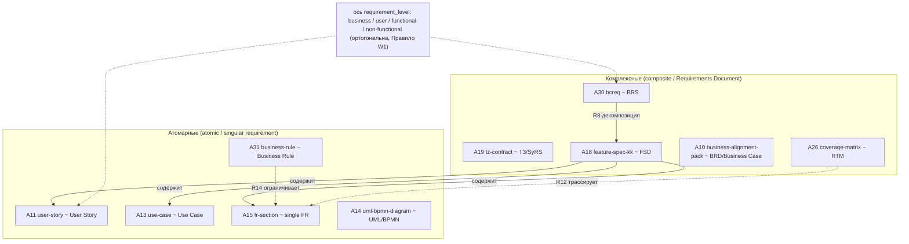
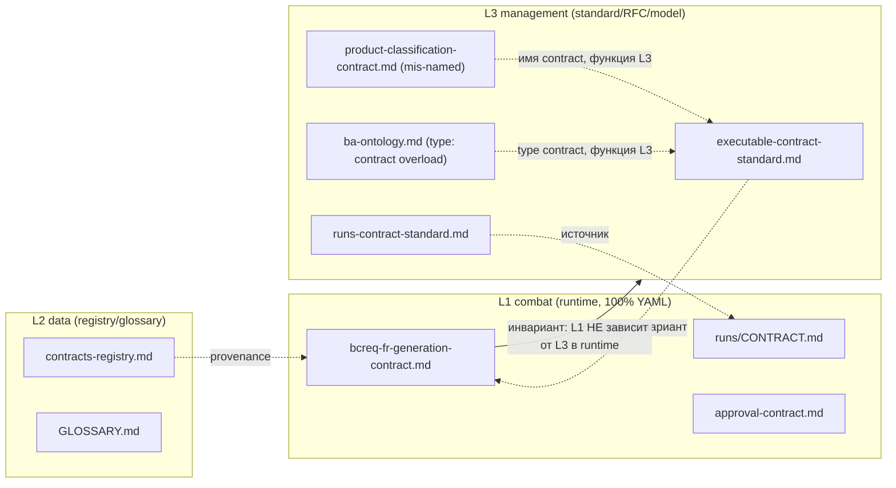

# Структурный анализ БА-процессов и артефактов с опорой на индустриальные практики телекома

> **Назначение.** Документ закрывает [issue #233](https://github.com/G-Ivan-A/mango_ba_prompts/issues/233):
> структурный анализ БА-процессов и артефактов репозитория `mango_ba_prompts`
> с опорой на индустриальные практики телекома и фреймворки бизнес-анализа.
> Это **research-задача**: документ **не принимает решений**, **не меняет**
> БА-процессы и **не перестраивает** артефакты — он даёт **только анализ и
> рекомендации** как вход для будущего RFC.
>
> **Защищённые артефакты** [`docs/ba-processes/00-index.md`](../ba-processes/00-index.md),
> [`standards/ba-ontology.md`](../../standards/ba-ontology.md),
> [`standards/executable-contract-standard.md`](../../standards/executable-contract-standard.md),
> [`governance/bcreq-fr-generation-contract.md`](../../governance/bcreq-fr-generation-contract.md)
> и [`runs/CONTRACT.md`](../../runs/CONTRACT.md) изучены, процитированы по
> функции, но **не изменены**.

## Методология и роли экспертов

Анализ выполнен в режиме `Creative` (Deep Dive / Think Max) по обязательной
последовательности из issue (Этапы 1-10) и проведён **последовательно тремя
ролями** (как требует issue):

| Роль | Зона ответственности | Разделы |
| --- | --- | --- |
| **Архитектор БА-методологий** | Индустриальные практики телекома (10+ компаний) и фреймворки БА (BABOK, IREB, BCS, PMI-PBA, Agile BA); таксономия артефактов в индустрии. | 3, 4, 5 |
| **AI-инженер** | Соответствие текущих процессов и артефактов модели L1-L3; контракты vs стандарты; неправильно отнесённые документы. | 2, 8 |
| **BA-эксперт** | Полный список артефактов (тип/уровень/место/принцип/связь), таксономия комплексные vs атомарные, вход для RFC. | 5, 9, 10 |

**Источниковая дисциплина** — по [`kb/practices/source-backed-analysis.md`](../../kb/practices/source-backed-analysis.md)
(критерии C1-C4: существование URL проверено). Каждое фактическое утверждение
сопровождается уровнем доказательности:

| Метка | Значение |
| --- | --- |
| **[CONFIRMED]** | прямой публичный источник (URL проверен на существование) |
| **[INFERRED]** | разумный вывод из вакансий / косвенных свидетельств (с URL) |
| **[HYPOTHESIS]** | правдоподобно, но не подтверждено (указана причина) |
| **NOT FOUND** | источник не найден — утверждение **не выпускается** как факт |

**Эмпирическая база** собрана в отдельном companion-документе
[`docs/analysis/telecom-vendors-ba-practices-research.md`](telecom-vendors-ba-practices-research.md)
(16 компаний с источниками по каждому факту выручки и BA-практики); этот документ
синтезирует её, не дублируя сырьё. Разделение research-сырья и аналитического
синтеза соответствует цепочке артефактов из
[`docs/analysis/artifact-chain-hypothesis-research.md`](artifact-chain-hypothesis-research.md).

**Метод-оговорка (честно).** Домены `tmforum.org`, официальные домены операторов
(att.com, verizon.com, gsma.com), ATS-страницы вакансий и SEC EDGAR
систематически отдают HTTP 403 ботам. Там, где первичная страница недоступна,
факт подтверждался зеркалами, PDF-отчётами TM Forum (HTTP 200) и сниппетами
выдачи. Конверсии валют в USD — приблизительная арифметика по датированным
курсам.

---

## 1. Введение

### 1.1. Цель исследования

В репозитории `mango_ba_prompts` существует карта БА-процессов
([`docs/ba-processes/00-index.md`](../ba-processes/00-index.md)) и онтология
артефактов ([`standards/ba-ontology.md`](../../standards/ba-ontology.md)) в статусе
`draft`. Они **не проверены** на соответствие индустриальным практикам и **не
переведены** в canonical. Цель исследования:

1. Определить **таксономию БА-артефактов** (комплексные vs атомарные) в
   индустриальных терминах.
2. Собрать **эмпирическую базу**: ≥10 телеком-компаний + ≥3 фреймворка БА.
3. **Сравнить** текущие процессы и артефакты с индустрией (пробелы и излишества).
4. Проанализировать **сильные/слабые стороны** и сформулировать рекомендации по
   заимствованию.
5. **Проверить стандарты проекта** (L1-L3, контракты vs стандарты), выявить
   неправильно отнесённые документы.
6. Сформировать **полный список артефактов** (тип/уровень/место/принцип/связь).
7. Подготовить **вход для RFC** по перестройке БА-процессов.

### 1.2. Контекст из предыдущих анализов

Issue опирается на два завершённых исследования, чьи выводы задают рамку:

- **A3 — runs-observability** ([`runs-observability-research.md`](runs-observability-research.md)):
  индустриальные практики (LLM observability, experiment tracking, distributed
  tracing, prompt engineering, contract testing) **полностью покрывают**
  выявленные проблемы. Вывод: *«изобретать новую модель не требуется — всё уже
  есть в индустрии»*. Этот тезис проверяется здесь и для БА-артефактов.
- **A4 — bcreq-fr-contract-process-analysis** ([`bcreq-fr-contract-process-analysis.md`](bcreq-fr-contract-process-analysis.md)):
  контракт BCREQ-FR применяется как **монолитный промпт**, хотя в репозитории есть
  карта процессов и библиотека промптов, способных собрать тот же артефакт по
  шагам. Корневая причина — **разрыв между L1-исполнением и L3-знанием о
  процессе**. Этот разрыв — сквозная гипотеза и для артефактной таксономии.

### 1.3. Гипотезы (проверяются в разделах 5-8)

| # | Гипотеза | Где проверяется | Итог |
| --- | --- | --- | --- |
| **H1** | Индустрия проводит чёткую границу «комплексный документ (composite) vs атомарное требование (singular/atomic)», и эта граница в проекте размыта (Факт 3 issue). | §4, §5 | Подтверждена [CONFIRMED] |
| **H2** | Текущие 9 процессов имеют индустриальный аналог в модели Вигерса 4+1 и BABOK KA; «лишних» процессов нет, но есть **недопредставленные операции**. | §5, §6 | Подтверждена частично |
| **H3** | Модель L1-L3 зафиксирована в стандарте, но применяется непоследовательно: часть документов с `type: contract` по функции являются стандартами/моделями. | §8 | Подтверждена [CONFIRMED] |
| **H4** | Класс «телеком-компании с оборотом $400-600M/год» как массовая опора **разрежён**: публично таких почти нет; самый цитируемый индустриальный якорь — не «компании этого размера», а **TM Forum ODA/Open API** и **фреймворки**. | §3 | Подтверждена [CONFIRMED] |
| **H5** | Универсальный де-факто артефакт требований в телекоме — не BRD/SRS, а **спецификация API (OpenAPI/TMF Open API)** + процессно-информационные модели (eTOM/SID); классические BRD/FRD/SRS как именованные шаблоны редки. | §3, §5 | Подтверждена [CONFIRMED] |
| **H6** | Фокус-компания (Манго Телеком) сама находится **ниже** полосы $400-600M и сама проходит переход «длинные ТЗ → User Stories» — то есть проблема комплексные/атомарные артефакты наблюдаема эмпирически у самого носителя задачи. | §3 | Подтверждена [CONFIRMED] |

---

## 2. Текущее состояние БА-процессов

> Роль: **AI-инженер** (самостоятельное изучение, Этап 1). Источники — реальные
> файлы репозитория, процитированные по функции.

### 2.1. Реестр: 9 процессов, 13 операций, паттерны и промпты

Карта ([`docs/ba-processes/00-index.md`](../ba-processes/00-index.md)) фиксирует
реестр **«9 процессов БА, 13 когнитивных операций, 7 MVP-паттернов, 24 активных
prompt-файла, 6 архивных legacy-файлов, 6 направлений разработки»**.

**9 процессов БА** (точные названия из карты):

| № | Процесс | Операции (из карты) |
| --- | --- | --- |
| 1 | Формирование ФТ/ТЗ | `ingestion`, `understanding`, `modeling`, `documentation`, `solution_design`, `validation` |
| 2 | Валидация ФТ/ТЗ | `validation`, `quality`, `risk_analysis` |
| 3 | Анализ тендерных ТЗ | `ingestion`, `understanding`, `validation`, `risk_analysis`, `quality` |
| 4 | Формирование UC/US | `understanding`, `modeling`, `validation`, `documentation` |
| 5 | Визуализация UML/BPMN | `modeling`, `documentation`, `quality` |
| 6 | Помощь ПО/ПМ | `ingestion`, `understanding`, `documentation`, `governance` |
| 7 | Статистика | `ingestion`, `quality`, `research` |
| 8 | Impact Analysis | `reverse_requirements`, `impact_analysis`, `validation`, `governance` |
| 9 | Risk Analysis | `risk_analysis`, `release_readiness`, `validation`, `quality` |

**13 когнитивных операций** ([`docs/taxonomy.md`](../taxonomy.md)):
9 базовых — `ingestion`, `understanding`, `validation`, `modeling`,
`solution_design`, `documentation`, `quality`, `research`, `governance`;
4 расширенных — `impact_analysis`, `reverse_requirements`, `risk_analysis`,
`release_readiness`. Терминологическое решение карты: операция контроля качества
называется `quality` (не `quality_control`).

### 2.2. Текущая таксономия артефактов: реестр 31 типа (A01-A31)

[`standards/ba-ontology.md`](../../standards/ba-ontology.md) §4 — нормативный
реестр **31 типа артефакта (A01-A31)** с категориями. Сам стандарт фиксирует
итог: **«вход (6), промежуточный (3), выход (16), композит/документ (6)»**.
Категория **«композит / композит-документ»** — это и есть зачаток индустриального
понятия «комплексный (composite) артефакт»:

| Категория (репо) | Артефакты | Индустриальный смысл |
| --- | --- | --- |
| **композит / композит-документ** (6) | A10 `business-alignment-pack`, A18 `feature-spec-kk`, A19 `tz-contract`, A26 `coverage-matrix`, A30 `bcreq` | **complex / composite** (документ из нескольких разделов/операций) |
| выход (16) | A09, A11-A17, A20-A25, A27-A29, A31 | в основном **atomic** (US, UC, FR-раздел, business-rule…) |
| вход (6) | A01-A06 | сырьё (источники) |
| промежуточный (3) | A02, A07, A08 | рабочие артефакты понимания |

Онтология также фиксирует:

- **14 типизированных рёбер** R1-R14 (в т.ч. R4 `потребляет`, R5 `производит`,
  R8 `классифицируется` Domain→Capability→Feature→Function, R12 `трассируется`,
  R14 `порождает/ограничивает` для `business-rule`).
- **Ортогональную ось `requirement_level`** (business / user / functional /
  non-functional) по Вигерсу — отдельный тег, который **нельзя выводить** из
  глубины дерева `BCREQ-NNN.k.m` или из продуктовой классификации (Правило W1).
- **Машину состояний ЖЦ**: `raw → draft → in-review → validated → approved →
  baselined/released` (+ `needs-clarification`, `superseded/archived`), с human
  gates на переходах в `validated/approved/baselined` (Правило С6).
- **Маппинг операций на 6 областей знаний BABOK** (BAPM/EC/RLCM/SA/RADD/SE) и
  аудит по **9+5 характеристикам ISO/IEC/IEEE 29148** ([`docs/taxonomy.md`](../taxonomy.md) §4.2).

### 2.3. Процесс BCREQ как комплексный артефакт

Комплексный артефакт A30 `bcreq` собирается **вертикальным деревом** (`BCREQ-NNN.k.m`)
× **горизонтальным конвейером П1-П6** с тремя human gates (G1/G2/G3) и
non-blocking механизмом `needs-clarification` (ADR-009; зафиксировано в
[`docs/requirements-engineering-crosswalk.md`](../requirements-engineering-crosswalk.md)).
Это уже фрактальная процессная модель, в которой каждый узел проходит П1-П6.

### 2.4. Известный разрыв (из A4)

Несмотря на наличие карты процессов и пошаговых промптов, контракт
[`governance/bcreq-fr-generation-contract.md`](../../governance/bcreq-fr-generation-contract.md)
применяется как **монолит** (один большой промпт), а не как оркестрация
операций. Это ключевой контекст: **процессно-операционная модель существует на
уровне L3-знания, но не управляет L1-исполнением** (см. §8, H3).

---

## 3. Индустриальные практики телекома

> Роль: **Архитектор БА-методологий** (Этап 2). Полный per-company разбор с
> источниками — в [`telecom-vendors-ba-practices-research.md`](telecom-vendors-ba-practices-research.md);
> здесь — синтез по 16 компаниям (требование issue — минимум 10).

### 3.1. Полоса $400-600M почти не населена (проверка H4)

Issue (Факт 4) предполагает «телеком-компании с оборотом 400-600 млн $/год» как
массовый класс-опору. **Публичными данными это не подтверждается:**

- Единственный реально **in-band (~$400-600M)** игрок — **Mavenir** (~$500-600M,
  оценка TelecomTV) [CONFIRMED]:
  <https://www.telecomtv.com/content/open-ran/more-moolah-for-mavenir-50501/>.
- Вендоры группы либо **лидеры** (Amdocs $5.00B FY2024 [CONFIRMED]; Twilio
  $4.458B; CSG $1.197B; RingCentral $2.40B; Vonage $1.409B), либо
  **smaller/other** (Optiva ~$47.1M; Hansen AUD ~392.5M ≈ $233-259M).
- **Манго Телеком (фокус-компания)** — ООО «Манго Телеком», ИНН 7709501144;
  выручка **2024: 5,826,792,000 ₽** (≈ **$58-61M USD** @~96-100 ₽/$) [CONFIRMED,
  rusprofile/list-org/checko]; 2025: ~6.7-7.6 млрд ₽. Это **на порядок ниже**
  полосы $400-600M — проверка **H6**: носитель задачи сам не «in-band».

**Вывод:** опираться на «размерный класс» нерелевантно; устойчивый
индустриальный якорь — **общие фреймворки и стандарты** (TM Forum ODA/Open API,
BABOK, ISO 29148, SAFe), а не «компании ровно этого оборота».

### 3.2. Сводка по 16 компаниям

| Компания | Выручка (FY, USD) | Band | Ключевые BA-артефакты | Фреймворки |
| --- | --- | --- | --- | --- |
| **Mavenir** | ~$500-600M (оценка) | **in-band** | RFP/RFI/RFQ, Functional specs, Use cases, API specs, data modeling, call-flow/network diagrams | TM Forum Open API (Platinum-20)+ODA; 3GPP; O-RAN; GSMA; Agile |
| **Манго Телеком / MANGO OFFICE** | ~$58-61M (₽5.83B FY2024) | smaller | **ТЗ, User Stories + критерии приёмки, Use cases, функциональные требования, BPMN**, постановка задач | **SAFe + Scrum**, PI Planning, PBR, Jira, Confluence |
| **Amdocs** | $5.00B (FY2024) | leader | business/technical reqs, solution specs, high-level design, test plans, Open API | TM Forum ODA/Open API/OAS3 + **eTOM/ASOM**; Agile/SAFe |
| **Netcracker** | NOT CONFIRMED ($1B+ INFERRED) | leader (INFERRED) | Use Cases, Information Models, Operation Process Specs, Functional Reqs, Solution Design, TMF Open API | TM Forum ODA/Open API (Platinum, Ready-for-ODA L6); **BABOK principles**; 3GPP/ETSI |
| **CSG Intl** | $1,197.2M (FY2024) | leader | User stories+AC, functional specs, backlog/epics, solution design, config models, UAT | TM Forum **eTOM+SID**+ODA+Open API(Silver); Agile; **SAFe+PI Planning** |
| **Optiva** | ~$47.1M (FY2024) | smaller | API specs (Open API/REST), catalog/configuration specs, solution/integration design | TM Forum Open API(Silver)+ODA; 3GPP 5G; SRE |
| **Hansen / Sigma** | AUD ~392.5M ≈ $259M | smaller | SID-conformant catalog/data models, eTOM process designs, TMF Open API | TM Forum Frameworx (**eTOM, SID**), ODA, Open APIs; Agile/SDLC |
| **Twilio** | $4.458B (FY2024) | leader | **OpenAPI 3.0 specs**, API Reference/SDK docs, Postman, reference blueprints | OpenAPI/OAS; Agile. Нет TM Forum, нет BA-BoK |
| **RingCentral** | $2.400B (FY2024) | leader | OpenAPI 2.0/3.0+Postman, requirements/process docs, UAT, RFP/RFI | Agile; OpenAPI; ISO27001/SOC2. Нет TM Forum/SAFe/BABOK |
| **8x8** | $728.7M (FY2024) | leader | REST API portal, SDK (Jitsi), process/workflow docs | Agile/Scrum; ISO27001. Нет TM Forum/SAFe/BABOK |
| **Vonage/Ericsson** | $1.409B (FY2021) | leader | OpenAPI specs («development contract»), Spectral CI, User Stories, SAFe backlog/PI | OpenAPI Initiative; **CAMARA+GSMA Open Gateway**; **SAFe+Scrum** |
| **Telenor** | NOK 79,928M ≈ $7.3B | leader | дашборды/data models (BA=data analyst!); Open API+AsyncAPI; CAMARA defs | TM Forum ODA/Open API; GSMA/CAMARA; Agile/Kanban |
| **Orange** | €40,260M ≈ $43.6B | leader | **User Stories, AC, Functional Specs, Epics/Features, BPMN**, OpenAPI/CAMARA, eTOM/SID | **SAFe**, Agile, **BPMN**, TM Forum ODA/eTOM/SID/Open API, CAMARA |
| **Vodafone** | €37.448B ≈ $40.5B | leader | **BRD, User Stories, Use Cases, Process Flows, AC, Reqs Traceability**, UAT, API specs | **IIBA BABOK, PMI-PBA, SAFe/Agile, ITIL 4, PRINCE2**, TM Forum ODA/Open API |
| **Deutsche Telekom** | €115.8B ≈ $125B | leader | business/functional reqs, Solution Design, Open API, **BPMN models**, service designs/test cases | **SAFe**, Agile, TM Forum ODA/Open API, CAMARA (DT chairs board), **BPMN** |
| **AT&T** | $122.3B (FY2024) | leader | **Requirements packages, User Stories, Reqs Traceability, RFP**, process docs, UAT, API specs | Agile+Waterfall/SDLC, TM Forum ODA/eTOM/SID, CAMARA, **ONAP/ECOMP** |

### 3.3. Ключевые находки по индустрии

1. **TM Forum ODA / Open API — самый цитируемый, наиболее [CONFIRMED] общий
   слой** для телеком-вендоров и операторов. Почти все держат Open API
   conformance и/или «Running on ODA»; операторы — ещё и CAMARA/GSMA Open Gateway.
   Канонические ориентиры: eTOM/**GB921**, SID/**GB922**, Functional
   Framework/**GB929**, ODA/**IG1167**.
2. **«Business Analyst» означает разное** — от **data/financial analyst**
   (Telenor) до **классического requirements engineer** (Orange, Vodafone, AT&T,
   DT) до **встроенной в Solution Architect** функции (Mavenir, отчасти Optiva).
   Это прямо релевантно Факту 3 issue (смешение комплексных/атомарных артефактов
   и ролей).
3. **Явные BA-BoK (BABOK/PMI-PBA) публично подтверждены только у Vodafone**
   (вакансии _VOIS: IIBA ECBA/CCBA/CBAP, PMI-PBA, SAFe, ITIL 4). У Netcracker —
   «BABOK principles». **IREB CPRE и ISO/IEC/IEEE 29148 не названы НИ У КОГО** из
   16 компаний в публичных источниках (честно: NOT FOUND, не выдумано).
4. **Универсальный де-факто артефакт требований — спецификация API**
   (Twilio/Vonage прямо называют OpenAPI «контрактом»). Для BSS/OSS добавляются
   **TMF Open API (TMF6xx), eTOM-процессы, SID-модели данных**. Классические
   **BRD/FRD/SRS как именованные шаблоны редки** (BRD подтверждён у Vodafone)
   (проверка **H5** — подтверждена).
5. **Манго Телеком — прямое эмпирическое подтверждение Факта 3.** Habr-статья
   *«SAFe, платформенные команды и ИИ в разработке: как устроен IT в MANGO
   OFFICE»* фиксирует переход от **«длинных ТЗ» к «пользовательским историям
   (User Stories)»**, Confluence, Scrum-команды, PI Planning, PBR-сессии и
   аналитика как роль в команде [CONFIRMED]:
   <https://habr.com/ru/companies/mango_telecom/articles/1017534/>. Вакансии
   подтверждают артефакты: *«анализ и согласование функциональных требований,
   разработку use cases и ТЗ»* (Бизнес-аналитик, Крупные клиенты), *«документации
   с User Stories и критериями приёмки»*, *«моделирование пользовательских
   сценариев и use cases»* (Системный аналитик) [CONFIRMED, dreamjob.ru/employers/38236].
   То есть именно граница «комплексный документ ТЗ vs атомарные US/UC/критерии» —
   живая методологическая развилка у самого носителя задачи.

---

## 4. Фреймворки БА

> Роль: **Архитектор БА-методологий** (Этап 3). Изучено 5 фреймворков (требование
> — минимум 3) по первичным источникам.

### 4.1. BABOK Guide v3 (IIBA) [CONFIRMED]

- **6 областей знаний (Knowledge Areas):** Business Analysis Planning and
  Monitoring; Elicitation and Collaboration; Requirements Life Cycle Management;
  Strategy Analysis; Requirements Analysis and Design Definition (RADD);
  Solution Evaluation. Источник:
  <https://www.iiba.org/knowledgehub/business-analysis-body-of-knowledge-babok-guide/>
- **Схема классификации требований** (Requirements Classification Schema):
  **Business**, **Stakeholder**, **Solution** (= Functional + Non-functional),
  **Transition** requirements. Источник:
  <https://www.iiba.org/knowledgehub/business-analysis-body-of-knowledge-babok-guide/2-business-analysis-key-concepts/2-3--requirements-classification-schema/>
- **Артефакты-результаты (deliverables) и техники 10.x:** Business Rules Analysis
  (10.9), Use Cases and Scenarios (10.47), User Stories (10.48), Glossary,
  Stakeholder/Process modelling, Scope Modelling, Data Dictionary. BABOK не
  навязывает шаблоны BRD/SRS, но описывает их как формы пакетов требований.
- **Agile Extension to the BABOK Guide v2** (IIBA + Agile Alliance): анализ на
  **трёх горизонтах** — Strategy / Initiative / Delivery, что соответствует
  декомпозиции **Epic → Feature → User Story**. Источник:
  <https://www.iiba.org/career-resources/a-business-analysis-professionals-foundation-for-success/agile-extension/>

### 4.2. IREB CPRE [CONFIRMED]

- Первичные источники: **CPRE Foundation Level Handbook v1.0.0** (M. Glinz/IREB)
  <https://www.gasq.org/files/content/gasq/downloads/certification/IREB/IREB%20FL/cpre_foundationlevel_handbook_en_v1.0.pdf>
  и **CPRE Glossary v2.2.0**
  <https://isqi.org/media/80/d8/be/1760694665/ireb_cpre_glossary_EN_2.2.pdf>.
- **Определение требования** — «statement that completely describes a single
  system function, feature, need or capability» (по сути **атомарная единица**).
- Активности RE: **Elicitation, Documentation, Validation & Negotiation,
  Management**; продвинутые модули (Advanced Level): Elicitation, Requirements
  Management, Modeling, RE@Agile.
- Артефакт-контейнер — **Requirements Specification** (System/Software);
  отдельная единица — **single requirement**.

### 4.3. BCS Business Analysis [CONFIRMED]

- Сертификации и силлабусы BCS (Foundation / Practitioner Requirements /
  Professional): <https://www.bcs.org/qualifications-and-certifications/certifications-for-professionals/business-analysis/>;
  Requirements Engineering syllabus:
  <https://www.bcs.org/media/8271/ba-practitioner-requirements-syllabus.pdf>.
- BCS-модель RE: **Elicitation → Analysis → Validation → Documentation →
  Management**; иерархия требований **General/Technical → Functional →
  Non-functional**; ключевой документ — **Requirements Catalogue** (атомарные
  строки требований) + Requirements Document.

### 4.4. PMI-PBA [CONFIRMED]

- **The PMI Guide to Business Analysis** (handbook PDF):
  <https://www.pmi.org/-/media/pmi/documents/public/pdf/certifications/professional-business-analysis-handbook.pdf>.
- Домены: Needs Assessment; Planning; Analysis; Traceability & Monitoring;
  Evaluation. Ключевой артефакт трассируемости — **Requirements Traceability
  Matrix (RTM)**.

### 4.5. Agile BA / SAFe [CONFIRMED]

- **Agile Business Consortium (DSDM):** MoSCoW-приоритизация, Prioritised
  Requirements List, Timeboxing, Modelling:
  <https://www.agilebusiness.org/dsdm-project-framework/moscow-prioritisation.html>.
- **SAFe 6.0:** выделенной роли «Business Analyst» нет — BA-работа распределена по
  Product Owner / Product Management / Business Owner; иерархия требований
  **Epic → Capability → Feature → Story**: <https://framework.scaledagile.com/>.
- **INVEST** — критерий качества пользовательской истории (Agile Alliance):
  <https://agilealliance.org/glossary/invest/>.

### 4.6. Стандарты артефактов (ориентиры) [CONFIRMED]

- **ISO/IEC/IEEE 29148:2018** — определяет комплексные документы **BRS / StRS /
  SyRS / SRS** и характеристики требований, включая **«Singular»** (стандартное
  слово для «атомарного» требования). Sample PDF:
  <https://cdn.standards.iteh.ai/samples/72089/62bb2ea1ef8b4f33a80d984f826267c1/ISO-IEC-IEEE-29148-2018.pdf>;
  IEEE: <https://standards.ieee.org/ieee/29148/6937/>.
- **INCOSE** использует термин **«atomic»** для единичного требования
  (<https://reqi.io/articles/incose-requirements-quality-42-rule-guide>).
- **OMG BPMN 2.0** (= ISO/IEC 19510): <https://www.omg.org/spec/BPMN/2.0/About-BPMN/>;
  **OMG UML 2.5.1**: <https://www.omg.org/spec/UML/2.5.1/>;
  **OpenAPI 3.x**: <https://spec.openapis.org/oas/v3.2.0.html>.
- **ГОСТ 34.602-2020** — структура ТЗ (привязана в онтологии к A15/A18/A19).

### 4.7. Сводная таблица фреймворков

| Фреймворк | Единица процесса | Комплексный артефакт | Атомарный артефакт | Источник |
| --- | --- | --- | --- | --- |
| **BABOK v3** | 6 Knowledge Areas | Requirements package / BRD-форма | single requirement, User Story (10.48), Use Case (10.47), Business Rule (10.9) | iiba.org KnowledgeHub |
| **IREB CPRE** | Elicit/Document/Validate/Manage | Requirements Specification (Sy/SW) | single requirement | IREB Handbook v1.0.0 / Glossary v2.2.0 |
| **BCS** | Elicit→Analyse→Validate→Document→Manage | Requirements Document | Requirements Catalogue item | BCS syllabi |
| **PMI-PBA** | Needs/Plan/Analyse/Trace/Evaluate | RTM + requirements docs | requirement, traceable item | PMI Guide to BA |
| **SAFe / Agile BA** | Epic→Capability→Feature→Story | Epic / Feature | User Story (INVEST), Acceptance Criteria | scaledagile.com; Agile Alliance |
| **ISO/IEC/IEEE 29148** | — (artifact standard) | BRS / StRS / SyRS / SRS | **«Singular»** requirement | iso.org / IEEE 29148 |

**Сквозной вывод (проверка H1):** во **всех** фреймворках есть явная двухуровневая
структура — **многосекционный документ-спецификация (composite)** и **единичное
требование (atomic / singular)**. Индустриальные термины для оси: composite =
*Requirements Document/Specification* (BRD, FRD, SRS, SyRS, StRS, FSD); atomic =
*Singular* (29148) / *atomic* (INCOSE) requirement, реализуемое как один User
Story / Use Case / Business Rule.

---

## 5. Таксономия БА-артефактов (комплексные vs атомарные)

> Роли: **Архитектор БА-методологий** + **BA-эксперт** (Этап 4). Каждый артефакт
> описан по требуемым осям: **тип / уровень / место / принцип формирования /
> связь с процессами**.

### 5.1. Определение оси (индустриальные термины)

| Свойство | **Комплексный (composite / complex)** | **Атомарный (atomic / singular)** |
| --- | --- | --- |
| Индустриальный термин | *Requirements Document / Specification* (29148: BRS/StRS/SyRS/SRS; формы BRD/FRD/FSD) | *Singular requirement* (29148), *atomic requirement* (INCOSE) |
| Состав | много разделов/требований, собирается несколькими операциями | одно проверяемое утверждение / одна единица работы |
| Примеры (индустрия) | BRD, FRD, SRS, SyRS, ТЗ, Feature Spec, Epic | User Story, Use Case, Business Rule, Acceptance Criterion, FR-строка |
| Критерий качества | полнота, согласованность, прослеживаемость разделов | INVEST (US), «Singular/Unambiguous/Verifiable» (29148) |
| Ключевой риск | смешение уровней требований внутри одного документа | потеря трассируемости к родительскому документу |

### 5.2. Маппинг оси на онтологию репозитория (A01-A31)

Категория `композит/документ` в [`standards/ba-ontology.md`](../../standards/ba-ontology.md)
**прямо соответствует** индустриальному *composite*, а большинство `выход`-типов
— индустриальному *atomic/singular*. Сводный список (тип/уровень/место/принцип):

**Комплексные (composite) артефакты:**

| ID | Тип (репо) | Индустриальный аналог | Loading layer | Место (где живёт) | Принцип формирования |
| --- | --- | --- | --- | --- | --- |
| A30 | `bcreq` | BRS / Requirements Specification | L1 (runtime) | `governance/bcreq-fr-generation-contract.md` оркестрация | дерево BCREQ-NNN.k.m × конвейер П1-П6 |
| A19 | `tz-contract` | ТЗ (ГОСТ 34.602) / SyRS | L1 | артефакт-результат | сборка разделов ФТ + НФТ + ограничения |
| A18 | `feature-spec-kk` | FSD / Feature Specification | L1 | артефакт-результат | спецификация фичи (Domain→Capability→Feature) |
| A10 | `business-alignment-pack` | Business Case / BRD-пакет | L2/выход | пакет согласования | агрегация бизнес-целей и стейкхолдеров |
| A26 | `coverage-matrix` | Requirements Traceability Matrix (RTM) | L2 | матрица покрытия | трассировка требование↔тест/раздел |

**Атомарные (atomic/singular) артефакты (выборка):**

| ID | Тип (репо) | Индустриальный аналог | Принцип формирования | Связь с процессом |
| --- | --- | --- | --- | --- |
| A11 | `user-story` | User Story (INVEST) | одна история + AC | П4 Формирование UC/US |
| A13 | `use-case` | Use Case (BABOK 10.47) | один сценарий «актор-система» | П4 |
| A15 | `fr-section` | single functional requirement | одно проверяемое ФТ | П1 Формирование ФТ/ТЗ |
| A31 | `business-rule` | Business Rule (BABOK 10.9) | одно правило (порождает/ограничивает, R14) | П1, П4 |
| A14 | `uml-bpmn-diagram` | UML/BPMN-модель (OMG) | одна диаграмма-модель | П5 Визуализация UML/BPMN |
| A08 | `customer-questions` | RFI / список вопросов | атомарные вопросы заказчику | П1, П6 |
| A09 | `meeting-summary` | meeting notes | резюме встречи | П6 |

**Наблюдение (BA-эксперт).** Граница composite/atomic в онтологии **уже
формально проведена** (категория `композит/документ` = 6 типов). Слабое место не
в отсутствии оси, а в том, что **`requirement_level`** (business/user/functional/
non-functional) — ортогональный тег, который, по предупреждению самой онтологии
(Правило W1), легко спутать с продуктовой классификацией или с глубиной дерева
BCREQ. Это и есть «смешение уровней внутри композита», о котором предупреждает
Факт 3 issue.

### 5.3. Диаграмма таксономии

---

## 6. Сравнительный анализ

> Роль: **Архитектор БА-методологий** (Этап 5). Две сравнительные таблицы
> (процесс→индустрия, артефакт→индустрия) + пробелы + излишества.

### 6.1. Процессы: текущая модель → индустрия

| № | Процесс (репо) | BABOK KA | Вигерс 4+1 (crosswalk) | Индустриальный аналог (телеком) | Покрытие |
| --- | --- | --- | --- | --- | --- |
| 1 | Формирование ФТ/ТЗ | Elicitation; RADD | Elicitation + Specification | Functional/business reqs, ТЗ, solution spec (Amdocs, Mango, AT&T) | полное |
| 2 | Валидация ФТ/ТЗ | Sol. Evaluation; RLCM | Validation | UAT, review, AC (Vodafone, CSG, Mango) | полное |
| 3 | Анализ тендерных ТЗ | Strategy Analysis; Elicitation | Elicitation (bid) | **RFP/RFI/RFQ Response Analysis** (Mavenir, RingCentral, AT&T) | полное |
| 4 | Формирование UC/US | RADD | Analysis + Specification | User Stories/Use Cases (Orange, Vodafone, Mango) | полное |
| 5 | Визуализация UML/BPMN | RADD (modelling) | Analysis | **BPMN** (Orange, DT), process flows (Vodafone), UML | полное |
| 6 | Помощь ПО/ПМ | BA Planning & Monitoring | Management | BA↔PO/PM collaboration (SAFe-команды) | полное |
| 7 | Статистика | (нет прямой KA) | (вне Вигерса) | метрики/дашборды (Telenor BA=data analyst) | частичное |
| 8 | Impact Analysis | RLCM | Management | change/impact analysis (RTM-driven, PMI-PBA) | полное |
| 9 | Risk Analysis | Strategy Analysis; Sol. Evaluation | Management | risk register/assessment (PMI-PBA) | полное |

### 6.2. Артефакты: текущая модель → индустрия

| Артефакт (репо) | Тип | Индустриальный аналог | Подтверждено у | Метка |
| --- | --- | --- | --- | --- |
| A30 `bcreq` | composite | BRS / Requirements Specification | 29148; Netcracker «Functional Reqs» | [CONFIRMED] |
| A19 `tz-contract` | composite | ТЗ (ГОСТ 34.602) / SyRS | Mango, Amdocs (solution spec) | [CONFIRMED] |
| A18 `feature-spec-kk` | composite | FSD / Feature (SAFe) | Orange/CSG (Features/Epics) | [CONFIRMED] |
| A11 `user-story` | atomic | User Story (INVEST) | Orange, Vodafone, CSG, Mango, Vonage | [CONFIRMED] |
| A13 `use-case` | atomic | Use Case (BABOK 10.47) | Mavenir, Netcracker, Mango | [CONFIRMED] |
| A31 `business-rule` | atomic | Business Rule (BABOK 10.9) | (фреймворк; в телекоме реже именуется) | [INFERRED] |
| A14 `uml-bpmn-diagram` | atomic | BPMN/UML (OMG) | Orange, DT (BPMN) | [CONFIRMED] |
| A26 `coverage-matrix` | composite | RTM | Vodafone, AT&T (Reqs Traceability); PMI-PBA | [CONFIRMED] |
| A08 `customer-questions` | atomic | RFI | Mavenir/AT&T (RFP/RFI) | [CONFIRMED] |
| — (нет явного типа) | — | **OpenAPI / TMF Open API spec («контракт»)** | Twilio, Vonage, Amdocs, Optiva, все | [CONFIRMED] |
| — (нет явного типа) | — | **eTOM process / SID data model** | Amdocs, Hansen, CSG, Orange, AT&T | [CONFIRMED] |

### 6.3. Пробелы (gaps) — что есть в индустрии, но не выделено как тип

| # | Пробел | Индустриальный источник | Серьёзность |
| --- | --- | --- | --- |
| G1 | **Нет артефакта «API-спецификация (OpenAPI/TMF Open API)»** как первоклассного типа — хотя в телекоме это де-факто главный «контракт требований». | Twilio/Vonage («OpenAPI = development contract»), TMF6xx | высокая |
| G2 | **Нет процессно-информационных моделей eTOM/SID** в онтологии (телеком-специфика BSS/OSS). | TM Forum GB921/GB922; Amdocs/Hansen/CSG | средняя (для телеком-домена) |
| G3 | **RTM (A26 coverage-matrix) есть, но не привязан явно к процессам 1/4** как обязательный выход — трассируемость остаётся опциональной. | PMI-PBA (RTM — ядро); Vodafone/AT&T | средняя |
| G4 | **Нет явной приоритизации (MoSCoW / WSJF)** как атрибута требования. | DSDM MoSCoW; SAFe WSJF | низкая-средняя |
| G5 | **Нет шаблона BRD/Business Case** как именованного composite (A10 близок, но это «pack согласования», а не классический BRD). | BABOK; Vodafone BRD | низкая |

### 6.4. Излишества (excesses) — что есть в проекте, но индустрия так не дробит

| # | Излишество | Замечание | Серьёзность |
| --- | --- | --- | --- |
| E1 | **31 тип артефакта (A01-A31)** при минимуме «≥20» — гранулярность выше, чем у большинства компаний (которые оперируют 5-8 именованными артефактами). Это **не дефект**, но повышает когнитивную нагрузку и риск mis-classification. | Намеренная детализация ради машинной онтологии; ср. «minimal useful model». | низкая |
| E2 | **13 операций** против ~5 фаз RE у BCS/IREB/Вигерса. Расширенные операции (`impact_analysis`, `reverse_requirements`, `release_readiness`) — это **декомпозиция** Management/Analysis, не лишние сущности. | Оправдано для AI-оркестрации; индустрия их не называет отдельно. | низкая |
| E3 | **Тип `quality` vs `quality_control`** — терминологическая развилка, решённая в карте; индустрия использует «Validation/Verification» (29148). | Косметика; задокументировано. | очень низкая |
| E4 | Категория **`промежуточный` (3 типа)** — индустрия обычно не выделяет «intermediate» артефакты в реестр (это рабочие черновики). | Полезно для трассировки, но в индустрии не нормируется. | очень низкая |

**Итог сравнения (проверка H2).** «Лишних процессов» нет — все 9 имеют
индустриальный аналог. Реальная асимметрия в **артефактах**: индустрия телекома
ставит в центр **API-спецификацию и eTOM/SID-модели** (G1, G2), которых в
онтологии нет как первоклассных типов, тогда как онтология подробно нормирует
требования-документы и атомарные единицы.

---

## 7. Сильные/слабые стороны и рекомендации

> Роль: **Архитектор БА-методологий** (Этап 6). SWOT текущего подхода относительно
> индустрии + рекомендации по заимствованию (как вход для RFC, **не решение**).

### 7.1. SWOT текущего БА-подхода

| | Помогает | Мешает |
| --- | --- | --- |
| **Внутренние** | **Strengths**: (S1) формальная онтология A01-A31 с типизированными рёбрами и ЖЦ — глубже, чем у большинства компаний; (S2) ось `requirement_level` по Вигерсу выделена явно; (S3) граница composite/atomic уже формализована (`композит/документ`); (S4) human gates G1-G3 и `needs-clarification`; (S5) машинно-исполнимая модель L1-L3. | **Weaknesses**: (W1) нет первоклассного типа «API-спецификация» и eTOM/SID-моделей (G1,G2); (W2) трассируемость (RTM) опциональна (G3); (W3) высокая гранулярность → риск mis-classification (E1) и перегрузки `type: contract` (см. §8); (W4) разрыv L1-исполнения и L3-знания (из A4): композит собирается монолитом. |
| **Внешние** | **Opportunities**: (O1) принять индустриальные термины (Singular/atomic, composite, RTM) для интероперабельности; (O2) добавить OpenAPI/TMF Open API как тип — выровняться с де-факто стандартом телекома; (O3) использовать BABOK Requirements Classification Schema как канон для `requirement_level`; (O4) SAFe Epic→Feature→Story как явная декомпозиция композита. | **Threats**: (T1) телеком-специфика (eTOM/SID/ODA) требует доменной экспертизы — риск поверхностного заимствования; (T2) over-engineering онтологии может оторвать её от реальной работы аналитика; (T3) изменение стандартов без RFC нарушит управляемость (поэтому — только рекомендации). |

### 7.2. Рекомендации по заимствованию (вход для RFC, не решение)

| # | Рекомендация | Источник-обоснование | Приоритет |
| --- | --- | --- | --- |
| R1 | Закрепить **индустриальную терминологию оси**: composite = *Requirements Document/Specification*, atomic = *Singular* (29148)/*atomic* (INCOSE) — добавить как синонимы к категории `композит/документ` и к выходным типам. | 29148; INCOSE; BABOK | высокий |
| R2 | Рассмотреть **первоклассный тип «API-спецификация» (OpenAPI 3.x / TMF Open API)** — де-факто «контракт» в телекоме. | Twilio/Vonage; TMF6xx | высокий |
| R3 | Сделать **RTM (A26) обязательным выходом** процессов 1/4 (а не опциональным) для соответствия PMI-PBA/Vodafone/AT&T. | PMI-PBA; Vodafone | средний |
| R4 | Добавить **атрибут приоритизации (MoSCoW / WSJF)** к атомарным требованиям. | DSDM; SAFe | средний |
| R5 | Для телеком-домена — рассмотреть **процессно-информационные модели eTOM/SID** как опциональные доменные артефакты. | TM Forum GB921/GB922; Amdocs/Hansen | средний (доменный) |
| R6 | Явно сослаться на **BABOK Requirements Classification Schema** как канон для `requirement_level` (business/stakeholder/solution[functional+NFR]/transition). | BABOK §2.3 | средний |
| R7 | Зафиксировать декомпозицию композита по **SAFe Epic→Feature→Story** как опорную для перехода «длинные ТЗ → User Stories» (наблюдаемого у Манго). | SAFe; Habr MANGO OFFICE | средний |

**Оговорка.** Все рекомендации — **кандидаты для обсуждения в RFC**. Документ
**не предписывает** их внедрение и **не меняет** ни один стандарт/контракт.

---

## 8. Проверка стандартов проекта (L1-L3, контракты vs стандарты)

> Роль: **AI-инженер** (Этап 7). Проверка соответствия модели L1-L3 и поиск
> неправильно отнесённых / неправильно применяемых документов. Все ссылки — по
> функции, **без изменения файлов**.

### 8.1. Модель L1-L3 (как зафиксировано в стандарте)

[`standards/executable-contract-standard.md`](../../standards/executable-contract-standard.md)
§1-§2 определяет два **независимых** признака классификации:

| Признак | Значения | Смысл |
| --- | --- | --- |
| `layer` | L1 / L2 / L3 | L1 = runtime-инструкция (боевой контракт); L2 = данные/реестр/глоссарий; L3 = управленческий стандарт/RFC/ADR/процесс. |
| `rule_class` | combat / management / data | тип правила. |
| `loading_layer` | напр. `executable` | технический слой загрузки; **не заменяет** `layer`. |

**Ключевой инвариант:** L1-контракт самодостаточен; **правило L3 не должно быть
runtime-зависимостью L1** (иначе переносится в L1 как локальное правило или в L2
как данные). Формат L1 — 100% YAML.

### 8.2. Неправильно **названные** документы (`type/имя: contract`, по функции — стандарт/модель)

Самоклассификация §2 самого стандарта **прямо фиксирует overload термина
«contract»** — несколько файлов исторически названы `contract`, но по функции
являются L3-стандартами/моделями (verbatim-rationale из таблицы §2):

| Документ | Заявлено | Фактически (по §2) | Verbatim rationale | Тип проблемы |
| --- | --- | --- | --- | --- |
| `standards/product-classification-contract.md` | имя «contract» | **L3 / management** | *«Исторически назван contract, но по функции задаёт классификационную модель продукта»* | **mis-named** (contract→стандарт-модель) |
| `standards/runs-contract-standard.md` | «contract-standard» | **L3 / management** | *«Стандарт для run-контрактов; не является самим runtime-контрактом run»* | стандарт **о** контрактах ≠ контракт |
| `standards/ba-ontology.executable.md` | `loading_layer: executable` | **L3 / management** | *«Имеет loading_layer: executable, но по содержанию загружает онтологический стандарт, а не боевую задачу»* | **loading_layer ≠ layer** |
| `standards/ba-ontology.md` | `type: contract` (frontmatter) | **L3 / management** | *«Формализует модель БА и типы артефактов для проектного управления»* | **type-overload** (frontmatter `contract` vs функция L3) |

**Находка №1 (mis-classification).** Поле `type: contract` в frontmatter
`standards/ba-ontology.md` **расходится** с функциональной классификацией L3/management
из §2 того же стандарта. Это не ошибка содержания, а **рассогласование метки
`type` и функции** — ровно тот класс проблем, что ищет Этап 7. (Рекомендация —
не «исправить тип», а вынести в RFC вопрос об унификации значения `contract`.)

### 8.3. Правильное разделение L1 vs L3 — эталон (runs)

Положительный контр-пример: пара **`runs/CONTRACT.md` (L1 / combat)** против
**`standards/runs-contract-standard.md` (L3 / management)** показывает **корректное**
разделение «боевой контракт» vs «стандарт о контрактах». То же — `governance/bcreq-fr-generation-contract.md`
(L1) vs `executable-contract-standard.md` (L3). Эти пары — образец, на который
стоит равнять mis-named документы из §8.2.

### 8.4. Контракты vs стандарты: реестр L1-контрактов

[`governance/contracts-registry.md`](../../governance/contracts-registry.md)
регистрирует L1-контракты с provenance (источник→контракт). Статусы показывают
незавершённую миграцию (релевантно для RFC):

| Контракт (L1) | Статус | Источник (L3/provenance) |
| --- | --- | --- |
| `bcreq-fr-generation-contract` | active | — |
| `rfc-generation-contract` | active | — |
| `approval-contract` | needs-backfill | — |
| `runs-contract` | needs-migration | `runs-contract-standard.md` (L3) |
| `golden-examples-contract` | active | — |

**Находка №2.** Реестр корректно отделяет L1-контракт от его L3-источника
(`runs-contract` ← `runs-contract-standard.md`), что подтверждает: модель
«контракт vs стандарт» **спроектирована верно**; проблема — лишь в **исторических
именах/метках** отдельных файлов (§8.2), а не в самой модели.

### 8.5. Применение L1-исполнения vs L3-знания (связь с A4)

Из [`bcreq-fr-contract-process-analysis.md`](bcreq-fr-contract-process-analysis.md):
контракт BCREQ-FR (L1) исполняется как монолит, хотя процессно-операционная
модель (L3-знание: карта 9 процессов, библиотека промптов) могла бы собрать тот
же композит по шагам. **Находка №3:** инвариант «L1 самодостаточен» соблюдён, но
**L3-знание о процессе не используется L1-исполнением** — это не нарушение
классификации, а недоиспользование процессной модели (кандидат для RFC, не
решение здесь).

### 8.6. Диаграмма проверки классификации

---

## 9. Полный список артефактов (по уровням и типам)

> Роль: **BA-эксперт** (Этап 9). Полный реестр с осями **тип / уровень (L1-L3) /
> место / принцип формирования / связь с процессами**. Источник типов —
> [`standards/ba-ontology.md`](../../standards/ba-ontology.md) (A01-A31); источник
> уровней — [`executable-contract-standard.md`](../../standards/executable-contract-standard.md) §2.

### 9.1. По уровням L1 / L2 / L3 (исполнимая классификация)

**L1 (combat, runtime):**

| Артефакт | Место | Принцип формирования | Процесс |
| --- | --- | --- | --- |
| `bcreq-fr-generation-contract.md` | `governance/` | оркестрация генерации BCREQ-FR (дерево×конвейер) | П1 |
| `approval-contract.md` | `governance/` | исполнимая процедура согласования | П6 |
| `runs/CONTRACT.md` | `runs/` | правила записи run | П7 |
| `kb/golden-examples/CONTRACT.md` | `kb/golden-examples/` | lifecycle-контракт примеров | (мета) |
| `prompts/fr-documentation-stepwise.md` | `prompts/` | пошаговый промпт ФТ | П1 |
| `prompts/questions-customer-understanding-stepwise.md` | `prompts/` | вопросы заказчику (RFI) | П1/П6 |
| `prompts/session-debug-documentation-oneshot.md` | `prompts/` | разовое runtime-действие | П6 |
| `prompts/README.executable.md` | `prompts/` | исполнимая навигация | (мета) |
| `prompts/archive/tz-stats-generator-legacy.md` | `prompts/archive/` | архивный исполнимый промпт | П7 |

**L2 (data, registry/glossary):**

| Артефакт | Место | Роль |
| --- | --- | --- |
| `contracts-registry.md` | `governance/` | реестр provenance контрактов |
| `rfc-register.md` | `governance/` | реестр RFC |
| `GLOSSARY.md` | `standards/` | справочник терминов (legacy-размещение) |
| `team-directory.md` | `standards/` | справочник ролей |
| `runs/README.md`, `runs/REGISTRY.md`, `runs/stats/by-type.md` | `runs/` | навигация/реестр/агрегаты run |

**L3 (management, standard/RFC/model):**

| Артефакт | Место | Роль |
| --- | --- | --- |
| `executable-contract-standard.md` | `standards/` | модель L1-L3 + rule_class |
| `ba-ontology.md` / `ba-ontology.executable.md` | `standards/` | модель БА и типы A01-A31 |
| `product-classification-contract.md` | `standards/` | модель классификации продукта (mis-named) |
| `runs-contract-standard.md` | `standards/` | стандарт run-контрактов |
| `artifact-naming-standard.md`, `prompt-standard.md`, `pattern-standard.md`, `kb-standard.md`, `readme-standard.md`, `cascading-context-loading-standard.md`, `industry-standards-standard.md`, `industry-taxonomy-standard.md`, `mango-taxonomy-standard.md` | `standards/` | прочие L3-стандарты |
| `rfc-process.md`, `rfc/*-proposal.md` | `governance/` | процесс и предложения RFC |

### 9.2. По типам артефактов БА (онтология A01-A31, связь с процессами)

| Категория (онтология) | Кол-во | ID | Composite/Atomic | Основные процессы |
| --- | --- | --- | --- | --- |
| **вход / input** | 6 | A01-A06 | source | П1, П3 (ingestion) |
| **промежуточный / intermediate** | 3 | A02, A07, A08 | atomic (рабочие) | П1, П6 (understanding) |
| **выход / output** | 16 | A09, A11-A17, A20-A25, A27-A29, A31 | в осн. atomic | П1, П2, П4, П5, П8, П9 |
| **композит / документ** | 6 | A10, A18, A19, A26, A30 (+ метка на A18/A19) | **composite** | П1, П4 (documentation, solution_design) |
| **Итого** | **31** | A01-A31 | — | 9 процессов |

> Связь «артефакт→процесс» формализуется рёбрами R4 `потребляет` / R5
> `производит` и R8 `классифицируется` (Domain→Capability→Feature→Function) в
> онтологии; трассируемость — R12 `трассируется`, ограничения — R14.

---

## 10. Вход для RFC

> Роль: **BA-эксперт** (Этап 8). Сводка для будущего RFC по перестройке
> БА-процессов. Это **вход**, а не решение и не сам RFC.

### 10.1. Что выносить в RFC (на основе находок §6-§9)

| RFC-пункт | Источник-находка | Тип изменения |
| --- | --- | --- |
| RFC-IN-1 | Унифицировать значение `type: contract` (overload): `ba-ontology.md`/`product-classification-contract.md` названы contract, но функционально L3. | терминология/метаданные |
| RFC-IN-2 | Закрепить индустриальные синонимы оси composite/atomic (Singular 29148, atomic INCOSE) в онтологии. | онтология (синонимы) |
| RFC-IN-3 | Рассмотреть первоклассный тип «API-спецификация (OpenAPI/TMF Open API)». | новый тип артефакта |
| RFC-IN-4 | Сделать RTM (A26) обязательным выходом П1/П4. | процесс/трассируемость |
| RFC-IN-5 | Добавить атрибут приоритизации (MoSCoW/WSJF) к атомарным требованиям. | атрибут требования |
| RFC-IN-6 | Связать L3-процессную модель с L1-исполнением BCREQ-FR (из A4): собирать композит по операциям, а не монолитом. | оркестрация |
| RFC-IN-7 | Опциональные доменные телеком-артефакты (eTOM/SID) — нужны ли. | доменное расширение |
| RFC-IN-8 | Канон `requirement_level` ← BABOK Requirements Classification Schema. | онтология (ось) |

### 10.2. Открытые вопросы для RFC (требуют решения Фаундера)

1. Принимать ли индустриальную полосу «$400-600M» как ориентир, если публично
   таких компаний почти нет (H4)? — вероятно, **заменить** на «опора на TM Forum
   ODA/Open API + фреймворки».
2. Нужен ли телеком-домен (eTOM/SID/ODA) проекту, который оперирует более широко,
   чем BSS/OSS? — доменный охват.
3. Снижать ли гранулярность с 31 типа, или гранулярность оправдана машинной
   онтологией (E1)?
4. Делать ли OpenAPI первоклассным артефактом, учитывая, что это де-факто
   «контракт» индустрии (H5)?

### 10.3. Зелёный свет на инициативу (Этап 9 issue)

Issue даёт «зелёный свет» на дополнительную инициативу. В рамках research-границ
**инициирована** проверка применимости TM Forum ODA/Open API как опорного
индустриального якоря **вместо** размерного класса компаний — результат
зафиксирован выше (H4, §3.1, §6.3 G1-G2) и вынесен в RFC-IN-3/RFC-IN-7. Никаких
изменений процессов при этом не вносится.

---

## 11. Дополнительные исследования

> Что осталось за границами этого research и рекомендуется как следующий шаг
> (без принятия решений).

| # | Тема | Зачем | Приоритет |
| --- | --- | --- | --- |
| AR1 | Глубокий разбор **TMF Open API (TMF6xx) + ODA Component** как кандидата в типы артефактов. | G1, RFC-IN-3 | высокий |
| AR2 | Эмпирика **российского/СНГ рынка** (помимо Манго): найти БА-практики у сопоставимых RU-телеком-вендоров (фоновый агент по Russia/CIS не завершил доставку — данные не выпускаются как факт). | контекст фокус-рынка | средний |
| AR3 | Сопоставление **ГОСТ 34.602-2020 (ТЗ)** ↔ ISO/IEC/IEEE 29148 (SyRS/SRS) для A19. | A19, RFC-IN-8 | средний |
| AR4 | Прототип **operation-sequence сборки** BCREQ-FR (из A4) как PoC для RFC-IN-6. | разрыв L1/L3 | средний |
| AR5 | Проверка, существует ли индустриальный аналог процесса **«Статистика» (П7)** как отдельной BA-дисциплины (у большинства его нет; Telenor BA=data analyst). | E2, §6.1 | низкий |

**Честная оговорка о пробелах данных.** Фоновые агенты по Russia/CIS и
дополнительному Mango-разбору **не доставили** финальные дайджесты; восстановлено
из транскриптов только то, что имеет проверяемый URL (см. §3.2, §3.3.5). Всё, что
не подтверждено источником, помечено **NOT FOUND** и **не выпущено** как факт —
по дисциплине [`kb/practices/source-backed-analysis.md`](../../kb/practices/source-backed-analysis.md).

---

## 12. Заключение

> **Без решений.** Раздел фиксирует выводы анализа; он **не предписывает**
> изменений и **не меняет** процессы/артефакты/стандарты.

1. **Текущая БА-модель структурно состоятельна.** 9 процессов имеют
   индустриальные аналоги (BABOK KA, Вигерс 4+1); 13 операций — оправданная
   декомпозиция, не «лишние сущности» (H2). Онтология A01-A31 с типизированными
   рёбрами и ЖЦ **глубже**, чем у большинства телеком-компаний.

2. **Ось «комплексные vs атомарные» уже формализована** (`композит/документ` = 6
   типов) и **совпадает** с индустриальной парой *Requirements Document/
   Specification* (composite) vs *Singular/atomic requirement* (atomic). H1
   подтверждена: терминологически проект можно выровнять (R1), переименований
   сущностей не требуется.

3. **Главная асимметрия — в артефактах, не в процессах.** Индустрия телекома
   ставит в центр **API-спецификацию (OpenAPI/TMF Open API)** и **eTOM/SID-модели**
   (H5), которых в онтологии нет как первоклассных типов (G1, G2). Это — основной
   кандидат для RFC (RFC-IN-3, RFC-IN-7).

4. **Полоса $400-600M как опора несостоятельна** (H4): публично таких компаний
   почти нет (единственный in-band — Mavenir), а фокус-компания **Манго Телеком**
   сама на порядок ниже (~$58-61M). Устойчивый якорь — **TM Forum ODA/Open API +
   фреймворки**, а не размерный класс.

5. **Модель L1-L3 спроектирована верно**, но имеет **исторические
   рассогласования меток**: `type: contract` у `ba-ontology.md` и имена
   `*-contract` у функционально-L3 файлов (§8.2). Это metadata-overload, а не
   дефект модели; вынесено в RFC-IN-1.

6. **Фокус-компания эмпирически подтверждает постановку issue (Факт 3):** Манго
   проходит переход **«длинные ТЗ → User Stories»** на SAFe — то есть граница
   composite/atomic не абстрактна, а наблюдаема у самого носителя задачи (H6).

7. **Все рекомендации (R1-R7, RFC-IN-1..8) — вход для RFC.** Решение об их
   принятии — за процессом RFC и Фаундером. Документ свою research-роль выполняет
   и **останавливается на анализе**.

---

## Источники

> Все источники — URL; уровень доказательности указан в тексте разделов. Полный
> per-company разбор с источниками — в
> [`docs/analysis/telecom-vendors-ba-practices-research.md`](telecom-vendors-ba-practices-research.md).

### Фреймворки БА

- BABOK Guide v3 (IIBA KnowledgeHub): <https://www.iiba.org/knowledgehub/business-analysis-body-of-knowledge-babok-guide/>
- BABOK Requirements Classification Schema: <https://www.iiba.org/knowledgehub/business-analysis-body-of-knowledge-babok-guide/2-business-analysis-key-concepts/2-3--requirements-classification-schema/>
- Agile Extension to the BABOK Guide v2: <https://www.iiba.org/career-resources/a-business-analysis-professionals-foundation-for-success/agile-extension/>
- IREB CPRE Foundation Level Handbook v1.0.0: <https://www.gasq.org/files/content/gasq/downloads/certification/IREB/IREB%20FL/cpre_foundationlevel_handbook_en_v1.0.pdf>
- IREB CPRE Glossary v2.2.0: <https://isqi.org/media/80/d8/be/1760694665/ireb_cpre_glossary_EN_2.2.pdf>
- BCS Business Analysis certifications: <https://www.bcs.org/qualifications-and-certifications/certifications-for-professionals/business-analysis/>
- BCS BA Practitioner Requirements syllabus: <https://www.bcs.org/media/8271/ba-practitioner-requirements-syllabus.pdf>
- The PMI Guide to Business Analysis (handbook): <https://www.pmi.org/-/media/pmi/documents/public/pdf/certifications/professional-business-analysis-handbook.pdf>
- DSDM MoSCoW prioritisation (Agile Business Consortium): <https://www.agilebusiness.org/dsdm-project-framework/moscow-prioritisation.html>
- SAFe 6.0 framework: <https://framework.scaledagile.com/>
- INVEST (Agile Alliance): <https://agilealliance.org/glossary/invest/>

### Стандарты артефактов

- ISO/IEC/IEEE 29148:2018 (sample): <https://cdn.standards.iteh.ai/samples/72089/62bb2ea1ef8b4f33a80d984f826267c1/ISO-IEC-IEEE-29148-2018.pdf>
- IEEE 29148: <https://standards.ieee.org/ieee/29148/6937/>
- INCOSE «atomic» requirement (reqi.io): <https://reqi.io/articles/incose-requirements-quality-42-rule-guide>
- OMG BPMN 2.0: <https://www.omg.org/spec/BPMN/2.0/About-BPMN/>
- OMG UML 2.5.1: <https://www.omg.org/spec/UML/2.5.1/>
- OpenAPI Specification 3.x: <https://spec.openapis.org/oas/v3.2.0.html>

### Телеком-индустрия (компании и TM Forum)

- Mavenir revenue (TelecomTV): <https://www.telecomtv.com/content/open-ran/more-moolah-for-mavenir-50501/>
- Amdocs FY2024 (investors): <https://investors.amdocs.com/news-releases/news-release-details/amdocs-reports-fourth-quarter-and-full-year-fiscal-2024-results>
- CSG FY2024 (investor): <https://investor.csgi.com/news/news-details/2025/CSG-Systems-International-Reports-Fourth-Quarter-and-Full-Year-2024-Results/default.aspx>
- Twilio FY2024 (investors): <https://investors.twilio.com/news/news-details/2025/Twilio-Announces-Fourth-Quarter-and-Full-Year-2024-Results/default.aspx>
- TM Forum Open APIs / ODA: <https://www.tmforum.org/oda/>
- TM Forum Open API Conformance: <https://www.tmforum.org/conformance-certification/>
- CAMARA / GSMA Open Gateway: <https://camaraproject.org/> ; <https://www.gsma.com/solutions-and-impact/gsma-open-gateway/>

### Фокус-компания (Манго Телеком / MANGO OFFICE)

- ООО «Манго Телеком» (rusprofile, ИНН 7709501144): <https://www.rusprofile.ru/id/262926>
- list-org: <https://www.list-org.com/company/698333>
- checko: <https://checko.ru/company/mango-telekom-1037739829027>
- «SAFe, платформенные команды и ИИ в разработке: как устроен IT в MANGO OFFICE» (Habr): <https://habr.com/ru/companies/mango_telecom/articles/1017534/>
- Вакансии MANGO OFFICE (dreamjob): <https://dreamjob.ru/employers/38236>

### Внутренние артефакты репозитория (процитированы по функции, не изменены)

- [`docs/ba-processes/00-index.md`](../ba-processes/00-index.md)
- [`docs/taxonomy.md`](../taxonomy.md)
- [`standards/ba-ontology.md`](../../standards/ba-ontology.md)
- [`standards/executable-contract-standard.md`](../../standards/executable-contract-standard.md)
- [`governance/bcreq-fr-generation-contract.md`](../../governance/bcreq-fr-generation-contract.md)
- [`governance/contracts-registry.md`](../../governance/contracts-registry.md)
- [`runs/CONTRACT.md`](../../runs/CONTRACT.md)
- [`docs/requirements-engineering-crosswalk.md`](../requirements-engineering-crosswalk.md)
- [`kb/practices/source-backed-analysis.md`](../../kb/practices/source-backed-analysis.md)
- [`docs/analysis/telecom-vendors-ba-practices-research.md`](telecom-vendors-ba-practices-research.md)
- [`docs/analysis/artifact-chain-hypothesis-research.md`](artifact-chain-hypothesis-research.md)
- [`docs/analysis/runs-observability-research.md`](runs-observability-research.md)
- [`docs/analysis/bcreq-fr-contract-process-analysis.md`](bcreq-fr-contract-process-analysis.md)

