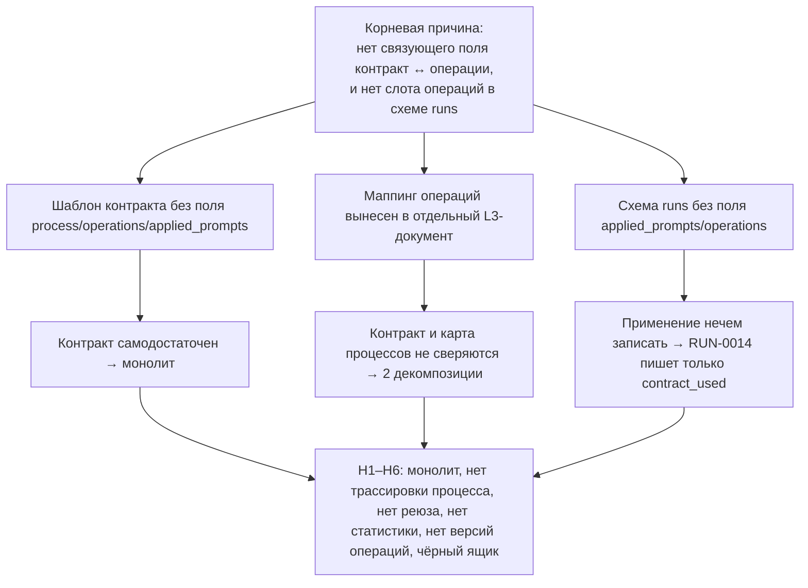

# Структурный анализ применения контракта BCREQ-FR: монолитный промпт против последовательности операций

> Аналитический документ по issue
> [#231](https://github.com/G-Ivan-A/mango_ba_prompts/issues/231).
> Режим работы: Creative / Deep Dive / Think Max.
>
> **Это только анализ.** Документ не принимает решений, не изменяет контракт
> [`governance/bcreq-fr-generation-contract.md`](../../governance/bcreq-fr-generation-contract.md),
> не изменяет [`runs/CONTRACT.md`](../../runs/CONTRACT.md) и не создаёт новых
> обязательных правил процесса. Он фиксирует гипотезы, структурный разбор,
> причины, тесты, выявленные проблемы, граничные кейсы и открытые вопросы для
> владельца (Конард принимает решения сам).

## Методология и роли экспертов

Анализ выполнен последовательным прохождением трёх экспертных ролей. Каждая роль
смотрит на один и тот же предмет — способ применения контракта BCREQ-FR — со
своей позиции и фиксирует свой набор проблем.

1. **Архитектор процессов** (`process-architect`). Отвечает на вопрос: контракт
   применяется как один монолитный шаг или как процесс из подпроцессов и
   операций? Где границы операций, где гейты, как это соотносится с уже
   существующей картой процессов БА.
2. **AI-инженер** (`ai-engineer`). Отвечает на вопрос: что теряется на уровне
   prompt-инженерии и observability — трассировка промптов, переиспользование,
   режимы запуска (`stepwise`/`oneshot`), версионирование, статистика и
   возможность оценивать эффективность.
3. **BA-эксперт** (`ba-expert`). Отвечает на вопрос: что теряется для качества и
   аудита самого артефакта BCREQ-FR — можно ли проследить, какая операция
   породила раздел, и связать дефект документа с конкретным правилом.

Источники изучены самостоятельно (Stage 1): прочитаны контракт целиком, его
применение в `RUN-0014`, runs-контракт и его стандарт, стандарт исполняемых
контрактов, карта процессов БА, каталог промптов, один пример stepwise-промпта и
два прогона-эталона `RUN-0010`/`RUN-0011`, где тот же класс артефакта собирался
последовательностью промптов.

## 1. Введение

### 1.1. Предмет анализа

Контракт [`governance/bcreq-fr-generation-contract.md`](../../governance/bcreq-fr-generation-contract.md)
(L1, `rule_class: combat`, 100% YAML, версия 0.4) описывает, как из сырого
запроса заказчика получить документ BCREQ-FR (Business Change Request —
Functional Requirements) с разделами 1, 2, 3, 4, 6 и заглушками 5 и 7. Контракт
содержит:

- `generation_process` из трёх шагов
  ([`bcreq-fr-generation-contract.md:178-212`](../../governance/bcreq-fr-generation-contract.md)):
  `step_1_load_and_normalize_sources`, `step_2_taxonomy_and_documentation_binding`,
  `step_3_result_decomposition`;
- `section_rules` — встроенные правила по каждому разделу
  ([`bcreq-fr-generation-contract.md:214-319`](../../governance/bcreq-fr-generation-contract.md));
- `validation` — 10 проверок `BCREQ-FR-VAL-01…10`
  ([`bcreq-fr-generation-contract.md:365-398`](../../governance/bcreq-fr-generation-contract.md));
- `self_review` — три роли само-проверки **самого файла контракта**
  ([`bcreq-fr-generation-contract.md:434-453`](../../governance/bcreq-fr-generation-contract.md)).

### 1.2. Вопрос issue

Issue #231 ставит структурный вопрос: контракт BCREQ-FR применяется **как единый
монолитный промпт** или **как последовательность операций, каждая из которых
применяет специализированный промпт**? И требует выявить **максимальный набор
проблем** в процессах, подпроцессах и операциях генерации, если применение —
монолитное.

### 1.3. Что важно знать заранее (контекст репозитория)

В репозитории уже существует отдельный слой знаний о процессах — карта
[`docs/ba-processes/00-index.md`](../../docs/ba-processes/00-index.md). Она
**сознательно** ведётся как единый reviewable-реестр и связывает «9 процессов БА,
13 когнитивных операций, 7 MVP-паттернов, 24 активных prompt-файла»
([`00-index.md:28-29`](../../docs/ba-processes/00-index.md)). Процесс №1
«Формирование ФТ/ТЗ» — это ровно тот процесс, результатом которого является
BCREQ-FR. По центральному маппингу он раскладывается на операции `ingestion`,
`understanding`, `modeling`, `documentation`, `solution_design`, `validation` и
~19 рекомендованных промптов ([`00-index.md:63`](../../docs/ba-processes/00-index.md)).

То есть в репозитории **одновременно** живут:

- монолитный исполняемый контракт, который порождает BCREQ-FR «за один проход»;
- развёрнутая карта операций и библиотека специализированных промптов, способных
  собрать тот же BCREQ-FR «по шагам».

Эти два слоя **не связаны между собой ни одним полем**. Именно зазор между ними и
есть корень проблемы, разбираемой ниже.

## 2. Гипотезы

Центральная гипотеза issue и производные от неё подгипотезы. Для каждой указан
вердикт по итогам тестов (раздел 5) и ключевая улика.

| ID | Гипотеза | Вердикт | Ключевая улика |
| --- | --- | --- | --- |
| H1 | Контракт BCREQ-FR применяется как **единый монолитный промпт**, а не как последовательность специализированных промптов. | **Подтверждена** | В `RUN-0014` из идентификаторов исполнения записаны `contract_used` + `model`; поля промпта/операции в метаданных нет ([`metadata.yaml`](../../runs/2026/RUN-0014/metadata.yaml)). |
| H2 | Монолитное применение теряет **трассируемость процесса**: невозможно сказать, какие промпты/операции были применены. | **Подтверждена** | Лог `RUN-0014` пересказывает 3 шага постфактум прозой, без атрибуции операций ([`business-task-log.md:14-34`](../../runs/2026/RUN-0014/logs/business-task-log.md)). |
| H3 | Монолит мешает **переиспользованию промптов**: логика разделов заперта внутри контракта и недоступна другим процессам. | **Подтверждена** | `section_rules` дублируют правила промптов, но не ссылаются на них; промпты переиспользуются между `RUN-0010/0011/0012`, контракт — нет. |
| H4 | Монолит мешает **статистическому анализу эффективности**: нельзя сравнить операции и привязать дефект к промпту. | **Подтверждена** | `RUN-0010` привязывает дефекты Б1–Б5 к именованным промптам; `RUN-0014` таких данных не даёт ([`...email-routing.md:98-123`](../../runs/2026/RUN-0010/outputs/2026-06-17-bcreq-1025-email-routing.md)). |
| H5 | Монолит мешает **версионированию операций**: одна версия контракта покрывает все операции, нет привязки версий контракт↔промпт. | **Подтверждена** | Контракт v0.4 против `fr-documentation-stepwise` v0.1; правила раздела 4 дублируются и расходятся без проверки паритета. |
| H6 | Применённый монолитно контракт становится **«чёрным ящиком»** для последующего аудита. | **Подтверждена** | По выходу `RUN-0014` нельзя восстановить, какая операция породила раздел 4 против раздела 6. |
| H7 (нюанс) | Контракт теряет **всю** трассируемость. | **Опровергнута (уточнена)** | Трассируемость **артефакта** (FR → источник → taxonomy) у контракта сильная ([`...contract.md:332-348`](../../governance/bcreq-fr-generation-contract.md)); теряется только трассируемость **процесса** (операция/промпт). См. §6.1. |

Гипотеза H7 важна для честности анализа: нельзя утверждать, что контракт «теряет
трассируемость» вообще. Нужно различать два разных вида трассируемости —
артефактную и процессную (детально в §6.1). Контракт силён в первой и пуст во
второй.

## 3. Структурный анализ проблемы

### 3.1. Три способа применить правило генерации

Чтобы ответить на вопрос issue точно, зафиксируем три структурно различных режима
применения генерирующего правила.

```mermaid
flowchart TD
    subgraph M1["Режим 1: Монолитный промпт (как сейчас — RUN-0014)"]
        A1["Сырой запрос"] --> B1["Контракт целиком = один промпт"]
        B1 --> C1["Один проход модели"]
        C1 --> D1["Один выходной документ"]
        D1 --> E1["Один итоговый блок валидации"]
    end
    subgraph M2["Режим 2: Последовательность операций (RUN-0010/0011)"]
        A2["Сырой запрос"] --> O1["Операция 1: glossary-context → разделы 1-2"]
        O1 --> G1{"Гейт БА"}
        G1 --> O2["Операция 2: fr-documentation → раздел 4"]
        O2 --> G2{"Гейт БА"}
        G2 --> O3["Операция 3: constraints → раздел 6"]
        O3 --> G3{"Гейт БА"}
        G3 --> V["Операция N: fr-validation"]
    end
    subgraph M3["Режим 3: Оркестрованный контракт (не существует)"]
        A3["Сырой запрос"] --> ORCH["Контракт ссылается на операции и фиксирует шаги"]
        ORCH -.-> LIB[("Библиотека промптов")]
        ORCH --> TRACE["Запись операция → промпт → версия → раздел"]
    end
```



- **Режим 1 (монолит).** Контракт — это один самодостаточный YAML-спецификатор.
  Его `generation_process`, `section_rules` и `validation` исполняются за один
  проход модели. Именно так выглядит `RUN-0014`.
- **Режим 2 (последовательность).** Артефакт собирается цепочкой именованных
  операций, каждая из которых — отдельный промпт (часто `stepwise` с гейтом).
  Так выглядят `RUN-0010`, `RUN-0011`, `RUN-0012`.
- **Режим 3 (оркестрация).** Контракт, который **ссылается** на операции и
  библиотеку промптов и фиксирует, какие операции и в каком порядке были
  применены. В репозитории **не существует**: ни в шаблоне контракта, ни в схеме
  runs нет поля для такой записи.

### 3.2. Прямой ответ на вопрос issue

**Контракт BCREQ-FR применяется в Режиме 1 (монолитный промпт).** Это
подтверждается и структурой контракта, и фактом его применения:

1. **Структурно** контракт самодостаточен: он встраивает весь процесс внутрь
   себя (3 шага + правила всех разделов + валидация) и **не содержит ни одной
   ссылки** на промпты или операции. Поиск по файлу: `prompt` в контракте не
   встречается ни разу (Тест A, §5.1).
2. **Фактически** единственный прогон, применивший этот контракт (`RUN-0014`), из
   идентификаторов исполнения записал `contract_used:
   "governance/bcreq-fr-generation-contract.md"` (стр. 9) и `model:
   "claude-opus-4-8"` (стр. 7), но ни одного промпта или операции — поля для них в
   метаданных нет ([`metadata.yaml`](../../runs/2026/RUN-0014/metadata.yaml)). Лог
   пересказал 3 шага генерации прозой постфактум и свёл валидацию в один финальный
   блок ([`business-task-log.md:29-34`](../../runs/2026/RUN-0014/logs/business-task-log.md)).

Контракт **не** применяется как последовательность специализированных промптов —
**хотя** такие промпты существуют, документированная последовательность для
«Формирования ФТ/ТЗ» зафиксирована
([`prompts/README.md`](../../prompts/README.md),
[`00-index.executable.md:38`](../../docs/ba-processes/00-index.executable.md)), а
другие прогоны доказали, что последовательность работает и даёт более богатую
трассировку.

### 3.3. Подпроцессы и операции: где они «схлопнулись»

Архитектор процессов фиксирует три уровня схлопывания.

**(а) Процесс → монолит.** Канонический процесс №1 состоит из 6 операций
([`00-index.executable.md:52`](../../docs/ba-processes/00-index.executable.md)).
Контракт переописывает генерацию как **3 своих шага**, которые не совпадают с
этими 6 операциями:

| Канонические операции процесса №1 | 3 шага `generation_process` контракта |
| --- | --- |
| `ingestion`, `understanding` | частично в `step_1_load_and_normalize_sources` |
| `modeling`, `solution_design` | явно отсутствуют как шаги (растворены в `section_rules` 3.x) |
| `documentation` | `step_3_result_decomposition` |
| `validation` | вынесена в отдельный блок `validation`, а не как шаг |
| — | `step_2_taxonomy_and_documentation_binding` (нет прямого аналога-операции) |

Это **две несовместимые декомпозиции одного процесса**: карта процессов и
контракт описывают «Формирование ФТ/ТЗ» по-разному, и их никто не сверяет.

**(б) Операция → статическое правило.** Одна операция в мире промптов — это сам
по себе подпроцесс с шагами и гейтами. Промпт
[`fr-documentation-stepwise.md`](../../prompts/fr-documentation-stepwise.md)
(операция `documentation` для раздела 4) — это 4 внутренних шага: ШАГ 1
синхронизация контекста, ШАГ 2 сценарная декомпозиция, ШАГ 3 генерация, ШАГ 4
валидация через ODA; «РЕЖИМ РАБОТЫ: Строго пошаговый» с явными человеческими
гейтами «Жди ответа» после Шагов 1–2
([`fr-documentation-stepwise.md:32-63`](../../prompts/fr-documentation-stepwise.md)).
Контракт переносит **правила** этого промпта в `section_4_functional_requirements`
([`...contract.md:275-292`](../../governance/bcreq-fr-generation-contract.md)) —
иерархию 4.x/4.x.x/4.x.x.x, нормализацию стиля, атомарность, защиту scope, — но
**теряет 4 интерактивных шага и человеческие гейты**. Подпроцесс схлопнут в набор
статических правил.

**(в) Шаги контракта не адресуемы.** Три шага `generation_process` не имеют
stable ID (в отличие от разделов `BCREQ-FR-SECTION-0X` и проверок
`BCREQ-FR-VAL-0X`). На них нельзя сослаться из run-лога, их нельзя пере-выполнить
по отдельности, их нельзя посчитать в статистике. Шаг существует как проза внутри
YAML, а не как исполняемая единица.

### 3.4. Внутреннее противоречие контракта как зеркало проблемы

Контракт сам по себе содержит микро-версию обсуждаемой проблемы. Поле
`validation.cadence` гласит: «Выполнять проверки **после каждого крупного шага** и
вывести итоговый блок в конце документа»
([`...contract.md:366`](../../governance/bcreq-fr-generation-contract.md)). Но ни
одного механизма пошаговых гейтов в контракте нет: есть только `final_block_title`
([`...contract.md:367`](../../governance/bcreq-fr-generation-contract.md)) и 10
проверок, все из которых проверяют **готовый документ целиком** (полнота
источников, структура, атомарность раздела 4 и т.д.). И применение это
подтверждает: в `RUN-0014` валидация — единый финальный блок
([`business-task-log.md:33-34`](../../runs/2026/RUN-0014/logs/business-task-log.md)).

Таким образом, **намерение** пошагового процесса с гейтами в контракте
задекларировано прозой, но **структурно не реализовано**. Это тот же разрыв
«процесс заявлен — но применён монолитно», только в миниатюре, внутри одного
поля.

## 4. Анализ причин

### 4.1. Метод «5 почему»

1. **Почему контракт применяется как один промпт?**
   Потому что он встраивает весь процесс (3 шага + все правила разделов +
   валидацию) в один самодостаточный YAML без ссылок наружу.
2. **Почему он самодостаточен и не ссылается на промпты?**
   Потому что шаблон в [`standards/executable-contract-standard.md`](../../standards/executable-contract-standard.md)
   не предусматривает поля для процесса/операций/применённых промптов и
   предписывает «боевую чистоту» L1 — контракт моделируется как **одиночный
   combat-ассет, брат промпта**, а не как оркестратор промптов.
3. **Почему в шаблоне нет поля операций?**
   Потому что маппинг «процесс → операции → промпты» **сознательно** вынесен в
   отдельный L3-документ ([`00-index.md:28-29`](../../docs/ba-processes/00-index.md):
   «Маппинг сознательно ведётся здесь, а не во frontmatter промптов»). Два слоя
   спроектированы раздельно.
4. **Почему их так и не связали?**
   Потому что нет поля, связывающего контракт с картой процессов, **и** в схеме
   runs ([`runs/CONTRACT.md:39-51`](../../runs/CONTRACT.md),
   [`runs-contract-standard.md`](../../standards/runs-contract-standard.md)) нет
   слота, куда записать применённые операции/промпты. Записать
   последовательность негде даже во время выполнения.
5. **Корневая причина.**
   Фреймворк разделяет **«боевое исполнение»** (контракт = один монолитный
   промпт) и **«знание о процессе»** (карта `00-index.md` = операции и промпты)
   **без связующего поля между ними**, а схема runs не имеет слота для записи
   применённых операций. Поэтому контракт **неизбежно** применяется и
   записывается как чёрный ящик из одного промпта.



### 4.2. Почему это не «случайность одного прогона»

Можно было бы возразить: возможно, `RUN-0014` просто плохо залогирован, а
контракт здесь ни при чём. Тест C (§5.3) это снимает: поле для промптов
**отсутствует в схеме** runs, а не «забыто» в одном прогоне. Прогоны, которые
писали промпты (`RUN-0007/0010/0011/0012`), делали это **ad hoc** — кто в
`related_artifacts`, кто в `prompts_used` внутри выходного файла, кто отдельным
`prompts-chain.md`. Единого поля нет ни у кого. Значит, отсутствие записи
операций у `RUN-0014` — следствие структуры, а не небрежности.

## 5. Тесты применения

Тесты выполнены поиском по корпусу репозитория (эмпирические наблюдения, а не
гипотезы). Команды и результаты приведены, чтобы вывод можно было воспроизвести.

### 5.1. Тест A — ссылается ли контракт на промпты

```bash
grep -niE "prompt|prompts/" governance/bcreq-fr-generation-contract.md
```

**Результат:** совпадений нет. Контракт **не ссылается ни на один промпт-ассет**.
Это прямое доказательство Режима 1: контракт самодостаточен.

### 5.2. Тест B — естественный эксперимент «монолит против последовательности»

Ключевой тест. В репозитории уже есть оба способа собрать BCREQ-FR/ФТ, и их можно
сравнить напрямую.

```bash
grep -rniE "prompts/[a-z]|prompts_used|applied_prompt" runs/
```

**Результат:** прогоны, собиравшие ФТ **последовательностью промптов**, записали
её явно:

- `RUN-0010` — таблица «Использованные промпты (ЦЕПОЧКА)»: промпт | версия |
  раздел ([`...email-routing.md:44-50`](../../runs/2026/RUN-0010/outputs/2026-06-17-bcreq-1025-email-routing.md));
- `RUN-0011` — отдельный [`prompts-chain.md`](../../runs/2026/RUN-0011/outputs/prompts-chain.md)
  с таблицей «№ | промпт | операция | зачем в цепочке | артефакт-выход» и
  отдельными файлами `step-1…step-5`;
- `RUN-0012` — поле `prompts_used` в логе и выходе.

А **единственный прогон, применивший контракт BCREQ-FR (`RUN-0014`), не записал
ни одного промпта** — только `contract_used` + `model`.

**Дельта (что теряется при схлопывании Режима 2 → Режим 1).** Сравнение реальных
прогонов, а не гипотетических:

| Измерение | Режим 2: последовательность (`RUN-0010/0011`) | Режим 1: монолит (`RUN-0014`) | Что потеряно |
| --- | --- | --- | --- |
| Идентичность операции/промпта | каждый промпт назван и версионирован по разделу | нет | Нельзя сказать, чем порождён раздел |
| Промежуточные артефакты | файлы `step-N`, гейт БА между шагами | один выходной файл | Нет точек контроля и отката |
| Эффективность по операции | дефекты Б1–Б5 привязаны к именованному промпту | дефект можно отнести только к «контракту» | Нет per-operation аналитики |
| Режим запуска (`stepwise`/`oneshot`) | выбран и обоснован по шагу | отсутствует как понятие | Нет управления риском домыслов |
| Условное/выборочное применение | задокументировано «что НЕ запускали и почему» | всё-или-ничего | Нет ветвления и его записи |
| Переиспользование | промпты переиспользуются между прогонами | логика заперта в контракте | Нет DRY |
| Гранулярность версий | каждый промпт версионируется отдельно (v0.1) | одна версия контракта (v0.4) на все операции | Правка одного раздела двигает весь контракт |
| Статистика | счётчики по промптам ([`runs/stats/by-process.md`](../../runs/stats/by-process.md)) | ноль данных по операциям | Слепое пятно в статистике |

Эта дельта — прямой ответ на требование issue «найти дельту между применением
контракта как промпта и как последовательности».

### 5.3. Тест C — есть ли в схеме runs поле для операций/промптов

```bash
grep -rhoE "^[a-z_]+:" runs/2026/*/metadata.yaml | sort | uniq -c | sort -rn
```

**Результат:** среди 15 прогонов поля `process`, `model`, `status` есть у всех; а
выделенного поля `applied_prompts`/`operations` **нет ни у одного**. Поле
`contract_used` встречается лишь дважды (`RUN-0014` и `RUN-0015`). Сверка с
[`runs/CONTRACT.md:39-51`](../../runs/CONTRACT.md) и
[`standards/runs-contract-standard.md`](../../standards/runs-contract-standard.md)
подтверждает: запись применённых операций контрактом **схемой не предусмотрена**.

### 5.4. Тест D — совпадают ли 3 шага контракта с 6 операциями процесса

Сопоставление выполнено в §3.3 (таблица). **Результат:** не совпадают. Контракт
вводит собственную декомпозицию (3 шага), параллельную канонической (6 операций),
и эти две декомпозиции нигде не сверяются.

## 6. Выявленные проблемы

Проблемы сгруппированы по трём ролям. Каждая снабжена уликой и влиянием. Это
**максимальный набор**, как требует issue: подпроцессы, операции, трассируемость и
версионирование покрыты явно.

### 6.1. Роль «Архитектор процессов» (PA)

| ID | Проблема | Улика | Влияние |
| --- | --- | --- | --- |
| PA-1 | **Процесс схлопнут в монолит**: 6 канонических операций заменены 3 неадресуемыми шагами. | §3.3(а), [`00-index.executable.md:52`](../../docs/ba-processes/00-index.executable.md) против [`...contract.md:178-212`](../../governance/bcreq-fr-generation-contract.md) | Процесс непрозрачен; нельзя управлять им по операциям. |
| PA-2 | **Две несовместимые декомпозиции** одного процесса (карта vs контракт) никем не сверяются. | §3.3(а), §5.4 | Расхождение моделей процесса; риск тихого дрейфа. |
| PA-3 | **Подпроцесс операции схлопнут**: 4 гейтованных шага `fr-documentation-stepwise` стали статическими правилами. | [`fr-documentation-stepwise.md:32-63`](../../prompts/fr-documentation-stepwise.md) против [`...contract.md:275-292`](../../governance/bcreq-fr-generation-contract.md) | Потеряны человеческие гейты внутри операции. |
| PA-4 | **Шаги не адресуемы**: у `generation_process` нет stable ID, в отличие от разделов и проверок. | [`...contract.md:178-212`](../../governance/bcreq-fr-generation-contract.md) | На шаг нельзя сослаться, его нельзя пере-выполнить/посчитать. |
| PA-5 | **Декларация без реализации**: `cadence` обещает проверки «после каждого крупного шага», но есть только финальный блок. | [`...contract.md:366`](../../governance/bcreq-fr-generation-contract.md), [`business-task-log.md:33-34`](../../runs/2026/RUN-0014/logs/business-task-log.md) | Намерение пошаговых гейтов не исполняется. |
| PA-6 | **Нет режима оркестрации**: ни шаблон контракта, ни схема runs не позволяют контракту ссылаться на операции. | [`executable-contract-standard.md`](../../standards/executable-contract-standard.md), [`runs/CONTRACT.md`](../../runs/CONTRACT.md) | Режим 3 структурно недостижим. |

### 6.2. Роль «AI-инженер» (AIE)

| ID | Проблема | Улика | Влияние |
| --- | --- | --- | --- |
| AIE-1 | **Нет трассировки промптов**: применение записано без единого промпта/операции. | [`RUN-0014/metadata.yaml`](../../runs/2026/RUN-0014/metadata.yaml) | Нельзя восстановить, что и как исполнялось. |
| AIE-2 | **Нет observability по операциям**: нет per-step токенов, латентности, качества, промежуточных выходов. | §3.3(в), [`business-task-log.md`](../../runs/2026/RUN-0014/logs/business-task-log.md) | Невозможно профилировать и отлаживать генерацию. |
| AIE-3 | **Нет управления режимом** `stepwise`/`oneshot`: контракт не знает понятия режима. | [`00-index.md:73-79`](../../docs/ba-processes/00-index.md) против контракта | Нет управления риском домыслов и гейтами. |
| AIE-4 | **Нарушение DRY**: `section_rules` дублируют правила промптов, не ссылаясь на них. | [`...contract.md:275-292`](../../governance/bcreq-fr-generation-contract.md) против [`fr-documentation-stepwise.md:14-31`](../../prompts/fr-documentation-stepwise.md) | Два источника правды для одной логики. |
| AIE-5 | **Невозможны eval/A-B по операциям**: нет единицы, на которой ставить эксперимент. | §5.2, отсутствие per-operation выходов | Нельзя измерять и улучшать отдельные операции. |
| AIE-6 | **Запертый ассет**: логика разделов недоступна другим процессам (4, 8, 9), которые переиспользуют те же промпты. | [`00-index.md:64-71`](../../docs/ba-processes/00-index.md) | Дублирование вместо переиспользования. |

### 6.3. Роль «BA-эксперт» (BA)

| ID | Проблема | Улика | Влияние |
| --- | --- | --- | --- |
| BA-1 | **Нет процессной трассируемости артефакта**: по выходу нельзя сказать, какая операция породила раздел 4 против раздела 6. | §3.2, [`business-task-log.md:29-32`](../../runs/2026/RUN-0014/logs/business-task-log.md) | Аудит документа упирается в чёрный ящик. |
| BA-2 | **Регресс по сравнению с `RUN-0010`**: там дефекты привязаны к промпту, здесь — нет. | [`...email-routing.md:98-123`](../../runs/2026/RUN-0010/outputs/2026-06-17-bcreq-1025-email-routing.md) против `RUN-0014` | Утрачена возможность точечного улучшения. |
| BA-3 | **Различение двух трассируемостей** (уточнение H7): артефактная трассируемость (FR → источник → taxonomy) у контракта **сильная**; процессная (операция/промпт → раздел) — **отсутствует**. | [`...contract.md:332-348`](../../governance/bcreq-fr-generation-contract.md) (сильная) против §5.3 (пустая) | Проблема не «нет трассировки вообще», а «нет трассировки процесса». |
| BA-4 | **Нет точки частичной переработки**: при правке только раздела 6 нет операции-единицы, которую можно пере-выполнить. | §3.3(в), практика `RUN-0010` (раздел 6 отдельным промптом) | Переработка — всё-или-ничего. |
| BA-5 | **Скрытые ручные пробелы**: где операция выполняется вручную (нет промпта — процессы 5/7/8/9), монолит это не отражает. | [`00-index.executable.md:62-67`](../../docs/ba-processes/00-index.executable.md) (gate rules) | Ручной шаг не виден в аудите. |

### 6.4. Версионирование (сквозная проблема)

| ID | Проблема | Улика | Влияние |
| --- | --- | --- | --- |
| VER-1 | **Монолитная версия**: одна версия контракта (0.4) покрывает все операции; правка логики одного раздела двигает весь контракт. | [`...contract.md:4`](../../governance/bcreq-fr-generation-contract.md) | Нет независимой эволюции операций. |
| VER-2 | **Дрейф без проверки паритета**: правила раздела 4 в контракте (v0.4) и в `fr-documentation-stepwise` (v0.1) версионируются независимо, сверки нет. | §6.2 AIE-4 | Контракт и промпт могут разойтись молча. |
| VER-3 | **Невозможно закрепить «какая версия какой операции» породила артефакт.** | §5.3 (нет поля), `RUN-0014` | Артефакт нельзя привязать к версии операции. |

### 6.5. Связь с ранее зафиксированными проблемами (без дублирования)

Чтобы не плодить дубли, отмечаю пересечения с уже принятыми анализами:

- [`docs/analysis/executable-contracts-and-rfc-problems.md`](executable-contracts-and-rfc-problems.md)
  фиксирует разрыв «знание процесса в L3 — исполнение в L1»; настоящий документ
  даёт **конкретный кейс** этого разрыва для BCREQ-FR (PA-1, PA-2, PA-6).
- [`docs/analysis/artifact-chain-hypothesis-research.md`](artifact-chain-hypothesis-research.md)
  ставит вопрос наблюдаемости и переиспользования на уровне governance; здесь —
  **операционный уровень** того же вопроса (AIE-2, AIE-5, AIE-6).

## 7. Граничные кейсы

Минимум 6 кейсов по требованию issue. Для каждого: сценарий, вопрос, риск, как
ведёт себя монолит и как — последовательность. Кейсы — это и есть «тесты на
устойчивость» структуры.

### EC-1. Одна операция применяется несколько раз

- **Сценарий.** `fr-documentation` запускается повторно (после правок БА или по
  одному блоку 4.x на каждый FR из 3.6) — внутри `fr-documentation-stepwise`
  ШАГ 2 «матрица сценариев» сам по себе итеративен ([`fr-documentation-stepwise.md:43-52`](../../prompts/fr-documentation-stepwise.md)).
- **Вопрос.** Как записать N применений одной операции в одном прогоне?
- **Риск.** Монолит не имеет понятия «операция», поэтому записывает 0 применений
  вместо N. Последовательность пишет каждый запуск отдельным шагом.

### EC-2. Операция вернула ошибку или галлюцинацию

- **Сценарий.** Taxonomy-binding не нашёл узел (реальный блокер `RUN-0014`:
  «Узла именованной группы номеров ВАТС … нет», [`business-task-log.md:38-40`](../../runs/2026/RUN-0014/logs/business-task-log.md)),
  или операция придумала slug.
- **Вопрос.** Как изолировать сбойную операцию и пере-выполнить только её?
- **Риск.** В монолите сбой одного шага делает подозрительным **весь** проход;
  нет изоляции. В последовательности сбойный шаг локализован и переисполняется.

### EC-3. Условная операция / ветвление

- **Сценарий.** `asr-ingestion` применяется только «при ASR»
  ([`00-index.executable.md:38`](../../docs/ba-processes/00-index.executable.md));
  разделы 5/7 — заглушки; выбор `stepwise` vs `oneshot` зависит от
  неопределённости.
- **Вопрос.** Как зафиксировать, какая ветка была выбрана и почему?
- **Риск.** Монолит «запекает» один путь и не записывает выбор ветки.
  Последовательность фиксирует условие и решение (как `RUN-0011`, раздел «что
  осознанно НЕ запускалось», [`prompts-chain.md:80-88`](../../runs/2026/RUN-0011/outputs/prompts-chain.md)).

### EC-4. Частичная переработка (re-run одного раздела)

- **Сценарий.** Ревью требует переписать только раздел 6, остальное принято.
  В `RUN-0010` раздел 6 шёл отдельным `stepwise`-промптом — его можно
  переисполнить точечно ([`...email-routing.md:50`](../../runs/2026/RUN-0010/outputs/2026-06-17-bcreq-1025-email-routing.md)).
- **Вопрос.** Какая единица переисполняется при частичной правке?
- **Риск.** Монолит переисполняет всё-или-ничего; нет раздело-/операционной
  единицы отката.

### EC-5. Несколько контрактов / передача в одном прогоне

- **Сценарий.** BCREQ-FR порождает NFR-кандидаты, которые должны уйти в отдельный
  NFR-артефакт ([`...contract.md:296-297`](../../governance/bcreq-fr-generation-contract.md));
  либо в одном прогоне применяются RFC-контракт и BCREQ-FR-контракт.
- **Вопрос.** Где граница операций для передачи между контрактами?
- **Риск.** Без границ операций непонятно, где заканчивается один контракт и
  начинается другой; передача не трассируется.

### EC-6. Промпт/операция меняется по ходу программы

- **Сценарий.** `fr-documentation-stepwise` поднимается с v0.1 до v0.2, контракт
  остаётся v0.4.
- **Вопрос.** Какой версией операции порождён раздел 4 в `RUN-0014`?
- **Риск.** Ответа нет (VER-2/VER-3): правила в контракте и в промпте
  расходятся молча, привязка версии к артефакту невозможна.

### EC-7. Новая операция без промпта (ручной пробел)

- **Сценарий.** Процессы 5/7/8/9 не имеют выделенного промпта — «Выполняется
  вручную» или «Требуется разработка промпта»
  ([`00-index.executable.md:62-67`](../../docs/ba-processes/00-index.executable.md)).
- **Вопрос.** Как монолит покажет, что часть работы сделана руками?
- **Риск.** Монолит скрывает ручной пробел; последовательность по gate-правилу
  обязана пометить «Выполняется вручную».

### EC-8. Нарушение порядка/зависимости операций

- **Сценарий.** `bridge_rule`: раздел 4 нельзя начинать до построения моста 3.6
  ([`...contract.md:210`](../../governance/bcreq-fr-generation-contract.md)).
- **Вопрос.** Чем подтверждается, что зависимость соблюдена?
- **Риск.** В монолите это внутреннее прозаическое правило без записи факта
  соблюдения. В последовательности это явный гейт между операциями с
  артефактом-выходом.

## 8. Дополнительные исследования

Раздел опционален по issue; включён, чтобы поместить вывод в контекст инженерных
практик (как анализ, не как решение).

- **Промпт-цепочки и пошаговая наблюдаемость.** В индустрии LLM-конвейеры
  собираются из адресуемых компонентов с per-step трассировкой (вход/выход,
  токены, латентность). Режим 2 репозитория уже близок к этому (`prompts-chain.md`,
  файлы `step-N`); Режим 1 — нет. Это согласуется с измерением «observability» в
  [`artifact-chain-hypothesis-research.md`](artifact-chain-hypothesis-research.md).
- **Реестр промптов как источник правды.** Карта `00-index.md` уже играет роль
  реестра операций/промптов. Разрыв в том, что combat-контракт его не использует.
  Это операционная проекция вывода
  [`executable-contracts-and-rfc-problems.md`](executable-contracts-and-rfc-problems.md)
  о разрыве L3-знания и L1-исполнения.
- **Гибридные исполняемые контракты.** Существование Режима 3 (контракт-оркестратор)
  технически не противоречит «боевой чистоте» L1: ссылки на операции можно держать
  как stable IDs в L2-реестре, а не как L3-прозу. Это **наблюдение о пространстве
  решений**, а не рекомендация; выбор — за владельцем.

## 9. Заключение

### 9.1. Ответ на вопрос issue

Контракт BCREQ-FR применяется **как единый монолитный промпт** (Режим 1),
подтверждено и структурой контракта (Тест A: ноль ссылок на промпты), и его
единственным применением (`RUN-0014`: записаны только `contract_used` + `model`).
Он **не** применяется как последовательность специализированных промптов, хотя
такие промпты, документированная последовательность и доказавшие её прогоны
(`RUN-0010/0011/0012`) в репозитории есть.

### 9.2. Дельта и корневая причина

Дельта между монолитом и последовательностью измерена на **реальном естественном
эксперименте** (Тест B, таблица §5.2): теряются идентичность операций,
промежуточные артефакты, per-operation эффективность, управление режимом,
ветвление, переиспользование, гранулярность версий и статистика. Корневая причина
(§4): фреймворк разделяет боевое исполнение и знание о процессе **без связующего
поля**, а схема runs не имеет слота для записи применённых операций — поэтому
монолитное чёрно-ящичное применение структурно неизбежно.

### 9.3. Максимальный набор проблем

Зафиксировано 6 проблем уровня процессов (PA-1…6), 6 — уровня AI-инженерии
(AIE-1…6), 5 — уровня BA (BA-1…5) и 3 сквозных по версионированию (VER-1…3), плюс
8 граничных кейсов (EC-1…8). Явно покрыты все требуемые срезы: подпроцессы,
операции, трассируемость (с уточнением артефактная vs процессная) и
версионирование.

### 9.4. Открытые вопросы для владельца (решения не принимаются)

1. Нужен ли Режим 3 (контракт-оркестратор) или достаточно фиксировать применённые
   операции на уровне runs?
2. Где должна жить связь «контракт ↔ операции» — в L2-реестре, во frontmatter
   контракта или в схеме runs?
3. Допустимо ли дублирование правил «контракт vs промпт», или нужен механизм
   паритета версий (VER-2)?
4. Что делать с расхождением двух декомпозиций процесса (3 шага контракта vs 6
   операций карты) — сверять или сознательно оставить параллельными?

Эти вопросы намеренно оставлены без ответа: issue требует **анализа**, а решения
принимает Конард.

## Источники

- [`governance/bcreq-fr-generation-contract.md`](../../governance/bcreq-fr-generation-contract.md)
- [`runs/CONTRACT.md`](../../runs/CONTRACT.md),
  [`standards/runs-contract-standard.md`](../../standards/runs-contract-standard.md)
- [`standards/executable-contract-standard.md`](../../standards/executable-contract-standard.md)
- [`docs/ba-processes/00-index.md`](../../docs/ba-processes/00-index.md),
  [`docs/ba-processes/00-index.executable.md`](../../docs/ba-processes/00-index.executable.md)
- [`prompts/README.md`](../../prompts/README.md),
  [`prompts/fr-documentation-stepwise.md`](../../prompts/fr-documentation-stepwise.md)
- [`runs/2026/RUN-0014/`](../../runs/2026/RUN-0014/) (metadata, business-task-log, scope-analysis)
- [`runs/2026/RUN-0010/outputs/2026-06-17-bcreq-1025-email-routing.md`](../../runs/2026/RUN-0010/outputs/2026-06-17-bcreq-1025-email-routing.md)
- [`runs/2026/RUN-0011/outputs/prompts-chain.md`](../../runs/2026/RUN-0011/outputs/prompts-chain.md)
- [`runs/stats/by-process.md`](../../runs/stats/by-process.md)
- [`docs/analysis/executable-contracts-and-rfc-problems.md`](executable-contracts-and-rfc-problems.md),
  [`docs/analysis/artifact-chain-hypothesis-research.md`](artifact-chain-hypothesis-research.md)
- issue [#231](https://github.com/G-Ivan-A/mango_ba_prompts/issues/231)
