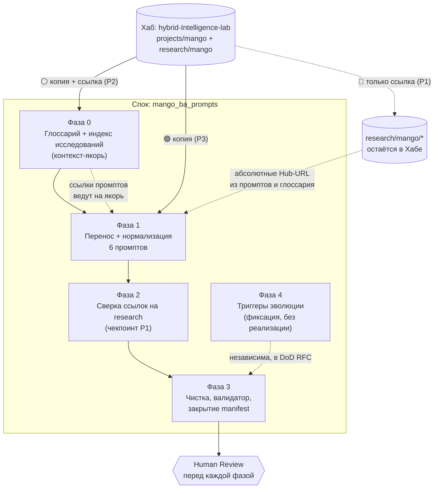

# RFC: стратегия миграции проекта Mango из Хаба в спок `mango_ba_prompts`

> ⚠️ **Это RFC-отчёт на Human Review, а не реализация.** В рамках issue #8
> действует стоп-фактор: физический перенос промптов, глоссария и стандартов
> **не выполняется** до утверждения этой стратегии человеком. Документ фиксирует
> аудит артефактов Хаба по полным URL, предлагает фазовую стратегию миграции,
> разбирает edge cases и фиксирует, что сознательно откладывается на будущее.

**Operating Mode**: `Creative` — задача не в механическом копировании
предложенных шагов, а в проверке их аудитом и в предложении **собственной**
оптимальной стратегии с трассируемым обоснованием каждого решения.

**Связь с предыдущим RFC**: настоящий документ — прямое продолжение
[`docs/audit/initial-state-2026-06.md`](../audit/initial-state-2026-06.md)
(issue #4). Тот RFC покрыл **базовый геном** спока (governance, правила,
каркасы) и набросал черновой план миграции (§3). Этот RFC сужает фокус до
**стратегии переноса содержимого Mango** и опирается на фактический аудит Хаба,
а не на память.

---

## 1. Введение

### 1.1. Контекст миграции

Проект Mango мигрирует из Хаба (`hybrid-Intelligence-lab`, монорепо) в отдельный
standalone-спок (`mango_ba_prompts`). Базовый геном спока уже инициализирован
(issue #4 → #6): в корне есть `AI_GOVERNANCE.md`, `AI_QUICK_RULES.md`,
`CONTRIBUTING.md`, `CHANGELOG.md`, каркасы `docs/adr/`, `docs/audit/` и тонкий
`kb/glossary.md`. Содержимое самого проекта Mango (промпты, Mango-only
классификационный глоссарий, эксперименты) **физически остаётся в Хабе**.

Цель этого этапа — определить, **как именно** перенести содержимое, чтобы:

1. не потерять контекст и трассируемость;
2. соблюсти модель hub-and-spoke (исследования — в Хабе, стандарты —
   копируются, промпты — в споке);
3. не усложнять старт ADR-ами и матрицами («практика первична»);
4. оставить дверь открытой для эволюции (ADR, матрица, стандарты — когда
   концепция созреет).

### 1.2. Согласованные принципы (кратко)

| # | Принцип | Что это значит на практике |
| :--- | :--- | :--- |
| P1 | **Исследования → остаются в Хабе** | Спок **ссылается** по полному URL, **не копирует** (избегаем дрейфа). |
| P2 | **Стандарты → source of truth в Хабе, рабочая копия в споке** | Копия + ссылка на оригинал; спок сам решает, когда синхронизироваться. |
| P3 | **Промпты → переносим сейчас; матрица/ADR — потом** | Физический перенос промптов; матрицу и ADR — по факту боли. |
| P4 | **Классификации Mango → доисследовать → стандарт в Хабе → копия в спок** | Не фиксируем как обязательный стандарт спока преждевременно. |
| P5 | **Anti-Inflation** (правило Хаба) | Каталог создаётся только под реальный артефакт, не «на вырост». |

### 1.3. Цель RFC

Предложить **исчерпывающий аудит** артефактов Mango в Хабе, **фазовую
стратегию** миграции с обоснованием, **решения edge cases** и **триггеры
будущей эволюции** — и вынести всё это на Human Review **до** физического
переноса.

---

## 2. Аудит артефактов в Хабе

### 2.1. Метод аудита (полные URL, без относительных путей)

Аудит выполнен по **полным абсолютным URL** к Хабу (техническое требование
issue #8: относительные пути запрещены, т.к. целевые данные — в другом
репозитории). Дерево снято рекурсивно с ветки `main`; permalink-ссылки в этом
RFC **закреплены за коммитом** `038868d` Хаба, чтобы аудит не «поплыл» при
последующих изменениях монорепо (см. творческое улучшение C3, §5).

- Корень аудита (tree):
  <https://github.com/G-Ivan-A/hybrid-Intelligence-lab/tree/main/projects/mango>
- Исследования (tree):
  <https://github.com/G-Ivan-A/hybrid-Intelligence-lab/tree/main/research/mango>
- Permalink-база для blob-ссылок ниже:
  `https://github.com/G-Ivan-A/hybrid-Intelligence-lab/blob/038868dd125b4e2d849ff73604890f1d2787ac0f/`

### 2.2. Легенда классификации

| Знак | Категория | Действие по принципам §1.2 |
| :--- | :--- | :--- |
| 🟢 | **Промпт** | Переносим физически в спок (`prompts/`) + нормализация. |
| 🔵 | **Исследование** | Остаётся в Хабе; в споке — ссылка на полный URL (P1). |
| ⚪ | **Стандарт** | Копируем в спок + ссылка на source of truth в Хабе (P2). |
| ⚫ | **Документация / KB / эксперимент** | Решение индивидуально (перенос / ссылка / архивация). |

### 2.3. Инвентарь `projects/mango/`

| Артефакт (полный URL) | Размер | Тип | Что делаем | Обоснование |
| :--- | :--- | :--- | :--- | :--- |
| [`README.md`](https://github.com/G-Ivan-A/hybrid-Intelligence-lab/blob/038868dd125b4e2d849ff73604890f1d2787ac0f/projects/mango/README.md) | 13.7 KB | ⚫ Docs | **Не переносим.** Архивная ссылка в манифесте | Написан под монорепо Хаба (`status: canonical, v1.3`); относительные ссылки `../../standards/...`, `../../governance/...` за пределы спока; в споке уже есть свой spoke-README. Перенос дал бы битую навигацию (gap G6 предыдущего RFC). |
| [`standards/classification-glossary.md`](https://github.com/G-Ivan-A/hybrid-Intelligence-lab/blob/038868dd125b4e2d849ff73604890f1d2787ac0f/projects/mango/standards/classification-glossary.md) | 13.7 KB | ⚪ Стандарт (Mango-only) | **Копируем в спок** + ссылка на source of truth; переписать внутренние ссылки на абсолютные Hub-URL | `scope: mango-only`, фиксирует иерархию `Domain → Capability → Feature → Atomic Function` и mapping терминов. Это рабочий стандарт промптов; промпты ссылаются на него. Source of truth — Хаб (P2, P4). |
| [`prompts/tz-stats-generator_exp-2026-05.md`](https://github.com/G-Ivan-A/hybrid-Intelligence-lab/blob/038868dd125b4e2d849ff73604890f1d2787ac0f/projects/mango/prompts/tz-stats-generator_exp-2026-05.md) | 1.6 KB | 🟢 Промпт | **Переносим** + нормализация | Готовый prompt asset (вариант `_exp`, ссылается на `research/mango/classification.md`). |
| [`prompts/tz-stats-generator_simple-2026-05.md`](https://github.com/G-Ivan-A/hybrid-Intelligence-lab/blob/038868dd125b4e2d849ff73604890f1d2787ac0f/projects/mango/prompts/tz-stats-generator_simple-2026-05.md) | 2.6 KB | 🟢 Промпт | **Переносим** + нормализация | Готовый asset (вариант `_simple`, без доступа к репо). |
| [`prompts/usecase-stepwise-generator_exp-2026-05.md`](https://github.com/G-Ivan-A/hybrid-Intelligence-lab/blob/038868dd125b4e2d849ff73604890f1d2787ac0f/projects/mango/prompts/usecase-stepwise-generator_exp-2026-05.md) | 1.5 KB | 🟢 Промпт | **Переносим** + нормализация | Ссылается на `research/mango/classification.md` и `kb/glossary.md`. |
| [`prompts/usecase-stepwise-generator_simple-2026-05.md`](https://github.com/G-Ivan-A/hybrid-Intelligence-lab/blob/038868dd125b4e2d849ff73604890f1d2787ac0f/projects/mango/prompts/usecase-stepwise-generator_simple-2026-05.md) | 2.9 KB | 🟢 Промпт | **Переносим** + нормализация | Содержит явный раздел «ФОРМАТ ВЫВОДА» (эталон для выравнивания `_exp`). |
| [`prompts/user-story-generator_exp-2026-05.md`](https://github.com/G-Ivan-A/hybrid-Intelligence-lab/blob/038868dd125b4e2d849ff73604890f1d2787ac0f/projects/mango/prompts/user-story-generator_exp-2026-05.md) | 1.5 KB | 🟢 Промпт | **Переносим** + нормализация | Ссылается на `research/mango/classification.md`, `standards/classification-glossary.md`, `kb/glossary.md`. |
| [`prompts/user-story-generator_simple-2026-05.md`](https://github.com/G-Ivan-A/hybrid-Intelligence-lab/blob/038868dd125b4e2d849ff73604890f1d2787ac0f/projects/mango/prompts/user-story-generator_simple-2026-05.md) | 2.9 KB | 🟢 Промпт | **Переносим** + нормализация | Готовый asset (`_simple`), содержит «ФОРМАТ ВЫВОДА». |
| [`experiments/tz-stats-prototype-2026-05.md`](https://github.com/G-Ivan-A/hybrid-Intelligence-lab/blob/038868dd125b4e2d849ff73604890f1d2787ac0f/projects/mango/experiments/tz-stats-prototype-2026-05.md) | 22.6 KB | ⚫ Эксперимент (`based_on`) | **Ссылка сейчас; перенос по необходимости** | Источник `based_on` для `tz-stats-generator_*`. Нужен для трассировки происхождения промпта, но не для исполнения. |
| [`experiments/usecase_gen-stepwise-alignment_2026-05-26.md`](https://github.com/G-Ivan-A/hybrid-Intelligence-lab/blob/038868dd125b4e2d849ff73604890f1d2787ac0f/projects/mango/experiments/usecase_gen-stepwise-alignment_2026-05-26.md) | 28.3 KB | ⚫ Эксперимент (`based_on`) | **Ссылка; перенос по необходимости** | Источник `based_on` для `usecase-stepwise-generator_*`. |
| [`experiments/user-story_gen-from-raw-request_2026-05-26.md`](https://github.com/G-Ivan-A/hybrid-Intelligence-lab/blob/038868dd125b4e2d849ff73604890f1d2787ac0f/projects/mango/experiments/user-story_gen-from-raw-request_2026-05-26.md) | 23.5 KB | ⚫ Эксперимент (`based_on`) | **Ссылка; перенос по необходимости** | Источник `based_on` для `user-story-generator_*`. |
| [`experiments/prompts-audit-2026-05-26.md`](https://github.com/G-Ivan-A/hybrid-Intelligence-lab/blob/038868dd125b4e2d849ff73604890f1d2787ac0f/projects/mango/experiments/prompts-audit-2026-05-26.md) | 11.9 KB | ⚫ Эксперимент | **Ссылка; перенос, если нужен репро нормализации** | Аудит исходных промптов. Полезен как input для нормализации (Фаза 1). |
| [`experiments/prompts-selftest-2026-05-26.md`](https://github.com/G-Ivan-A/hybrid-Intelligence-lab/blob/038868dd125b4e2d849ff73604890f1d2787ac0f/projects/mango/experiments/prompts-selftest-2026-05-26.md) | 8.7 KB | ⚫ Эксперимент | **Ссылка; перенос, если делаем self-test gate** | Сценарий self-test. Кандидат на перенос, если вводим self-test как acceptance-gate (улучшение C2). |
| `decisions/.gitkeep`, `docs/.gitkeep`, `kb/.gitkeep`, `experiments/.gitkeep` | 0 B | ⚫ Пустой плейсхолдер | **Не переносим** | Anti-Inflation (P5): пустые каталоги спок «с собой не носит». Создаются только под реальный артефакт. |

### 2.4. Инвентарь `research/mango/` — всё 🔵 (остаётся в Хабе)

Все исследования остаются в Хабе (P1). В споке создаются **ссылки на полные
URL**, а не копии. Инвентарь приведён для полноты и чтобы зафиксировать, **на
что именно** ссылаются мигрируемые промпты и глоссарий.

| Артефакт (полный URL) | Размер | Примечание |
| :--- | :--- | :--- |
| [`research/mango/README.md`](https://github.com/G-Ivan-A/hybrid-Intelligence-lab/blob/038868dd125b4e2d849ff73604890f1d2787ac0f/research/mango/README.md) | 2.8 KB | Навигация по исследованиям — точка входа для ссылок спока. |
| [`research/mango/classification.md`](https://github.com/G-Ivan-A/hybrid-Intelligence-lab/blob/038868dd125b4e2d849ff73604890f1d2787ac0f/research/mango/classification.md) | 122.6 KB | **Ключевая зависимость**: на неё ссылаются все `_exp`-промпты и глоссарий. |
| [`research/mango/classification.html`](https://github.com/G-Ivan-A/hybrid-Intelligence-lab/blob/038868dd125b4e2d849ff73604890f1d2787ac0f/research/mango/classification.html) | 151.7 KB | HTML-экспорт; не ссылаемся (дубль `.md`). |
| [`research/mango/classification-tz.md`](https://github.com/G-Ivan-A/hybrid-Intelligence-lab/blob/038868dd125b4e2d849ff73604890f1d2787ac0f/research/mango/classification-tz.md) | 58.7 KB | Проверка классификатора на корпусе из 30 ТЗ; референс для `tz-stats-*`. |
| [`research/mango/classification-tz.html`](https://github.com/G-Ivan-A/hybrid-Intelligence-lab/blob/038868dd125b4e2d849ff73604890f1d2787ac0f/research/mango/classification-tz.html) | 72.0 KB | HTML-экспорт. |
| [`research/mango/requirements-flow.md`](https://github.com/G-Ivan-A/hybrid-Intelligence-lab/blob/038868dd125b4e2d849ff73604890f1d2787ac0f/research/mango/requirements-flow.md) | 47.5 KB | Flow требований для AI-анализа ТЗ. |
| [`research/mango/requirements-flow.html`](https://github.com/G-Ivan-A/hybrid-Intelligence-lab/blob/038868dd125b4e2d849ff73604890f1d2787ac0f/research/mango/requirements-flow.html) | 73.0 KB | HTML-экспорт. |
| [`research/mango/requirements-lifecycle-uncertainty-2026-05.md`](https://github.com/G-Ivan-A/hybrid-Intelligence-lab/blob/038868dd125b4e2d849ff73604890f1d2787ac0f/research/mango/requirements-lifecycle-uncertainty-2026-05.md) | 52.8 KB | Жизненный цикл требования и обработка неопределённости. |
| [`research/mango/rag-mapping-roadmap-2026-05.md`](https://github.com/G-Ivan-A/hybrid-Intelligence-lab/blob/038868dd125b4e2d849ff73604890f1d2787ac0f/research/mango/rag-mapping-roadmap-2026-05.md) | 44.8 KB | RAG-навигатор и roadmap автоматизации БА. |
| [`research/mango/capability-decomposition-2026-05.md`](https://github.com/G-Ivan-A/hybrid-Intelligence-lab/blob/038868dd125b4e2d849ff73604890f1d2787ac0f/research/mango/capability-decomposition-2026-05.md) | 90.1 KB | Справочник атомарных функций пилотных доменов. |
| [`research/mango/taxonomy-concept-2026-05.md`](https://github.com/G-Ivan-A/hybrid-Intelligence-lab/blob/038868dd125b4e2d849ff73604890f1d2787ac0f/research/mango/taxonomy-concept-2026-05.md) | 30.8 KB | Draft-концепция Unified Capability Taxonomy; на неё ссылается глоссарий. **Релевантна триггеру эволюции P4** (§6). |

### 2.5. Сводка аудита

- **Доступность**: все 23 артефакта (12 в `projects/mango/`, 11 в
  `research/mango/`) получены по полным URL. **Недоступных артефактов нет.**
- **К физическому переносу (🟢)**: 6 промптов.
- **К копированию со ссылкой (⚪)**: 1 Mango-only глоссарий.
- **Остаются в Хабе со ссылкой (🔵)**: 11 исследований.
- **Индивидуально (⚫)**: монорепо-README (архив-ссылка) + 5 экспериментов
  (ссылка сейчас, перенос по необходимости) + 4 пустых плейсхолдера (не
  переносим).
- **Главная зависимость**: `research/mango/classification.md` — её цитируют все
  `_exp`-промпты и глоссарий; она **не переносится** (P1) → отсюда edge case E1
  (§4).

---

## 3. Предлагаемая стратегия миграции

### 3.1. Принцип стратегии

Стратегия следует «практика первична»: переносим **исполняемую ценность**
(промпты) и её **минимально необходимый контекст** (Mango-only глоссарий) —
сразу; **доказательную базу** (исследования) — оставляем в Хабе за ссылками;
**мета-надстройку** (ADR, матрица промптов, стандарт-классификация) — **не
создаём**, а фиксируем триггеры (§6). Каждая фаза самодостаточна, проходит
Human Review и оставляет спок в работоспособном состоянии.

> Отличие от чернового плана issue #4 (§3 предыдущего RFC): там перенос промптов
> и глоссария были слиты в один шаг. Здесь они **разведены по фазам** (Фаза 0 —
> глоссарий как предусловие, Фаза 1 — промпты), потому что промпты ссылаются на
> глоссарий: без него ссылки промптов некуда направить (см. E1, E5).

### 3.2. Фазы

#### Фаза 0 — Контекст-якорь: глоссарий + ссылочный индекс исследований
- **Что делаем**: копируем `standards/classification-glossary.md` Хаба в спок
  (`kb/` — целевой каталог, см. вопрос Q1); переписываем его внутренние ссылки
  на абсолютные Hub-URL (он цитирует `research/mango/classification.md` и
  `taxonomy-concept-...`); добавляем provenance-frontmatter (`source_hub`,
  `source_sha`, ссылку на source of truth). Создаём один лёгкий **индекс ссылок
  на исследования** (см. улучшение C4).
- **Зачем**: промпты ссылаются на глоссарий и на классификацию; без якоря
  контекста перенос промптов даст битые ссылки. Якорь — предусловие Фазы 1.
- **Артефакты**: `kb/<глоссарий>.md` (копия + нормализованные ссылки); индекс
  исследований; запись в `CHANGELOG.md`; ADR-решение по размещению глоссария
  (отклонение от тонкого `kb/glossary.md` — фиксируется как ADR, требование
  `CONTRIBUTING.md`).
- **Зависимости**: нет (входная фаза). **Блокирует Фазу 1.**

#### Фаза 1 — Перенос и нормализация промптов
- **Что делаем**: копируем 6 промптов в `prompts/`; нормализуем каждый по
  чек-листу (ниже). Битые/hub-относительные ссылки в теле и `based_on`
  переписываем на абсолютные Hub-URL или на якоря Фазы 0.
- **Зачем**: это основная переносимая ценность проекта (P3).
- **Артефакты**: `prompts/*.md` (6 шт., нормализованные); запись в
  `CHANGELOG.md`; обновление migration manifest.
- **Зависимости**: **требует Фазы 0** (глоссарий + индекс ссылок).

**Чек-лист нормализации (на каждый промпт):**
- [ ] Frontmatter валиден: `status`, `version`, `updated`, `ai-generated`,
      `type`, `variant`, `scope`.
- [ ] Добавлено поле **`temperature`** (в промптах Хаба отсутствует — gap G8).
- [ ] Добавлены provenance-поля `source_hub` + `source_sha` (улучшение C1).
- [ ] Есть явный раздел **«ФОРМАТ ВЫВОДА»** (`_exp`-варианты его не содержат —
      выровнять по парным `_simple`).
- [ ] Ссылки на глоссарий ведут на якорь Фазы 0 в споке (а не на hub-путь
      `research/mango/classification.md` / `classification-glossary.md`).
- [ ] Ссылки на исследования ведут на **абсолютный Hub-URL** (P1: не копируем).
- [ ] `based_on` указывает на абсолютный Hub-URL эксперимента (или на копию в
      `experiments/`, если эксперимент перенесён).
- [ ] (Если введён self-test gate, C2) промпт прогнан по сценарию
      `prompts-selftest-...` — проходит.

#### Фаза 2 — Фиксация ссылок на исследования (review-чекпоинт)
- **Что делаем**: проверяем, что **все** ссылки на `research/mango/*` в споке —
  абсолютные Hub-URL, ни одной относительной/битой; индекс исследований (C4)
  полон и соответствует §2.4.
- **Зачем**: гарантия принципа P1 и отсутствия дрейфа.
- **Артефакты**: финализированный индекс исследований; чек в migration manifest.
- **Зависимости**: после Фаз 0–1 (ссылки уже проставлены — здесь только сверка).

#### Фаза 3 — Чистка и сверка спока
- **Что делаем**: убираем технический `.gitkeep` из корня; убеждаемся, что
  spoke-README и навигация не ссылаются на несуществующие/hub-относительные
  пути; прогон валидатора структуры (если перенесён из Хаба); финальная запись
  в `CHANGELOG.md`; закрытие migration manifest как «снимка состояния миграции».
- **Зачем**: спок остаётся консистентным и проходит DoD.
- **Артефакты**: обновлённый `README.md`/`CHANGELOG.md`; закрытый manifest.
- **Зависимости**: финальная фаза, после 0–2.

#### Фаза 4 — Подготовка к эволюции (**только фиксация триггеров, без реализации**)
- **Что делаем**: записываем в evolution roadmap (§6), что и **при каком
  триггере** делаем позже: ADR-классификации, матрица промптов, фиксация
  Mango-таксономии как стандарта. **Ничего из этого сейчас не создаём** (P5).
- **Зачем**: «документация растёт по факту боли» — но триггеры зафиксированы,
  чтобы будущая боль была распознана, а не пропущена.
- **Артефакты**: раздел §6 этого RFC (он и есть roadmap-якорь).
- **Зависимости**: концептуально независима; включена в DoD этого RFC.

### 3.3. Mermaid-диаграмма процесса



### 3.4. Зависимости и оценки

| Фаза | Зависит от | Блокирует | Оценка | Выход |
| :--- | :--- | :--- | :--- | :--- |
| 0. Глоссарий + индекс | — | 1 | ~0.5 дня | Якорь контекста готов |
| 1. Промпты + нормализация | 0 | 2 | ~1.5–2 дня | 6 промптов, ссылки не битые |
| 2. Сверка ссылок research | 0, 1 | 3 | ~0.25 дня | P1 подтверждён |
| 3. Чистка и сверка | 0–2 | — | ~0.5 дня | Спок консистентен, manifest закрыт |
| 4. Триггеры эволюции | — | — | входит в RFC | Roadmap зафиксирован |

**Итого по миграции**: ~2.75–3.25 дня (без review-итераций). Меньше, чем
черновая оценка предыдущего RFC (~3.5–4.5 дня), за счёт переноса экспериментов
по необходимости, а не «всё сразу».

---

## 4. Обработка edge cases

| # | Ситуация | Решение | Обоснование |
| :--- | :--- | :--- | :--- |
| **E1** | Промпт ссылается на исследование, которое **не переносим** (`_exp`-промпты → `research/mango/classification.md`). | Переписать ссылку на **абсолютный Hub-URL** (предпочтительно permalink на SHA). Не копировать исследование, не оставлять относительный путь. | P1: исследования живут в Хабе; permalink исключает дрейф (C3). Промпт остаётся рабочим, ссылка — стабильной. |
| **E2** | Артефакт **одновременно** «стандарт» и «исследование» (`classification-glossary.md` — Mango-only стандарт, но плотно цитирует research). | Классифицируем по **роли в потоке промптов**: это рабочий **стандарт** (⚪) — копируем со ссылкой на source of truth; его внутренние ссылки на research переписываем на Hub-URL (как E1). Сам глоссарий **не становится** обязательным стандартом спока, пока таксономия не созрела (P4). | Роль важнее формы: глоссарий нужен промптам как словарь терминов «здесь и сейчас», а его исследовательские корни остаются в Хабе. |
| **E3** | Артефакт **не попадает ни в одну категорию** (`projects/mango/README.md` — навигация монорепо). | **Не переносим.** Регистрируем в migration manifest как «архивная ссылка» (archived/reference) с пометкой «заменён spoke-README». | Перенос дал бы битую навигацию (gap G6). Манифест сохраняет трассируемость: видно, что артефакт **рассмотрен**, а не потерян. |
| **E4** | Как работать с промптами **пока нет ADR и матрицы**? | Временный workflow (улучшение C5): промпты в `prompts/`, черновики — в `prompts/drafts/` (разрешено без human review по capability boundaries `AI_GOVERNANCE.md`); изменение существующего промпта — через issue→PR→review; матрицу **не вводим**, навигацию держим в spoke-README и manifest. | «Практика первична» (P3). Capability boundaries уже описывают `prompts/drafts/` — используем готовое, не плодим процесс. |
| **E5** | `based_on` промпта указывает на **эксперимент, который не переносим** (`projects/mango/experiments/...`). | По умолчанию — переписать `based_on` на **абсолютный Hub-URL**. Перенести конкретный эксперимент в `experiments/` спока **только если** он нужен для воспроизводимости нормализации/self-test (тогда — отдельным под-шагом Фазы 1 с записью в manifest). | Трассируемость происхождения сохраняется через URL; физический перенос — лишний вес без операционной боли (P5). |
| **E6** | **Коллизия имени**: в споке уже есть тонкий `kb/glossary.md` (4 общих термина), а из Хаба переносим богатый Mango-only `classification-glossary.md`. | Вынести на Human Review (Q1). Рекомендация: **раздельно** — оставить `kb/glossary.md` как общий словарь спока, разместить классификацию как `kb/classification-glossary.md` (или `kb/mango-classification.md`); в обоих — перекрёстные ссылки. Слияние рискует смешать «термины проекта» и «иерархию классификации» (разные роли). | Предыдущий RFC (Шаг 2 §3) планировал `→ kb/glossary.md`, но тонкий файл уже создан при bootstrap. Разные роли → разные файлы (тот же принцип разделения, что `glossary` vs `policies` в концепции мини-агента Хаба). |
| **E7** | Исследование в Хабе **обновится** после того, как промпт сослался на него. | Ссылки на research/стандарт фиксируем **permalink-ом на SHA** (C3); синхронизация — осознанное действие спока (P2), фиксируется записью в `CHANGELOG.md`/manifest, а не происходит молча. | P2: «спок решает, когда синхронизировать». Permalink даёт воспроизводимость; обновление становится видимым решением. |

---

## 5. Креативные улучшения

> Все улучшения соблюдают Anti-Inflation (P5): ни одно **не создаёт лишних
> файлов сейчас**. Это либо поля во frontmatter, либо лёгкие конвенции, либо
> артефакты, появляющиеся **в момент** реального переноса (Фазы 0–3), а не «на
> вырост».

| # | Улучшение | Что это | Обоснование |
| :--- | :--- | :--- | :--- |
| **C1** | **Provenance-frontmatter** | В каждый мигрируемый файл добавить `source_hub: <repo-path>` и `source_sha: <commit>`. | Делает происхождение машинно-проверяемым; отвечает на вопрос «откуда это и от какой версии Хаба» без догадок. Не новый файл — два поля. |
| **C2** | **Self-test как acceptance-gate** | Прогон промпта по сценарию `prompts-selftest-2026-05-26.md` Хаба перед пометкой «migrated». | Превращает существующий артефакт Хаба в воспроизводимый критерий качества нормализации. Без него «нормализован» — субъективно. |
| **C3** | **Permalink-pinning ссылок на Хаб** | Все ссылки на research/стандарт — на **commit SHA**, не на `main`. | Единственная защита от тихого дрейфа (E7). Стоимость нулевая (формат URL), выгода — воспроизводимость. Применено уже в этом RFC. |
| **C4** | **Индекс ссылок на исследования** | Один лёгкий раздел/файл со списком `research/mango/*` → Hub-URL (как §2.4), создаётся в Фазе 0. | Спок ссылается на research **из одной точки**, а не врассыпную по промптам. Упрощает будущую синхронизацию и сверку (Фаза 2). |
| **C5** | **Временный prompt-workflow без ADR** | `prompts/` для активных, `prompts/drafts/` для черновиков; изменения — через issue→PR→review; **без матрицы**. | Прямой ответ на «как работать, пока нет ADR» (E4). Опирается на уже описанные capability boundaries — не вводит новый процесс. |
| **C6** | **Migration manifest как живой снимок** | Таблица «артефакт → действие → статус → ссылка», ведётся по ходу Фаз 0–3 и **закрывается** в Фазе 3. | Фиксирует «что перенесено / что осталось / что архивировано» (см. §7). Закрытый manifest = воспроизводимый снимок миграции для будущего аудита. |

### 5.1. Шаблон migration manifest (создаётся при миграции, не сейчас)

```text
| Артефакт (Хаб) | Категория | Действие | Статус | Ссылка/Назначение в споке |
| -------------- | --------- | -------- | ------ | ------------------------- |
| prompts/tz-stats-generator_exp-... | 🟢 | migrate+normalize | migrated | prompts/tz-stats-generator_exp-... |
| standards/classification-glossary.md | ⚪ | copy+link | migrated | kb/classification-glossary.md |
| research/mango/classification.md | 🔵 | reference | referenced | <Hub permalink> |
| projects/mango/README.md | ⚫ | archive | archived | (заменён spoke-README) |
| experiments/...prototype... | ⚫ | reference | referenced | <Hub permalink> (based_on) |
```

---

## 6. Подготовка к будущей эволюции

**Сейчас НЕ делаем** (фиксируем как отложенное, с триггером входа):

| Отложенный артефакт | Почему не сейчас | **Триггер входа** (когда начинать) |
| :--- | :--- | :--- |
| **ADR-классификации** (как фиксируем иерархию Mango в споке) | Концепция таксономии в Хабе — `draft` (`taxonomy-concept-2026-05.md`); фиксировать рано (P4). | Когда Unified Capability Taxonomy в Хабе перейдёт из `draft` в `canonical` **или** возникнет повторяющийся спор о классе при нормализации промптов. |
| **Матрица промптов** | 6 промптов навигируются README/manifest без матрицы; матрица «на вырост» (P5). | Когда число промптов/вариантов превысит обозримое в README **или** появятся повторяющиеся ошибки выбора нужного варианта. |
| **Mango-классификация как стандарт спока** | Source of truth — Хаб; спок держит рабочую копию (P2, P4). | Когда классификация согласована в Хабе как стандарт **и** спок ощутит боль рассинхрона рабочей копии. |
| **Перенос экспериментов** (`experiments/*`) | Нужны для трассировки, не для исполнения; ссылки достаточно (E5). | Когда потребуется **воспроизводимость** нормализации/self-test локально (тогда — конкретный эксперимент, не все). |
| **Валидатор frontmatter промптов** (вкл. `temperature`) | Tooling-улучшение, не блокирует миграцию. | Когда ручная сверка чек-листа Фазы 1 станет узким местом (≥ повторных промахов по `temperature`/ссылкам). |

**Общий принцип триггера**: следующая фаза эволюции запускается **фактом боли**
(спор, рассинхрон, ошибка выбора, потребность в репро), а не календарём. Каждый
триггер при срабатывании оформляется как issue, спорное отклонение — как ADR в
`docs/adr/`.

---

## 7. Запрос Human Review

Прошу фаундера/ревьюера **утвердить или скорректировать** стратегию. Конкретные
вопросы, требующие решения человека:

1. **Q1 — Размещение глоссария (E6).** Куда переносить Mango-only
   `classification-glossary.md`: (а) **раздельно** — `kb/classification-glossary.md`,
   сохранив тонкий `kb/glossary.md` как общий словарь спока (**рекомендация
   RFC**); или (б) **слить** в единый `kb/glossary.md` (как намечал RFC issue #4)?
2. **Q2 — Стратегия ссылок на Хаб (C3, E7).** Закреплять ссылки на research
   **permalink-ом на SHA** (воспроизводимость, рекомендация) или на `main`
   (всегда свежо, но риск дрейфа)?
3. **Q3 — Эксперименты (E5).** Достаточно ли **ссылок** на `experiments/*` Хаба
   сейчас, с переносом по необходимости, или сразу перенести
   `prompts-selftest-...` под self-test gate (C2)?
4. **Q4 — Self-test gate (C2).** Вводим ли прогон self-test как **обязательный**
   критерий пометки промпта «migrated», или оставляем как рекомендованную
   проверку?
5. **Q5 — Фазирование.** Согласны ли с разведением глоссария (Фаза 0) и промптов
   (Фаза 1) в отдельные фазы, или переносить их одним PR?

После аппрува: issue #8 → `done`; миграция продолжается по Фазам 0–3 (каждая —
отдельным reviewable PR). До аппрува **физический перенос промптов, глоссария и
стандартов не выполняется** (стоп-фактор issue #8).

---

## Связанные артефакты

- Issue: <https://github.com/G-Ivan-A/mango_ba_prompts/issues/8>
- Предыдущий RFC (bootstrap + черновой план): [`docs/audit/initial-state-2026-06.md`](../audit/initial-state-2026-06.md)
- Глоссарий спока: [`kb/glossary.md`](../../kb/glossary.md)
- Контракт и правила: [`AI_GOVERNANCE.md`](../../AI_GOVERNANCE.md), [`AI_QUICK_RULES.md`](../../AI_QUICK_RULES.md)
- Хаб, проект Mango (аудит): <https://github.com/G-Ivan-A/hybrid-Intelligence-lab/tree/main/projects/mango>
- Хаб, исследования Mango: <https://github.com/G-Ivan-A/hybrid-Intelligence-lab/tree/main/research/mango>
- Хаб, шаблон спока: <https://github.com/G-Ivan-A/hybrid-Intelligence-lab/tree/main/templates/spoke>
