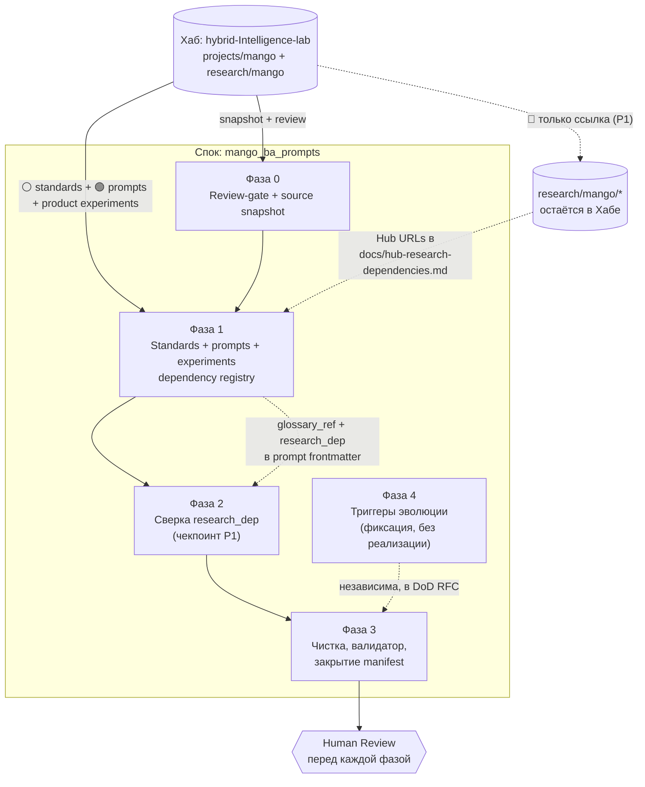

# RFC: стратегия миграции проекта Mango из Хаба в спок `mango_ba_prompts`

> ⚠️ **Это RFC-отчёт на Human Review, а не реализация.** В рамках issue #8
> действует стоп-фактор: физический перенос промптов, стандартов и экспериментов
> **не выполняется** до утверждения этой стратегии человеком. Документ фиксирует
> аудит артефактов Хаба по полным URL, предлагает фазовую стратегию миграции,
> разбирает edge cases и фиксирует, что сознательно откладывается на будущее.

**Operating Mode**: `Creative` — задача не в механическом копировании
предложенных шагов, а в проверке их аудитом и в предложении **собственной**
оптимальной стратегии с трассируемым обоснованием каждого решения.

**Связь с предыдущим RFC**: настоящий документ — прямое продолжение
[`docs/audit/initial-state-2026-06.md`](../audit/initial-state-2026-06.md)
(issue #4). Тот RFC покрыл **базовый геном** спока (governance, правила,
каркасы) и набросал черновой план миграции (§3). Этот RFC сужает фокус до
**стратегии переноса содержимого Mango** и опирается на фактический аудит Хаба,
а не на память.

---

## 1. Введение

### 1.1. Контекст миграции

Проект Mango мигрирует из Хаба (`hybrid-Intelligence-lab`, монорепо) в отдельный
standalone-спок (`mango_ba_prompts`). Базовый геном спока уже инициализирован
(issue #4 → #6): в корне есть `AI_GOVERNANCE.md`, `AI_QUICK_RULES.md`,
`CONTRIBUTING.md`, `CHANGELOG.md`, каркасы `docs/adr/`, `docs/audit/` и тонкий
`kb/glossary.md`. Содержимое самого проекта Mango (промпты, Mango-only
классификационный контракт, продуктовые эксперименты) **физически остаётся в
Хабе** до утверждённой фазы миграции.

Цель этого этапа — определить, **как именно** перенести содержимое, чтобы:

1. не потерять контекст и трассируемость;
2. соблюсти модель hub-and-spoke (исследования — в Хабе, стандарты —
   копируются, промпты — в споке);
3. не усложнять старт ADR-ами и матрицами («практика первична»);
4. оставить дверь открытой для эволюции (ADR, матрица, стандарты — когда
   концепция созреет).

### 1.2. Согласованные принципы (кратко)

| # | Принцип | Что это значит на практике |
| :--- | :--- | :--- |
| P1 | **Исследования → остаются в Хабе** | Спок **ссылается** по полному URL, **не копирует** (избегаем дрейфа). |
| P2 | **Стандарты → source of truth в Хабе, рабочая копия в `standards/` спока** | `standards/GLOSSARY.md` копируется из Хаба; синхронизация — явное действие спока. |
| P3 | **Промпты → переносим сейчас; матрица/ADR — потом** | Физический перенос промптов; матрицу и ADR — по факту боли. |
| P4 | **Классификация Mango → контракт, не глоссарий** | Mango-only классификация переносится как `standards/MANGO_CLASSIFICATION_CONTRACT.md`, а не смешивается с `kb/glossary.md`. |
| P5 | **Anti-Inflation** (правило Хаба) | Каталог создаётся только под реальный артефакт, не «на вырост». |

### 1.3. Цель RFC

Предложить **исчерпывающий аудит** артефактов Mango в Хабе, **фазовую
стратегию** миграции с обоснованием, **решения edge cases** и **триггеры
будущей эволюции** — и вынести всё это на Human Review **до** физического
переноса.

---

## 2. Аудит артефактов в Хабе

### 2.1. Метод аудита (полные URL, без относительных путей)

Аудит выполнен по **полным абсолютным URL** к Хабу (техническое требование
issue #8: относительные пути запрещены, т.к. целевые данные — в другом
репозитории). Дерево снято рекурсивно с ветки `main`; permalink-ссылки в этом
RFC **закреплены за коммитом** `038868d` Хаба, чтобы аудит не «поплыл» при
последующих изменениях монорепо (см. творческое улучшение C3, §5).

- Корень аудита (tree):
  <https://github.com/G-Ivan-A/hybrid-Intelligence-lab/tree/main/projects/mango>
- Исследования (tree):
  <https://github.com/G-Ivan-A/hybrid-Intelligence-lab/tree/main/research/mango>
- Permalink-база для blob-ссылок ниже:
  `https://github.com/G-Ivan-A/hybrid-Intelligence-lab/blob/038868dd125b4e2d849ff73604890f1d2787ac0f/`

### 2.2. Легенда классификации

| Знак | Категория | Действие по принципам §1.2 |
| :--- | :--- | :--- |
| 🟢 | **Промпт** | Переносим физически в спок (`prompts/`) + нормализация. |
| 🔵 | **Исследование** | Остаётся в Хабе; в споке — ссылка на полный URL (P1). |
| ⚪ | **Стандарт** | Копируем в спок + ссылка на source of truth в Хабе (P2). |
| ⚫ | **Документация / KB / эксперимент** | Решение индивидуально (перенос / ссылка / архивация). |

### 2.3. Инвентарь `projects/mango/`

| Артефакт (полный URL) | Размер | Тип | Что делаем | Обоснование |
| :--- | :--- | :--- | :--- | :--- |
| [`README.md`](https://github.com/G-Ivan-A/hybrid-Intelligence-lab/blob/038868dd125b4e2d849ff73604890f1d2787ac0f/projects/mango/README.md) | 13.7 KB | ⚫ Docs | **Не переносим.** Архивная ссылка в манифесте | Написан под монорепо Хаба (`status: canonical, v1.3`); относительные ссылки `../../standards/...`, `../../governance/...` за пределы спока; в споке уже есть свой spoke-README. Перенос дал бы битую навигацию (gap G6 предыдущего RFC). |
| [`standards/classification-glossary.md`](https://github.com/G-Ivan-A/hybrid-Intelligence-lab/blob/038868dd125b4e2d849ff73604890f1d2787ac0f/projects/mango/standards/classification-glossary.md) | 13.7 KB | ⚪ Контракт классификации (Mango-only) | **Переименовать + перенести в `standards/` спока** | Это не общий глоссарий, а контракт классификации `Domain → Capability → Feature → Atomic Function`; целевой путь: `standards/MANGO_CLASSIFICATION_CONTRACT.md`. |
| [`prompts/tz-stats-generator_exp-2026-05.md`](https://github.com/G-Ivan-A/hybrid-Intelligence-lab/blob/038868dd125b4e2d849ff73604890f1d2787ac0f/projects/mango/prompts/tz-stats-generator_exp-2026-05.md) | 1.6 KB | 🟢 Промпт | **Переносим** + нормализация | Готовый prompt asset (вариант `_exp`, ссылается на `research/mango/classification.md`). |
| [`prompts/tz-stats-generator_simple-2026-05.md`](https://github.com/G-Ivan-A/hybrid-Intelligence-lab/blob/038868dd125b4e2d849ff73604890f1d2787ac0f/projects/mango/prompts/tz-stats-generator_simple-2026-05.md) | 2.6 KB | 🟢 Промпт | **Переносим** + нормализация | Готовый asset (вариант `_simple`, без доступа к репо). |
| [`prompts/usecase-stepwise-generator_exp-2026-05.md`](https://github.com/G-Ivan-A/hybrid-Intelligence-lab/blob/038868dd125b4e2d849ff73604890f1d2787ac0f/projects/mango/prompts/usecase-stepwise-generator_exp-2026-05.md) | 1.5 KB | 🟢 Промпт | **Переносим** + нормализация | Ссылается на `research/mango/classification.md` и `kb/glossary.md`. |
| [`prompts/usecase-stepwise-generator_simple-2026-05.md`](https://github.com/G-Ivan-A/hybrid-Intelligence-lab/blob/038868dd125b4e2d849ff73604890f1d2787ac0f/projects/mango/prompts/usecase-stepwise-generator_simple-2026-05.md) | 2.9 KB | 🟢 Промпт | **Переносим** + нормализация | Содержит явный раздел «ФОРМАТ ВЫВОДА» (эталон для выравнивания `_exp`). |
| [`prompts/user-story-generator_exp-2026-05.md`](https://github.com/G-Ivan-A/hybrid-Intelligence-lab/blob/038868dd125b4e2d849ff73604890f1d2787ac0f/projects/mango/prompts/user-story-generator_exp-2026-05.md) | 1.5 KB | 🟢 Промпт | **Переносим** + нормализация | Ссылается на `research/mango/classification.md`, `standards/classification-glossary.md`, `kb/glossary.md`. |
| [`prompts/user-story-generator_simple-2026-05.md`](https://github.com/G-Ivan-A/hybrid-Intelligence-lab/blob/038868dd125b4e2d849ff73604890f1d2787ac0f/projects/mango/prompts/user-story-generator_simple-2026-05.md) | 2.9 KB | 🟢 Промпт | **Переносим** + нормализация | Готовый asset (`_simple`), содержит «ФОРМАТ ВЫВОДА». |
| [`experiments/tz-stats-prototype-2026-05.md`](https://github.com/G-Ivan-A/hybrid-Intelligence-lab/blob/038868dd125b4e2d849ff73604890f1d2787ac0f/projects/mango/experiments/tz-stats-prototype-2026-05.md) | 22.6 KB | ⚫ Эксперимент (`based_on`) | **Переносим физически** в `prompts/experiments/` | Часть продукта (E5): источник `based_on` для `tz-stats-generator_*`; перенос сохраняет операционную историю. |
| [`experiments/usecase_gen-stepwise-alignment_2026-05-26.md`](https://github.com/G-Ivan-A/hybrid-Intelligence-lab/blob/038868dd125b4e2d849ff73604890f1d2787ac0f/projects/mango/experiments/usecase_gen-stepwise-alignment_2026-05-26.md) | 28.3 KB | ⚫ Эксперимент (`based_on`) | **Переносим физически** в `prompts/experiments/` | Часть продукта (E5): источник `based_on` для `usecase-stepwise-generator_*`. |
| [`experiments/user-story_gen-from-raw-request_2026-05-26.md`](https://github.com/G-Ivan-A/hybrid-Intelligence-lab/blob/038868dd125b4e2d849ff73604890f1d2787ac0f/projects/mango/experiments/user-story_gen-from-raw-request_2026-05-26.md) | 23.5 KB | ⚫ Эксперимент (`based_on`) | **Переносим физически** в `prompts/experiments/` | Часть продукта (E5): источник `based_on` для `user-story-generator_*`. |
| [`experiments/prompts-audit-2026-05-26.md`](https://github.com/G-Ivan-A/hybrid-Intelligence-lab/blob/038868dd125b4e2d849ff73604890f1d2787ac0f/projects/mango/experiments/prompts-audit-2026-05-26.md) | 11.9 KB | ⚫ Эксперимент | **Переносим физически** в `prompts/experiments/` | Часть продукта (E5): аудит исходных промптов, input для нормализации (Фаза 1). |
| [`experiments/prompts-selftest-2026-05-26.md`](https://github.com/G-Ivan-A/hybrid-Intelligence-lab/blob/038868dd125b4e2d849ff73604890f1d2787ac0f/projects/mango/experiments/prompts-selftest-2026-05-26.md) | 8.7 KB | ⚫ Эксперимент | **Переносим физически** в `prompts/experiments/` | Часть продукта (E5): сценарий self-test; используется для self-test gate (улучшение C2). |
| `decisions/.gitkeep`, `docs/.gitkeep`, `kb/.gitkeep`, `experiments/.gitkeep` | 0 B | ⚫ Пустой плейсхолдер | **Не переносим** | Anti-Inflation (P5): пустые каталоги спок «с собой не носит». Создаются только под реальный артефакт. |

### 2.4. Внешние стандарты Хаба

Эти файлы не лежат в `projects/mango/`, но входят в контекст Фазы 1 как стандарты
Хаба, которые спок использует рабочей копией.

| Артефакт (полный URL) | Тип | Что делаем | Обоснование |
| :--- | :--- | :--- | :--- |
| [`standards/GLOSSARY.md`](https://github.com/G-Ivan-A/hybrid-Intelligence-lab/blob/038868dd125b4e2d849ff73604890f1d2787ac0f/standards/GLOSSARY.md) | ⚪ Стандарт Хаба | **Копируем в `standards/GLOSSARY.md`** + provenance | Общий глоссарий Хаба; source of truth остаётся в Хабе, спок синхронизирует копию явно (P2). |

### 2.5. Инвентарь `research/mango/` — всё 🔵 (остаётся в Хабе)

Все исследования остаются в Хабе (P1). В споке создаются **ссылки на полные
URL**, а не копии. Инвентарь приведён для полноты и чтобы зафиксировать, **на
что именно** ссылаются мигрируемые промпты и контракт классификации.

| Артефакт (полный URL) | Размер | Примечание |
| :--- | :--- | :--- |
| [`research/mango/README.md`](https://github.com/G-Ivan-A/hybrid-Intelligence-lab/blob/038868dd125b4e2d849ff73604890f1d2787ac0f/research/mango/README.md) | 2.8 KB | Навигация по исследованиям — точка входа для ссылок спока. |
| [`research/mango/classification.md`](https://github.com/G-Ivan-A/hybrid-Intelligence-lab/blob/038868dd125b4e2d849ff73604890f1d2787ac0f/research/mango/classification.md) | 122.6 KB | **Ключевая зависимость**: на неё ссылаются все `_exp`-промпты и контракт классификации. |
| [`research/mango/classification.html`](https://github.com/G-Ivan-A/hybrid-Intelligence-lab/blob/038868dd125b4e2d849ff73604890f1d2787ac0f/research/mango/classification.html) | 151.7 KB | HTML-экспорт; не ссылаемся (дубль `.md`). |
| [`research/mango/classification-tz.md`](https://github.com/G-Ivan-A/hybrid-Intelligence-lab/blob/038868dd125b4e2d849ff73604890f1d2787ac0f/research/mango/classification-tz.md) | 58.7 KB | Проверка классификатора на корпусе из 30 ТЗ; референс для `tz-stats-*`. |
| [`research/mango/classification-tz.html`](https://github.com/G-Ivan-A/hybrid-Intelligence-lab/blob/038868dd125b4e2d849ff73604890f1d2787ac0f/research/mango/classification-tz.html) | 72.0 KB | HTML-экспорт. |
| [`research/mango/requirements-flow.md`](https://github.com/G-Ivan-A/hybrid-Intelligence-lab/blob/038868dd125b4e2d849ff73604890f1d2787ac0f/research/mango/requirements-flow.md) | 47.5 KB | Flow требований для AI-анализа ТЗ. |
| [`research/mango/requirements-flow.html`](https://github.com/G-Ivan-A/hybrid-Intelligence-lab/blob/038868dd125b4e2d849ff73604890f1d2787ac0f/research/mango/requirements-flow.html) | 73.0 KB | HTML-экспорт. |
| [`research/mango/requirements-lifecycle-uncertainty-2026-05.md`](https://github.com/G-Ivan-A/hybrid-Intelligence-lab/blob/038868dd125b4e2d849ff73604890f1d2787ac0f/research/mango/requirements-lifecycle-uncertainty-2026-05.md) | 52.8 KB | Жизненный цикл требования и обработка неопределённости. |
| [`research/mango/rag-mapping-roadmap-2026-05.md`](https://github.com/G-Ivan-A/hybrid-Intelligence-lab/blob/038868dd125b4e2d849ff73604890f1d2787ac0f/research/mango/rag-mapping-roadmap-2026-05.md) | 44.8 KB | RAG-навигатор и roadmap автоматизации БА. |
| [`research/mango/capability-decomposition-2026-05.md`](https://github.com/G-Ivan-A/hybrid-Intelligence-lab/blob/038868dd125b4e2d849ff73604890f1d2787ac0f/research/mango/capability-decomposition-2026-05.md) | 90.1 KB | Справочник атомарных функций пилотных доменов. |
| [`research/mango/taxonomy-concept-2026-05.md`](https://github.com/G-Ivan-A/hybrid-Intelligence-lab/blob/038868dd125b4e2d849ff73604890f1d2787ac0f/research/mango/taxonomy-concept-2026-05.md) | 30.8 KB | Draft-концепция Unified Capability Taxonomy; на неё ссылается контракт классификации. **Релевантна триггеру эволюции P4** (§6). |

### 2.6. Сводка аудита

- **Доступность**: все 23 артефакта (12 в `projects/mango/`, 11 в
  `research/mango/`) получены по полным URL. **Недоступных артефактов нет.**
- **К физическому переносу (🟢)**: 6 промптов.
- **К копированию со ссылкой (⚪)**: 1 Mango-only контракт классификации +
  `standards/GLOSSARY.md` Хаба.
- **Остаются в Хабе со ссылкой (🔵)**: 11 исследований.
- **Индивидуально (⚫)**: монорепо-README (архив-ссылка) + 5 экспериментов
  (все переносим физически в `prompts/experiments/` как часть продукта — E5) +
  4 пустых плейсхолдера (не переносим).
- **Главная зависимость**: `research/mango/classification.md` — её цитируют все
  `_exp`-промпты и контракт классификации; она **не переносится** (P1), а
  регистрируется в `docs/hub-research-dependencies.md` → отсюда edge case E1
  (§4).

---

## 3. Предлагаемая стратегия миграции

### 3.1. Принцип стратегии

Стратегия следует «практика первична»: переносим **исполняемую ценность**
(промпты и продуктовые эксперименты) и её **минимально необходимый контекст**
(Hub glossary + Mango classification contract) одним reviewable пакетом Фазы 1;
**доказательную базу** (research) — оставляем в Хабе за ссылками через единый
реестр зависимостей; **мета-надстройку** (ADR, матрица промптов) — **не
создаём**, а фиксируем триггеры (§6). Каждая фаза самодостаточна, проходит
Human Review и оставляет спок в работоспособном состоянии.

> Уточнение issue #10: прежний термин «Mango-only глоссарий» неточен. Это
> классификационный **контракт**, поэтому целевой путь — `standards/`, а не
> `kb/`. Общий глоссарий берётся отдельно из `standards/GLOSSARY.md` Хаба.

### 3.2. Фазы

#### Фаза 0 — Review-gate и фиксация snapshot
- **Что делаем**: утверждаем этот RFC, фиксируем SHA Хаба для миграции и
  проверяем, что таблица Фазы 1 ниже соответствует фактическому дереву Хаба.
- **Зачем**: физический перенос не начинается до Human Review; спорные source
  paths устраняются до копирования файлов.
- **Артефакты**: утверждённый RFC; выбранный `source_sha`; запись в issue/PR.
- **Зависимости**: нет. **Блокирует Фазу 1.**

#### Фаза 1 — Единый перенос контекста, промптов и продуктовых экспериментов
- **Что делаем**: переносим стандарты, prompt assets и продуктовые эксперименты
  по таблице ниже; создаём `docs/hub-research-dependencies.md`; нормализуем
  frontmatter каждого промпта; обновляем spoke-README и migration manifest.
- **Зачем**: промпт должен быть исполняемым в споке без hub-относительных путей,
  а исследовательская база должна оставаться в Хабе без дублирования.
- **Артефакты**: `prompts/*.md`, `prompts/experiments/*.md`,
  `standards/GLOSSARY.md`, `standards/MANGO_CLASSIFICATION_CONTRACT.md`,
  `docs/hub-research-dependencies.md`, обновлённые `README.md`/`CHANGELOG.md` и
  migration manifest.
- **Зависимости**: требует Фазы 0.

##### Таблица файлов Фазы 1

| Исходный путь (Хаб) | Целевой путь (Спок) | Действие | Примечание |
| :--- | :--- | :--- | :--- |
| `https://.../projects/mango/prompts/tz-stats-generator_exp-2026-05.md` | `prompts/tz-stats-generator.md` | Перенести + нормализовать | Экспериментальный prompt asset; итоговое имя без даты/`_exp`, если вариант становится canonical. |
| `https://.../projects/mango/prompts/*_simple-2026-05.md` | `prompts/<name>-simple.md` или `prompts/drafts/<name>.md` | Перенести + нормализовать | Simple-варианты сохраняются как отдельные assets, пока Human Review не решит объединить пары. |
| `https://.../projects/mango/prompts/*_exp-2026-05.md` | `prompts/<name>.md` | Перенести + нормализовать | Остальные 🟢 артефакты; нормализованные имена фиксируются в manifest. |
| `https://.../projects/mango/experiments/*` (все 5 экспериментов) | `prompts/experiments/<file>.md` | **Перенести физически** | Все эксперименты — часть продукта (E5), не research Хаба; если фактическое имя в snapshot отличается, заменить на подтверждённый Hub-путь перед переносом. |
| `https://.../projects/mango/experiments/prompts-selftest-2026-05-26.md` | `prompts/experiments/prompts-selftest-2026-05-26.md` | **Перенести физически** | Acceptance-сценарий для нормализации промптов (self-test gate, C2); не размещать в корневом `experiments/` спока. |
| `https://.../projects/mango/standards/classification-glossary.md` | `standards/MANGO_CLASSIFICATION_CONTRACT.md` | **Переименовать + перенести в `standards/`** | Это контракт классификации, не глоссарий; путь = `standards/`. Если source в Хабе будет `projects/mango/kb/classification-glossary.md`, целевой путь не меняется. |
| `https://.../standards/GLOSSARY.md` | `standards/GLOSSARY.md` | **Копировать из Хаба** | Стандарт Хаба, синхронизируется явно; используется в `glossary_ref`. |
| `https://.../research/mango/*` | `docs/hub-research-dependencies.md#<anchor>` | Только зарегистрировать ссылку | Research не копируется; промпты ссылаются на якорь через `research_dep`. |
| `https://.../projects/mango/README.md` | `README.md` (обновление навигации спока) | **Не переносить** | README Хаба архивируется в manifest; spoke-README обновляется только ссылками на новые локальные artifacts. |
| *(пустые `.gitkeep` и каталоги Хаба)* | — | Не переносить | Anti-Inflation: каталоги создаются только под реальные artifacts Фазы 1. |

##### Чек-лист нормализации промпта

Каждый перенесённый промпт должен иметь:

- [ ] `status: canonical` (или `draft`)
- [ ] `version: 1.0` (или `0.1`)
- [ ] `updated: {{date}}`
- [ ] `temperature: 0.1`
- [ ] `output_format: markdown`
- [ ] `glossary_ref: standards/GLOSSARY.md` (или `none`)
- [ ] `research_dep: docs/hub-research-dependencies.md#<anchor>` (или `none`)
- [ ] `source_hub: <absolute-hub-url>` и `source_sha: <hub-commit-sha>`
- [ ] `based_on: <absolute-hub-url>` или `based_on: prompts/experiments/<file>`
- [ ] Явный раздел **«ФОРМАТ ВЫВОДА»** для `_exp`/canonical-вариантов.

##### Единый реестр зависимостей на research

`docs/hub-research-dependencies.md` создаётся в Фазе 1 как единственная точка,
где спок хранит ссылки на research Хаба. Промпты и контракт классификации не
дублируют длинные research-URL в frontmatter; они указывают на якорь реестра
через `research_dep`.

Минимальная структура реестра:

| Anchor | Hub URL | Используется в | Политика |
| :--- | :--- | :--- | :--- |
| `#classification` | `https://github.com/G-Ivan-A/hybrid-Intelligence-lab/blob/<sha>/research/mango/classification.md` | `_exp`/canonical prompts, `standards/MANGO_CLASSIFICATION_CONTRACT.md` | Reference only; не копировать. |
| `#classification-tz` | `https://github.com/G-Ivan-A/hybrid-Intelligence-lab/blob/<sha>/research/mango/classification-tz.md` | `tz-stats-generator` | Reference only; не копировать. |
| `#taxonomy-concept` | `https://github.com/G-Ivan-A/hybrid-Intelligence-lab/blob/<sha>/research/mango/taxonomy-concept-2026-05.md` | `standards/MANGO_CLASSIFICATION_CONTRACT.md` | Reference only до canonical-статуса в Хабе. |

##### Переписка README.md спока (обязательная задача Фазы 1)

Текущий README скопирован из Хаба и содержит битые ссылки. В рамках Фазы 1 его
необходимо переписать:

- Назначение проекта Mango BA Prompts.
- Структура `prompts/` и `standards/`.
- Временный workflow (ссылка на `CONTRIBUTING.md`).
- Контакты / ответственные.
- Удалить все ссылки на Хаб, кроме `docs/hub-research-dependencies.md`.

#### Фаза 2 — Фиксация ссылок на исследования (review-чекпоинт)
- **Что делаем**: проверяем, что **все** ссылки на `research/mango/*` в споке
  проходят через `docs/hub-research-dependencies.md`, ни одной
  hub-относительной/битой ссылки; реестр полон и соответствует §2.5.
- **Зачем**: гарантия принципа P1 и отсутствия дрейфа.
- **Артефакты**: финализированный реестр research-зависимостей; чек в migration
  manifest.
- **Зависимости**: после Фаз 0–1 (ссылки уже проставлены — здесь только сверка).

#### Фаза 3 — Чистка и сверка спока
- **Что делаем**: убираем технический `.gitkeep` из корня; убеждаемся, что
  spoke-README и навигация не ссылаются на несуществующие/hub-относительные
  пути; прогон валидатора структуры (если перенесён из Хаба); финальная запись
  в `CHANGELOG.md`; закрытие migration manifest как «снимка состояния миграции».
- **Зачем**: спок остаётся консистентным и проходит DoD.
- **Артефакты**: обновлённый `README.md`/`CHANGELOG.md`; закрытый manifest.
- **Зависимости**: финальная фаза, после 0–2.

#### Фаза 4 — Подготовка к эволюции (**только фиксация триггеров, без реализации**)
- **Что делаем**: записываем в evolution roadmap (§6), что и **при каком
  триггере** делаем позже: ADR-классификации, матрица промптов, фиксация
  Mango-таксономии как стандарта. **Ничего из этого сейчас не создаём** (P5).
- **Зачем**: «документация растёт по факту боли» — но триггеры зафиксированы,
  чтобы будущая боль была распознана, а не пропущена.
- **Артефакты**: раздел §6 этого RFC (он и есть roadmap-якорь).
- **Зависимости**: концептуально независима; включена в DoD этого RFC.

### 3.3. Mermaid-диаграмма процесса



### 3.4. Зависимости и оценки

| Фаза | Зависит от | Блокирует | Оценка | Выход |
| :--- | :--- | :--- | :--- | :--- |
| 0. Review-gate + snapshot | — | 1 | ~0.25 дня | SHA и таблица Фазы 1 утверждены |
| 1. Стандарты + промпты + эксперименты | 0 | 2 | ~2–2.5 дня | Prompt package, standards и dependency registry готовы |
| 2. Сверка ссылок research | 1 | 3 | ~0.25 дня | P1 подтверждён |
| 3. Чистка и сверка | 0–2 | — | ~0.5 дня | Спок консистентен, manifest закрыт |
| 4. Триггеры эволюции | — | — | входит в RFC | Roadmap зафиксирован |

**Итого по миграции**: ~3–3.5 дня (без review-итераций). Оценка выросла по
сравнению с v0.1, потому что продуктовые эксперименты и единый реестр
зависимостей теперь входят в обязательную Фазу 1.

### 3.5. Реестр зависимостей от исследований Хаба

Единственный файл-носитель этого реестра — `docs/hub-research-dependencies.md`
(⚠️ **не** создаём `hub-research-links.md` и не дублируем содержимое в других
файлах). Ниже — целевая структура реестра, который заполняется при миграции на
основе аудита §2.5. Заголовок файла-носителя — `# Реестр зависимостей от
исследований Хаба`.

| Название | Полный URL в Хабе | Тип зависимости | Версия/Дата | Статус синхронизации | Затронутые артефакты спока | Примечание |
|----------|-------------------|-----------------|-------------|---------------------|---------------------------|------------|
| Prompt Classification | https://... | Классификация промптов | 2026-05 | ✅ Актуально | `prompts/tz-stats-generator.md` | Базовая таксономия |

**Правила:**

- Заполняется при миграции на основе аудита.
- В frontmatter промптов: `research_dep: docs/hub-research-dependencies.md#<anchor>`.
- Если промпт не зависит от исследований: `research_dep: none` + комментарий о бизнес-задаче.

---

## 4. Обработка edge cases

| # | Ситуация | Решение | Обоснование |
| :--- | :--- | :--- | :--- |
| **E1** | Промпт ссылается на исследование, которое **не переносим** (`_exp`-промпты → `research/mango/classification.md`). | Research URL записать в `docs/hub-research-dependencies.md`, а в промпте оставить `research_dep: docs/hub-research-dependencies.md#classification`. Не копировать исследование, не оставлять относительный путь. | P1: исследования живут в Хабе; единый реестр исключает дублирование длинных URL и делает сверку Фазы 2 машинно-простой. |
| **E2** | `classification-glossary.md` выглядит как глоссарий, но фактически задаёт Mango-классификацию `Domain → Capability → Feature → Atomic Function`. | Переименовать в `standards/MANGO_CLASSIFICATION_CONTRACT.md`. Внутренние ссылки на research заменить на `research_dep`/якоря реестра. | Это контракт, не `kb`-глоссарий. Размещение в `standards/` совпадает с ролью файла и с принципом P4. |
| **E3** | Артефакт **не попадает ни в одну категорию** (`projects/mango/README.md` — навигация монорепо). | **Не переносим.** Регистрируем в migration manifest как «архивная ссылка» (archived/reference) с пометкой «заменён spoke-README»; spoke-README обновляем только локальной навигацией Фазы 1. | Перенос дал бы битую навигацию (gap G6). Манифест сохраняет трассируемость: видно, что артефакт **рассмотрен**, а не потерян. |
| **E4** | Как работать с промптами **пока нет ADR и матрицы**? | Временный workflow (улучшение C5): промпты в `prompts/`, черновики — в `prompts/drafts/` (разрешено без human review по capability boundaries `AI_GOVERNANCE.md`); изменение существующего промпта — через issue→PR→review; матрицу **не вводим**, навигацию держим в spoke-README и manifest. | «Практика первична» (P3). Capability boundaries уже описывают `prompts/drafts/` — используем готовое, не плодим процесс. |
| **E5** | Эксперименты в `projects/mango/experiments/` — research Хаба или часть продукта? | **Эксперименты = часть продукта.** Все эксперименты переносятся физически в `prompts/experiments/` спока (согласованная формулировка — см. §4.1). | Они не являются исследованиями Хаба; перенос обязателен для сохранения операционной истории проекта. |
| **E6** | **Глоссарий vs Контракт + путь**: `standards/GLOSSARY.md` (словарь терминов) и `classification-glossary.md` (спецификация классификации) смешиваются по роли и пути. | Разделить роли и пути: `standards/GLOSSARY.md` = словарь; `standards/MANGO_CLASSIFICATION_CONTRACT.md` = контракт классификации (переименование `classification-glossary.md`); взаимные ссылки; слияние запрещено (согласованная формулировка — см. §4.1). | `kb/` остаётся только для данных и практик, не являющихся стандартами; слияние скрывает source of truth. |
| **E7** | Исследование или стандарт в Хабе **обновится** после того, как спок сослался на него. | Ссылки в реестре и provenance фиксируем **permalink-ом на SHA** (C3); синхронизация — осознанное действие спока, фиксируется записью в `CHANGELOG.md`/manifest. | P2: «спок решает, когда синхронизировать». Permalink даёт воспроизводимость; обновление становится видимым решением. |
| **E8** | Несколько промптов зависят от одного research-файла. | Один anchor в `docs/hub-research-dependencies.md`; в каждом промпте только `research_dep` на этот anchor. | Убирает расхождение ссылок между промптами и делает Фазу 2 проверяемой grep/валидатором. |

### 4.1. Согласованные формулировки E5 и E6 (issue #12)

**E5 — Эксперименты:**

> **Эксперименты = часть продукта.** Все эксперименты из
> `projects/mango/experiments/` переносятся физически в `prompts/experiments/`
> спока. Они не являются исследованиями Хаба. Перенос обязателен для сохранения
> операционной истории проекта.

**E6 — Глоссарий vs Контракт + Путь:**

> **Разделение ролей и путей:**
> - `standards/GLOSSARY.md` = словарь терминов (стандарт, копируется из Хаба).
> - `standards/MANGO_CLASSIFICATION_CONTRACT.md` = спецификация классификации (переименовано из `classification-glossary.md`).
> - Контракт ссылается на глоссарий: «Для значений терминов см. `standards/GLOSSARY.md`».
> - Глоссарий может ссылаться на контракт: «Классификация продуктов: `standards/MANGO_CLASSIFICATION_CONTRACT.md`».
> - Слияние запрещено. `kb/` остаётся только для данных и практик, не являющихся стандартами.

---

## 5. Креативные улучшения

> Все улучшения соблюдают Anti-Inflation (P5): ни одно **не создаёт лишних
> файлов сейчас**. Это либо поля во frontmatter, либо лёгкие конвенции, либо
> артефакты, появляющиеся **в момент** реального переноса (Фазы 0–3), а не «на
> вырост».

| # | Улучшение | Что это | Обоснование |
| :--- | :--- | :--- | :--- |
| **C1** | **Provenance + dependency frontmatter** | В каждый мигрируемый prompt добавить `source_hub`, `source_sha`, `glossary_ref`, `research_dep`, `output_format`, `temperature`. | Делает происхождение, настройки и внешние зависимости машинно-проверяемыми. Не новый процесс — поля в уже переносимом файле. |
| **C2** | **Self-test как acceptance-gate** | Прогон промпта по сценарию из `prompts/experiments/prompts-selftest-2026-05-26.md` перед пометкой «migrated». | Превращает существующий артефакт Хаба в воспроизводимый критерий качества нормализации. Без него «нормализован» — субъективно. |
| **C3** | **Permalink-pinning ссылок на Хаб** | Все ссылки на research/стандарт — на **commit SHA**, не на `main`. | Единственная защита от тихого дрейфа (E7). Стоимость нулевая (формат URL), выгода — воспроизводимость. Применено уже в этом RFC. |
| **C4** | **Единый реестр research-зависимостей** | `docs/hub-research-dependencies.md` со списком `research/mango/*` → Hub-URL + consumers, создаётся в Фазе 1. | Спок ссылается на research **из одной точки**, а не врассыпную по промптам. Упрощает будущую синхронизацию и сверку (Фаза 2). |
| **C5** | **Временный prompt-workflow без ADR** | `prompts/` для активных, `prompts/drafts/` для черновиков; изменения — через issue→PR→review; **без матрицы**. P0-содержание для `CONTRIBUTING.md` — §5.2. | Прямой ответ на «как работать, пока нет ADR» (E4). Опирается на уже описанные capability boundaries — не вводит новый процесс. |
| **C6** | **Migration manifest как живой снимок** | Таблица «артефакт → действие → статус → ссылка» (§5.1) + чек-лист-трекер (§5.3), ведётся по ходу Фаз 0–3 и **закрывается** в Фазе 3. | Фиксирует «что перенесено / что осталось / что архивировано». Закрытый manifest = воспроизводимый снимок миграции для будущего аудита. |

### 5.1. Шаблон migration manifest (создаётся при миграции, не сейчас)

```text
| Артефакт (Хаб) | Категория | Действие | Статус | Ссылка/Назначение в споке |
| -------------- | --------- | -------- | ------ | ------------------------- |
| prompts/tz-stats-generator_exp-... | 🟢 | migrate+normalize | migrated | prompts/tz-stats-generator.md |
| standards/classification-glossary.md | ⚪ | rename+copy | migrated | standards/MANGO_CLASSIFICATION_CONTRACT.md |
| standards/GLOSSARY.md | ⚪ | copy+link | migrated | standards/GLOSSARY.md |
| research/mango/classification.md | 🔵 | register | referenced | docs/hub-research-dependencies.md#classification |
| projects/mango/README.md | ⚫ | archive | archived | (заменён spoke-README) |
| experiments/exp-2026-05-v2.md | ⚫ | migrate | migrated | prompts/experiments/exp-2026-05-v2.md |
| experiments/...prototype... | ⚫ | migrate | migrated | prompts/experiments/...prototype... |
```

### 5.2. Временный workflow промптов P0 (содержание для `CONTRIBUTING.md`)

Прямой ответ на «как работать с промптами, пока нет ADR и матрицы» (E4, C5).
Это содержание добавляется в `CONTRIBUTING.md` при миграции (Фаза 1), не сейчас:

1. Создать файл в `prompts/drafts/` с именем `[biz-process]-[purpose].md`.
2. Frontmatter обязателен: `status: draft`, `version: 0.1`, `updated: {{date}}`, `temperature: 0.1`.
3. Добавить комментарий: `<!-- Experimental: for [task/link], no formal research yet -->`.
4. Создать issue `prompt:review` с описанием бизнес-контекста.
5. После human review → переместить в `prompts/`, обновить `status: canonical`, `version: 1.0`.

### 5.3. Шаблон Migration Manifest (минимальный локальный трекер)

Локальный трекер состояния миграции; ведётся при переносе (Фазы 0–3),
закрывается в Фазе 3. Дополняет таблицу §5.1 чек-лист-представлением:

```markdown
# Migration Manifest — mango_ba_prompts
## Перенесено (Физически в спок)
- [x] `prompts/tz-stats-generator.md` — 2026-06-03 — status: canonical
## Осталось в Хабе (зависимости задекларированы)
- [x] `Prompt Classification` → [полный URL]
## Требует уточнения / В работе
- [ ] `docs/unknown-file.md` — категория не определена, issue #XX создан
```

---

## 6. Подготовка к будущей эволюции

**Сейчас НЕ делаем** (фиксируем как отложенное, с триггером входа):

| Отложенный артефакт | Почему не сейчас | **Триггер входа** (когда начинать) |
| :--- | :--- | :--- |
| **ADR-классификации** (как меняем `MANGO_CLASSIFICATION_CONTRACT.md`) | Целевой контракт уже задан, но правила его будущего изменения преждевременно усложнять. | Когда Unified Capability Taxonomy в Хабе перейдёт из `draft` в `canonical` **или** возникнет повторяющийся спор о классе при нормализации промптов. |
| **Матрица промптов** | 6 промптов навигируются README/manifest без матрицы; матрица «на вырост» (P5). | Когда число промптов/вариантов превысит обозримое в README **или** появятся повторяющиеся ошибки выбора нужного варианта. |
| **Расширение `MANGO_CLASSIFICATION_CONTRACT.md` до стандарта вне Mango** | Сейчас контракт Mango-only; расширение за границы проекта нарушило бы scope Фазы 1. | Когда классификация согласована в Хабе как общий стандарт **и** спок ощутит боль рассинхрона рабочей копии. |
| **Валидатор frontmatter промптов** (вкл. `temperature`, `output_format`, `glossary_ref`, `research_dep`) | Tooling-улучшение, не блокирует миграцию. | Когда ручная сверка чек-листа Фазы 1 станет узким местом (≥ повторных промахов по обязательным полям/ссылкам). |

**Общий принцип триггера**: следующая фаза эволюции запускается **фактом боли**
(спор, рассинхрон, ошибка выбора, потребность в репро), а не календарём. Каждый
триггер при срабатывании оформляется как issue, спорное отклонение — как ADR в
`docs/adr/`.

---

## 7. Запрос Human Review

Прошу фаундера/ревьюера **утвердить или скорректировать** стратегию. Вопросы,
оставшиеся после уточнений issue #10:

1. **Q1 — Source paths Фазы 1.** Подтвердить фактические Hub-пути для
   продуктовых экспериментов (например, `exp-2026-05-v2.md`) и финальные имена
   нормализованных prompt assets.
2. **Q2 — Стратегия ссылок на Хаб (C3, E7).** Закреплять ссылки на research и
   standards **permalink-ом на SHA** (воспроизводимость, рекомендация) или на
   `main` (всегда свежо, но риск дрейфа)?
3. **Q3 — Self-test gate (C2).** Вводим ли прогон self-test как **обязательный**
   критерий пометки промпта «migrated», или оставляем как рекомендованную
   проверку?
4. **Q4 — Фазирование.** Согласны ли, что стандарты, промпты, продуктовые
   эксперименты и `docs/hub-research-dependencies.md` идут одним PR Фазы 1?

Решения, уже зафиксированные issue #10 и не требующие повторного выбора:
`classification-glossary.md` переносится как
`standards/MANGO_CLASSIFICATION_CONTRACT.md`; общий глоссарий Хаба копируется в
`standards/GLOSSARY.md`; research остаётся в Хабе и регистрируется в
`docs/hub-research-dependencies.md`.

После аппрува: issue #8/#10 → `done`; миграция продолжается по Фазам 0–3
(каждая — отдельным reviewable PR). До аппрува **физический перенос промптов,
стандартов и экспериментов не выполняется** (стоп-фактор issue #8).

---

## Связанные артефакты

- Issue: <https://github.com/G-Ivan-A/mango_ba_prompts/issues/8>
- Refinement issue: <https://github.com/G-Ivan-A/mango_ba_prompts/issues/10>
- Предыдущий RFC (bootstrap + черновой план): [`docs/audit/initial-state-2026-06.md`](../audit/initial-state-2026-06.md)
- Локальный глоссарий спока: [`kb/glossary.md`](../../kb/glossary.md)
- Целевые стандарты Фазы 1: `standards/GLOSSARY.md`,
  `standards/MANGO_CLASSIFICATION_CONTRACT.md`
- Контракт и правила: [`AI_GOVERNANCE.md`](../../AI_GOVERNANCE.md), [`AI_QUICK_RULES.md`](../../AI_QUICK_RULES.md)
- Хаб, проект Mango (аудит): <https://github.com/G-Ivan-A/hybrid-Intelligence-lab/tree/main/projects/mango>
- Хаб, исследования Mango: <https://github.com/G-Ivan-A/hybrid-Intelligence-lab/tree/main/research/mango>
- Хаб, шаблон спока: <https://github.com/G-Ivan-A/hybrid-Intelligence-lab/tree/main/templates/spoke>
