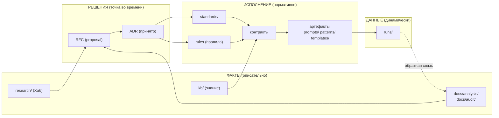
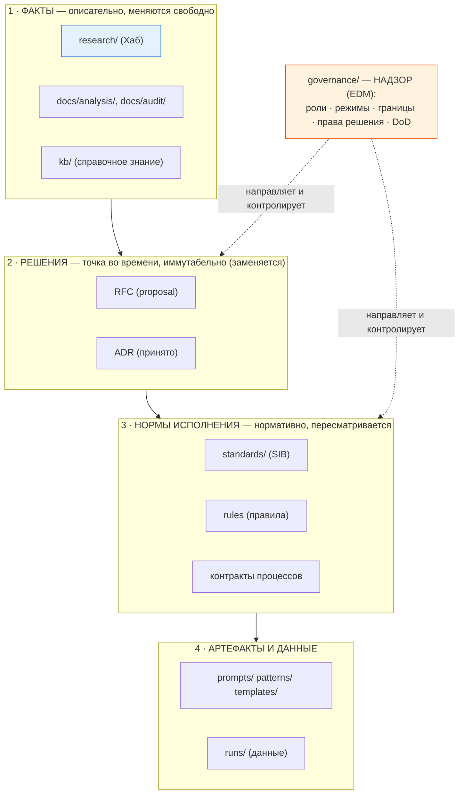
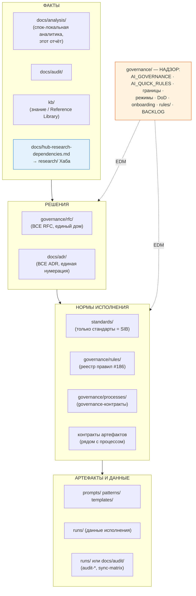
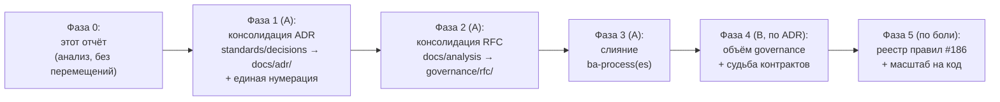

# Аналитическое исследование структуры каталогов проекта (обоснование архитектуры)

> **Режим:** Creative (issue [#192](https://github.com/G-Ivan-A/mango_ba_prompts/issues/192)
> явно просит выбрать оптимальное решение с trade-offs). Согласно
> [AI_GOVERNANCE.md](../../AI_GOVERNANCE.md) и
> [CONTRIBUTING.md](../../CONTRIBUTING.md), этот документ — **только
> аналитический отчёт**: он не создаёт и не перемещает рабочие файлы, не
> создаёт `research/` в споке и не меняет структуру. Все организационные
> изменения предлагаются как будущие RFC → ADR, а не выполняются здесь.
> Результат передаётся в Хаб `hybrid-Intelligence-lab` для синхронизации
> структуры каталогов (исключение: каталог `research/` остаётся в корне Хаба).

> **Нормативный словарь:** [RFC 2119 / BCP 14](https://www.rfc-editor.org/info/bcp14)
> (**ДОЛЖНО** / **СЛЕДУЕТ** / **МОЖНО**). Рекомендации отчёта — это входы для
> обсуждения и последующей фиксации через RFC/ADR, а не уже принятые решения
> (принцип [rfc-process.md](../../governance/rfc-process.md): молчание = согласие
> только с текущим состоянием, не с повышением статуса).

---

## Оглавление

1. [Executive Summary](#1-executive-summary)
2. [Методология исследования](#2-методология-исследования)
3. [Текущее состояние структуры (As-Is)](#3-текущее-состояние-структуры-as-is)
4. [Эмпирическая база: 15+ международных проектов](#4-эмпирическая-база-15-международных-проектов)
5. [Международные стандарты и фреймворки](#5-международные-стандарты-и-фреймворки)
6. [Концептуальная рамка решения](#6-концептуальная-рамка-решения)
7. [Ответы на 6 исследовательских вопросов](#7-ответы-на-6-исследовательских-вопросов)
8. [Целевая структура (To-Be) — предложение к обсуждению](#8-целевая-структура-to-be--предложение-к-обсуждению)
9. [Сводная матрица trade-offs](#9-сводная-матрица-trade-offs)
10. [Migration roadmap](#10-migration-roadmap)
11. [Рекомендации по синхронизации с Хабом](#11-рекомендации-по-синхронизации-с-хабом)
12. [Открытые вопросы и следующие шаги](#12-открытые-вопросы-и-следующие-шаги)
13. [Источники](#13-источники)
14. [Приложение A: первичные находки по проектам](#приложение-a-первичные-находки-по-проектам)

---

## 1. Executive Summary

Исследование отвечает на 6 архитектурных вопросов о структуре каталогов
`mango_ba_prompts`. Метод: проверка **фактической** структуры 15+ международных
проектов (через `gh api` git-trees на закреплённых SHA) + анализ 12 международных
стандартов и фреймворков. Главный вывод: текущая структура страдает не от
неправильного выбора каталогов, а от **двух однозначных дефектов** —
дублирование путей (ADR и RFC лежат в двух местах) и непоследовательная
нумерация ADR — плюс **одна спорная развилка** (ширина governance и критерий
размещения контрактов), которая является осознанным trade-off, а не дефектом,
и требует решения Пользователя через ADR (детали — §1.3, §3.3).

### 1.1. Ответы на 6 вопросов (сводка)

| # | Вопрос | Краткий ответ | Уверенность | Ключевой trade-off |
| --- | --- | --- | --- | --- |
| 1 | Где хранить правила исполнения процессов? | **Разделить два класса правил:** governance-правила (надзор за поведением AI) → `governance/`; execution-правила (как делать артефакт) → рядом с процессом/контрактом. Машинно-читаемый **реестр** правил (issue [#186](https://github.com/G-Ivan-A/mango_ba_prompts/issues/186)) → `governance/rules/`. | Средняя | `governance/rules/` (надзор) vs `kb/rules/` (знание/RAG) |
| 2 | `docs/research/` или `docs/analytics/`? | **Ни то, ни другое как новый каталог.** `research/` — только в Хабе (жёсткое правило). Для спока сохранить существующий `docs/analysis/` (где лежит этот отчёт). docs/ делится по функции, не по «research vs analytics». | Высокая | Косметика имени vs функция каталога |
| 3 | Где размещать стандарты? | **Корневой `standards/`** (обоснован TOGAF SIB), но **очистить** его: вынести контракты и ADR. Стандарты ≠ знания (kb/), потому что стандарты нормативны, а kb справочна. | Высокая | `standards/` (нормативный store) vs `kb/standards/` (всё знание вместе) |
| 4 | governance = управление репозиторием или всеми процессами? | **Надзор (evaluate-direct-monitor), не управление всем.** COBIT/ISO 38500 и практика 19 репозиториев единогласны: governance = роли, права решения, режимы, границы, DoD — НЕ исполнение процессов. | Высокая | Узкий governance (надзор) vs широкий (вся оркестрация) |
| 5 | Нужен ли отдельный `artifact/`? | **Нет.** 0 из 15 проектов имеют его. Артефакты организованы по типу рядом с функцией (`prompts/`, `patterns/`, `templates/`, `standards/`). Подтверждает интуицию Пользователя. | Очень высокая | — (консенсус) |
| 6 | Как масштабировать на код и агентов? | `apps/` (деплоимое) + `packages/`/`libs/` (переиспользуемое); `db/`/`data/` отдельно от `kb/`; `agents/` как пакет. Создавать **только при доказанной боли** (Anti-Inflation). | Высокая | Монорепо-конвенция (apps/+packages/) vs плоский src/ |

### 1.2. Главные эмпирические находки (что опровергнуто / подтверждено)

- **❌ Опровергнуто:** утверждение «ADR в `docs/adr/` — у 8/8 международных
  проектов». Из 15 проверенных проектов **ни один** не использует буквально
  `docs/adr/`. Реальность: Backstage → `docs/architecture-decisions/`; Ghost →
  корневой `adr/` (только для E2E-тестов); cal.com → `specs/{feature}/decisions.md`;
  остальные 12 — **вообще без ADR-каталога** (решения через RFC-репозитории,
  SIG-charters или TSC). `docs/adr/` — это **одна из легитимных конвенций**
  (близка к MADR `docs/decisions/`), но не универсальная.
- **✅ Подтверждено:** `governance/` как **каталог** не использует ни один из 19
  проверенных репозиториев. Есть только `GOVERNANCE.md` как **файл** (Node.js,
  k8s-community, Grafana), и его содержание — всегда **управление сообществом и
  ролями** (члены, мейнтейнеры, голосование, CoC), а не правила исполнения
  процессов.
- **✅ Подтверждено:** `docs/research/` и `docs/analytics/` не использует **ни
  один** проект. docs/ делится по теме/аудитории (Diátaxis: tutorials / how-to /
  reference / explanation), а «research/analysis» вообще не является типом
  документации.
- **✅ Подтверждено:** отдельного `artifact/`-каталога нет **ни у одного** из 15
  проектов.
- **✅ Подтверждено:** корневой `standards/` редок в OSS (стандарты инлайнятся в
  `CONTRIBUTING.md`/`docs/`), **но** концептуально обоснован TOGAF (Standards
  Information Base — отдельный нормативный store).

### 1.3. Два однозначных дефекта + одна спорная развилка

**Однозначные** (нарушают SSOT/единообразие при любой трактовке — см. §3.3-A):

1. **Дублирование путей одного типа.** ADR живут в `docs/adr/` **и**
   `standards/decisions/`; RFC живут в `docs/analysis/` **и** `governance/rfc/`.
   Нарушает SSOT. Сюда же — несогласованная нумерация ADR (`0001`/`001`/`ADR-011`)
   и почти-дубль `docs/ba-process/` vs `docs/ba-processes/`.

**Спорная развилка** (это **trade-off**, а не дефект — см. §3.3-B и §7.3/§7.4):

2. **Объём governance и расположение контрактов.** `governance/` держит надзор
   (роли, протоколы) **+** контракты процессов **+** operational-записи. Часть
   этого **обоснована** (по COBIT мониторинг/audit входит в governance);
   контракт в `standards/` — **документированный** выбор
   ([`artifact-map.md`](../../governance/artifact-map.md): `standards/` = «стандарты
   и контракты»). Поэтому это не «грязь», а развилка о ширине governance и
   критерии «контракт процесса vs data-контракт».

> Все рекомендации ниже **минимизируют churn**: там, где текущий выбор спока
> защитим (например, `docs/adr/` и корневой `standards/`), отчёт предлагает
> **сохранить** его и устранить дефект, а не переименовывать.

---

## 2. Методология исследования

### 2.1. Что и как проверялось

| Слой доказательств | Метод | Надёжность |
| --- | --- | --- |
| Структура каталогов 15+ проектов | `gh api repos/OWNER/REPO/git/trees/SHA?recursive=1` на закреплённых коммит-SHA; permalink на SHA, не на ветку | **Высокая** — это фактические деревья, не маркетинг |
| Канонические ADR/RFC-конвенции | Чтение README/исходников `adr-tools`, `joelparkerhenderson/architecture-decision-record`, `arc42-template` | Высокая |
| Международные стандарты | Первоисточники (ISO, ISACA, TOGAF pubs, diataxis.fr, rfc-editor.org, tmforum.org) + публичные зеркала там, где спецификация за login-gate | Средняя–высокая (часть TOGAF за пэйволом — сверено по зеркалам с идентичными формулировками) |
| Текущее состояние спока | Прямой обход дерева репозитория, чтение ключевых файлов | Высокая |

### 2.2. Выборка проектов (15+ первичных)

**Кластер A — крупные OSS с формальным governance:** Backstage, Kubernetes
(+ kubernetes/community, kubernetes/enhancements), Node.js, Rust (+ rust-lang/rfcs),
React (+ reactjs/rfcs).

**Кластер B — продуктовые/SaaS-компании (ближайший аналог Mango):** Ghost,
Supabase, Directus, Appwrite, Strapi.

**Кластер C — фреймворки/инструменты + канонические ADR/RFC-эталоны:** cal.com,
LangChain, Grafana, n8n, Vue (+ vuejs/rfcs); эталоны:
`joelparkerhenderson/architecture-decision-record`, `npryce/adr-tools`,
`arc42/arc42-template`.

Итого: **15 первичных продуктов + 6 companion-репозиториев (rfcs/enhancements/community) + 3 эталонных ADR-репозитория = 24 проверенных дерева.** Это превышает требование «10+».

### 2.3. Дисклеймер о достоверности

Отчёт строго разделяет:

- **Факт** — проверено в дереве на конкретном SHA (даны permalink).
- **Свидетельство стандарта** — процитировано из первоисточника (дан URL).
- **Интерпретация/логика** — явно помечена как вывод автора, открытый для оспаривания.

Где источник не найден (нет реального документа/URL), утверждение **не**
приводится как факт (правило C4 из [kb-standard.md](../../standards/kb-standard.md)).

---

## 3. Текущее состояние структуры (As-Is)

### 3.1. Карта верхнего уровня

```text
mango_ba_prompts/
├── AI_GOVERNANCE.md          ← контракт: роли, режимы, границы, DoD (надзор)
├── AI_QUICK_RULES.md         ← исполнимые правила для агента (надзор/поведение)
├── CONTRIBUTING.md           ← workflow issue → PR → review
├── CHANGELOG.md, README.md, Makefile, LICENSE, .hub-profile.json
├── docs/                     ← информационная база (для людей)
│   ├── adr/                  ← решения (0001–0003 + 001–010)  ⚠️ split #1
│   ├── analysis/             ← аналитика + RFC + отчёты + тесты  ⚠️ grab-bag
│   ├── audit/                ← аудиты состояния
│   ├── ba-process/           ⚠️ почти-дубль ba-processes/
│   ├── ba-processes/         ← индекс процесс↔операция↔паттерн↔промпт
│   ├── reviews/, screenshots/
│   └── hub-research-dependencies.md  ← единственный мост к research Хаба
├── governance/               ← надзор + execution + ops logs  ⚠️ смешение #2
│   ├── approval-contract.md, bcreq-fr-generation-contract.md  ← контракты (execution)
│   ├── rfc/                  ← RFC (proposals)  ⚠️ split #2
│   ├── rfc-process.md, rfc-register.md, rfc-to-hub-*.md
│   ├── audit-*-2026-06-17.md, sync-matrix-*.md  ← operational logs (не надзор)
│   ├── migration-*.md, knowledge-transfer-to-hub/
│   ├── agent-onboarding-protocol.md, session-digests.md, BACKLOG.md
│   └── prompt-debugging-process.md
├── kb/                       ← база знаний (для машин+людей)
│   ├── mango-product-docs/, fragments/, practices/
│   ├── industry-taxonomy/, mango-taxonomy/
├── patterns/                 ← паттерны БА (артефакт по типу)
├── prompts/                  ← промпты (артефакт по типу) + drafts/, archive/
├── standards/                ← стандарты + контракт + ADR  ⚠️ смешение #2
│   ├── decisions/            ← ADR-011, ADR-012  ⚠️ split #1 (ADR вне docs/adr/)
│   └── product-classification-contract.md  ← контракт (не стандарт)
├── templates/                ← шаблоны (артефакт по типу)
├── runs/                     ← результаты прогонов (данные исполнения)
├── scripts/                  ← валидаторы
├── site/                     ← GitHub Pages
└── experiments/              ← черновики экспериментов
```

### 3.2. Цепочка жизненного цикла знания (текущая логика)

Проект уже неявно реализует цепочку «факты → решения → исполнение». Она —
ключ к ответам на все 6 вопросов:



**Чтение цепочки:** исследования и аналитика порождают **факты**; факты
обсуждаются в **RFC** и фиксируются как **ADR** (решения); решения
материализуются в **стандарты, правила и контракты** (нормы исполнения);
контракты применяются к **артефактам** (промпты/паттерны/шаблоны); исполнение
даёт **данные** (`runs/`), которые возвращаются в аналитику. Эта модель прямо
соответствует IETF (draft → RFC/BCP), TOGAF и ISO 42010 (см. §5).

### 3.3. Наблюдаемые несоответствия и напряжения

Чтобы соблюсти принцип «показывать trade-offs, а не выносить приговоры», важно
**отделить однозначные несоответствия** (нарушение SSOT/именования — почти
бесспорно) от **осознанных проектных решений, которые стоит пересмотреть**
(зафиксированы в [`artifact-map.md`](../../governance/artifact-map.md) и
[`BACKLOG.md`](../../governance/BACKLOG.md), но спорны по существу). Смешивать
их в один список «дефектов» было бы неточно.

**(A) Однозначные несоответствия** (нарушают SSOT/единообразие при любой трактовке):

| # | Несоответствие | Доказательство (пути) | Нарушенный принцип |
| --- | --- | --- | --- |
| 1 | ADR в двух местах + три схемы нумерации | `docs/adr/0001…0003` (4-знач.) + `docs/adr/001…010` (3-знач.) + `standards/decisions/ADR-011…012` (`ADR-NN`) | SSOT; единый реестр решений; предсказуемость нумерации |
| 2 | RFC в двух местах | `docs/analysis/*-rfc*.md` (6 шт.) + `governance/rfc/*.md` (3 шт.) | SSOT (смягчается, если трактовать как «черновик-аналитика vs proposal-в-работе» — см. §7.2) |
| 3 | Почти-дубль каталогов процессов | `docs/ba-process/` vs `docs/ba-processes/` | один концепт — один путь |

**(B) Осознанные проектные решения, спорные по существу** (это **trade-offs**,
а не дефекты — разбираются в §7):

| # | Решение | Как зафиксировано сейчас | Связанный вопрос |
| --- | --- | --- | --- |
| 4 | Контракты живут в двух каталогах по типу | `artifact-map.md` определяет `standards/` как «рабочие копии **стандартов и контрактов**» (туда положен `product-classification-contract.md` — намеренно, [BACKLOG M-004](../../governance/BACKLOG.md)); `governance/` держит **контракты процесса** (`approval-contract.md`, `bcreq-fr-generation-contract.md`) | Q3 (стандарты), Q4 (governance) |
| 5 | governance держит и надзор, и контракты, и operational-записи | `governance/audit-*`, `sync-matrix-*` (мониторинг), `governance/*-contract.md` (исполнение) — рядом с надзорными `AI_GOVERNANCE`/протоколами | Q4 (объём governance) |

> **Важная оговорка к (B).** То, что выглядит «болотом governance», частично
> **обосновано**: по COBIT мониторинг (буква **M** в EDM — Evaluate-**Direct**-Monitor)
> *входит* в governance, поэтому audit-записи рядом с governance логичны. Спорно
> другое — operational sync-matrix (это уже исполнение/операции) и **широта**
> каталога. Аналогично, контракт в `standards/` — это **документированный** выбор
> (`standards/` = «стандарты и контракты»), а не случайная «грязь». Поэтому (B)
> разбирается как развилка с trade-offs (§7.3, §7.4), а не как однозначная ошибка.

---

## 4. Эмпирическая база: 15+ международных проектов

### 4.1. Сводная сравнительная таблица

Легенда: ✅ есть / ❌ нет / ⚠️ есть, но с оговоркой. «Governance» = отдельный
**каталог** governance/. «GOV.md» = файл GOVERNANCE.md.

| Проект (SHA) | ADR | RFC/proposals | docs/ делится на | research/ или analytics/ в docs | standards/ (корень) | governance/ (каталог) | GOV.md (файл) | rules/ (процессные) | artifact/ | Код |
| --- | --- | --- | --- | --- | --- | --- | --- | --- | --- | --- |
| Backstage | `docs/architecture-decisions/` | `beps/` (корень) | accessibility, ai, api, auth, contribute, tutorials… (по теме) | ❌ | ❌ | ❌ | ❌ | ❌ (есть lint-rules) | ❌ | `packages/` `plugins/` |
| Kubernetes | ❌ | `keps/` (отд. репо enhancements) | docs/ почти пуст | ❌ | ❌ | ❌ | ❌ (в community: `governance.md` файл) | ❌ | ❌ | `cmd/` `pkg/` `staging/` |
| Node.js | ❌ | ❌ | `doc/` (singular): api, changelogs, contributing | ❌ | ❌ | ❌ | ✅ `GOVERNANCE.md` (роли/TSC) | ❌ (правила в `doc/contributing/`) | ❌ | `src/` `lib/` `deps/` |
| Rust | ❌ | `text/` (отд. репо rust-lang/rfcs) | `src/doc/`: book, reference, style-guide… | ❌ | ❌ (style в `src/doc/style-guide/`) | ❌ (в отд. репо team/governance) | ❌ | ❌ | ❌ | `compiler/` `library/` `src/` |
| React | ❌ | `text/` (отд. репо reactjs/rfcs) | нет docs/ в репо | ❌ | ❌ | ❌ | ❌ | ❌ | ❌ | `packages/` |
| Ghost | ⚠️ `adr/` (только E2E-тесты) | ❌ | docs/ пуст | ❌ | ❌ | ❌ | ❌ | ⚠️ `.cursor/rules` (редактор) | ❌ | `apps/` `ghost/` |
| Supabase | ❌ | ❌ | `apps/docs/` (приложение) | ❌ (analytics = продукт) | ❌ | ❌ | ❌ | ⚠️ `.cursor/rules` | ❌ | `apps/` `packages/` |
| Directus | ❌ | ❌ | нет docs/ в репо | ❌ | ❌ | ❌ | ❌ | ❌ | ❌ | `api/` `app/` `packages/` `sdk/` |
| Appwrite | ❌ | ❌ | `docs/`: lists, references, sdks, services, specs, tutorials | ❌ | ❌ | ❌ | ❌ | ❌ (rules = код) | ❌ | `app/` `src/` |
| Strapi | ❌ | `docs/docs/rfcs/` | Docusaurus: api, guides, rfcs | ❌ | ❌ | ❌ | ❌ | ❌ | ❌ | `packages/` |
| cal.com | ⚠️ `specs/{f}/decisions.md` | ❌ | `apps/docs/` + root `docs/api-reference` | ❌ | ❌ | ❌ | ❌ | ⚠️ `agents/rules` (AI) | ❌ | `apps/` `packages/` |
| LangChain | ❌ | ❌ | нет docs/ в репо | ❌ | ⚠️ `libs/standard-tests/` (тесты!) | ❌ | ❌ | ❌ | ❌ | `libs/` |
| Grafana | ❌ (прозой в `contribute/architecture/`) | ❌ | `docs/sources/` (по продукту); `contribute/` | ❌ | ❌ (`contribute/style-guides/`) | ❌ | ✅ `GOVERNANCE.md` (роли/голосование) | ❌ (lint-rules = код) | ❌ | `pkg/` `public/app/` `packages/` `apps/` |
| n8n | ❌ | ❌ | `docs/` (только db-схема, auto-gen) | ❌ | ❌ | ❌ | ❌ | ⚠️ tooling rules | ❌ | `packages/` |
| Vue | ❌ | `active-rfcs/` (отд. репо vuejs/rfcs) | нет docs/ в репо | ❌ | ❌ | ❌ | ❌ | ❌ | ❌ | `packages/` |

### 4.2. Подсчёт паттернов (tally)

| Признак | Результат по 15 первичным проектам |
| --- | --- |
| Используют буквально `docs/adr/` | **0 / 15** |
| Имеют любой ADR-каталог | **3 / 15** (Backstage `docs/architecture-decisions/`; Ghost `adr/` для тестов; cal.com `specs/*/decisions.md`) — и все три по-разному |
| Вообще без ADR | **12 / 15** |
| RFC внутри основного репо | **3 / 15** (Backstage `beps/`, Strapi `docs/docs/rfcs/`, частично) |
| RFC в отдельном репозитории | Rust, React, Vue, Kubernetes (доминирующий паттерн для крупных) |
| Имеют каталог `governance/` | **0 / 19** (включая companion-репо) |
| Имеют файл `GOVERNANCE.md` | **3** (Node.js, Grafana, k8s-community) — все про роли/голосование |
| Используют `docs/research/` или `docs/analytics/` | **0 / 15** |
| Имеют корневой `standards/` (для документов-норм) | **0 / 15** |
| Имеют отдельный `artifact/` | **0 / 15** |
| Код: `packages/` и/или `apps/`/`libs/` | **≈13 / 15** |

### 4.3. Канонические ADR/RFC-эталоны (что копируют остальные)

| Эталон | Каноничный путь ADR | Доказательство |
| --- | --- | --- |
| `npryce/adr-tools` (исходный инструмент) | **`doc/adr`** (singular `doc`) — хардкод-дефолт `adr init` | README: *«The default directory is `doc/adr`»* |
| `joelparkerhenderson/architecture-decision-record` | рекомендует выделенный каталог, склоняется к имени **`decisions/`** | *«Some teams much prefer the name "decisions" over the abbreviation "ADRs"»* |
| MADR (adr.github.io) | **`docs/decisions/`** | *«Create folder `docs/decisions`»* |
| arc42 | **не каталог** — раздел 9 одного документа (`09_architecture_decisions.adoc`) | секция 9 ссылается на ADR Нюгарда |

**Вывод по ADR-пути:** единого победителя нет. Конвенции расходятся: дефолт
инструмента `doc/adr`, общинный вариант `docs/adr/`, MADR `docs/decisions/`,
arc42 «секция в документе». Текущий выбор спока `docs/adr/` — **легитимная и
распространённая конвенция**, близкая к MADR. Поэтому отчёт **не рекомендует**
переименовывать `docs/adr/`; рекомендует устранить *split* (см. §7.4, §10).

### 4.4. Интерпретация: почему так

1. **ADR редок в крупных продуктах, потому что они вынесли решения в RFC-репо.**
   Где есть тяжёлый RFC-процесс (Rust, React, Vue, k8s), отдельный ADR-каталог
   избыточен — решение фиксируется в принятом RFC. Спок с лёгким RFC-процессом
   логично держит и RFC (proposal), и ADR (решение) — это **не** ошибка, а другой
   масштаб.
2. **`governance/` как каталог не прижился, потому что "governance" в OSS — это
   роли и голосование (1 файл), а не каталог процессов.** Спок унаследовал
   каталог `governance/` из Хаба; это **необычный** выбор, и именно поэтому он
   «оброс» исполнением — у каталога нет естественной границы.
3. **`docs/research`/`docs/analytics` отсутствует, потому что docs делится по
   аудитории/функции** (Diátaxis), а «исследование» — это не тип документации.
4. **Отдельный `artifact/` отсутствует везде**, потому что артефакт
   классифицируется по **типу** (промпт/паттерн/шаблон), и тип — естественная
   граница каталога.

---

## 5. Международные стандарты и фреймворки

### 5.1. COBIT 2019 / COBIT 5 — governance ≠ management

COBIT прямо разделяет **governance** (домен **EDM** — Evaluate, Direct, Monitor;
ответственность совета директоров) и **management** (домены **PBRM** — Plan,
Build, Run, Monitor; ответственность исполнительного менеджмента). Пятый принцип
COBIT 5 буквально называется **«Separating Governance from Management»**.
Формулировка ISACA: *«governance determines who makes the decisions, and
management is assigned the responsibility of directing and implementing the
decisions»*.

**Импликация для Q4:** governance = «кто решает и как мы за этим следим», а не
«как выполняется каждый процесс». Каталог `governance/` ДОЛЖЕН держать надзорные
артефакты (роли, права решения, режимы, границы, DoD), а исполнение (контракты,
как-делать-артефакт) — отдельно.

### 5.2. ISO/IEC 38500 — governance IT

Стандарт написан **для управляющих органов**, не для IT-команд: governance задаёт
направление, утверждает инвестиции и политики, требует assurance; management
проектирует/строит/эксплуатирует в рамках guardrails. Модель надзора —
повторяемый цикл **Evaluate–Direct–Monitor** (общий с COBIT). Усиливает вывод
§5.1.

### 5.3. TOGAF — Architecture Repository (ключ к Q1/Q3)

TOGAF определяет **Architecture Repository** как набор раздельных, управляемых
классов активов. Три из них прямо отвечают на наши вопросы:

| Часть TOGAF Repository | Что хранит | Аналог в нашем репозитории |
| --- | --- | --- |
| **Standards Information Base (SIB)** | *«the standards with which new architectures must comply»* — нормативные «обязательные к соблюдению» | `standards/` |
| **Reference Library** | *«guidelines, templates, patterns… to accelerate the creation of new architectures»* — переиспользуемое справочное | `kb/`, `patterns/`, `templates/` |
| **Governance Log** | *«a record of governance activity across the enterprise»* — записи решений, отклонений, обоснований | `docs/adr/` + (предлагается) надзорный лог |

**Импликация:** TOGAF держит **стандарты (SIB)**, **справочное знание (Reference
Library)** и **записи governance (Governance Log)** в **трёх разных** хранилищах.
Это прямой аргумент: `standards/` (нормы) ≠ `kb/` (справочное знание) ≠ `docs/adr/`
(решения). Их слияние противоречит каноничной модели.

### 5.4. ISO/IEC/IEEE 42010 — архитектурные решения и обоснование

Редакция 2022 возвела **Architecture Decision** и **Architecture Rationale** в
явные концепты модели: решение связано с *Concerns*, влияет на элементы,
а rationale *фиксирует обоснование и отвергнутые альтернативы*. Это **стандартная
основа ADR**: решения и их обоснование ДОЛЖНЫ документироваться и трассироваться.

### 5.5. ADR — происхождение и каноничный каталог

ADR введены Майклом Нюгардом (2011, *«Documenting Architecture Decisions»*):
лёгкие нумерованные записи (Title / Status / Context / Decision / Consequences).
ThoughtWorks Technology Radar поместил «Lightweight ADR» в кольцо **Adopt** и
рекомендует хранить в системе контроля версий, не в вики. Каноничные каталоги:
`doc/adr/` (adr-tools), `docs/adr/` (общинный), `docs/decisions/` (MADR).

### 5.6. Diátaxis / Divio — как делить документацию (ключ к Q2)

Diátaxis: *«there isn't one thing called documentation, there are four»* —
**Tutorials** (учение), **How-to guides** (действие/цель), **Reference**
(информация), **Explanation** (понимание/обсуждение). Делить docs ДОЛЖНО по
**потребности пользователя**, и эти четыре типа держать *«separate and distinct»*.
Критично: **«research»/«analysis» не входит** в четвёрку. Ближайшее — *Explanation*
(дискурсивное обсуждение), но это **не** исследовательские заметки.

**Импликация для Q2:** ни `docs/research/`, ни `docs/analytics/` не являются
типом документации. Аналитические отчёты — это либо вход в решение (контекст
ADR/RFC), либо отдельная зона вне пользовательской docs-таксономии. Спок уже
поступает прагматично: `docs/analysis/` — зона разъяснений/обоснований
(explanation-rationale), питающая решения.

### 5.7. DAMA-DMBOK — данные vs знание (ключ к Q6, KB vs DB)

DMBOK строит **DAMA Wheel** (11 областей, Data Governance в центре) и опирается на
пирамиду **DIKW** (Data → Information → Knowledge → Wisdom): данные — сырые факты,
знание — контекстуализированное/применимое. Knowledge Management — смежная, но
**отдельная** дисциплина.

**Импликация:** `data/`/`db/` (сырые/структурированные данные) ≠ `kb/`
(контекстуализированное знание). Их разделять. У нас `runs/` — это данные
исполнения (DB-подобное), `kb/` — знание.

### 5.8. IETF RFC / BCP 14 — жизненный цикл нормы

RFC-серия — **плоская нумерованная** последовательность; номера не
переиспользуются, документы **иммутабельны** (изменение = новый RFC, который
*updates/obsoletes* старый). **BCP** (Best Current Practice) — устойчивый
указатель на «текущую лучшую практику», который может пересматриваться, тогда как
конкретный RFC фиксирован. RFC 2119 + 8174 = BCP 14 (нормативные MUST/SHOULD/MAY).

**Импликация:** различать **решение** (ADR/принятый RFC — иммутабельная запись,
*заменяется*, не редактируется) и **стандарт** (как BCP — живой нормативный
указатель, *пересматривается*). Это объясняет, почему ADR и standards — разные
сущности с разной семантикой изменения.

### 5.9. TM Forum — процесс vs информация

TM Forum намеренно разделяет **процессное** измерение (**eTOM** — «как») и
**информационное/данные** (**SID** — «что»); **ODA** переупаковывает их в
модульные компоненты. Подтверждает: фреймворк процессов ≠ фреймворк данных
(параллель к governance/execution vs kb/data).

### 5.10. Монорепо-конвенции (ключ к Q6)

Доминирующая JS/TS-конвенция: **`apps/`** (деплоимые приложения) vs
**`packages/`/`libs/`** (переиспользуемые библиотеки). Turborepo: *«`apps/` for
applications… and `packages/` for everything else»*. Nx: `apps/` + `libs/`,
ориентир ~80% кода в libs/. Go-проекты: `cmd/` + `pkg/`.

### 5.11. KB (machine-queryable) vs документация (human-readable)

Различие реально, но частично конвенционально: **knowledge base** —
структурированное, индексируемое для извлечения хранилище (в терминах RAG —
источник, из которого извлекает LLM); **документация** — нарратив для чтения
людьми. Один контент может быть авторизован как docs и *трансформирован/проиндексирован*
в KB. У нас [kb-standard.md](../../standards/kb-standard.md) уже задаёт KB как
pre-RAG store (каждая запись — отдельный chunk с frontmatter).

---

## 6. Концептуальная рамка решения

Сведём стандарты и эмпирику в рабочую модель, из которой выводятся все ответы.

### 6.1. Четыре слоя по семантике (а не по «удобству»)



**Governance (надзор) пронизывает слои сверху, но не является слоем исполнения.**
Это прямое следствие COBIT/ISO 38500: EDM направляет PBRM, но не равен ему.

### 6.2. Три оси классификации каталога

Любой каталог отвечает на три вопроса; ответы определяют, где он должен жить:

| Ось | Полюс A | Полюс B | Что решает |
| --- | --- | --- | --- |
| **Семантика изменения** | иммутабельно/заменяется (решения) | пересматривается (нормы, знание) | ADR vs standards |
| **Нормативность** | нормативно (обязательно соблюдать) | описательно/справочно | standards/ vs kb/ vs docs/ |
| **Потребитель** | машина (структурно, RAG) | человек (нарратив) | kb/ vs docs/ |

### 6.3. Принципы-ограничители (из governance Хаба и спока)

- **SSOT** — один концепт хранится в одном месте (нарушено split'ами #1, #2).
- **Anti-Inflation** — новый каталог только при доказанной операционной боли
  ([AI_GOVERNANCE.md §7](../../AI_GOVERNANCE.md)).
- **Артефакт по типу, не по контейнеру** — тип артефакта (промпт/паттерн/шаблон)
  даёт естественную границу; «всё в artifact/» — нет.
- **Минимизация churn** — где текущий выбор защитим, сохранить и починить дефект.

---

## 7. Ответы на 6 исследовательских вопросов

Каждый ответ: (a) вопрос, (b) эмпирика, (c) стандарт, (d) опции с trade-offs,
(e) логика, (f) рекомендация с уровнем уверенности.

### 7.1. Q1 — Где хранить правила исполнения процессов?

**Опции из задачи:** `governance/`, `kb/rules/`, рядом с процессами, `artifact/rules/`.

**(b) Эмпирика.** 0/19 проектов имеют процессный каталог `rules/`. Правила
исполнения живут двумя способами: (1) **governance-уровня** правила поведения и
порядка — в `GOVERNANCE.md`/`CONTRIBUTING.md`; (2) **процессные** правила — в
`doc/contributing/` (Node.js), per-SIG charters (k8s), прозой рядом с процессом.
Дедицированного `rules/` для процессов нет нигде (только lint/AI-rules — это
tooling).

**(c) Стандарт.** COBIT различает правила надзора (governance задаёт «правила
игры») и исполнения (management действует внутри них). TOGAF: нормы → SIB;
справочное → Reference Library. IETF: норма как BCP — живой нормативный указатель.

**(d) Ключевое различие: «правило» в споке — это два разных объекта.**

| Класс правила | Пример в споке | Природа | Где логично |
| --- | --- | --- | --- |
| **Governance-правило** (надзор за поведением AI) | hard rules из `AI_GOVERNANCE.md`/`AI_QUICK_RULES.md`, capability boundaries, fail-closed | надзор (EDM) | `governance/` |
| **Execution-правило** (как формировать конкретный артефакт) | `RFC-184-S1/S2` (скоуп-фильтр ФТ), правила разделов BCREQ | исполнение (PBRM), привязано к процессу/контракту | рядом с контрактом процесса (встроено в контракт) |
| **Реестр правил** (машинно-читаемый, кросс-процессный) | предложение issue [#186](https://github.com/G-Ivan-A/mango_ba_prompts/issues/186): `schema.yaml`, `registry.yaml`, `process-bindings.yaml` | кросс-срезовый надзор + знание | спорно: `governance/rules/` vs `kb/rules/` |

**Trade-offs для реестра правил (главная развилка):**

| Опция | За | Против |
| --- | --- | --- |
| **`governance/rules/`** (позиция RFC [#186](../analysis/rfc-rules-registry-system.md)) | Правила регулируют поведение AI-агента и создание артефактов = надзор (EDM); рядом с другими governance-контрактами; машинно-читаемый контракт поведения | Усиливает «болото governance», если туда же тянуть execution-правила; governance в норме = роли, не реестр |
| **`kb/rules/`** (позиция подготовительного диалога) | Правила как машинно-читаемое знание (SSOT, RAG-готовность); kb уже pre-RAG store | Нарушает kb-standard S1: kb не дублирует нормы, а ссылается; kb — справочно (Reference Library), правила — нормативно (SIB) |
| **Рядом с процессом** (встроить в контракт) | Execution-правила трассируются к процессу; минимум новых каталогов (Anti-Inflation) | Нет единой точки для кросс-процессных правил; дублирование между контрактами |
| **`artifact/rules/`** | — | Отвергается вместе с идеей artifact/ (Q5): нет такого каталога нигде |

**(e) Логика.** «Правило» не атомарно. **Execution-правила** (RFC-184-S1/S2)
трассируются к процессу и ДОЛЖНЫ жить рядом с контрактом, который их применяет
(сейчас так и есть — они в RFC, цитируются контрактом
[`bcreq-fr-generation-contract.md`](../../governance/bcreq-fr-generation-contract.md)).
**Реестр правил** — кросс-процессный надзор за поведением AI; по COBIT это
governance (EDM задаёт правила), а не management. Размещение в `kb/` противоречит
собственному правилу S1 kb-standard (kb не хранит нормы, а ссылается).

**(f) Рекомендация (уверенность: средняя).**

- Execution-правила: **оставить рядом с процессом/контрактом** (статус-кво
  корректен).
- Машинно-читаемый реестр правил (#186): **`governance/rules/`** — но при
  условии, что governance одновременно очищается от execution-контрактов и
  operational logs (см. Q4). Иначе развилка в пользу `kb/rules/` усиливается.
- Это решение ДОЛЖНО быть зафиксировано отдельным ADR (issue #186 — открытое
  решение).

### 7.2. Q2 — `docs/research/` или `docs/analytics/`?

**(b) Эмпирика.** 0/15 проектов используют `docs/research/` или `docs/analytics/`.
docs делится по теме (Appwrite: services/references/tutorials) или по аудитории.

**(c) Стандарт.** Diátaxis/Divio: четыре типа документации (tutorials/how-to/
reference/explanation); «research/analysis» — **не** тип. research/ в наших
правилах — **жёстко только в Хабе** ([AI_GOVERNANCE.md](../../AI_GOVERNANCE.md),
[hub-research-dependencies.md](../hub-research-dependencies.md)).

**(d) Trade-offs.**

| Опция | За | Против |
| --- | --- | --- |
| `docs/research/` в споке | — | **Запрещено** жёстким правилом (research только в Хабе) |
| `docs/analytics/` (новый каталог) | Слово «аналитика» ближе к спок-локальной работе | Нет функционального выигрыша; churn; не тип документации; дубль к существующему `docs/analysis/` |
| **`docs/analysis/` (статус-кво)** | Уже существует; уже держит аналитику, отчёты, сравнения, тесты сходимости; этот отчёт туда и кладётся | Сейчас grab-bag (мешает RFC и аналитику — см. Q «split RFC») |

**(e) Логика.** Вопрос «research vs analytics» в основном косметический. Важна
**функция**: спок-локальные аналитические отчёты, питающие решения. Эта функция
уже закрыта `docs/analysis/`. Вводить `docs/analytics/` — нарушать Anti-Inflation
без выигрыша. Реальная проблема `docs/analysis/` — что в нём смешаны RFC и
аналитика; это лечится выносом RFC (см. §10), а не переименованием.

**(f) Рекомендация (уверенность: высокая).** **Сохранить `docs/analysis/`** как
дом спок-локальной аналитики; **не** вводить `docs/research/` (Хаб-only) и **не**
переименовывать в `docs/analytics/`. research/ остаётся в корне Хаба (явное
исключение задачи). При желании выровнять имя с Хабом — это отдельный косметический
ADR с нулевым функциональным эффектом.

### 7.3. Q3 — Где размещать стандарты?

**Опции:** корневой `standards/`, `kb/standards/`, `docs/standards/`.

**(b) Эмпирика.** 0/15 имеют корневой `standards/` для документов-норм (стандарты
инлайнятся в CONTRIBUTING/docs/style-guides). Но у этих проектов **нет** формальных
артефактов-стандартов, как у спока (prompt-standard, kb-standard, pattern-standard…).

**(c) Стандарт.** TOGAF: **Standards Information Base** — отдельное хранилище норм
(«обязательно соблюдать»), отличное от Reference Library (справочное) и Governance
Log (решения). kb-standard S1 уже постулирует: **kb не дублирует стандарт, а
ссылается на него**.

**(d) Trade-offs.**

| Опция | За | Против |
| --- | --- | --- |
| **Корневой `standards/`** (статус-кво) | Соответствует TOGAF SIB; уже существует; видимая точка нормативности; легко цитировать `standards/*` | Редок в OSS; внутри лежат ADR (`decisions/`) — это однозначный SSOT-сбой (не место для решений) |
| `kb/standards/` (позиция диалога «всё знание в kb») | Один центр знания; RAG-готовность | **Стирает грань нормативное/справочное**; нарушает kb-standard S1; стандарт — это не chunk-знание, а норма соблюдения |
| `docs/standards/` | docs как единая инфо-база | Стандарт нормативен и кросс-аудиторен (машина+человек), а docs — нарратив для людей (Diátaxis); смешение слоёв |

**(e) Логика.** Стандарт — **нормативный** артефакт (SIB), kb — **справочное
знание** (Reference Library), docs — **нарратив** для людей. TOGAF держит их
раздельно намеренно. Слияние `standards/` в `kb/` ломает собственное правило S1
спока (kb ссылается на стандарт, не дублирует) и грань нормативное/справочное.

> **Отдельный под-вопрос: контракт в `standards/`.** Сейчас там лежит
> `product-classification-contract.md`. Это **не случайность**:
> [`artifact-map.md`](../../governance/artifact-map.md) явно определяет `standards/`
> как «рабочие копии **стандартов и контрактов**», а [BACKLOG M-004](../../governance/BACKLOG.md)
> намеренно положил его туда (DoD: «не в kb/»). То есть проект уже принял широкую
> трактовку `standards/`. Развилка: **(i)** оставить как есть — `standards/` =
> «нормативный store, включая data/классификационные контракты» (документированный
> статус-кво); либо **(ii)** сузить `standards/` до чистого SIB и вынести
> data-контракты к остальным контрактам. Различающий критерий — тот же, что в Q4:
> *data/классификационный контракт* (что классифицировать) vs *контракт процесса*
> (как выполнять). Сейчас они уже разнесены: data-контракт → `standards/`,
> процесс-контракты → `governance/`. Это **согласованный** type-based split, и
> ломать его без нужды — churn.

**(f) Рекомендация (уверенность: высокая для самого `standards/`; средняя для
размещения контракта).** **Сохранить корневой `standards/`** (обоснован TOGAF SIB);
не сливать в `kb/` (противоречит S1) и не в `docs/`. **Однозначно**: вынести
`standards/decisions/ADR-011/012` в `docs/adr/` (ADR — это решения, не стандарты).
**Спорно (требует ADR):** оставлять ли data-контракт в `standards/` (согласно
текущему определению «стандарты и контракты») или сузить `standards/` до чистого
SIB — это развилка для Пользователя, а не очевидный «вынос».

### 7.4. Q4 — governance = управление репозиторием или всеми процессами?

**(b) Эмпирика.** 0/19 имеют каталог `governance/`. Где есть `GOVERNANCE.md`
(Node.js, Grafana, k8s-community) — содержание **всегда** надзорное: роли,
мейнтейнеры, голосование, CoC, консенсус. **Никогда** — правила исполнения
процессов (они в `doc/contributing/`, SIG-charters).

**(c) Стандарт.** COBIT: governance (EDM) ≠ management (PBRM); пятый принцип —
«Separating Governance from Management». ISO 38500: governance — для управляющего
органа, задаёт направление/политики, не исполняет.

**(d) Trade-offs.**

| Трактовка governance | За | Против |
| --- | --- | --- |
| **Узкая: надзор** (роли, режимы, границы, права решения, DoD, надзорные правила) | Соответствует COBIT/ISO 38500 и 100% эмпирики; даёт каталогу чёткую границу → не «болото» | Требует вынести из текущего `governance/` контракты и operational logs |
| Широкая: «управление всеми процессами» (governance держит и контракты, и аудиты, и sync) | Удобно «всё про процессы в одном месте»; интуиция Пользователя про «управление всеми процессами» | Противоречит COBIT (смешивает EDM и PBRM); это уже произошло и дало «болото» (audit-*, sync-matrix, контракты в одном каталоге) |

**(e) Логика.** Широта `governance/` возникла из широкой трактовки. COBIT/ISO 38500
и вся эмпирика говорят: governance = **надзор**. Но «надзор» по COBIT — это
**E-D-M**, и буква **M (Monitor)** *включает* assurance/аудит. Поэтому **audit-***
рядом с governance — **обоснованы** (это мониторинг). Спорнее **sync-matrix**
(операционная запись синхронизации = ближе к исполнению/ops) и **контракты
процессов**: контракт — инструмент *исполнения* (PBRM), а не надзора, хотя
часть контрактов кодирует governance-правила (см. нюанс ниже).

> **Нюанс к интуиции Пользователя.** Тезис «контракты в governance логичны —
> управление ВСЕМИ процессами» верен в части «governance охватывает все процессы
> *надзором*», но контракт — это инструмент *исполнения*, а не надзора. Есть
> прагматичный компромисс: **процессные контракты, кодирующие governance-правила**
> (например, `approval-contract.md` — порядок согласования = правило игры) могут
> жить в `governance/processes/`, тогда как **контракты генерации артефактов**
> (`bcreq-fr-generation-contract.md` — как делать ФТ) логичнее рядом с артефактом/
> процессом. Эту грань стоит зафиксировать ADR.

**(f) Рекомендация (уверенность: высокая для принципа; средняя для конкретных
переносов).** governance = **надзор** (evaluate-direct-**monitor**), **не**
управление всеми процессами в смысле исполнения. Принцип однозначен; конкретные
переносы — через ADR: audit-* МОЖНО оставить (это Monitor); sync-matrix/migration-*
СЛЕДУЕТ вынести в `runs/`/`docs/audit/` (операционные записи); судьбу контрактов
решить ADR'ом по критерию «governance-правило vs генерация артефакта»
(governance-контракты → `governance/processes/`; artifact-контракты → рядом с
процессом). До ADR текущее размещение **допустимо** (оно документировано).

### 7.5. Q5 — Нужен ли отдельный `artifact/`?

**(b) Эмпирика.** 0/15 проектов имеют `artifact/`/`artifacts/` как проектный
каталог (единственные совпадения — sample-манифесты внутри vendored-примеров k8s).

**(c) Стандарт.** Нет стандарта, предписывающего «контейнер всех артефактов».
Напротив, артефакты классифицируются по типу/назначению (TOGAF: SBB, building
blocks по роли).

**(d) Trade-offs.**

| Опция | За | Против |
| --- | --- | --- |
| **Артефакт по типу** (статус-кво: `prompts/`, `patterns/`, `templates/`, `standards/`) | Тип = естественная граница; навигация по назначению; 15/15 проектов так; `artifact-map.md` уже **карта**, не контейнер | Нужна дисциплина именования (уже есть `artifact-naming-standard.md`) |
| Отдельный `artifact/` (все типы внутри) | Кажущаяся «единая точка артефактов» | Ломает логику (тип теряется в подкаталогах); 0 прецедентов; дубль к artifact-map; против Anti-Inflation |

**(e) Логика.** «Контракт — это тип артефакта, привязанный к процессу, а не
отдельный каталог» (вывод подготовительного диалога). Карта артефактов
([artifact-map.md](../../governance/artifact-map.md)) — это **навигационная карта**
по типам, а не призыв к каталогу-контейнеру. Отдельный `artifact/` уничтожил бы
семантику типа.

**(f) Рекомендация (уверенность: очень высокая).** **Отдельный `artifact/` не
нужен.** Сохранить артефакт-по-типу. Подтверждает интуицию Пользователя («скорее
нет, ломает логику/архитектуру»).

### 7.6. Q6 — Как масштабировать на код и агентов (`src/`, `agents/`, `db/`)?

**(b) Эмпирика.** Доминирует монорепо: `apps/` (деплоимое) + `packages/`/`libs/`
(переиспользуемое); Go — `cmd/` + `pkg/`. Никто не кладёт продукт в плоский `src/`
(кроме одно-пакетных, как Appwrite PHP).

**(c) Стандарт.** Turborepo/Nx: `apps/` + `packages/`/`libs/`. DAMA DIKW: данные ≠
знание → `db/`/`data/` отдельно от `kb/`.

**(d) Trade-offs.**

| Сущность | Рекомендуемый каталог | Альтернатива | Примечание |
| --- | --- | --- | --- |
| Деплоимый код | `apps/` | — | при появлении приложений |
| Переиспользуемые библиотеки | `packages/` (или `libs/`) | `src/` (если один пакет) | монорепо-норма |
| AI-агенты | `agents/` (top-level) или `packages/agents/` | внутри `apps/` | агент — деплоимое + код; держать рядом с кодовой конвенцией |
| Данные/БД | `data/` или `db/` | — | **отдельно** от `kb/` (DIKW: данные ≠ знание); `runs/` уже играет роль данных исполнения |
| Знание | `kb/` (как есть) | — | справочное/контекст (Reference Library) |

**(e) Логика.** Знание (`kb/`), данные (`db/`/`runs/`), код (`packages/`/`apps/`),
агенты (`agents/`) — **разные оси** (DIKW + монорепо). Их не смешивать. Текущая
структура с `kb/` + `runs/` уже совместима: добавление `apps/`/`packages/`/`db/`/
`agents/` встаёт ortogonально и **не конфликтует** с обсуждаемыми каталогами знания/
governance.

**(f) Рекомендация (уверенность: высокая).** При масштабировании: `apps/` +
`packages/` (монорепо-конвенция), `db/`/`data/` отдельно от `kb/`, `agents/` как
пакет/деплой. **Создавать только при доказанной операционной боли**
(Anti-Inflation) — сейчас кода нет, поэтому это roadmap, а не действие. Текущие
каталоги масштабирование **не блокируют**.

---

## 8. Целевая структура (To-Be) — предложение к обсуждению

> Это **предложение**, материализуемое только через будущие RFC → ADR. Отчёт
> ничего не перемещает. Подход — минимальный churn: сохранить защитимые выборы
> (`docs/adr/`, `standards/`, `kb/`, артефакт-по-типу), устранить два однозначных
> дефекта (§3.3-A) и вынести спорную развилку (§3.3-B) на решение через ADR.

### 8.1. Предлагаемая карта (по слоям §6.1)



### 8.2. As-Is → To-Be (только дельты; всё остальное без изменений)

Дельты разделены по уверенности, как и в §3.3: **(A)** низкорисковые, лечат
однозначные несоответствия; **(B)** требуют решения Пользователя (ADR), так как
затрагивают осознанные проектные развилки.

**(A) Однозначные дельты** (адресуют §3.3-A):

| Артефакт | As-Is (сейчас) | To-Be (предложение) | Адресует | Обоснование |
| --- | --- | --- | --- | --- |
| ADR-011, ADR-012 | `standards/decisions/` | `docs/adr/` (перенумеровать в единую схему) | §3.3-A #1 | SSOT; TOGAF Governance Log; AI_GOVERNANCE hard rule «ADR в docs/adr/» |
| Нумерация ADR | `0001`, `001`, `ADR-011` | единая схема (напр. `0001…` 4-значная) | §3.3-A #1 | предсказуемость |
| RFC из `docs/analysis/` | `docs/analysis/*-rfc*.md` | `governance/rfc/` (единый дом RFC) | §3.3-A #2 | SSOT; RFC ближе к governance-процессу |
| `docs/ba-process/` vs `docs/ba-processes/` | два каталога | слить в один | §3.3-A #3 | один концепт — один путь |

**(B) Развилки — только через ADR** (адресуют §3.3-B; не выполнять без решения):

| Артефакт | As-Is (сейчас) | Вариант To-Be | Адресует | Условие |
| --- | --- | --- | --- | --- |
| Operational sync-matrix | `governance/sync-matrix-*` | `runs/` или `docs/audit/` | §3.3-B #5 | если governance сужается до надзора; audit-* МОЖНО оставить (COBIT Monitor) |
| Контракты процессов | `governance/*-contract.md` | governance-контракты → `governance/processes/`; artifact-контракты → рядом с процессом | §3.3-B #4 | требует критерия различения (Q4); сейчас допустимо |
| data-контракт | `standards/product-classification-contract.md` | оставить (статус-кво) **или** вынести к контрактам | §3.3-B #4 | зависит от трактовки `standards/` (Q3); по умолчанию — оставить |
| Реестр правил (#186) | (не создан) | `governance/rules/` | Q1 | при очистке governance; иначе развилка с `kb/rules/` |

### 8.3. Что НЕ меняется (сознательно)

- `docs/adr/` как дом ADR — **сохраняется** (легитимная конвенция, hard rule).
- Корневой `standards/` — **сохраняется** (TOGAF SIB).
- `kb/`, `prompts/`, `patterns/`, `templates/`, `runs/` — **без изменений**.
- `docs/analysis/` — **сохраняется** (не вводим research/ или analytics/).
- Артефакт-по-типу — **сохраняется** (никакого `artifact/`).
- `docs/hub-research-dependencies.md` — **сохраняется** как единственный мост.

---

## 9. Сводная матрица trade-offs

| Решение | Вариант A (рекомендуемый) | Вариант B | Решающий фактор |
| --- | --- | --- | --- |
| Дом ADR | `docs/adr/` (сохранить) | `docs/decisions/` (MADR) / `doc/adr` (adr-tools) | hard rule + минимум churn; A |
| Дом RFC | `governance/rfc/` (единый) | `docs/analysis/` или отдельный репо | SSOT + лёгкий процесс; A |
| Дом стандартов | корневой `standards/` | `kb/standards/` | нормативное≠справочное (S1, TOGAF); A |
| Реестр правил #186 | `governance/rules/` | `kb/rules/` | надзор (COBIT) vs знание (RAG); A при очистке governance |
| Execution-правила | рядом с процессом | централизованный rules/ | трассируемость; A |
| Объём governance | узкий (надзор) | широкий (всё про процессы) | COBIT/ISO 38500 + эмпирика; A |
| Отдельный artifact/ | нет | да | 0 прецедентов + Anti-Inflation; A |
| docs/ подкаталог аналитики | `docs/analysis/` | `docs/research/`(запрет) / `docs/analytics/` | research только в Хабе; A |
| Масштаб на код | `apps/` + `packages/` | плоский `src/` | монорепо-норма; A (при появлении кода) |
| Данные | `db/`/`data/` + `runs/` | в `kb/` | DIKW: данные≠знание; A |

---

## 10. Migration roadmap

> Каждая фаза = отдельный RFC → ADR → PR. Отчёт **запускает** только Фазу 0
> (этот документ). Порядок — от наименее рискованного к структурному.

Сначала идут **однозначные** дельты (§3.3-A), затем — **развилки** (§3.3-B),
которые выполняются только после решения Пользователя (ADR).



| Фаза | Класс | Действие | Риск | Артефакт-триггер |
| --- | --- | --- | --- | --- |
| 0 | — | Аналитический отчёт (этот файл) | нет (без перемещений) | issue #192 |
| 1 | A | ADR-011/012 → `docs/adr/`, единая нумерация, обновить ссылки/`artifact-map` | низкий (правка ссылок) | новый RFC → ADR |
| 2 | A | RFC из `docs/analysis/` → `governance/rfc/`, обновить `rfc-register.md` | низкий | RFC → ADR |
| 3 | A | слить `ba-process/` и `ba-processes/` | средний (навигация) | RFC → ADR |
| 4 | B | по решению Q4/Q3: объём governance (sync-matrix → ops?), судьба контрактов, трактовка `standards/` | средний | **ADR обязателен до действия** |
| 5 | — | `governance/rules/` (#186) по решению Q1; затем `apps/`/`packages/`/`db/` при появлении кода | по необходимости | issue #186 + future |

**Принцип безопасности миграции:** каждая фаза — малый reviewable PR с обновлением
`CHANGELOG.md`, `artifact-map.md`, `README.md` и всех внутренних ссылок;
обоснование фиксируется ADR (требование Creative-режима из AI_GOVERNANCE).

---

## 11. Рекомендации по синхронизации с Хабом

Результат отчёта передаётся в Хаб `hybrid-Intelligence-lab` для синхронизации
структуры каталогов. Разделение ответственности:

| Аспект | Где живёт | Правило синхронизации |
| --- | --- | --- |
| **`research/`** | **Только корень Хаба** | Жёсткое исключение: спок не создаёт research/; ссылается через [`docs/hub-research-dependencies.md`](../hub-research-dependencies.md) (reference-only, permalink на SHA) |
| Governance-модель (роли/режимы/EDM) | Хаб → спок (наследование) | Спок адаптирует под локальные пути; узкая трактовка governance (§7.4) — кандидат в Хаб как общая практика |
| ADR/RFC-конвенция | спок-локально, но паттерн — в Хаб | Если Хаб примет `docs/adr/` + `governance/rfc/` как канон — синхронизировать имена |
| Стандарты (SIB) | Хаб даёт общие, спок — локальные копии | `standards/GLOSSARY.md` — из Хаба (не менять без согласования); локальные стандарты — спок |
| Реестр правил (#186) | спок-эксперимент → при успехе в Хаб | Сначала локально, перенос в Хаб отдельной задачей (правило AI_GOVERNANCE) |
| KB vs DB разделение | общий принцип → в Хаб | DIKW-разделение полезно как общая практика |

**Что предлагается передать в Хаб как RFC (отдельной задачей, не здесь):**

1. **Узкая трактовка governance** (надзор = EDM, не «всё про процессы») —
   с обоснованием COBIT/ISO 38500 и эмпирикой 19 репозиториев.
2. **Четырёхслойная модель** (факты → решения → нормы → артефакты/данные) как
   общий каркас структуры спока.
3. **Принцип «артефакт по типу, не по контейнеру»** (против `artifact/`).
4. **Разделение standards (SIB) / kb (Reference Library) / docs (нарратив)** по
   TOGAF.

> Передача в Хаб — **только отдельной задачей** (AI_GOVERNANCE: «передавать
> изменения в Хаб можно только отдельной задачей»). Этот отчёт лишь формирует
> рекомендации.

---

## 12. Открытые вопросы и следующие шаги

Требуют решения Пользователя / фиксации через RFC → ADR (кандидаты в
[`governance/BACKLOG.md`](../../governance/BACKLOG.md)):

1. **Реестр правил #186: `governance/rules/` vs `kb/rules/`** — отчёт
   рекомендует `governance/rules/` при условии очистки governance; финальное
   решение за Пользователем (ADR).
2. **Судьба контрактов в governance/** — разделить на governance-контракты
   (`governance/processes/`) и artifact-контракты (рядом с процессом)? Нужен ADR
   с критерием различения.
3. **Единая схема нумерации ADR** — `0001…` (4-значная) или `001…` (3-значная)?
4. **Слияние `ba-process/` + `ba-processes/`** — какое имя канонично?
5. **Выравнивание имени `docs/analysis/` с Хабом** — оставить `analysis` или
   принять хабовое имя (косметика, нулевой функциональный эффект)?
6. **Согласие Хаба** на узкую трактовку governance и четырёхслойную модель.

**Немедленный следующий шаг:** ревью этого отчёта Пользователем; при согласии —
Фаза 1 миграции (консолидация ADR) отдельным RFC → ADR → PR.

---

## 13. Источники

### Международные проекты (проверено через `gh api` git-trees на закреплённых SHA)

- Backstage `2480cfdcd71eb3fc47837904dcfe91ff76f1a314`: <https://github.com/backstage/backstage/tree/2480cfdcd71eb3fc47837904dcfe91ff76f1a314/docs/architecture-decisions>, <https://github.com/backstage/backstage/tree/2480cfdcd71eb3fc47837904dcfe91ff76f1a314/beps>
- Kubernetes `e3d444fe5c4ced4a46a736b7ba4905421955d809`: <https://github.com/kubernetes/kubernetes/tree/e3d444fe5c4ced4a46a736b7ba4905421955d809/docs>
- Kubernetes community `7e144d6c7570e7e5101cfcc0dc2a83053dfa2bec`: <https://github.com/kubernetes/community/blob/7e144d6c7570e7e5101cfcc0dc2a83053dfa2bec/governance.md>
- Kubernetes enhancements `fbadc6d9898e37c98064faed67334c62192ff586`: <https://github.com/kubernetes/enhancements/tree/fbadc6d9898e37c98064faed67334c62192ff586/keps>
- Node.js `ccc2d7c64d376f90a8425cbec5f8fb42e86c503b`: <https://github.com/nodejs/node/blob/ccc2d7c64d376f90a8425cbec5f8fb42e86c503b/GOVERNANCE.md>, <https://github.com/nodejs/node/tree/ccc2d7c64d376f90a8425cbec5f8fb42e86c503b/doc/contributing>
- Rust `4429659e4745016bd3f26a4a421843edc7fbc422`: <https://github.com/rust-lang/rust/tree/4429659e4745016bd3f26a4a421843edc7fbc422/src/doc>
- rust-lang/rfcs `7160a96b584ddd8b80128d90f0cf41b0eaa26a3e`: <https://github.com/rust-lang/rfcs/tree/7160a96b584ddd8b80128d90f0cf41b0eaa26a3e/text>
- React `99e86060ac35ea81153ac39ddab9b4cd744d9391`: <https://github.com/facebook/react/tree/99e86060ac35ea81153ac39ddab9b4cd744d9391>
- reactjs/rfcs `c15bc9df5afa8fd1dca6e5fd1c2ed073f7a9bd79`: <https://github.com/reactjs/rfcs/tree/c15bc9df5afa8fd1dca6e5fd1c2ed073f7a9bd79/text>
- Ghost `1806920fb6d0412ed438b616588a9ea45ab37e2e`: <https://github.com/TryGhost/Ghost/blob/1806920fb6d0412ed438b616588a9ea45ab37e2e/adr/README.md>
- Supabase `2b24065c7b5ea179199fcb4e97e0f3f25bdfb2f5`: <https://github.com/supabase/supabase/tree/2b24065c7b5ea179199fcb4e97e0f3f25bdfb2f5/apps/docs>
- Directus `451caff8e09dc592469450651f87b305598b7760`: <https://github.com/directus/directus/tree/451caff8e09dc592469450651f87b305598b7760>
- Appwrite `b4ec0afe5a99425423a0eb633ba670e0b349bc86`: <https://github.com/appwrite/appwrite/tree/b4ec0afe5a99425423a0eb633ba670e0b349bc86/docs>
- Strapi `e942fc6e2f9c6ea916231d3ba6795528e0bdea02`: <https://github.com/strapi/strapi/tree/e942fc6e2f9c6ea916231d3ba6795528e0bdea02/docs/docs/rfcs>
- cal.com `0d164da8ddc68474300dc85677856950ef81ee7e`: <https://github.com/calcom/cal.com/blob/0d164da8ddc68474300dc85677856950ef81ee7e/specs/README.md>
- LangChain `95fe150ad2863ef0ee54acfa4a177bd0acc137dd`: <https://github.com/langchain-ai/langchain/tree/95fe150ad2863ef0ee54acfa4a177bd0acc137dd/libs>
- Grafana `d5624da4e96f461696ebfce7313a8ce6ef07fb36`: <https://github.com/grafana/grafana/blob/d5624da4e96f461696ebfce7313a8ce6ef07fb36/GOVERNANCE.md>
- n8n `3987803b9d98d4cc6242a26d3249ab8ae2607c58`: <https://github.com/n8n-io/n8n/tree/3987803b9d98d4cc6242a26d3249ab8ae2607c58>
- Vue `325eb1d9a12e3b90fe36f755291b8f9ba5977820`: <https://github.com/vuejs/core/tree/325eb1d9a12e3b90fe36f755291b8f9ba5977820>
- vuejs/rfcs `2c62d12d0b8dc53018ed6ab6fbc5aea336d8eea6`: <https://github.com/vuejs/rfcs/blob/2c62d12d0b8dc53018ed6ab6fbc5aea336d8eea6/README.md>

### Канонические ADR/RFC-эталоны

- `npryce/adr-tools` `b3279baf9be2207d1a4f4bbd608fd0b591c72aee` (дефолт `doc/adr`): <https://github.com/npryce/adr-tools/blob/b3279baf9be2207d1a4f4bbd608fd0b591c72aee/README.md>
- `joelparkerhenderson/architecture-decision-record` `a36c53f49517fc55ceadd459d3e59770c9074416`: <https://github.com/joelparkerhenderson/architecture-decision-record/blob/a36c53f49517fc55ceadd459d3e59770c9074416/README.md>
- `arc42/arc42-template` `b29e08928644af7ae49f51d729d14313db0d934c`: <https://github.com/arc42/arc42-template/blob/b29e08928644af7ae49f51d729d14313db0d934c/EN/adoc/09_architecture_decisions.adoc>

### Международные стандарты и фреймворки

- COBIT 2019 (ISACA): <https://www.isaca.org/resources/news-and-trends/industry-news/2019/employing-cobit-2019-for-enterprise-governance-strategy>
- COBIT 5 (ISACA PDF): <https://files.santaclaracounty.gov/migrated/COBIT-5_res_eng_1012%20(ISACA).pdf>
- COBIT 5 принцип 5 (Separating Governance from Management): <https://www.orbussoftware.com/resources/blog/post/cobit-5-principle-5-separating-governance-from-management>
- ISO/IEC 38500:2015: <https://www.iso.org/standard/62816.html>; 38500:2024: <https://www.iso.org/standard/81684.html>
- TOGAF Architecture Repository (current): <https://pubs.opengroup.org/togaf-standard/architecture-content/chap07.html>; TOGAF 9.2: <https://pubs.opengroup.org/architecture/togaf9-doc/arch/chap37.html>
- ISO/IEC/IEEE 42010:2022: <https://www.iso.org/standard/74393.html>; концептуальная модель: <http://www.iso-architecture.org/42010/cm/>
- ADR origin (Nygard 2011): <https://cognitect.com/blog/2011/11/15/documenting-architecture-decisions>; Fowler: <https://martinfowler.com/bliki/ArchitectureDecisionRecord.html>; ThoughtWorks Radar: <https://www.thoughtworks.com/en-us/radar/techniques/lightweight-architecture-decision-records>; MADR: <https://adr.github.io/madr/>
- Diátaxis: <https://diataxis.fr/> и <https://diataxis.fr/foundations/>
- Divio documentation system: <https://docs.divio.com/documentation-system/>
- DAMA-DMBOK: <https://www.dataversity.net/what-is-the-data-management-body-of-knowledge-dmbok/>
- IETF RFC 2119: <https://www.rfc-editor.org/rfc/rfc2119.html>; RFC 8174: <https://www.rfc-editor.org/rfc/rfc8174.html>; RFC-процесс: <https://www.ietf.org/process/rfcs/>
- TM Forum eTOM: <https://www.tmforum.org/open-digital-architecture/process-framework-etom/>; SID: <https://www.tmforum.org/open-digital-architecture/information-framework-sid/>
- Turborepo структура: <https://turborepo.dev/docs/crafting-your-repository/structuring-a-repository>; Nx: <https://nx.dev/docs/concepts/decisions/folder-structure>
- KB vs RAG: <https://atlan.com/know/llm-knowledge-base-vs-rag/>

### Внутренние артефакты репозитория

- [AI_GOVERNANCE.md](../../AI_GOVERNANCE.md) — роли, режимы, границы, DoD
- [governance/artifact-map.md](../../governance/artifact-map.md) — карта артефактов
- [standards/kb-standard.md](../../standards/kb-standard.md) — правило S1 (kb не дублирует стандарт)
- [docs/analysis/rfc-rules-registry-system.md](rfc-rules-registry-system.md) — RFC реестра правил (#186)
- [docs/hub-research-dependencies.md](../hub-research-dependencies.md) — единственный мост к research Хаба
- [CONTRIBUTING.md](../../CONTRIBUTING.md) — workflow и правила Creative-режима

---

## Приложение A: первичные находки по проектам

Сжатая выжимка (полные permalink — в §13). Формат: проект → (ADR / RFC /
governance / artifact/).

| Проект | ADR | RFC | governance | artifact/ |
| --- | --- | --- | --- | --- |
| Backstage | `docs/architecture-decisions/` (adr000…adr015) | `beps/` (корень, по папке на BEP) | нет (OWNERS.md/REVIEWING.md) | нет |
| Kubernetes | нет (решения через sig-architecture) | `keps/` в отд. репо enhancements (по SIG) | `governance.md` файл в community (роли/CoC) | нет |
| Node.js | нет | нет (issue-процесс) | `GOVERNANCE.md` (Triagers/Collaborators/TSC) | нет |
| Rust | нет | `text/` в rust-lang/rfcs (flat, 637 файлов) | в отд. репо team/(archived)governance | нет |
| React | нет | `text/` в reactjs/rfcs (flat, 19) | нет (MAINTAINERS) | нет |
| Ghost | `adr/` (только E2E, формат Nygard) | нет | нет (.github community-health) | нет |
| Supabase | нет | нет | нет | нет |
| Directus | нет | нет | нет (code_of_conduct.md) | нет |
| Appwrite | нет | нет | нет (CoC в org .github) | нет |
| Strapi | нет | `docs/docs/rfcs/` | нет | нет |
| cal.com | `specs/{feature}/decisions.md` | нет | нет | нет |
| LangChain | нет | нет | нет | нет |
| Grafana | нет (прозой `contribute/architecture/`) | нет | `GOVERNANCE.md` (роли/голосование) | нет |
| n8n | нет | нет | нет | нет |
| Vue | нет | `active-rfcs/` в vuejs/rfcs | нет | нет |

**Итог Приложения A:** ни один проект не воспроизводит текущую структуру спока
буквально; ближайшие аналоги по «решениям» — Backstage (ADR-каталог) и лёгкие
RFC-процессы; по governance — модель «файл ролей», а не каталог процессов.
