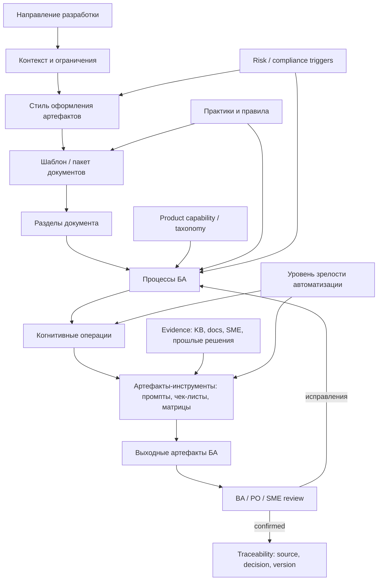
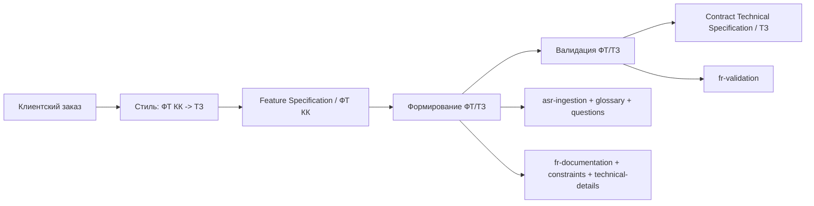
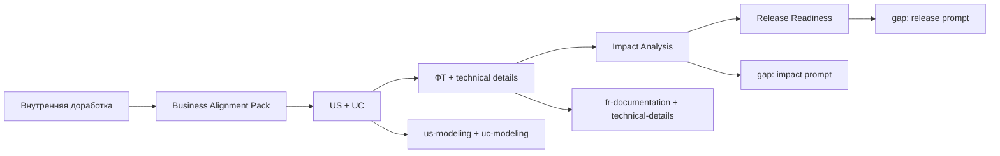
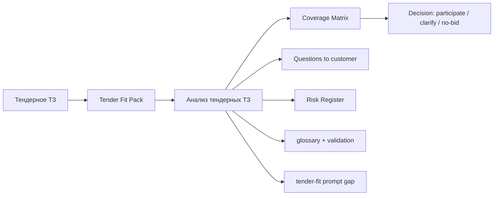
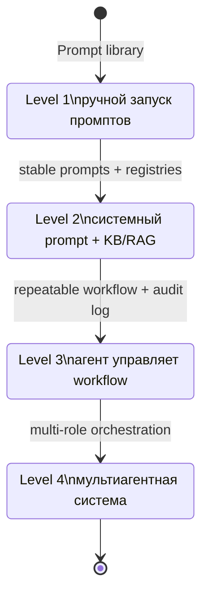

# Экосистема работы БА Mango

Документ связывает процессы БА, когнитивные операции, промпты, шаблоны,
направления разработки и будущую агентную автоматизацию в одну управляемую
модель. Он дополняет базовую таксономию
[docs/taxonomy.md](taxonomy.md) и центральный индекс процессов
[docs/ba-processes/00-index.md](ba-processes/00-index.md): там фиксируются
короткие определения и маппинг, здесь - граф, классификации, матрицы, workflow
и примеры запуска.

## 1. Методология и границы

Экосистема спроектирована как минимальная полезная модель, а не как полный
enterprise-framework. Решения опираются на research Хаба, но research не
копируется в спок: источники зарегистрированы в
[docs/hub-research-dependencies.md](hub-research-dependencies.md).

| Опора | Как используется в экосистеме | Что не переносится в спок |
| --- | --- | --- |
| TM Forum / ODA из `#taxonomy-concept` и `#classification` | Доменный язык телеком-слоев `Customer / Product / Service / Resource`, маршрутизация capability к продуктовым зонам. | Полный Frameworx как обязательная структура команд. |
| ISO/IEC/IEEE 29148 и BABOK из `#requirements-flow` | Атомарность, проверяемость, sourceLocation, разделение business/stakeholder/solution/NFR. | Тяжелый compliance-процесс requirements engineering. |
| ISO/IEC 25010 из `#taxonomy-concept` | Quality/NFR overlay для ФТ, ТЗ, release readiness и risk analysis. | Смешение quality characteristics с продуктовыми capability. |
| UNSPSC / ОКПД 2 / российский compliance overlay из `#classification` | Тендерный и договорной слой: закупка, предмет поставки, ПДн, реклама, услуга связи, КИИ. | Закупочный код как главный ключ продуктовой классификации. |
| RAG roadmap из `#rag-mapping` | Путь от Markdown-реестров к RAG и n8n-оркестрации с human gates. | Преждевременная векторная БД без проверенного Markdown-пилота. |

Ключевое решение по вопросу "кто определяет когнитивные операции": базовый
маршрут задает процесс из [docs/taxonomy.md](taxonomy.md), БА выбирает сценарий
и утверждает gates, AI/агент предлагает уточнение маршрута по направлению
разработки и уровню зрелости. БА не должен проектировать операции с нуля при
каждом запуске процесса.

### 1.1 ДОД операции: процесс проверки обязателен

Экосистема подчиняется принципу «качество системы исполнения > стоимость»
([AI_GOVERNANCE.md](../AI_GOVERNANCE.md#принцип-качество-системы-исполнения--стоимость)).
Для экосистемы это означает: **выходной артефакт операции — не весь ДОД**.
Операция считается завершённой, только когда у неё назван механизм проверки
результата.

| Механизм проверки | Форма в этом репозитории | Типовые операции |
| --- | --- | --- |
| Чек-лист | Раздел «Проверка» в паттерне или блок quality gates в промпте. | `documentation`, `solution_design`, `release_readiness` |
| Evals-метрика | Прогон в [`runs/`](../runs/) с зафиксированным входом и ожидаемым выходом. **Пока недоступен:** `evals/` и golden-set в репозитории отсутствуют ([статус механизмов](../AI_GOVERNANCE.md#статус-механизмов-проверки-на-сегодня)). | `validation`, `quality`, `research` |
| Human-in-the-loop gate | Подтверждение человеком перед сменой статуса (`covered / validated / approved / released`). | `governance`, `risk_analysis`, `impact_analysis`, `reverse_requirements` |

Практические следствия для матриц §4 и карты процессов §5:

1. Строка «Промпты» в карте процесса читается вместе со строкой «Правило»:
   правило и есть объявленный механизм проверки этого процесса.
2. Отсутствие проверки помечается честно («требуется разработка проверки») и
   попадает в §8 как gap, а не маскируется формулировкой выхода.
3. Промпт не переводится `draft → canonical`, пока нет зафиксированного прогона
   и названного механизма проверки.

Источник требований к ДОД — чек-лист D1–D10 из онтологии процессов БА Хаба
([`#ba-process-ontology`](hub-research-dependencies.md#ba-process-ontology));
здесь он не дублируется.

## 2. Граф связей экосистемы

### Сущности

| Сущность | Назначение | Основной владелец |
| --- | --- | --- |
| Направление разработки | Контекст работы: клиентская доработка, внутренний продукт, тендер, интеграция и т. д. Определяет глубину, стиль, риски и шаблон. | БА + PO/PM |
| Стиль оформления | Язык и строгость артефакта: бизнес-ориентированный ФТ, договорное ТЗ, User Story, Use Case, технический блок, тендерный комментарий. | БА |
| Шаблон / пакет документов | Минимальный набор разделов и выходов под сценарий. Термин "комплексный документ" заменяется на "пакет" или конкретный шаблон. | БА + reviewer |
| Раздел документа | Единица заполнения: терминология, проблема/цель, ФТ, НФТ, ограничения, технические детали, acceptance, риски. | БА |
| Процесс БА | Повторяемый рабочий сценарий из 9 процессов таксономии. | БА |
| Когнитивная операция | Тип мыслительной работы, который можно поддержать промптом: `ingestion`, `understanding`, `validation` и т. д. | БА / AI-agent |
| Артефакт-инструмент | Промпт, чек-лист, матрица, граф, шаблон, registry. | Contributor / prompt owner |
| Evidence | Основание решения: продуктовая документация, API, KB, SME-комментарий, прошлый тендер, классификация. | БА / SME |
| Практика / правило | Практика рекомендует и допускает адаптацию; правило обязательно и проверяется в review. | Пользователь / reviewer |
| Уровень зрелости | Способ исполнения: ручные промпты, системный prompt+KB, агент, мультиагентный контур. | Пользователь + BA lead |

## 3. Классификации

### 3.1 Направления разработки

| ID | Направление | Когда применять | Основные выходы | Важные ограничения |
| --- | --- | --- | --- | --- |
| `client-order` | Клиентский заказ / коммерческая доработка | Есть конкретный заказчик, договорной контекст и ожидаемое приложение к договору. | ФТ КК, ТЗ к договору, список вопросов, ограничения клиента. | НФТ минимальны: фиксируются ограничения клиента, SLA/ИБ/ПДн и договорные условия, но не вся внутренняя инженерная модель. |
| `internal-product` | Внутренняя доработка продукта | Инициатива Mango без внешнего договорного приложения. | Business Alignment Pack, ФТ, подробные НФТ, impact map, release readiness. | Нужны quality overlay, метрики, наблюдаемость, поддержка и трассировка. |
| `tender-rfp` | Тендер / RFI / RFP | Есть внешнее ТЗ, нужно оценить fit, gaps, риски участия. | Tender Fit Pack, матрица покрытия, вопросы заказчику, risk register. | Evidence обязателен; закупочный и compliance overlay отделяются от продуктовой capability. |
| `product-research` | Продуктовое исследование / discovery | Требование не сформировано, есть гипотеза или рыночный сигнал. | Discovery brief, гипотезы, candidate capability, research notes. | Не публиковать как standard до пилота; uncertainty фиксируется явно. |
| `technical-debt` | Технический долг / legacy / reverse requirements | Нужно восстановить или изменить существующее поведение. | Reverse requirements, impact map, ADR/RFC при необходимости. | Нельзя переписать смысл текущей функции без evidence и owner review. |
| `integration-project` | Интеграционный проект | Затрагиваются API, CRM/1C/LDAP, webhooks, внешние системы, data exchange. | Integration Specification Pack, data mapping, security constraints. | Обязательны границы ответственности, версии API, ПДн/ИБ, error handling. |
| `release-readiness` | Подготовка к релизу / change package | Требование уже реализуется или готовится к выпуску. | Release checklist, traceability, risk register, acceptance summary. | Проверяются критерии приемки, известные риски, rollback, коммуникации. |

### 3.2 Стили и шаблоны артефактов

| Стиль | Назначение | Типовые шаблоны | Когда использовать |
| --- | --- | --- | --- |
| ФТ, бизнес-ориентированный | Зафиксировать проблему, цель, функциональное поведение, ограничения и критерии без преждевременного технического решения. | `Feature Specification`, `ФТ КК`, `Business Requirements Note`. | `client-order`, `internal-product`, `product-research`. |
| ТЗ, договорно-точный | Сформулировать предмет доработки как приложение к договору или формальный контракт исполнения. | `Contract Technical Specification`, `ТЗ к договору`. | `client-order`, `tender-rfp` после решения участвовать. |
| User Story | Описать ценность для роли и критерии приемки. Поддерживаются форматы "Я как...", "As a..." и Job Story. | `User Story Set`, `Business Alignment Pack`. | Ранний бизнес-слой, agile/backlog, внутренние доработки. |
| Use Case | Описать сценарий взаимодействия по Cockburn-подобной структуре: актор, предусловия, основной поток, альтернативы, постусловия. | `Use Case Model`, `Business Alignment Pack`. | Когда важны сценарии, ветвления, actor-system границы. |
| Технические детали | Передать команде разработки ограничения, интерфейсы, NFR, интеграции и edge cases. | `Technical Details Section`, `Integration Specification Pack`. | После согласования бизнес-слоя. |
| Тендерный комментарий | Оценить покрытие требований, gaps, вопросы и риски участия. | `Tender Fit Pack`, `Coverage Matrix`. | `tender-rfp`. |
| Коммуникационный | Зафиксировать встречи, письма, вопросы, статус и next steps. | `Meeting Summary`, `Customer Question Set`, `Customer Letter`. | Поддержка ПО/ПМ, discovery, clarification. |
| Риск / impact / readiness | Показать влияние, риски, готовность к релизу и обязательные review-точки. | `Impact Analysis Report`, `Risk Register`, `Release Readiness Pack`. | `technical-debt`, `release-readiness`, сложные клиентские и тендерные сценарии. |

### 3.3 Пакеты документов вместо "комплексного документа"

| Пакет | Состав | Основной сценарий |
| --- | --- | --- |
| `Business Alignment Pack` | User Story, Use Case, high-level ФТ, assumptions, open questions. | Согласование бизнес-слоя до техники. |
| `Feature Specification / ФТ КК` | Терминология, проблема/цель/задачи, ФТ, НФТ/quality overlay, ограничения, технические детали для разработки. | Клиентская или внутренняя доработка. |
| `Contract Technical Specification / ТЗ` | Предмет доработки, точные формулировки, границы поставки, acceptance, ответственность сторон. | Приложение к договору. |
| `Tender Fit Pack` | Реестр требований, coverage matrix, gaps, вопросы заказчику, risk register, executive summary. | Анализ тендерного ТЗ. |
| `Integration Specification Pack` | Use Cases интеграции, API/data mapping, error handling, security/privacy, ownership. | CRM/API/webhook/1C/LDAP интеграции. |
| `Release Readiness Pack` | Acceptance summary, traceability, risks, rollback, коммуникации, known issues. | Готовность к релизу. |

### 3.4 Практики и правила

| Тип | Формулировка | Где применяется |
| --- | --- | --- |
| Правило | 9 процессов БА и 13 когнитивных операций из [docs/taxonomy.md](taxonomy.md) сохраняются; переименование требует отдельного review. | Все изменения таксономии. |
| Правило | Маппинг процесс -> операции -> промпты ведется централизованно, не во frontmatter промптов. | `docs/ba-processes/00-index.md`. |
| Правило | Бизнес-слой согласуется до технической детализации. | ФТ/ТЗ, UC/US, интеграции. |
| Правило | Для покрытия, gap и tender-fit нужен evidence или явная пометка "требует уточнения". | Тендеры, gap analysis, risk analysis. |
| Правило | Compliance triggers (`ПДн`, `реклама`, `услуга связи`, `КИИ`) передаются на ручной review. | ФТ/ТЗ, тендеры, интеграции, release readiness. |
| Правило | Research Хаба остается reference-only через [docs/hub-research-dependencies.md](hub-research-dependencies.md). | Все docs и prompt assets. |
| Практика | Для `uncertainty: medium/high` использовать stepwise-промпты и отдельный clarification backlog. | Discovery, ФТ/ТЗ, UC/US. |
| Практика | Для простых повторяемых задач использовать oneshot-промпты, но сохранять результат review. | Meeting summary, короткие черновики. |
| Практика | Диаграмму добавлять там, где есть gate, ветвление, состояние или цепочка промптов. | Процессы, maturity, integration. |
| Практика | Known gaps фиксировать в процессной карте и закрывать отдельными prompt/research задачами. | Развитие библиотеки. |

## 4. Матрицы

### 4.1 Процесс -> операции -> промпты

| Процесс БА | Операции | Рекомендуемые промпты | Known gaps |
| --- | --- | --- | --- |
| Формирование ФТ/ТЗ | `ingestion`, `understanding`, `modeling`, `documentation`, `solution_design`, `validation` | `asr-ingestion-oneshot`, `glossary-context-understanding-*`, `questions-customer-understanding-*`, `us-modeling-*`, `uc-modeling-*`, `fr-documentation-*`, `constraints-documentation-*`, `technical-details-solution-design-*`, `fr-validation-*` | Нет единого orchestrator prompt для сборки полного пакета ФТ/ТЗ. |
| Валидация ФТ/ТЗ | `validation`, `quality`, `risk_analysis` | `fr-validation-stepwise`, `fr-validation-oneshot` | Нет отдельного quality/statistics prompt для дефектов ФТ. |
| Анализ тендерных ТЗ | `ingestion`, `understanding`, `validation`, `risk_analysis`, `quality` | Частично: `glossary-context-understanding-*`, `questions-customer-understanding-*`, `fr-validation-*` | Нет активного document-ingestion, tender-fit, coverage matrix и risk prompt. |
| Формирование UC/US | `understanding`, `modeling`, `validation` | `us-modeling-stepwise`, `us-modeling-oneshot`, `uc-modeling-stepwise`, `uc-modeling-oneshot`, `glossary-context-understanding-*` | Нет prompt для Job Story и связки US -> UC -> FT в один пакет. |
| Визуализация UML/BPMN | `modeling`, `documentation`, `quality` | Косвенно: `uc-modeling-*` как вход для сценариев | Нет активных UML/BPMN/Mermaid prompts и визуальных quality gates. |
| Помощь ПО/ПМ | `ingestion`, `understanding`, `documentation`, `governance` | `asr-ingestion-oneshot`, `meeting-team-documentation-stepwise`, `meeting-customer-documentation-stepwise`, `questions-customer-understanding-stepwise`, `letter-customer-documentation-legacy` | Нет prompt для product decision log и stakeholder map. |
| Статистика | `ingestion`, `quality`, `research` | Только legacy в `prompts/archive/` | Нет активного statistics prompt после архивирования. |
| Impact Analysis | `impact_analysis`, `reverse_requirements`, `validation`, `governance` | Косвенно: `technical-details-solution-design-*`, `fr-validation-*` | Нет dedicated impact-analysis prompt и traceability matrix. |
| Risk Analysis | `risk_analysis`, `release_readiness`, `validation`, `quality` | Косвенно: `fr-validation-*`, `constraints-documentation-*` | Нет risk register и release-readiness prompts. |

`*` означает оба режима `stepwise` и `oneshot`, если они есть в
[prompts/](../prompts/).

### 4.2 Направление -> стиль -> шаблон

| Направление | Основной стиль | Шаблон / пакет | Вторичные артефакты |
| --- | --- | --- | --- |
| `client-order` | ФТ бизнес-ориентированный -> ТЗ договорно-точный | `Feature Specification / ФТ КК`, затем `Contract Technical Specification / ТЗ` | Customer Question Set, constraints, acceptance, legal/compliance notes. |
| `internal-product` | User Story / Use Case -> ФТ -> technical details | `Business Alignment Pack`, `Feature Specification` | Impact map, NFR, release readiness. |
| `tender-rfp` | Тендерный комментарий и evidence-first стиль | `Tender Fit Pack` | Coverage matrix, risk register, вопросы заказчику, gap hypotheses. |
| `product-research` | Discovery brief и гипотезы | `Discovery Brief`, candidate `Business Alignment Pack` | Research notes, opportunity score, candidate capability. |
| `technical-debt` | Reverse requirements и impact-first стиль | `Impact Analysis Report`, ADR/RFC при необходимости | Traceability matrix, regression examples. |
| `integration-project` | Use Case + technical/API style | `Integration Specification Pack` | Data mapping, security/privacy constraints, error handling. |
| `release-readiness` | Gate/checklist style | `Release Readiness Pack` | Risk register, acceptance summary, rollback notes. |

### 4.3 Артефакт -> стиль оформления

| Артефакт | Стиль | Контроль качества | Поддерживающие промпты |
| --- | --- | --- | --- |
| ФТ КК | Бизнес-ориентированный, проверяемый, без лишней техники в ранних разделах. | Полнота цели, задач, ФТ, ограничений, acceptance; соответствие направлению. | `fr-documentation-*`, `constraints-documentation-*`, `fr-validation-*`. |
| ТЗ | Договорно-точный, однозначный, с границами поставки. | Проверяемость, ответственность сторон, отсутствие двусмысленности. | `fr-documentation-*`, `technical-details-solution-design-*`, `fr-validation-*`. |
| User Story | Value-oriented: роль, потребность, ценность; допускается Job Story. | INVEST, acceptance criteria, capability link. | `us-modeling-*`. |
| Use Case | Cockburn-like: актор, предусловия, основной поток, альтернативы, постусловия. | Полнота сценария и границ actor/system. | `uc-modeling-*`. |
| UML/BPMN/Mermaid | Диаграмма процесса, состояния, sequence или связей. | Читаемость, соответствие тексту, наличие gate/decision. | Gap: dedicated prompt отсутствует. |
| Резюме встречи | Краткий action-oriented summary. | Decisions, questions, owners, next steps. | `meeting-team-documentation-stepwise`, `meeting-customer-documentation-stepwise`. |
| Вопросы заказчику | Clarification backlog по ambiguity tags. | Вопросы проверяемы, не навязывают решение. | `questions-customer-understanding-stepwise`. |
| Матрица покрытия | Evidence-first tender style. | Каждая оценка имеет status, confidence, evidence или question. | Gap: active tender prompt отсутствует. |
| Impact map | Traceability-first style. | Все затронутые функции, команды, риски и тесты перечислены. | Gap: dedicated impact prompt отсутствует. |
| Risk register | Risk-first style: cause, impact, likelihood, mitigation, owner. | Compliance/high-impact risks имеют owner review. | Gap: dedicated risk prompt отсутствует. |
| Release checklist | Gate/checklist style. | Acceptance, known issues, rollback, comms, traceability. | Gap: dedicated release-readiness prompt отсутствует. |

## 5. Карта процессов БА

### 5.1 Формирование ФТ/ТЗ

| Поле | Содержание |
| --- | --- |
| Цель | Перевести сырой запрос, встречу, письмо или идею в согласованный бизнес-слой и черновик ФТ/ТЗ. |
| Входы | ASR/meeting notes, письмо, задача, исходное ТЗ, product context, ограничения клиента. |
| Выходы | `Business Alignment Pack`, ФТ КК, ТЗ, questions backlog, constraints, technical details. |
| Workflow | 1. `ingestion`: очистить вход (`asr-ingestion-oneshot`). 2. `understanding`: термины, цель, вопросы (`glossary-context-understanding-*`, `questions-customer-understanding-*`). 3. `modeling`: US/UC при необходимости (`us-modeling-*`, `uc-modeling-*`). 4. `documentation`: ФТ и ограничения (`fr-documentation-*`, `constraints-documentation-*`). 5. `solution_design`: технические детали после business gate (`technical-details-solution-design-*`). 6. `validation`: проверить черновик (`fr-validation-*`). |
| Правила | Бизнес-слой до техники; direction определяет глубину НФТ; compliance trigger требует review. |

### 5.2 Валидация ФТ/ТЗ

| Поле | Содержание |
| --- | --- |
| Цель | Проверить ФТ/ТЗ на полноту, непротиворечивость, тестируемость и соответствие выбранному направлению. |
| Входы | Черновик ФТ/ТЗ, шаблон, style guide, constraints, known decisions. |
| Выходы | Defect report, вопросы, список правок, quality summary. |
| Workflow | 1. `validation`: проверить структуру и формулировки (`fr-validation-stepwise` для сложных, `fr-validation-oneshot` для коротких). 2. `quality`: классифицировать дефекты по severity. 3. `risk_analysis`: отметить legal/ИБ/NFR gaps. 4. `documentation`: вернуть правки в документ. |
| Known gap | Нет отдельного prompt для агрегированной статистики дефектов ФТ/ТЗ. |

### 5.3 Анализ тендерных ТЗ

| Поле | Содержание |
| --- | --- |
| Цель | Разобрать внешнее ТЗ, оценить покрытие Mango, выявить gaps, риски и вопросы для tender Q&A. |
| Входы | DOCX/PDF/XLSX/HTML/plain text ТЗ, карточка тендера, product/taxonomy context. |
| Выходы | `Tender Fit Pack`, coverage matrix, gap list, questions, risk register, executive summary. |
| Workflow | 1. `ingestion`: сохранить исходную структуру и извлечь требования. 2. `understanding`: термины и ambiguity. 3. `validation`: атомарность и проверяемость. 4. `risk_analysis`: compliance, SLA, интеграционные и коммерческие риски. 5. `quality`: статистика coverage/gaps. |
| Known gap | Нужны dedicated prompts для tender-fit, coverage matrix и risk scoring; текущие промпты покрывают только части workflow. |

### 5.4 Формирование UC/US

| Поле | Содержание |
| --- | --- |
| Цель | Преобразовать требование в User Story и Use Case, не теряя бизнес-цель и границы сценария. |
| Входы | Normalized Requirement, actor/stakeholder, capability, assumptions. |
| Выходы | User Story, acceptance criteria, Use Case, альтернативные потоки. |
| Workflow | 1. `understanding`: уточнить роль, цель, ценность. 2. `modeling`: сгенерировать US (`us-modeling-*`). 3. `modeling`: сгенерировать UC (`uc-modeling-*`). 4. `validation`: проверить INVEST, предусловия, альтернативы и postconditions. |
| Known gap | Нет отдельного Job Story prompt и связи US/UC/ФТ в один chain. |

### 5.5 Визуализация UML/BPMN

| Поле | Содержание |
| --- | --- |
| Цель | Представить процесс, взаимодействия, состояния или структуру требований через диаграммы. |
| Входы | Use Case, process description, actors, decisions, states. |
| Выходы | Mermaid/UML/BPMN source, diagram notes, validation checklist. |
| Workflow | 1. `modeling`: выбрать тип диаграммы. 2. `documentation`: оформить source в Markdown. 3. `quality`: сверить диаграмму с текстом и gate criteria. |
| Known gap | Нет активного промпта для Mermaid/UML/BPMN и визуального review. |

### 5.6 Помощь ПО/ПМ

| Поле | Содержание |
| --- | --- |
| Цель | Ускорить коммуникации: резюме встреч, письма, вопросы, decision notes, подготовку материалов для PO/PM. |
| Входы | Notes, ASR, chat context, draft message, stakeholder goal. |
| Выходы | Meeting summary, customer letter, question set, action list. |
| Workflow | 1. `ingestion`: очистить ASR при необходимости. 2. `understanding`: выделить decisions и вопросы. 3. `documentation`: оформить summary/letter (`meeting-*`, `letter-customer-documentation-legacy`). 4. `governance`: зафиксировать owners и next steps. |
| Known gap | Нет prompt для product decision log и stakeholder map. |

### 5.7 Статистика

| Поле | Содержание |
| --- | --- |
| Цель | Считать статистику требований, покрытий, gaps, дефектов и повторяемости спроса. |
| Входы | Корпус требований, ТЗ, результаты coverage/gap анализа, defect reports. |
| Выходы | Demand statistics, gap frequency, quality metrics, trend summary. |
| Workflow | 1. `ingestion`: собрать corpus. 2. `quality`: нормализовать категории и исключить дубли. 3. `research`: агрегировать выводы и гипотезы. |
| Known gap | Активного prompt нет; старые статистические промпты находятся в `prompts/archive/`. |

### 5.8 Impact Analysis

| Поле | Содержание |
| --- | --- |
| Цель | Оценить влияние изменения на capability, требования, интерфейсы, документы, тесты и команды. |
| Входы | Change request, existing FT/TZ, product capability, release scope, known dependencies. |
| Выходы | Impact map, affected artifacts, traceability matrix, owner list, regression scope. |
| Workflow | 1. `reverse_requirements`: восстановить текущее поведение. 2. `impact_analysis`: связать изменение с capability, API, UX, NFR, договорами. 3. `validation`: проверить полноту затронутых артефактов. 4. `governance`: назначить owners и gates. |
| Known gap | Нет dedicated impact-analysis prompt и шаблона traceability matrix. |

### 5.9 Risk Analysis

| Поле | Содержание |
| --- | --- |
| Цель | Выявить риски требования, решения, тендера или релиза и определить митигации. |
| Входы | ФТ/ТЗ, coverage matrix, impact map, release scope, compliance triggers. |
| Выходы | Risk register, mitigation plan, release-readiness notes, escalation list. |
| Workflow | 1. `risk_analysis`: собрать риски по продукту, интеграции, НФТ, compliance, коммерции. 2. `release_readiness`: проверить gates и acceptance. 3. `validation`: убедиться, что митигации проверяемы. 4. `quality`: собрать trend/recurrence. |
| Known gap | Нет dedicated risk register и release-readiness prompts. |

## 6. Примеры запуска процессов

### 6.1 Клиентский заказ: "сформировать ТЗ на доработку системы для клиента X"

Маршрут:

| Шаг | Решение |
| --- | --- |
| Направление | `client-order`: есть заказчик и договорной контекст. |
| Шаблон | Сначала `Feature Specification / ФТ КК`, затем `Contract Technical Specification / ТЗ`. |
| Процессы | Формирование ФТ/ТЗ -> Валидация ФТ/ТЗ. |
| Операции | `ingestion`, `understanding`, `modeling`, `documentation`, `solution_design`, `validation`. |
| Промпты | `asr-ingestion-oneshot`, `glossary-context-understanding-*`, `questions-customer-understanding-*`, `us-modeling-*`, `uc-modeling-*`, `fr-documentation-*`, `constraints-documentation-*`, `technical-details-solution-design-*`, `fr-validation-*`. |
| Правило | НФТ минимальны, если это именно клиентское ТЗ: фиксируются ограничения клиента, SLA/ИБ/ПДн и договорно значимые условия. |

### 6.2 Внутренняя доработка: "улучшить маршрутизацию callback в контакт-центре"

Маршрут:

| Шаг | Решение |
| --- | --- |
| Направление | `internal-product`: продуктовая инициатива Mango. |
| Шаблон | `Business Alignment Pack` -> `Feature Specification` -> `Release Readiness Pack`. |
| Процессы | Формирование UC/US -> Формирование ФТ/ТЗ -> Impact Analysis -> Risk Analysis. |
| Операции | `understanding`, `modeling`, `documentation`, `solution_design`, `impact_analysis`, `release_readiness`. |
| Промпты | `us-modeling-*`, `uc-modeling-*`, `fr-documentation-*`, `technical-details-solution-design-*`, `fr-validation-*`; impact/release prompts отсутствуют. |
| Правило | Бизнес-слой и acceptance согласуются до технического дизайна; NFR и наблюдаемость описываются глубже, чем в клиентском ТЗ. |

### 6.3 Тендер: "оценить ТЗ на омниканальный контакт-центр"

Маршрут:

| Шаг | Решение |
| --- | --- |
| Направление | `tender-rfp`: внешний документ и закупочный контекст. |
| Шаблон | `Tender Fit Pack`: реестр требований, coverage matrix, questions, risks, summary. |
| Процессы | Анализ тендерных ТЗ -> Risk Analysis -> Статистика (если корпус/серия тендеров). |
| Операции | `ingestion`, `understanding`, `validation`, `risk_analysis`, `quality`, `research`. |
| Промпты | Частично: `glossary-context-understanding-*`, `questions-customer-understanding-*`, `fr-validation-*`; dedicated tender prompts отсутствуют. |
| Правило | Для статуса `Покрывается` или `Частично покрывается` нужен evidence; при низкой уверенности статус становится `Требует уточнения`. |

## 7. Границы автоматизации: где заканчивается спок

**Область этого репозитория — уровни 1–2.** `mango_ba_prompts` работает на
GitHub с AI-исполнителем: промпты, паттерны, реестры, прогоны и
локальные валидаторы. Инструментальный слой — агенты, оркестрация и
инфраструктура их запуска — предмет отдельного проекта
([`ai-ba-playbooks`](https://github.com/G-Ivan-A/ai-ba-playbooks), ADR-009 v0.3
через [`#adr-009-repo-split`](hub-research-dependencies.md#adr-009-repo-split)),
а не этой экосистемы.

Шкала ниже — **справочная модель зрелости**, чтобы понимать, чем сегодняшние
промпты станут в руках инструментального проекта. Уровни 3–4 не являются планом
работ `mango_ba_prompts`: спок отвечает за *содержание, онтологию и стандарты
качества* операций, а не за исполняющие их инструменты.

| Уровень | Как работает | Роль БА | Критерии перехода дальше |
| --- | --- | --- | --- |
| 1. Промпты | БА вручную выбирает процесс, промпт, режим `stepwise/oneshot`, копирует контекст и валидирует результат. | Оператор и reviewer каждого шага. | Есть процессная карта, стабильные prompt outputs, известные gaps и примеры прогонов. |
| 2. Системные промпты + БЗ | Системный prompt предлагает маршрут по направлению, читает registry/KB/RAG, возвращает structured output и gates. | Оркестратор: подтверждает route, отвечает на gates, исправляет output. | Есть `product-matrix`/source registry или их аналоги, evidence policy, regression examples, audit log. |
| 3. Агенты | Агент ведет состояние workflow: выбирает операции, запускает промпты, сохраняет артефакты, предлагает next step. | Коллега-валидатор: принимает gates, решает спорные статусы, утверждает публикацию. | Workflow повторяем, есть rollback prompt/version, manual override rate приемлем, sensitive-data policy готова. |
| 4. Мультиагенты | Несколько ролей: BA orchestrator, evidence agent, documentation agent, risk/compliance agent, reviewer agent. | Владелец решения и escalation point. | Понятны права ролей, есть cross-agent audit, конфликтующие выводы не публикуются без человека. |

Плавность перехода обеспечивается тем, что сегодняшние промпты становятся
компонентами будущего агента: каждый промпт закрывает одну когнитивную операцию,
процессная карта задает порядок, registry задает источники, gates сохраняют
human ownership. Вклад спока в эту плавность — качество и верифицируемость
операций (§1.1), а не построение исполняющей системы: уровни 3–4 достигаются
инструментальным проектом, который забирает готовые операции отсюда через
односторонний ручной отбор ([docs/rfc-hub-integration.md](rfc-hub-integration.md)).

## 8. Roadmap known gaps

| Gap | Почему важен | Следующий артефакт |
| --- | --- | --- |
| Tender-fit / coverage matrix prompt | Issue 66 ставит тендеры как один из 9 процессов, а сейчас покрыты только вспомогательные операции. | `prompts/tender-validation-stepwise.md` или отдельный issue на tender-fit chain. |
| Impact analysis prompt | Нужен для изменений legacy, интеграций и внутренних доработок. | `prompts/impact-analysis-stepwise.md` + traceability matrix template. |
| Risk register / release-readiness prompts | Нужны для Risk Analysis и release gates. | `prompts/risk-analysis-stepwise.md`, `prompts/release-readiness-validation-stepwise.md`. |
| UML/BPMN/Mermaid prompt | Визуализация - отдельный процесс БА, но инструмента нет. | Prompt для выбора диаграммы и генерации Mermaid/BPMN source. |
| Product/RAG navigator | Hub roadmap предлагает `kb/product-matrix.md`; в споке его пока нет. | Отдельный пилот после согласования owner и sanitized sources. |
| Orchestrator prompt | Сейчас БА сам связывает промпты в цепочку. | Системный prompt уровня 2 для выбора процесса, операций и gates. |
| Механизм проверки не объявлен у части операций | По §1.1 такая операция считается незавершённой; пробел должен быть виден, а не замаскирован. | Явный раздел «Проверка» в паттернах и quality gates в промптах; сверка с чек-листом D1–D10 ([`#ba-process-ontology`](hub-research-dependencies.md#ba-process-ontology)). |

## 9. Связанные репозитории и PR

Полные URL для трассировки:

| Артефакт | URL |
| --- | --- |
| Issue 66 | https://github.com/G-Ivan-A/mango_ba_prompts/issues/66 |
| PR 67 | https://github.com/G-Ivan-A/mango_ba_prompts/pull/67 |
| PR 60 | https://github.com/G-Ivan-A/mango_ba_prompts/pull/60 |
| PR 57 | https://github.com/G-Ivan-A/mango_ba_prompts/pull/57 |
| PR 59 | https://github.com/G-Ivan-A/mango_ba_prompts/pull/59 |
| Issue 263 (видение и концепция) | https://github.com/G-Ivan-A/mango_ba_prompts/issues/263 |
| Хаб | https://github.com/G-Ivan-A/hybrid-Intelligence-lab |
| ai-ba-playbooks (публичная витрина методологии) | https://github.com/G-Ivan-A/ai-ba-playbooks |
| clarify-engine-ai | https://github.com/G-Ivan-A/clarify-engine-ai |
| open-ai.ru | https://github.com/G-Ivan-A/open-ai.ru |
| mango_ba_prompts | https://github.com/G-Ivan-A/mango_ba_prompts |
