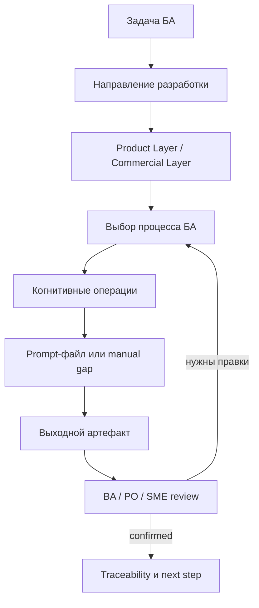
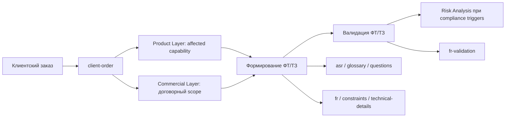
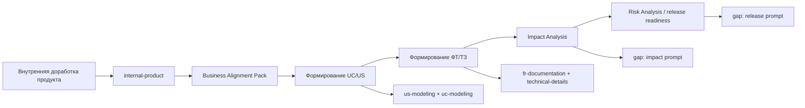
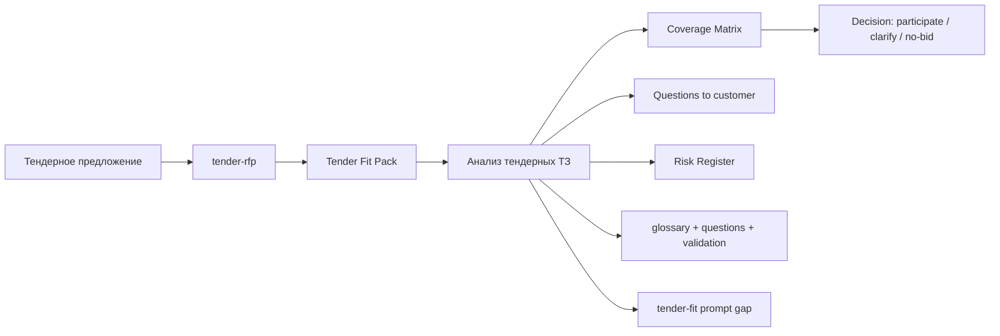

> **LLM Loading Contract — full layer.**
> Start with [`docs/ba-processes/00-index.executable.md`](00-index.executable.md).
> Load this full file only when an escalation trigger in the executable companion is true:
> explicit request for full/rationale/history, missing required section in
> executable, need for exact wording/table/reference, or editing/validating this
> full file. Otherwise do not load this file into context.

# Процессы БА: карта маршрутов, операций и промптов

Этот документ - практическая точка входа для БА Mango. Он отвечает на вопрос:
"какие промпты использовать для моей задачи, в каком порядке и где пока нужен
ручной шаг?".

Карта связывает 9 процессов БА, 13 когнитивных операций, 7 MVP-паттернов,
24 активных prompt-файла, 6 архивных legacy-файлов и направления разработки из
[docs/ba-ecosystem.md](../ba-ecosystem.md). Маппинг сознательно ведется здесь, а
не во frontmatter промптов и паттернов, чтобы сохранить один reviewable реестр.

Базовые определения процессов и операций находятся в
[docs/taxonomy.md](../taxonomy.md), матрица prompt-файлов - в
[prompts/README.md](../../prompts/README.md), визуальный каталог - на
[GitHub Pages](https://g-ivan-a.github.io/mango_ba_prompts/).

Терминологическое решение: в действующей таксономии операция контроля качества
называется `quality`. Токен `quality_control`, упомянутый в issue #83, не
используется в workflow, чтобы не противоречить [docs/taxonomy.md](../taxonomy.md).

## Быстрый выбор маршрута

| Если задача | Начните с процесса | Первый prompt / шаг | Что проверить перед продолжением |
| --- | --- | --- | --- |
| Сформировать ФТ/ТЗ по встрече, письму или сырому запросу | [1. Формирование ФТ/ТЗ](#1-формирование-фттз) | [`glossary-context-understanding-stepwise.md`](../../prompts/glossary-context-understanding-stepwise.md) или [`asr-ingestion-oneshot.md`](../../prompts/asr-ingestion-oneshot.md), если вход - ASR | Есть цель, термины, вопросы, границы Product Layer и Commercial Layer. |
| Проверить готовый черновик ФТ/ТЗ | [2. Валидация ФТ/ТЗ](#2-валидация-фттз) | [`fr-validation-stepwise.md`](../../prompts/fr-validation-stepwise.md) | Дефекты отделены от новых требований и рисков. |
| Разобрать внешнее тендерное ТЗ | [3. Анализ тендерных ТЗ](#3-анализ-тендерных-тз) | [`glossary-context-understanding-stepwise.md`](../../prompts/glossary-context-understanding-stepwise.md), затем [`fr-validation-stepwise.md`](../../prompts/fr-validation-stepwise.md) | Для coverage/gap есть evidence или статус "требует уточнения". |
| Получить User Story или Use Case | [4. Формирование UC/US](#4-формирование-ucus) | [`us-modeling-stepwise.md`](../../prompts/us-modeling-stepwise.md), [`uc-modeling-stepwise.md`](../../prompts/uc-modeling-stepwise.md) | Story и сценарий не теряют бизнес-цель и actor/system boundary. |
| Нарисовать процесс, состояние или взаимодействие | [5. Визуализация UML/BPMN](#5-визуализация-umlbpmn) | Выполняется вручную; можно взять [`uc-modeling-stepwise.md`](../../prompts/uc-modeling-stepwise.md) как вход | Диаграмма соответствует тексту и имеет gate/decision. |
| Подготовить резюме встречи, письмо, вопросы или handover | [6. Помощь ПО/ПМ](#6-помощь-попм) | [`meeting-customer-documentation-stepwise.md`](../../prompts/meeting-customer-documentation-stepwise.md), [`meeting-team-documentation-stepwise.md`](../../prompts/meeting-team-documentation-stepwise.md), [`questions-customer-understanding-stepwise.md`](../../prompts/questions-customer-understanding-stepwise.md) | Есть decisions, owners, next steps и открытые вопросы. |
| Посчитать статистику по корпусу ТЗ или дефектам | [7. Статистика](#7-статистика) | Активного prompt нет; legacy доступны в [`prompts/archive/`](../../prompts/archive/tz-stats-generator-legacy.md) | Категории и правила подсчета согласованы вручную. |
| Оценить влияние изменения | [8. Impact Analysis](#8-impact-analysis) | Выполняется вручную с опорой на [`technical-details-solution-design-stepwise.md`](../../prompts/technical-details-solution-design-stepwise.md) и [`fr-validation-stepwise.md`](../../prompts/fr-validation-stepwise.md) | Есть affected artifacts, owners и regression scope. |
| Собрать риски и readiness перед релизом | [9. Risk Analysis](#9-risk-analysis) | Выполняется вручную с опорой на [`constraints-documentation-stepwise.md`](../../prompts/constraints-documentation-stepwise.md) и [`fr-validation-stepwise.md`](../../prompts/fr-validation-stepwise.md) | Compliance/high-impact risks имеют owner review. |

## Центральный маппинг

Таблица ниже остается parser-compatible для
[`scripts/generate-pages-data.mjs`](../../scripts/generate-pages-data.mjs): первые
пять колонок фиксируют краткий реестр "процесс -> операции -> паттерн -> prompts".
Детальные workflow находятся в следующем разделе.

| № | Процесс | Операции | Паттерн | Рекомендуемые промпты |
| --- | --- | --- | --- | --- |
| 1 | Формирование ФТ/ТЗ | `ingestion`, `understanding`, `modeling`, `documentation`, `solution_design`, `validation` | [`asr-ingestion`](../../patterns/asr-ingestion/), [`glossary-context-generation`](../../patterns/glossary-context-generation/), [`user-story-generation`](../../patterns/user-story-generation/), [`usecase-generation`](../../patterns/usecase-generation/), [`fr-generation`](../../patterns/fr-generation/), [`fr-validation`](../../patterns/fr-validation/) | [`asr-ingestion-oneshot.md`](../../prompts/asr-ingestion-oneshot.md), [`asr-ingestion-legacy.md`](../../prompts/asr-ingestion-legacy.md), [`glossary-context-understanding-stepwise.md`](../../prompts/glossary-context-understanding-stepwise.md), [`glossary-context-understanding-oneshot.md`](../../prompts/glossary-context-understanding-oneshot.md), [`questions-customer-understanding-stepwise.md`](../../prompts/questions-customer-understanding-stepwise.md), [`questions-customer-understanding-legacy.md`](../../prompts/questions-customer-understanding-legacy.md), [`us-modeling-stepwise.md`](../../prompts/us-modeling-stepwise.md), [`us-modeling-oneshot.md`](../../prompts/us-modeling-oneshot.md), [`uc-modeling-stepwise.md`](../../prompts/uc-modeling-stepwise.md), [`uc-modeling-oneshot.md`](../../prompts/uc-modeling-oneshot.md), [`fr-documentation-stepwise.md`](../../prompts/fr-documentation-stepwise.md), [`fr-documentation-oneshot.md`](../../prompts/fr-documentation-oneshot.md), [`constraints-documentation-stepwise.md`](../../prompts/constraints-documentation-stepwise.md), [`constraints-documentation-oneshot.md`](../../prompts/constraints-documentation-oneshot.md), [`technical-details-solution-design-stepwise.md`](../../prompts/technical-details-solution-design-stepwise.md), [`technical-details-solution-design-oneshot.md`](../../prompts/technical-details-solution-design-oneshot.md), [`technical-details-solution-design-legacy.md`](../../prompts/technical-details-solution-design-legacy.md), [`fr-validation-stepwise.md`](../../prompts/fr-validation-stepwise.md), [`fr-validation-oneshot.md`](../../prompts/fr-validation-oneshot.md), [`fr-validation-legacy.md`](../../prompts/fr-validation-legacy.md) |
| 2 | Валидация ФТ/ТЗ | `validation`, `quality`, `risk_analysis` | [`fr-validation`](../../patterns/fr-validation/) | [`fr-validation-stepwise.md`](../../prompts/fr-validation-stepwise.md), [`fr-validation-oneshot.md`](../../prompts/fr-validation-oneshot.md), [`fr-validation-legacy.md`](../../prompts/fr-validation-legacy.md) |
| 3 | Анализ тендерных ТЗ | `ingestion`, `understanding`, `validation`, `risk_analysis`, `quality` | [`glossary-context-generation`](../../patterns/glossary-context-generation/), [`fr-validation`](../../patterns/fr-validation/) | [`glossary-context-understanding-stepwise.md`](../../prompts/glossary-context-understanding-stepwise.md), [`glossary-context-understanding-oneshot.md`](../../prompts/glossary-context-understanding-oneshot.md), [`questions-customer-understanding-stepwise.md`](../../prompts/questions-customer-understanding-stepwise.md), [`questions-customer-understanding-legacy.md`](../../prompts/questions-customer-understanding-legacy.md), [`fr-validation-stepwise.md`](../../prompts/fr-validation-stepwise.md), [`fr-validation-oneshot.md`](../../prompts/fr-validation-oneshot.md), [`fr-validation-legacy.md`](../../prompts/fr-validation-legacy.md) |
| 4 | Формирование UC/US | `understanding`, `modeling`, `validation`, `documentation` | [`glossary-context-generation`](../../patterns/glossary-context-generation/), [`user-story-generation`](../../patterns/user-story-generation/), [`usecase-generation`](../../patterns/usecase-generation/), [`fr-validation`](../../patterns/fr-validation/) | [`glossary-context-understanding-stepwise.md`](../../prompts/glossary-context-understanding-stepwise.md), [`glossary-context-understanding-oneshot.md`](../../prompts/glossary-context-understanding-oneshot.md), [`us-modeling-stepwise.md`](../../prompts/us-modeling-stepwise.md), [`us-modeling-oneshot.md`](../../prompts/us-modeling-oneshot.md), [`uc-modeling-stepwise.md`](../../prompts/uc-modeling-stepwise.md), [`uc-modeling-oneshot.md`](../../prompts/uc-modeling-oneshot.md), [`fr-validation-stepwise.md`](../../prompts/fr-validation-stepwise.md) |
| 5 | Визуализация UML/BPMN | `modeling`, `documentation`, `quality` | Косвенно: [`usecase-generation`](../../patterns/usecase-generation/) как сценарный источник | Косвенно: [`uc-modeling-stepwise.md`](../../prompts/uc-modeling-stepwise.md), [`uc-modeling-oneshot.md`](../../prompts/uc-modeling-oneshot.md) |
| 6 | Помощь ПО/ПМ | `ingestion`, `understanding`, `documentation`, `governance` | [`asr-ingestion`](../../patterns/asr-ingestion/), [`glossary-context-generation`](../../patterns/glossary-context-generation/), [`meeting-summary-generation`](../../patterns/meeting-summary-generation/) | [`asr-ingestion-oneshot.md`](../../prompts/asr-ingestion-oneshot.md), [`meeting-customer-documentation-stepwise.md`](../../prompts/meeting-customer-documentation-stepwise.md), [`meeting-team-documentation-stepwise.md`](../../prompts/meeting-team-documentation-stepwise.md), [`questions-customer-understanding-stepwise.md`](../../prompts/questions-customer-understanding-stepwise.md), [`questions-customer-understanding-legacy.md`](../../prompts/questions-customer-understanding-legacy.md), [`letter-customer-documentation-legacy.md`](../../prompts/letter-customer-documentation-legacy.md), [`session-debug-documentation-oneshot.md`](../../prompts/session-debug-documentation-oneshot.md) |
| 7 | Статистика | `ingestion`, `quality`, `research` | — (workflow map) | Legacy only: [`archive/tz-stats-generator-legacy.md`](../../prompts/archive/tz-stats-generator-legacy.md), [`archive/tz-stats-generator-simple-legacy.md`](../../prompts/archive/tz-stats-generator-simple-legacy.md) |
| 8 | Impact Analysis | `reverse_requirements`, `impact_analysis`, `validation`, `governance` | — (workflow map) | Косвенно: [`technical-details-solution-design-stepwise.md`](../../prompts/technical-details-solution-design-stepwise.md), [`technical-details-solution-design-oneshot.md`](../../prompts/technical-details-solution-design-oneshot.md), [`fr-validation-stepwise.md`](../../prompts/fr-validation-stepwise.md), [`fr-validation-oneshot.md`](../../prompts/fr-validation-oneshot.md) |
| 9 | Risk Analysis | `risk_analysis`, `release_readiness`, `validation`, `quality` | — (workflow map) | Косвенно: [`constraints-documentation-stepwise.md`](../../prompts/constraints-documentation-stepwise.md), [`constraints-documentation-oneshot.md`](../../prompts/constraints-documentation-oneshot.md), [`fr-validation-stepwise.md`](../../prompts/fr-validation-stepwise.md), [`fr-validation-oneshot.md`](../../prompts/fr-validation-oneshot.md) |

## Режимы запуска промптов

| Режим | Когда применять | Риск, который закрывает | Примеры |
| --- | --- | --- | --- |
| `stepwise` | Неопределенность medium/high, нужен gate между шагами, есть риск домыслов. | БА видит промежуточный результат и подтверждает направление. | [`glossary-context-understanding-stepwise.md`](../../prompts/glossary-context-understanding-stepwise.md), [`fr-documentation-stepwise.md`](../../prompts/fr-documentation-stepwise.md), [`fr-validation-stepwise.md`](../../prompts/fr-validation-stepwise.md) |
| `oneshot` | Вход полный, задача короткая, цена уточнения низкая, нужен быстрый черновик или постобработка. | Экономит время без потери review шага. | [`asr-ingestion-oneshot.md`](../../prompts/asr-ingestion-oneshot.md), [`fr-documentation-oneshot.md`](../../prompts/fr-documentation-oneshot.md), [`session-debug-documentation-oneshot.md`](../../prompts/session-debug-documentation-oneshot.md) |
| `legacy` | Нужна совместимость, сравнение с историческим результатом или активный draft еще не заменен. | Не теряется история решений и миграций из Хаба. | [`technical-details-solution-design-legacy.md`](../../prompts/technical-details-solution-design-legacy.md), [`letter-customer-documentation-legacy.md`](../../prompts/letter-customer-documentation-legacy.md), [`fr-validation-legacy.md`](../../prompts/fr-validation-legacy.md) |

## Направления разработки и слои

Направление задает глубину артефакта: один и тот же процесс может требовать
разного уровня Product Layer и Commercial Layer.

| Направление | Как влияет на Product Layer | Как влияет на Commercial Layer | Основной маршрут |
| --- | --- | --- | --- |
| `client-order` | Product Layer фиксирует затронутые capability и ограничения продукта. | Commercial Layer фиксирует договорной scope, ответственность, SLA/ИБ/ПДн и границы поставки. | Формирование ФТ/ТЗ -> Валидация ФТ/ТЗ -> Risk Analysis при triggers. |
| `internal-product` | Product Layer главный: value, capability, NFR, наблюдаемость, release scope. | Commercial Layer обычно вторичен, но фиксирует влияние на тарифы, оферты или клиентские обязательства. | Формирование UC/US -> Формирование ФТ/ТЗ -> Impact Analysis -> Risk Analysis. |
| `tender-rfp` | Product Layer дает coverage по текущим и планируемым возможностям. | Commercial Layer дает закупочный контекст, договорные риски и no-bid критерии. | Анализ тендерных ТЗ -> Risk Analysis -> Статистика при серии тендеров. |
| `technical-debt` | Product Layer восстанавливает текущее поведение и затронутые capability. | Commercial Layer проверяет влияние на действующие обязательства и поддержку клиентов. | Impact Analysis -> Формирование ФТ/ТЗ -> Валидация ФТ/ТЗ. |
| `integration-project` | Product Layer фиксирует API, data mapping, ownership и system boundaries. | Commercial Layer фиксирует ответственность сторон, персональные данные и условия интеграции. | Формирование UC/US -> Формирование ФТ/ТЗ -> Risk Analysis. |
| `release-readiness` | Product Layer проверяет acceptance, regression scope и known issues. | Commercial Layer проверяет коммуникации, rollback, договорные и support-обязательства. | Risk Analysis -> Валидация ФТ/ТЗ -> Помощь ПО/ПМ. |

## Общий граф маршрутизации

## Детальная карта 9 процессов

### 1. Формирование ФТ/ТЗ

**Цель.** Перевести сырой запрос, встречу, письмо, тендерный фрагмент или идею в
согласованный бизнес-слой и черновик ФТ/ТЗ.

**Входы.** ASR/meeting notes, письмо, задача, исходное ТЗ, product context,
ограничения клиента, связанные US/UC, известные решения.

**Выходы.** `Business Alignment Pack`, ФТ КК, ТЗ, questions backlog, constraints,
technical details, validation report.

| Шаг | Операция | Что получить | Промпты | Gate / gap |
| --- | --- | --- | --- | --- |
| 1. Нормализовать сырой вход | `ingestion` | Читаемый вход без потери смысла | [`asr-ingestion-oneshot.md`](../../prompts/asr-ingestion-oneshot.md); legacy: [`asr-ingestion-legacy.md`](../../prompts/asr-ingestion-legacy.md) | Gate: смысловая структура сохранена. |
| 2. Собрать контекст | `understanding` | Термины, проблема, цель, задачи, вопросы | [`glossary-context-understanding-stepwise.md`](../../prompts/glossary-context-understanding-stepwise.md), [`glossary-context-understanding-oneshot.md`](../../prompts/glossary-context-understanding-oneshot.md), [`questions-customer-understanding-stepwise.md`](../../prompts/questions-customer-understanding-stepwise.md); legacy: [`questions-customer-understanding-legacy.md`](../../prompts/questions-customer-understanding-legacy.md) | Gate: нет критичных неотвеченных вопросов для бизнес-слоя. |
| 3. Смоделировать сценарии при необходимости | `modeling` | User Story, Use Case, acceptance context | [`us-modeling-stepwise.md`](../../prompts/us-modeling-stepwise.md), [`us-modeling-oneshot.md`](../../prompts/us-modeling-oneshot.md), [`uc-modeling-stepwise.md`](../../prompts/uc-modeling-stepwise.md), [`uc-modeling-oneshot.md`](../../prompts/uc-modeling-oneshot.md) | Gate: роль, ценность, основной поток и исключения согласованы. |
| 4. Оформить ФТ и ограничения | `documentation` | Раздел 4 ФТ и раздел 6 ограничений | [`fr-documentation-stepwise.md`](../../prompts/fr-documentation-stepwise.md), [`fr-documentation-oneshot.md`](../../prompts/fr-documentation-oneshot.md), [`constraints-documentation-stepwise.md`](../../prompts/constraints-documentation-stepwise.md), [`constraints-documentation-oneshot.md`](../../prompts/constraints-documentation-oneshot.md) | Gate: требования атомарны и отделены от реализации. |
| 5. Подготовить технические детали | `solution_design` | Раздел 7, do/edge cases, системные ограничения | [`technical-details-solution-design-stepwise.md`](../../prompts/technical-details-solution-design-stepwise.md), [`technical-details-solution-design-oneshot.md`](../../prompts/technical-details-solution-design-oneshot.md); legacy: [`technical-details-solution-design-legacy.md`](../../prompts/technical-details-solution-design-legacy.md) | Gate: business layer уже согласован. |
| 6. Проверить черновик | `validation` | Defect report, вопросы, список правок | [`fr-validation-stepwise.md`](../../prompts/fr-validation-stepwise.md), [`fr-validation-oneshot.md`](../../prompts/fr-validation-oneshot.md); legacy: [`fr-validation-legacy.md`](../../prompts/fr-validation-legacy.md) | Требуется разработка промпта: orchestrator для сборки полного ФТ/ТЗ chain. |

### 2. Валидация ФТ/ТЗ

**Цель.** Проверить готовый черновик на полноту, непротиворечивость,
тестируемость, соответствие направлению разработки и явные риски.

**Входы.** Черновик ФТ/ТЗ, шаблон, constraints, glossary, product context,
known decisions, acceptance criteria.

**Выходы.** Defect report, questions backlog, список правок, quality summary,
risk notes.

| Шаг | Операция | Что получить | Промпты | Gate / gap |
| --- | --- | --- | --- | --- |
| 1. Провести аудит структуры и формулировок | `validation` | Дефекты полноты, противоречий и тестируемости | [`fr-validation-stepwise.md`](../../prompts/fr-validation-stepwise.md), [`fr-validation-oneshot.md`](../../prompts/fr-validation-oneshot.md); legacy: [`fr-validation-legacy.md`](../../prompts/fr-validation-legacy.md) | Gate: дефекты привязаны к пунктам документа. |
| 2. Классифицировать качество | `quality` | Severity, тип дефекта, частота повторения | Выполняется вручную | Требуется разработка промпта: quality/statistics prompt для дефектов ФТ/ТЗ. |
| 3. Отметить риски | `risk_analysis` | Legal/ИБ/NFR/commercial risk notes | Выполняется вручную с опорой на [`constraints-documentation-stepwise.md`](../../prompts/constraints-documentation-stepwise.md) | Требуется разработка промпта: risk overlay для валидации ФТ/ТЗ. |
| 4. Вернуть результат в документ | `documentation` | Исправленный или размеченный черновик | [`fr-documentation-stepwise.md`](../../prompts/fr-documentation-stepwise.md), если нужна перегенерация раздела 4 | Gate: новые требования не добавлены без source. |

### 3. Анализ тендерных ТЗ

**Цель.** Разобрать внешнее ТЗ/RFI/RFP, оценить соответствие Mango, выявить gaps,
вопросы заказчику, риски участия и no-bid основания.

**Входы.** DOCX/PDF/XLSX/HTML/plain text ТЗ, карточка тендера, product/taxonomy
context, ограничения закупки, коммерческие условия.

**Выходы.** `Tender Fit Pack`, coverage matrix, gap list, questions backlog,
risk register, executive summary.

| Шаг | Операция | Что получить | Промпты | Gate / gap |
| --- | --- | --- | --- | --- |
| 1. Сохранить структуру внешнего ТЗ | `ingestion` | Реестр требований с sourceLocation | Выполняется вручную | Требуется разработка промпта: document-ingestion для тендерных DOCX/PDF/XLSX. |
| 2. Понять термины и неоднозначности | `understanding` | Glossary, ambiguity list, questions | [`glossary-context-understanding-stepwise.md`](../../prompts/glossary-context-understanding-stepwise.md), [`glossary-context-understanding-oneshot.md`](../../prompts/glossary-context-understanding-oneshot.md), [`questions-customer-understanding-stepwise.md`](../../prompts/questions-customer-understanding-stepwise.md); legacy: [`questions-customer-understanding-legacy.md`](../../prompts/questions-customer-understanding-legacy.md) | Gate: сомнительные требования помечены как "требует уточнения". |
| 3. Проверить атомарность и проверяемость | `validation` | Дефекты требований и вопросы | [`fr-validation-stepwise.md`](../../prompts/fr-validation-stepwise.md), [`fr-validation-oneshot.md`](../../prompts/fr-validation-oneshot.md); legacy: [`fr-validation-legacy.md`](../../prompts/fr-validation-legacy.md) | Gate: нельзя ставить covered без evidence. |
| 4. Оценить риски участия | `risk_analysis` | Compliance, SLA, интеграционные и коммерческие risks | Выполняется вручную | Требуется разработка промпта: tender risk scoring и no-bid criteria. |
| 5. Свести coverage/gaps | `quality` | Coverage matrix и summary | Выполняется вручную | Требуется разработка промпта: tender-fit / coverage matrix. |

### 4. Формирование UC/US

**Цель.** Преобразовать требование в User Story и Use Case, не потеряв
бизнес-цель, акторов, границы системы и acceptance.

**Входы.** Normalized Requirement, actor/stakeholder, capability, assumptions,
context, related FT/TZ section.

**Выходы.** User Story, Job Story при необходимости, acceptance criteria, Use
Case, основной и альтернативные потоки.

| Шаг | Операция | Что получить | Промпты | Gate / gap |
| --- | --- | --- | --- | --- |
| 1. Уточнить роль, ценность и границы | `understanding` | Role/value/context, open questions | [`glossary-context-understanding-stepwise.md`](../../prompts/glossary-context-understanding-stepwise.md), [`glossary-context-understanding-oneshot.md`](../../prompts/glossary-context-understanding-oneshot.md) | Gate: одна story или явная декомпозиция. |
| 2. Сформировать User Story | `modeling` | US, acceptance criteria, INVEST check | [`us-modeling-stepwise.md`](../../prompts/us-modeling-stepwise.md), [`us-modeling-oneshot.md`](../../prompts/us-modeling-oneshot.md); archive reference: [`archive/user-story-generator-legacy.md`](../../prompts/archive/user-story-generator-legacy.md), [`archive/user-story-generator-simple-legacy.md`](../../prompts/archive/user-story-generator-simple-legacy.md) | Gate: ценность и критерии приемки проверяемы. |
| 3. Сформировать Use Case | `modeling` | UC, actors, preconditions, main/alternative flows | [`uc-modeling-stepwise.md`](../../prompts/uc-modeling-stepwise.md), [`uc-modeling-oneshot.md`](../../prompts/uc-modeling-oneshot.md); archive reference: [`archive/usecase-stepwise-generator-legacy.md`](../../prompts/archive/usecase-stepwise-generator-legacy.md), [`archive/usecase-stepwise-generator-simple-legacy.md`](../../prompts/archive/usecase-stepwise-generator-simple-legacy.md) | Gate: actor/system boundary не смешан. |
| 4. Проверить связку US -> UC -> ФТ | `validation` | Несоответствия, вопросы, ready/not ready | [`fr-validation-stepwise.md`](../../prompts/fr-validation-stepwise.md) | Требуется разработка промпта: chain validation для US/UC/ФТ и отдельный Job Story prompt. |
| 5. Передать в ФТ при необходимости | `documentation` | Вход для раздела 4 | [`fr-documentation-stepwise.md`](../../prompts/fr-documentation-stepwise.md) | Gate: ФТ создается после согласования бизнес-сценария. |

### 5. Визуализация UML/BPMN

**Цель.** Представить процесс, взаимодействие, состояние или структуру требований
через Mermaid/UML/BPMN, чтобы увидеть ветвления, gates и зависимости.

**Входы.** Use Case, process description, actors, decisions, states,
integration boundaries.

**Выходы.** Mermaid/UML/BPMN source, diagram notes, validation checklist,
question list.

| Шаг | Операция | Что получить | Промпты | Gate / gap |
| --- | --- | --- | --- | --- |
| 1. Выбрать тип диаграммы | `modeling` | Process/state/sequence/context diagram decision | Выполняется вручную; вход можно взять из [`uc-modeling-stepwise.md`](../../prompts/uc-modeling-stepwise.md) или [`uc-modeling-oneshot.md`](../../prompts/uc-modeling-oneshot.md) | Требуется разработка промпта: выбор типа диаграммы и UML/BPMN routing. |
| 2. Оформить source диаграммы | `documentation` | Mermaid/UML/BPMN source в Markdown | Выполняется вручную | Требуется разработка промпта: Mermaid/UML/BPMN generator. |
| 3. Сверить диаграмму с текстом | `quality` | Visual quality checklist и gaps | Выполняется вручную | Требуется разработка промпта: visual review и consistency gate. |

### 6. Помощь ПО/ПМ

**Цель.** Ускорить коммуникации БА с PO/PM, командой и заказчиком: резюме встреч,
письма, вопросы, handover, decision notes.

**Входы.** Notes, ASR, chat context, draft message, stakeholder goal,
meeting agenda.

**Выходы.** Meeting summary, customer letter, question set, action list,
session summary, owners/next steps.

| Шаг | Операция | Что получить | Промпты | Gate / gap |
| --- | --- | --- | --- | --- |
| 1. Очистить ASR или длинный вход | `ingestion` | Читаемый transcript/input | [`asr-ingestion-oneshot.md`](../../prompts/asr-ingestion-oneshot.md) | Gate: не потеряны decisions и вопросы. |
| 2. Выделить смысл и вопросы | `understanding` | Questions backlog, decisions, blockers | [`questions-customer-understanding-stepwise.md`](../../prompts/questions-customer-understanding-stepwise.md); legacy: [`questions-customer-understanding-legacy.md`](../../prompts/questions-customer-understanding-legacy.md) | Gate: вопросы не навязывают решение заказчику. |
| 3. Оформить коммуникацию | `documentation` | Meeting summary, customer/team note, letter | [`meeting-customer-documentation-stepwise.md`](../../prompts/meeting-customer-documentation-stepwise.md), [`meeting-team-documentation-stepwise.md`](../../prompts/meeting-team-documentation-stepwise.md), [`letter-customer-documentation-legacy.md`](../../prompts/letter-customer-documentation-legacy.md), [`session-debug-documentation-oneshot.md`](../../prompts/session-debug-documentation-oneshot.md) | Gate: есть decisions, owners, dates/next steps. |
| 4. Зафиксировать управление процессом | `governance` | Owners, статус, follow-up, link to artifact | Выполняется вручную | Требуется разработка промпта: product decision log и stakeholder map. |

### 7. Статистика

**Цель.** Считать статистику требований, coverage, gaps, дефектов и повторяемости
спроса для анализа качества и продуктовых решений.

**Входы.** Корпус требований, ТЗ, результаты coverage/gap анализа, defect
reports, taxonomy/category rules.

**Выходы.** Demand statistics, gap frequency, quality metrics, trend summary,
research hypotheses.

| Шаг | Операция | Что получить | Промпты | Gate / gap |
| --- | --- | --- | --- | --- |
| 1. Собрать корпус | `ingestion` | Список документов и единый источник данных | Выполняется вручную | Gate: corpus source и правила включения понятны. |
| 2. Нормализовать категории | `quality` | Категории, исключение дублей, defect classes | Legacy reference: [`archive/tz-stats-generator-legacy.md`](../../prompts/archive/tz-stats-generator-legacy.md), [`archive/tz-stats-generator-simple-legacy.md`](../../prompts/archive/tz-stats-generator-simple-legacy.md) | Требуется разработка промпта: активный statistics prompt после архивирования legacy. |
| 3. Сформировать выводы | `research` | Trend summary, гипотезы и next questions | Выполняется вручную | Gate: выводы отделены от непроверенных гипотез. |

### 8. Impact Analysis

**Цель.** Оценить влияние изменения на capability, требования, интерфейсы,
документы, тесты, команды, клиентов и релизный scope.

**Входы.** Change request, existing FT/TZ, product capability, release scope,
known dependencies, incidents, legacy behavior.

**Выходы.** Impact map, affected artifacts, traceability matrix, owner list,
regression scope, decision gates.

| Шаг | Операция | Что получить | Промпты | Gate / gap |
| --- | --- | --- | --- | --- |
| 1. Восстановить текущее поведение | `reverse_requirements` | Reverse requirements и source evidence | Выполняется вручную с опорой на [`fr-validation-stepwise.md`](../../prompts/fr-validation-stepwise.md) | Требуется разработка промпта: reverse requirements для legacy behavior. |
| 2. Связать изменение с артефактами | `impact_analysis` | Impact map по Product Layer, Commercial Layer, API, UX, NFR | Выполняется вручную; технический вход можно уточнить через [`technical-details-solution-design-stepwise.md`](../../prompts/technical-details-solution-design-stepwise.md) или [`technical-details-solution-design-oneshot.md`](../../prompts/technical-details-solution-design-oneshot.md) | Требуется разработка промпта: dedicated impact-analysis prompt и traceability matrix. |
| 3. Проверить полноту влияния | `validation` | Missed dependencies, affected tests, owner gaps | [`fr-validation-stepwise.md`](../../prompts/fr-validation-stepwise.md), [`fr-validation-oneshot.md`](../../prompts/fr-validation-oneshot.md) | Gate: нет high-impact зоны без owner. |
| 4. Назначить gates и owners | `governance` | Owner list, review gates, next step | Выполняется вручную | Gate: изменения без owner не идут в разработку. |

### 9. Risk Analysis

**Цель.** Выявить риски требования, решения, тендера или релиза и определить
митигации, owners и release-readiness gates.

**Входы.** ФТ/ТЗ, coverage matrix, impact map, release scope, compliance
triggers, known issues, support context.

**Выходы.** Risk register, mitigation plan, release-readiness notes, escalation
list, known issues.

| Шаг | Операция | Что получить | Промпты | Gate / gap |
| --- | --- | --- | --- | --- |
| 1. Собрать риски | `risk_analysis` | Risk register: cause, impact, likelihood, mitigation, owner | Выполняется вручную; входные ограничения можно оформить через [`constraints-documentation-stepwise.md`](../../prompts/constraints-documentation-stepwise.md) или [`constraints-documentation-oneshot.md`](../../prompts/constraints-documentation-oneshot.md) | Требуется разработка промпта: risk register prompt. |
| 2. Проверить readiness | `release_readiness` | Acceptance, rollback, comms, known issues | Выполняется вручную | Требуется разработка промпта: release-readiness validation prompt. |
| 3. Проверить митигации | `validation` | Проверяемость mitigation и escalation criteria | [`fr-validation-stepwise.md`](../../prompts/fr-validation-stepwise.md), [`fr-validation-oneshot.md`](../../prompts/fr-validation-oneshot.md) | Gate: high/compliance risks имеют owner review. |
| 4. Собрать recurring quality signals | `quality` | Trend/recurrence notes | Legacy statistics reference: [`archive/tz-stats-generator-legacy.md`](../../prompts/archive/tz-stats-generator-legacy.md) | Выполняется вручную до появления активного statistics prompt. |

## Known gaps

Known gaps - это не скрытый backlog внутри карты. Каждый gap ниже означает, что
сейчас БА выполняет шаг вручную или использует косвенный prompt, а отдельный
prompt должен появиться через новый issue/PR.

| Gap | Процессы | Статус | Следующий артефакт |
| --- | --- | --- | --- |
| Orchestrator для полного ФТ/ТЗ chain | Формирование ФТ/ТЗ | Требуется разработка промпта | `prompts/ft-tz-orchestration-stepwise.md` или отдельный issue на workflow prompt. |
| Quality/statistics prompt для дефектов ФТ/ТЗ | Валидация ФТ/ТЗ, Статистика | Требуется разработка промпта | Новый active statistics prompt вместо reliance on archive. |
| Document ingestion для тендерных DOCX/PDF/XLSX | Анализ тендерных ТЗ | Требуется разработка промпта | `prompts/tender-ingestion-stepwise.md` после определения sanitized examples. |
| Tender-fit / coverage matrix / no-bid scoring | Анализ тендерных ТЗ, Risk Analysis | Требуется разработка промпта | `prompts/tender-validation-stepwise.md` или tender-fit chain. |
| UML/BPMN/Mermaid generation и visual review | Визуализация UML/BPMN | Требуется разработка промпта | Prompt для выбора типа диаграммы и генерации Mermaid/BPMN source. |
| Product decision log и stakeholder map | Помощь ПО/ПМ | Требуется разработка промпта | Коммуникационный governance prompt. |
| Reverse requirements и impact traceability matrix | Impact Analysis | Требуется разработка промпта | `prompts/impact-analysis-stepwise.md`. |
| Risk register и release-readiness prompts | Risk Analysis | Требуется разработка промпта | `prompts/risk-analysis-stepwise.md`, `prompts/release-readiness-validation-stepwise.md`. |
| Product/RAG navigator для evidence | Все процессы, где нужен source-backed routing | Выполняется вручную | Отдельный пилот после согласования owner и sanitized sources. |
| Compliance triggers review (`ПДн`, `реклама`, `услуга связи`, `КИИ`) | ФТ/ТЗ, тендеры, интеграции, release readiness | Выполняется вручную | Human review gate, не prompt-only решение. |
| Product Layer / Commercial Layer boundaries | Клиентские, тендерные, интеграционные и внутренние доработки | Выполняется вручную | Matrix или navigator поверх ecosystem map. |

## Примеры запуска

### Клиентский заказ

Сценарий: "сформировать ТЗ на доработку системы для клиента X".

| Шаг | Решение |
| --- | --- |
| Направление | `client-order`: есть заказчик, договорной контекст и ожидаемое приложение к договору. |
| Пакет | `Feature Specification / ФТ КК` -> `Contract Technical Specification / ТЗ`. |
| Процессы | [1. Формирование ФТ/ТЗ](#1-формирование-фттз) -> [2. Валидация ФТ/ТЗ](#2-валидация-фттз) -> [9. Risk Analysis](#9-risk-analysis), если есть compliance/high-impact triggers. |
| Prompt path | [`asr-ingestion-oneshot.md`](../../prompts/asr-ingestion-oneshot.md) -> [`glossary-context-understanding-stepwise.md`](../../prompts/glossary-context-understanding-stepwise.md) -> [`questions-customer-understanding-stepwise.md`](../../prompts/questions-customer-understanding-stepwise.md) -> [`fr-documentation-stepwise.md`](../../prompts/fr-documentation-stepwise.md) -> [`constraints-documentation-stepwise.md`](../../prompts/constraints-documentation-stepwise.md) -> [`technical-details-solution-design-stepwise.md`](../../prompts/technical-details-solution-design-stepwise.md) -> [`fr-validation-stepwise.md`](../../prompts/fr-validation-stepwise.md). |
| Layer decision | Product Layer описывает затронутую capability; Commercial Layer фиксирует договорные ограничения, ответственность, SLA/ИБ/ПДн. |
| Manual gap | Risk register и release readiness выполняются вручную до появления dedicated prompts. |

### Внутренняя доработка продукта

Сценарий: "улучшить маршрутизацию callback в контакт-центре".

| Шаг | Решение |
| --- | --- |
| Направление | `internal-product`: продуктовая инициатива Mango без внешнего договорного приложения. |
| Пакет | `Business Alignment Pack` -> `Feature Specification` -> `Release Readiness Pack`. |
| Процессы | [4. Формирование UC/US](#4-формирование-ucus) -> [1. Формирование ФТ/ТЗ](#1-формирование-фттз) -> [8. Impact Analysis](#8-impact-analysis) -> [9. Risk Analysis](#9-risk-analysis). |
| Prompt path | [`us-modeling-stepwise.md`](../../prompts/us-modeling-stepwise.md) -> [`uc-modeling-stepwise.md`](../../prompts/uc-modeling-stepwise.md) -> [`fr-documentation-stepwise.md`](../../prompts/fr-documentation-stepwise.md) -> [`technical-details-solution-design-stepwise.md`](../../prompts/technical-details-solution-design-stepwise.md) -> [`fr-validation-stepwise.md`](../../prompts/fr-validation-stepwise.md). |
| Layer decision | Product Layer главный: value, capability, NFR, observability, regression scope. Commercial Layer проверяется только если изменение затрагивает тарифы, договоры или customer commitments. |
| Manual gap | Impact map, traceability matrix, risk register и release readiness выполняются вручную. |

### Тендерное предложение

Сценарий: "оценить ТЗ на омниканальный контакт-центр".

| Шаг | Решение |
| --- | --- |
| Направление | `tender-rfp`: внешний документ, закупочный контекст, высокий evidence pressure. |
| Пакет | `Tender Fit Pack`: реестр требований, coverage matrix, gaps, questions, risks, executive summary. |
| Процессы | [3. Анализ тендерных ТЗ](#3-анализ-тендерных-тз) -> [9. Risk Analysis](#9-risk-analysis) -> [7. Статистика](#7-статистика), если есть серия тендеров. |
| Prompt path | [`glossary-context-understanding-stepwise.md`](../../prompts/glossary-context-understanding-stepwise.md) -> [`questions-customer-understanding-stepwise.md`](../../prompts/questions-customer-understanding-stepwise.md) -> [`fr-validation-stepwise.md`](../../prompts/fr-validation-stepwise.md). |
| Layer decision | Product Layer отвечает за fit/gap по capability. Commercial Layer отвечает за procurement constraints, договорные риски, SLA/ИБ/ПДн и no-bid criteria. |
| Manual gap | Document ingestion, coverage matrix, tender-fit scoring and risk register выполняются вручную. |

## Навигация и traceability

| Артефакт | Назначение | Ссылка |
| --- | --- | --- |
| Таксономия | 13 операций и 9 процессов БА | [docs/taxonomy.md](../taxonomy.md) |
| Матрица промптов | 24 активных prompt-файла и 6 архивных legacy-файлов | [prompts/README.md](../../prompts/README.md) |
| Экосистема БА | Направления, стили, пакеты, roadmap автоматизации | [docs/ba-ecosystem.md](../ba-ecosystem.md) |
| GitHub Pages | Визуальный каталог prompt-файлов с фильтрами | https://g-ivan-a.github.io/mango_ba_prompts/ |
| Стандарт промпта | Именование, frontmatter и modes | [standards/prompt-standard.md](../../standards/prompt-standard.md) |
| Contributing | Workflow issue -> PR -> review | [CONTRIBUTING.md](../../CONTRIBUTING.md) |

Полные URL связанных артефактов:

| Артефакт | URL |
| --- | --- |
| Issue #83 | https://github.com/G-Ivan-A/mango_ba_prompts/issues/83 |
| PR #84 | https://github.com/G-Ivan-A/mango_ba_prompts/pull/84 |
| Stub файла | https://github.com/G-Ivan-A/mango_ba_prompts/blob/main/docs/ba-processes/00-index.md |
| Экосистема БА | https://github.com/G-Ivan-A/mango_ba_prompts/blob/main/docs/ba-ecosystem.md |
| Таксономия | https://github.com/G-Ivan-A/mango_ba_prompts/blob/main/docs/taxonomy.md |
| Матрица промптов | https://github.com/G-Ivan-A/mango_ba_prompts/blob/main/prompts/README.md |
| GitHub Pages | https://g-ivan-a.github.io/mango_ba_prompts/ |
| PR #60 | https://github.com/G-Ivan-A/mango_ba_prompts/pull/60 |
| PR #67 | https://github.com/G-Ivan-A/mango_ba_prompts/pull/67 |
| PR #69 | https://github.com/G-Ivan-A/mango_ba_prompts/pull/69 |
| PR #79 | https://github.com/G-Ivan-A/mango_ba_prompts/pull/79 |

Репозитории экосистемы:

| Репозиторий | URL |
| --- | --- |
| Хаб `hybrid-Intelligence-lab` | https://github.com/G-Ivan-A/hybrid-Intelligence-lab |
| `clarify-engine-ai` | https://github.com/G-Ivan-A/clarify-engine-ai |
| `open-ai.ru` | https://github.com/G-Ivan-A/open-ai.ru |
| `mango_ba_prompts` | https://github.com/G-Ivan-A/mango_ba_prompts |

## Правила ведения карты

- При добавлении, архивировании или переименовании prompt-файла обновляется
  [центральный маппинг](#центральный-маппинг) и соответствующий workflow.
- Если шаг не покрыт prompt-файлом, он остается явным gap с формулировкой
  "Требуется разработка промпта" или "Выполняется вручную".
- Паттерны в колонке "Паттерн" заполняются только после появления реальных
  файлов в [`patterns/`](../../patterns/README.md).
- Новые отдельные файлы `NN-<process-name>.md` создаются только если один процесс
  перестает быть удобно читаемым в этом индексе.
- Research Хаба остается reference-only через
  [docs/hub-research-dependencies.md](../hub-research-dependencies.md); карта не
  копирует research в локальный `research/`.
