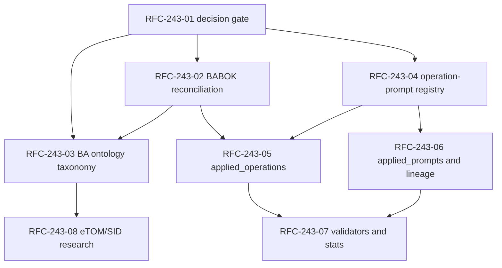

# Бэклог Mango BA Prompts

Этот файл — операционный бэклог и единый трекер открытых вопросов проекта.
Он не реализует продуктовые, governance- или run-артефакты сам по себе:
исполнение идёт через отдельные reviewable issues и pull requests.

Сначала показаны рабочие и запланированные спринты, чтобы пользователь видел
оперативные решения без прокрутки через архив.
Исторические данные вынесены ниже инструкций и сохраняются для аудита,
зависимостей и проверки статусов.

## Содержание

- [Рабочие спринты](#рабочие-спринты)
  - [Приоритетный спринт: RFC-243 BA-процессы и observability](#приоритетный-спринт-rfc-243-ba-процессы-и-observability)
  - [Запланированный спринт: Открытые вопросы](#запланированный-спринт-открытые-вопросы)
  - [Служебный спринт: управление бэклогом](#служебный-спринт-управление-бэклогом)
- [Инструкции по управлению бэклогом](#инструкции-по-управлению-бэклогом)
  - [Правила чтения и ведения](#правила-чтения-и-ведения)
  - [Зависимости и контракты](#зависимости-и-контракты)
  - [Промпты для создания issue по спринту](#промпты-для-создания-issue-по-спринту)
- [Исторические спринты](#исторические-спринты)
  - [Завершённый спринт: Backlog governance #247](#завершённый-спринт-backlog-governance-247)
  - [Завершённый спринт: Migration Phase 1](#завершённый-спринт-migration-phase-1)
- [Связанные артефакты](#связанные-артефакты)

## Рабочие спринты

| Спринт | Роль в управлении | Статус | Подтверждение |
| --- | --- | --- | --- |
| RFC-243 BA-процессы и observability | Приоритетный рабочий спринт | Активен в tracking issues fork | [RFC-243](rfc/ba-processes-observability-implementation-proposal.md), [PR #244](https://github.com/G-Ivan-A/mango_ba_prompts/pull/244) |
| Открытые вопросы | Запланированный triage-спринт | Активен, задачи ожидают решения или отдельного issue | [session digest rule](session-digests.md), [AI governance](../AI_GOVERNANCE.md) |
| Управление бэклогом | Служебный спринт текущего PR | В review по issue #250 | [Issue #250](https://github.com/G-Ivan-A/mango_ba_prompts/issues/250), [PR #251](https://github.com/G-Ivan-A/mango_ba_prompts/pull/251) |

### Приоритетный спринт: RFC-243 BA-процессы и observability

Источник: Issue #243, merged [PR #244](https://github.com/G-Ivan-A/mango_ba_prompts/pull/244)
и [RFC-243](rfc/ba-processes-observability-implementation-proposal.md).
При подготовке RFC-243 upstream token имел только `READ`-доступ, поэтому
исполняемые tracking issues созданы в fork `konard/G-Ivan-A-mango_ba_prompts`.
Если maintainers требуют upstream tracking, создайте те же строки как upstream
issues с labels `priority:P1`, `priority:P2`, `priority:P3`, `type:decision`,
`type:implementation`, `type:research`, `governance`, `ba-processes`,
`observability` и `sprint-3`.

Политика волн:

- **Волна 0 / Wave 0** — decision gate.
- **Волна 1 / Wave 1** — сверка process и taxonomy.
- **Волна 2 / Wave 2** — mapping и execution metadata.
- **Волна 3 / Wave 3** — enforcement и domain follow-up.
- Dependency mode: `RFC-243-01` is `independent`; all later rows are
  `dependent` on one or more previous rows.

| ID | Название | Тип | Приоритет | Статус | Блокируется | Блокирует | Подтверждение |
| --- | --- | --- | --- | --- | --- | --- | --- |
| RFC-243-01 | Зафиксировать RFC-243 governance proposal | decision | P1 | TODO | none | RFC-243-02, RFC-243-03, RFC-243-04 | [fork issue #1](https://github.com/konard/G-Ivan-A-mango_ba_prompts/issues/1); upstream [issue #243](https://github.com/G-Ivan-A/mango_ba_prompts/issues/243) is closed |
| RFC-243-02 | Сверить `00-index.md` с BABOK-операциями | implementation | P1 | BLOCKED | RFC-243-01 | RFC-243-03, RFC-243-05 | [fork issue #3](https://github.com/konard/G-Ivan-A-mango_ba_prompts/issues/3) |
| RFC-243-03 | Обновить БА-онтологию для atomic-composite taxonomy | implementation | P1 | BLOCKED | RFC-243-01, RFC-243-02 | RFC-243-08 | [fork issue #4](https://github.com/konard/G-Ivan-A-mango_ba_prompts/issues/4) |
| RFC-243-04 | Создать L2-реестр operation-prompt mapping | implementation | P1 | BLOCKED | RFC-243-01 | RFC-243-05, RFC-243-06 | [fork issue #2](https://github.com/konard/G-Ivan-A-mango_ba_prompts/issues/2) |
| RFC-243-05 | Добавить `applied_operations` в generation contracts | implementation | P1 | BLOCKED | RFC-243-02, RFC-243-04 | RFC-243-07 | [fork issue #5](https://github.com/konard/G-Ivan-A-mango_ba_prompts/issues/5) |
| RFC-243-06 | Добавить `applied_prompts` и lineage в runs contract | implementation | P1 | BLOCKED | RFC-243-04 | RFC-243-07 | [fork issue #6](https://github.com/konard/G-Ivan-A-mango_ba_prompts/issues/6) |
| RFC-243-07 | Обновить валидаторы и статистику под трассируемость | implementation | P2 | BLOCKED | RFC-243-05, RFC-243-06 | none | [fork issue #7](https://github.com/konard/G-Ivan-A-mango_ba_prompts/issues/7) |
| RFC-243-08 | Оценить eTOM/SID как доменные БА-артефакты | research | P3 | BLOCKED | RFC-243-03 | none | [fork issue #8](https://github.com/konard/G-Ivan-A-mango_ba_prompts/issues/8) |



### Запланированный спринт: Открытые вопросы

Открытые вопросы остаются элементами бэклога, пока их не заменит human decision,
issue, RFC, ADR или стандарт.

| ID | Название | Тип | Приоритет | Статус | Блокируется | Блокирует | Подтверждение |
| --- | --- | --- | --- | --- | --- | --- | --- |
| OQ-001 | Решить, нужна ли зеркальная метка `spoke-candidate` в Hub | question | P3 | TODO | none | none | [docs/rfc-hub-integration.md](../docs/rfc-hub-integration.md) |
| OQ-002 | Решить, threshold C1 равен двум приложениям или трём | question | P2 | TODO | none | none | [docs/rfc-hub-integration.md](../docs/rfc-hub-integration.md) |
| OQ-003 | Проверить метрики experiment log standard на следующих экспериментах | question | P2 | TODO | none | none | [standards/experiment-log-standard.md](../standards/experiment-log-standard.md), issue #101 context |
| OQ-004 | Решить уточнения онтологии из трека анализа experiment 1027 | question | P2 | TODO | none | none | [docs/analysis/2026-06-16-experiment-1027-analysis.md](../docs/analysis/2026-06-16-experiment-1027-analysis.md) |

### Служебный спринт: управление бэклогом

Источник: [Issue #250](https://github.com/G-Ivan-A/mango_ba_prompts/issues/250)
и [PR #251](https://github.com/G-Ivan-A/mango_ba_prompts/pull/251).
Этот спринт фиксирует текущую перестройку формата бэклога под чтение и
оперативное управление.

| ID | Название | Тип | Приоритет | Статус | Блокируется | Блокирует | Подтверждение |
| --- | --- | --- | --- | --- | --- | --- | --- |
| BKL-250-01 | Перевести бэклог на русскую навигацию и содержание | governance | P1 | REVIEW | none | BKL-250-02, BKL-250-03 | [issue #250](https://github.com/G-Ivan-A/mango_ba_prompts/issues/250), section `Содержание` |
| BKL-250-02 | Переставить рабочие спринты выше инструкций и истории | governance | P1 | REVIEW | BKL-250-01 | BKL-250-03 | [issue #250](https://github.com/G-Ivan-A/mango_ba_prompts/issues/250), section `Рабочие спринты` |
| BKL-250-03 | Добавить инструкции и промпты для создания issue по спринту | governance | P1 | REVIEW | BKL-250-02 | BKL-250-04 | Section `Инструкции по управлению бэклогом` |
| BKL-250-04 | Закрепить формат регрессионным валидатором | implementation | P2 | REVIEW | BKL-250-03 | none | [scripts/validate_issue_250_backlog_user_format.py](../scripts/validate_issue_250_backlog_user_format.py), CHANGELOG.md |

## Инструкции по управлению бэклогом

### Правила чтения и ведения

`governance/BACKLOG.md` хранит работу, которая ещё не лучше представлена
каноническим стандартом, RFC, ADR, run-артефактом или GitHub issue. Строка может
ссылаться на issue, но остаётся полезной как общий вид последовательности,
зависимостей и подтверждений.

Каждая строка бэклога использует эту схему:

| Поле | Правило |
| --- | --- |
| `ID` | Стабильный ID. Префиксы: `M` migration, `OQ` open question, `RFC-243` implementation sprint, `BKL-247` / `BKL-250` backlog governance. |
| `Название` | Краткое действие или вопрос; scope не должен выходить за linked evidence. |
| `Тип` | Один из `implementation`, `decision`, `research`, `question`, `governance`. |
| `Приоритет` | `P1` блокирует sequencing или review; `P2` нужен, но не является немедленным gate; `P3` follow-up или research. Старый migration `P0` считается `P1`. |
| `Статус` | `TODO`, `IN PROGRESS`, `REVIEW`, `DONE`, `BLOCKED` или `DEFERRED`. |
| `Блокируется` | `none` или список row ID / external gates через запятую. |
| `Блокирует` | `none` или список row ID через запятую. |
| `Подтверждение` | Issue, PR, artifact, RFC или source document, который доказывает текущий статус строки. |

1. Новую работу добавляйте только в спринт. Если спринта ещё нет, добавьте её в
   `Запланированный спринт: Открытые вопросы` как `question` до triage.
2. Не смешивайте prose-only задачи и table-only элементы. Детали должны жить в
   linked issue, RFC, ADR или artifact.
3. У каждой строки должны быть приоритет, статус, зависимости, обратные
   зависимости и подтверждение. Для пустых зависимостей явно пишите `none`.
4. Обновляйте статус по evidence, а не по намерению. Закрытый issue или merged PR
   может подтверждать `DONE`; работа, выполненная только в открытом PR, остаётся
   `REVIEW`.
5. Используйте `P1/P2/P3` во всех спринтах. Не вводите локальные шкалы
   приоритетов внутри отдельного спринта.
6. Открытые вопросы остаются в этом файле, пока не превратятся в issues,
   стандарты, RFC, ADR или явные решения.

### Зависимости и контракты

ИИ-агенты перед изменением строк бэклога обязаны читать issue, latest comments,
связанный PR и evidence-артефакты. Для управления бэклогом действуют следующие
контракты и инструкции:

- [AI_GOVERNANCE.md](../AI_GOVERNANCE.md) — границы решений человека и AI.
- [AI_QUICK_RULES.md](../AI_QUICK_RULES.md) — быстрые правила работы агента.
- [CONTRIBUTING.md](../CONTRIBUTING.md) — workflow `issue → PR → review`.
- [governance/rfc-generation-contract.md](rfc-generation-contract.md) — когда
  backlog-элемент должен стать RFC.
- [governance/bcreq-fr-generation-contract.md](bcreq-fr-generation-contract.md) —
  когда backlog-элемент порождает BCREQ-FR артефакт.
- [runs/CONTRACT.md](../runs/CONTRACT.md) — когда работа должна оформляться как
  run с metadata, outputs и logs.
- [standards/executable-contract-standard.md](../standards/executable-contract-standard.md) —
  когда правило требует исполняемого валидатора.
- [scripts/validate_issue_247_backlog_contract.py](../scripts/validate_issue_247_backlog_contract.py)
  и [scripts/validate_issue_250_backlog_user_format.py](../scripts/validate_issue_250_backlog_user_format.py) —
  regression gates для структуры и удобства чтения бэклога.

### Промпты для создания issue по спринту

**Промпт: создание issue для элемента спринта**

```text
Создай GitHub issue в репозитории G-Ivan-A/mango_ba_prompts на основе строки спринта:
- Sprint:
- ID:
- Название:
- Тип:
- Приоритет:
- Блокируется:
- Блокирует:
- Подтверждение:

Сформируй issue на русском языке. Включи: проблему, цель, scope, Definition of Done,
зависимости, links на evidence и рекомендуемые labels в формате priority:P1,
type:implementation/type:decision/type:research/type:question, governance или domain label.
Не расширяй scope за пределы строки бэклога и linked evidence.
```

**Промпт: пакетное создание issue по спринту**

```text
По разделу спринта из governance/BACKLOG.md подготовь набор GitHub issues для
репозитория G-Ivan-A/mango_ba_prompts. Для каждой строки со статусом TODO или
BLOCKED создай отдельный issue draft: title, body, labels, dependencies, blocked-by,
acceptance criteria и ссылку на исходный ID строки. Сохрани порядок dependency graph:
сначала independent или decision gate, затем dependent implementation/research rows.
```

**Промпт: проверка готовности спринта к issue tracking**

```text
Проверь спринт в governance/BACKLOG.md перед созданием issues. Найди строки без
evidence, без явных dependencies, без priority:P1/P2/P3, с неоднозначным status или
с title, который выходит за scope linked artifacts. Верни список исправлений и не
создавай issue drafts, пока ошибки не устранены.
```

### Почему формат изменён

**Причина неконсистентности:** файл появился 2026-06-03 как execution plan для
Phase 1 migration с подробными narrative-задачами и локальными приоритетами
`P0/P1/P2`. Позже в него добавили open questions как checklist, а RFC-243
добавил implementation sprint как compact issue table. Каждый фрагмент был
локально полезен, но вместе они дали три формата: migration narrative, question
checklist и RFC sprint table.

**Индустриальная норма:** backlog tools разделяют work item и view. Durable item
имеет structured metadata; sprint, board, roadmap и question views — это
проекции над одним набором элементов.

- **GitHub Projects** treats a project as table, board, and roadmap over issues
  and pull requests, with custom fields, filtering, grouping, roadmaps, and
  automation:
  <https://docs.github.com/en/issues/planning-and-tracking-with-projects/learning-about-projects/about-projects>.
  GitHub fields support metadata such as priority, effort, dates, iterations,
  parent issues, and issue type:
  <https://docs.github.com/en/issues/planning-and-tracking-with-projects/understanding-fields>.
- **Jira Scrum backlog** groups work into backlog and sprints, supports ranking,
  sprint assignment, epics, versions, estimates, parent, assignee, and priority:
  <https://support.atlassian.com/jira-software-cloud/docs/use-your-scrum-backlog/>.
  Jira dependency views model `blocks` / `is blocked by` relationships:
  <https://support.atlassian.com/jira-software-cloud/docs/create-or-remove-dependencies-on-your-timeline/>.
- **Linear cycles** are time-boxed sets of planned work:
  <https://linear.app/docs/use-cycles>. Linear also groups backlog views by
  status, assignee, project, priority, and cycle:
  <https://linear.app/changelog/2022-05-26-combined-board-and-issue-view>.
- **Notion roadmap databases** emphasize a living database that tracks
  initiatives, dependencies, milestones, deliverables, stakeholders, metrics,
  and links back to research and documents:
  <https://www.notion.com/use-case/project-management/ai-product-roadmap>.
  Notion Projects templates include sprints, dependencies, issue tracking, and
  subtasks:
  <https://www.notion.com/templates/collections/project-management>.

## Исторические спринты

### Завершённый спринт: Backlog governance #247

Источник: [Issue #247](https://github.com/G-Ivan-A/mango_ba_prompts/issues/247)
и merged [PR #249](https://github.com/G-Ivan-A/mango_ba_prompts/pull/249).
Этот спринт нормализовал контракт строк и добавил первичный regression gate.

| ID | Название | Тип | Приоритет | Статус | Блокируется | Блокирует | Подтверждение |
| --- | --- | --- | --- | --- | --- | --- | --- |
| BKL-247-01 | Определить, почему форматы бэклога разошлись | governance | P1 | DONE | none | BKL-247-02, BKL-247-03 | Причина записана в section `Почему формат изменён`; [issue #247](https://github.com/G-Ivan-A/mango_ba_prompts/issues/247) |
| BKL-247-02 | Описать industry-normal backlog practice для проекта | research | P1 | DONE | BKL-247-01 | BKL-247-03 | Industry sources записаны в section `Почему формат изменён` |
| BKL-247-03 | Создать контракт строк и правила ведения бэклога | governance | P1 | DONE | BKL-247-01, BKL-247-02 | BKL-247-04, BKL-247-05 | Contract recorded in section `Правила чтения и ведения` |
| BKL-247-04 | Применить контракт к текущим строкам и RFC-243 задачам | governance | P1 | DONE | BKL-247-03 | BKL-247-05 | Normalized sprint tables in this backlog |
| BKL-247-05 | Добавить regression validator и changelog entry | implementation | P2 | DONE | BKL-247-03, BKL-247-04 | none | [scripts/validate_issue_247_backlog_contract.py](../scripts/validate_issue_247_backlog_contract.py), CHANGELOG.md |

### Завершённый спринт: Migration Phase 1

Источник: [migration strategy RFC](../docs/analysis/2026-06-02-migration-strategy-rfc.md),
[human review](../docs/reviews/migration-rfc-human-review-2026-06.md),
[migration issue registry](migration-issues-registry.md) и
[migration manifest](migration-manifest.md).

| ID | Название | Тип | Приоритет | Статус | Блокируется | Блокирует | Подтверждение |
| --- | --- | --- | --- | --- | --- | --- | --- |
| M-001 | Переписать `README.md` спока | implementation | P1 | DONE | none | none | [issue #28](https://github.com/G-Ivan-A/mango_ba_prompts/issues/28) closed 2026-06-04; [README.md](../README.md) |
| M-002 | Создать базовую структуру каталогов проекта | implementation | P1 | DONE | none | M-003, M-004, M-005, M-006 | [issue #29](https://github.com/G-Ivan-A/mango_ba_prompts/issues/29) closed 2026-06-04; repository structure |
| M-003 | Скопировать `standards/GLOSSARY.md` из Hub | implementation | P1 | DONE | M-002 | M-006 | [issue #30](https://github.com/G-Ivan-A/mango_ba_prompts/issues/30) closed 2026-06-04; [standards/GLOSSARY.md](../standards/GLOSSARY.md) |
| M-004 | Переименовать classification glossary в product classification contract | implementation | P1 | DONE | M-002 | M-006 | [issue #31](https://github.com/G-Ivan-A/mango_ba_prompts/issues/31) closed 2026-06-04; [standards/product-classification-contract.md](../standards/product-classification-contract.md) |
| M-005 | Перенести experiment evidence | implementation | P1 | DONE | M-002 | M-006 | [issue #32](https://github.com/G-Ivan-A/mango_ba_prompts/issues/32) closed 2026-06-04; outputs now live in [runs/](../runs/) |
| M-006 | Нормализовать legacy prompt metadata | implementation | P2 | DONE | M-002, M-003, M-004, M-005 | M-007, M-009 | [issue #33](https://github.com/G-Ivan-A/mango_ba_prompts/issues/33) closed 2026-06-05; [prompts/](../prompts/) |
| M-007 | Создать Hub research dependency registry | implementation | P2 | DONE | M-006 | none | [issue #34](https://github.com/G-Ivan-A/mango_ba_prompts/issues/34) closed 2026-06-05; [docs/hub-research-dependencies.md](../docs/hub-research-dependencies.md) |
| M-008 | Добавить temporary prompt workflow в `CONTRIBUTING.md` | governance | P1 | DONE | none | none | [issue #35](https://github.com/G-Ivan-A/mango_ba_prompts/issues/35) closed 2026-06-04; [CONTRIBUTING.md](../CONTRIBUTING.md) |
| M-009 | Создать migration manifest | governance | P3 | DONE | M-006 | none | [issue #36](https://github.com/G-Ivan-A/mango_ba_prompts/issues/36) closed 2026-06-05; [governance/migration-manifest.md](migration-manifest.md) |

## Связанные артефакты

- Текущая задача формата бэклога: <https://github.com/G-Ivan-A/mango_ba_prompts/issues/250>
- Подготовленный PR: <https://github.com/G-Ivan-A/mango_ba_prompts/pull/251>
- Предыдущая нормализация backlog contract: <https://github.com/G-Ivan-A/mango_ba_prompts/issues/247>,
  <https://github.com/G-Ivan-A/mango_ba_prompts/pull/249>
- RFC-243: [governance/rfc/ba-processes-observability-implementation-proposal.md](rfc/ba-processes-observability-implementation-proposal.md)
- Migration manifest: [governance/migration-manifest.md](migration-manifest.md)
- Правила проекта: [AI_GOVERNANCE.md](../AI_GOVERNANCE.md),
  [AI_QUICK_RULES.md](../AI_QUICK_RULES.md), [CONTRIBUTING.md](../CONTRIBUTING.md)
