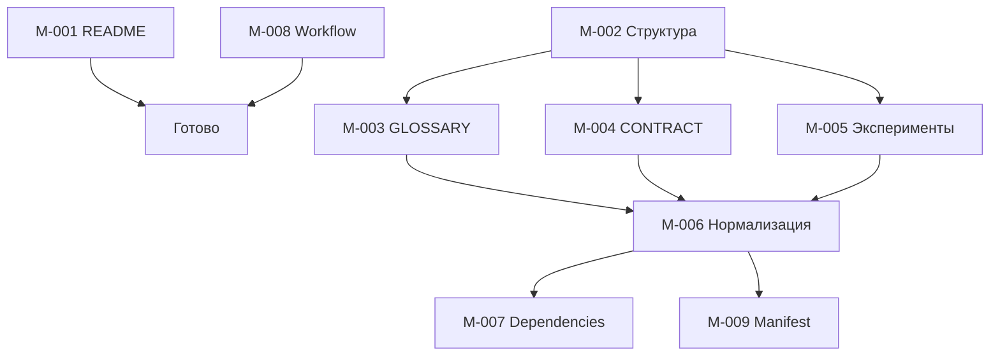

# BACKLOG: физическая миграция Mango из Хаба — Фаза 1

> 📋 **Это операционный план, а не реализация.** Документ разбивает утверждённую
> стратегию [`docs/analysis/migration-strategy-rfc.md`](../docs/analysis/migration-strategy-rfc.md)
> (v0.3, прошедшую Human Review —
> [`docs/reviews/migration-rfc-human-review-2026-06.md`](../docs/reviews/migration-rfc-human-review-2026-06.md))
> на атомарные задачи для физического переноса Фазы 1. Сам перенос **не
> выполняется** в рамках этой задачи — здесь только формируется бэклог.

## 1. Введение

### 1.1. Назначение

Этот файл — **операционный план миграции Фазы 1** проекта Mango из Хаба
(`hybrid-Intelligence-lab`, монорепо) в standalone-спок `mango_ba_prompts`.
Бэклог переводит фазовую стратегию RFC (раздел §3 «Предлагаемая стратегия
миграции») в исполняемый список атомарных задач: перенос стандартов, prompt
assets и продуктовых экспериментов, нормализацию frontmatter и создание единого
реестра зависимостей от исследований Хаба.

**Источник истины** — утверждённый
[`docs/analysis/migration-strategy-rfc.md`](../docs/analysis/migration-strategy-rfc.md).
Бэклог не вводит новых решений: каждая задача трассируется на конкретный раздел
RFC. Открытые вопросы Q1–Q4 (RFC §7) остаются на решение фаундера и не
переопределяются здесь.

### 1.2. Принципы ведения бэклога

- **Одна задача = один атомарный артефакт или действие.** Задача завершается
  созданием/изменением конкретного файла либо выполнением одного проверяемого
  действия.
- **Трассируемость.** Каждая задача ссылается на раздел RFC, который её
  обосновывает.
- **Anti-Inflation (RFC §1.2, P5).** Бэклог — один файл. Дополнительные
  документы-планы не создаются; каталоги создаются только под реальный артефакт.
- **Stop-factor.** Этот бэклог фиксирует *что* делать; *выполнение* задач
  начинается отдельными reviewable PR после снятия открытых вопросов Q1–Q4.

### 1.3. Условные обозначения

| Поле | Значение |
| :--- | :--- |
| **Приоритет** | `P0` — блокирует Фазу 1; `P1` — обязательно в Фазе 1, но не блокирует старт; `P2` — финализирующая часть Фазы 1. |
| **Статус** | `TODO` / `IN PROGRESS` / `REVIEW` / `DONE`. На момент создания бэклога — все `TODO`. |
| **Зависимости** | ID задач, которые должны быть `DONE` до старта данной. `—` — зависимостей нет. |

## 2. Сводная таблица задач

| ID | Название | Приоритет | Зависимости | Статус | Оценка |
|----|----------|-----------|-------------|--------|--------|
| M-001 | Переписать README.md спока | P0 | — | TODO | 1ч |
| M-002 | Создать базовую структуру папок проекта | P0 | — | TODO | 30мин |
| M-003 | Скопировать `standards/GLOSSARY.md` из Хаба | P0 | M-002 | TODO | 15мин |
| M-004 | Перенести и переименовать `classification-glossary` → `standards/product-classification-contract.md` | P0 | M-002 | TODO | 30мин |
| M-005 | Перенести эксперименты в `prompts/experiments/` | P0 | M-002 | TODO | 1ч |
| M-006 | Нормализовать промпты (7 полей frontmatter) | P1 | M-002, M-003, M-004 | TODO | 3ч |
| M-007 | Создать `docs/hub-research-dependencies.md` | P1 | M-006 | TODO | 1ч |
| M-008 | Добавить временный workflow в `CONTRIBUTING.md` | P0 | — | TODO | 30мин |
| M-009 | Создать Migration Manifest | P2 | M-006 | TODO | 30мин |

> Все 9 задач выведены из обязательных артефактов Фазы 1 (RFC §3.2, «Артефакты»)
> и сопровождающих разделов §3.5, §5. Дополнительные задачи не добавляются
> (режим `Structured`).

## 3. Детальное описание задач

### M-001: Переписать README.md спока

- **Приоритет:** P0 — **Зависимости:** — — **Оценка:** 1ч
- **Контекст:** RFC §3.2, подраздел «Переписка README.md спока (обязательная
  задача Фазы 1)»; таблица файлов Фазы 1 (строка `README.md` — действие «Не
  переносить», обновить навигацию); edge case E3 (§4).
- **Что сделать:**
  1. Переписать корневой `README.md` под спок: назначение проекта Mango BA
     Prompts.
  2. Описать структуру `prompts/` и `standards/`.
  3. Дать ссылку на временный workflow (`CONTRIBUTING.md`).
  4. Указать контакты / ответственных.
  5. Удалить все ссылки на Хаб, кроме `docs/hub-research-dependencies.md`.
- **DoD:**
  - [ ] `README.md` описывает назначение спока и структуру `prompts/`/`standards/`.
  - [ ] Нет hub-относительных и битых ссылок (`../../standards/...` и т. п.).
  - [ ] Единственная ссылка на Хаб — через `docs/hub-research-dependencies.md`.
  - [ ] Есть ссылка на `CONTRIBUTING.md` (временный workflow).
- **Артефакты:** `README.md`

### M-002: Создать базовую структуру папок проекта

- **Приоритет:** P0 — **Зависимости:** — — **Оценка:** 30мин
- **Контекст:** RFC §3.1, Edge Case E6.
- **Что сделать:**
  1. Создать каталоги: `prompts/`, `prompts/experiments/`, `prompts/archive/`,
     `standards/`, `kb/`, `docs/`, `docs/adr/`, `docs/audit/`.
  2. В каждом каталоге создать `.gitkeep` с поясняющим комментарием о
     назначении.
  3. **Обработка существующего `kb/glossary.md`:**
     - Если файл существует — удалить его (будет заменен копией из Хаба в
       M-003).
     - Каталог `kb/` сохранить — он предназначен для практик, примеров и
       справочников, НЕ для глоссария.
  4. Убедиться, что `standards/` создан как отдельный каталог для стандартов
     (глоссарий, контракт классификации).
- **DoD:**
  - [ ] Все 8 каталогов созданы с `.gitkeep`.
  - [ ] `kb/glossary.md` удалён (если существовал).
  - [ ] Каталог `kb/` существует и пуст (готов для будущих практик).
  - [ ] Каталог `standards/` существует и пуст (готов для M-003 и M-004).
- **Артефакты:** `prompts/`, `prompts/experiments/`, `prompts/archive/`,
  `standards/`, `kb/`, `docs/`, `docs/adr/`, `docs/audit/`

### M-003: Скопировать `standards/GLOSSARY.md` из Хаба

- **Приоритет:** P0 — **Зависимости:** M-002 — **Оценка:** 15мин
- **Контекст:** RFC §2.4 (внешний стандарт Хаба), таблица файлов Фазы 1 (§3.2,
  строка `standards/GLOSSARY.md` — «Копировать из Хаба»); принцип P2 (§1.2);
  edge case E6 / §4.1.
- **Что сделать:**
  1. Скопировать `standards/GLOSSARY.md` Хаба в `standards/GLOSSARY.md` спока.
  2. Добавить provenance: `source_hub` + `source_sha` (permalink-pinning, C3 /
     E7) во frontmatter или в шапку файла.
  3. Зафиксировать, что source of truth остаётся в Хабе; синхронизация — явное
     действие спока (P2).
- **DoD:**
  - [ ] Файл `standards/GLOSSARY.md` присутствует в споке.
  - [ ] Указаны `source_hub` и `source_sha` (permalink на коммит, не `main`).
  - [ ] Файл — словарь терминов; классификация в него не смешивается (E6).
- **Артефакты:** `standards/GLOSSARY.md`

### M-004: Перенести и переименовать `classification-glossary` → `standards/product-classification-contract.md`

- **Приоритет:** P0 — **Зависимости:** M-002 — **Оценка:** 30мин
- **Контекст:** RFC принцип P4 (§1.2), §2.3 (инвентарь), таблица файлов Фазы 1
  (§3.2); edge cases E2 и E6 / §4.1.
- **Что сделать:**
  1. Перенести `projects/mango/standards/classification-glossary.md` Хаба в
     `standards/product-classification-contract.md` спока (переименование).
  2. Внутренние ссылки на research заменить на `research_dep`/якоря реестра
     (`docs/hub-research-dependencies.md`, см. M-007 / E1, E8).
  3. Добавить взаимную ссылку на `standards/GLOSSARY.md` («Для значений терминов
     см. …», E6).
  4. Добавить provenance (`source_hub`, `source_sha`).
- **DoD:**
  - [ ] Файл размещён как `standards/product-classification-contract.md`
        (не в `kb/`, не как `glossary`).
  - [ ] Контракт ссылается на `standards/GLOSSARY.md`; слияние не выполнено (E6).
  - [ ] Ссылки на research идут через `research_dep`/реестр, не относительными
        путями (E1).
- **Артефакты:** `standards/product-classification-contract.md`

### M-005: Перенести эксперименты в `prompts/experiments/`

- **Приоритет:** P0 — **Зависимости:** M-002 — **Оценка:** 1ч
- **Контекст:** RFC §2.3 (5 экспериментов помечены «Переносим физически»), §2.6
  (сводка), таблица файлов Фазы 1 (§3.2); согласованная формулировка edge case
  E5 (§4.1): «Эксперименты = часть продукта».
- **Что сделать:**
  1. Перенести физически все 5 экспериментов из `projects/mango/experiments/`
     Хаба в `prompts/experiments/` спока:
     `tz-stats-prototype-2026-05.md`,
     `usecase_gen-stepwise-alignment_2026-05-26.md`,
     `user-story_gen-from-raw-request_2026-05-26.md`,
     `prompts-audit-2026-05-26.md`,
     `prompts-selftest-2026-05-26.md`.
  2. Не размещать `prompts-selftest-*` в корневом `experiments/` спока — только
     в `prompts/experiments/` (RFC §3.2).
  3. Если фактическое имя в snapshot отличается — заменить на подтверждённый
     Hub-путь (открытый вопрос Q1, RFC §7).
- **DoD:**
  - [ ] Все 5 экспериментов физически присутствуют в `prompts/experiments/`.
  - [ ] `prompts-selftest-2026-05-26.md` доступен как acceptance-сценарий для
        M-006 (self-test gate, C2).
  - [ ] Эксперименты не зарегистрированы как research-ссылки (они — часть
        продукта, E5).
- **Артефакты:** `prompts/experiments/*.md` (5 файлов)

### M-006: Нормализовать промпты (7 полей frontmatter)

- **Приоритет:** P1 — **Зависимости:** M-002, M-003, M-004 — **Оценка:** 3ч
- **Контекст:** RFC §3.2 («Чек-лист нормализации промпта»); креативное улучшение
  C1 (provenance + dependency frontmatter, §5); self-test gate C2.
- **Что сделать:**
  1. Перенести 6 промптов из `projects/mango/prompts/` Хаба в `prompts/`
     (нормализованные имена — открытый вопрос Q1, RFC §7).
  2. Для каждого файла добавить/обновить frontmatter, проверив наличие всех
     7 обязательных полей.
  3. Если `research_dep: none` — добавить комментарий о бизнес-задаче
     (RFC §3.5, правила реестра).
  4. Для `_exp`/canonical-вариантов — обеспечить явный раздел «ФОРМАТ ВЫВОДА».
- **DoD:**
  - [ ] Все промпты имеют валидный frontmatter с 7 полями: `status`, `version`,
        `updated`, `temperature`, `output_format`, `glossary_ref`,
        `research_dep`.
  - [ ] Нет промптов без `glossary_ref` или `research_dep`.
  - [ ] `temperature` указан явно.
  - [ ] Есть provenance: `source_hub`, `source_sha`, `based_on` (C1).
  - [ ] `_exp`/canonical-промпты содержат раздел «ФОРМАТ ВЫВОДА».
- **Артефакты:** `prompts/*.md` (6 промптов)

### M-007: Создать `docs/hub-research-dependencies.md`

- **Приоритет:** P1 — **Зависимости:** M-006 — **Оценка:** 1ч
- **Контекст:** RFC §3.5 (реестр зависимостей от исследований Хаба), §2.5
  (инвентарь research), креативное улучшение C4 (§5); edge cases E1, E8.
- **Что сделать:**
  1. Создать **единственный** файл-носитель реестра
     `docs/hub-research-dependencies.md` (⚠️ **не** создавать
     `hub-research-links.md` — RFC §3.5).
  2. Заголовок файла — `# Реестр зависимостей от исследований Хаба`.
  3. Заполнить таблицу по аудиту §2.5: `research/mango/*` → Hub-URL (permalink на
     SHA) + затронутые артефакты спока + статус синхронизации.
  4. Завести якоря (`#classification`, `#classification-tz`, `#taxonomy-concept`
     и т. д.), на которые ссылаются промпты и контракт через `research_dep`.
- **DoD:**
  - [ ] Файл `docs/hub-research-dependencies.md` создан как единая точка ссылок.
  - [ ] Файл `hub-research-links.md` НЕ создан (запрет дубля, RFC §3.5).
  - [ ] Каждый якорь имеет полный Hub-URL (permalink на SHA, C3) и список
        consumers.
  - [ ] Каждый promp/контракт с зависимостью ссылается на якорь через
        `research_dep` (E1, E8).
- **Артефакты:** `docs/hub-research-dependencies.md`

### M-008: Добавить временный workflow в `CONTRIBUTING.md`

- **Приоритет:** P0 — **Зависимости:** — — **Оценка:** 30мин
- **Контекст:** RFC §5.2 («Временный workflow промптов P0 — содержание для
  `CONTRIBUTING.md`»); креативное улучшение C5; edge case E4.
- **Что сделать:** добавить в `CONTRIBUTING.md` 5 нумерованных шагов временного
  workflow промптов (без ADR и матрицы):
  1. Создать файл в `prompts/drafts/` с именем `[biz-process]-[purpose].md`.
  2. Обязательный frontmatter: `status: draft`, `version: 0.1`,
     `updated: {{date}}`, `temperature: 0.1`.
  3. Добавить комментарий
     `<!-- Experimental: for [task/link], no formal research yet -->`.
  4. Создать issue `prompt:review` с бизнес-контекстом.
  5. После human review → переместить в `prompts/`, обновить `status: canonical`,
     `version: 1.0`.
- **DoD:**
  - [ ] В `CONTRIBUTING.md` присутствуют ровно 5 шагов workflow из RFC §5.2.
  - [ ] Workflow опирается на capability boundaries `prompts/drafts/`, не вводит
        матрицу/ADR (E4, C5).
  - [ ] Раздел согласован со структурой `prompts/` из M-002.
- **Артефакты:** `CONTRIBUTING.md`

### M-009: Создать Migration Manifest

- **Приоритет:** P2 — **Зависимости:** M-006 — **Оценка:** 30мин
- **Контекст:** RFC §5.1 (шаблон таблицы «артефакт → действие → статус →
  ссылка») и §5.3 (минимальный локальный чек-лист-трекер); креативное улучшение
  C6 (migration manifest как живой снимок).
- **Что сделать:**
  1. Создать migration manifest как живой снимок миграции по шаблонам §5.1/§5.3.
  2. Заполнять по ходу Фаз 0–3: «что перенесено / что осталось в Хабе / что
     архивировано» (включая архив-ссылку на монорепо-`README.md`, E3).
  3. Manifest **закрывается** в Фазе 3 как воспроизводимый снимок миграции.
- **DoD:**
  - [ ] Manifest содержит таблицу «артефакт → категория → действие → статус →
        назначение в споке» (§5.1).
  - [ ] Присутствует чек-лист-трекер «Перенесено / Осталось в Хабе / Требует
        уточнения» (§5.3).
  - [ ] Монорепо-`README.md` зафиксирован как `archived` (E3), research — как
        `referenced`.
- **Артефакты:** migration manifest (путь фиксируется при выполнении задачи)

## 4. Зависимости и критический путь

**Критический путь:** `M-002 → (M-003 ∥ M-004 ∥ M-005) → M-006 → (M-007 ∥
M-009)`. Задачи M-001 (README) и M-008 (workflow) независимы и могут идти
параллельно основному пути.

---

## Связанные артефакты

- Issue: <https://github.com/G-Ivan-A/mango_ba_prompts/issues/14>
- Утверждённый RFC: [`docs/analysis/migration-strategy-rfc.md`](../docs/analysis/migration-strategy-rfc.md)
- Human Review: [`docs/reviews/migration-rfc-human-review-2026-06.md`](../docs/reviews/migration-rfc-human-review-2026-06.md)
- Контракт и правила: [`AI_GOVERNANCE.md`](../AI_GOVERNANCE.md), [`AI_QUICK_RULES.md`](../AI_QUICK_RULES.md)
- Вклад и workflow: [`CONTRIBUTING.md`](../CONTRIBUTING.md)
</content>
</invoke>
