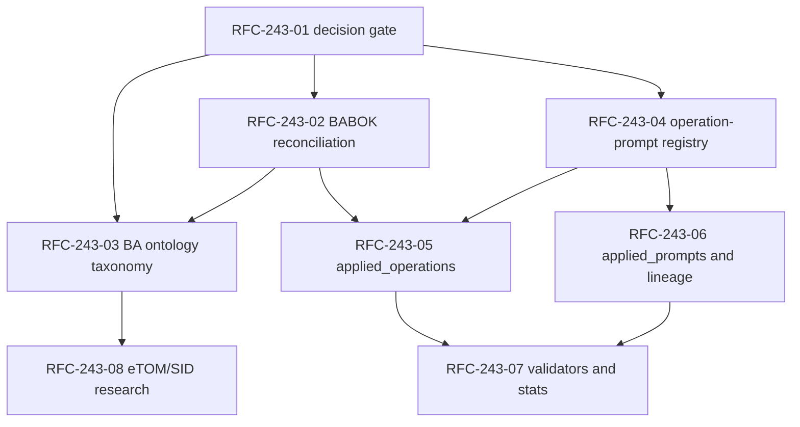

# BACKLOG: Mango BA Prompts

This file is the operational backlog and the single tracker for open project
questions. It does not implement product, governance, or run artifacts by
itself; implementation happens in separate reviewable issues and pull requests.

## 1. Backlog contract

### 1.1. Purpose

`governance/BACKLOG.md` keeps work that is not yet better represented by a
canonical standard, RFC, ADR, run artifact, or GitHub issue. A row may point to
an issue, but the row remains useful because it shows the project-wide sequence,
dependencies, and evidence in one place.

### 1.2. Root cause of inconsistency

**Причина неконсистентности:** the file started on 2026-06-03 as a Phase 1
migration execution plan with detailed task narratives and local `P0/P1/P2`
priorities. Later, open questions were appended as a checklist, and RFC-243
added an implementation sprint as a compact issue table. Those additions were
valid locally, but they used different units of work, fields, status semantics,
and priority scales. The result was one backlog file with three formats:
migration narrative, question checklist, and RFC sprint table.

### 1.3. Industry baseline

**Индустриальная норма:** backlog tools separate the work item from the view.
The durable item has structured metadata; sprint, board, roadmap, and question
views are projections over the same item set.

- **GitHub Projects** treats a project as table, board, and roadmap over issues
  and pull requests, with custom fields, filtering, grouping, roadmaps, and
  automation:
  <https://docs.github.com/en/issues/planning-and-tracking-with-projects/learning-about-projects/about-projects>.
  GitHub fields support metadata such as priority, effort, dates, iterations,
  parent issues, and issue type:
  <https://docs.github.com/en/issues/planning-and-tracking-with-projects/understanding-fields>.
- **Jira Scrum backlog** groups work into backlog and sprints, supports ranking,
  sprint assignment, epics, versions, estimates, parent, assignee, and priority:
  <https://support.atlassian.com/jira-software-cloud/docs/use-your-scrum-backlog/>.
  Jira dependency views model `blocks` / `is blocked by` relationships:
  <https://support.atlassian.com/jira-software-cloud/docs/create-or-remove-dependencies-on-your-timeline/>.
- **Linear cycles** are time-boxed sets of planned work:
  <https://linear.app/docs/use-cycles>. Linear also groups backlog views by
  status, assignee, project, priority, and cycle:
  <https://linear.app/changelog/2022-05-26-combined-board-and-issue-view>.
- **Notion roadmap databases** emphasize a living database that tracks
  initiatives, dependencies, milestones, deliverables, stakeholders, metrics,
  and links back to research and documents:
  <https://www.notion.com/use-case/project-management/ai-product-roadmap>.
  Notion Projects templates include sprints, dependencies, issue tracking, and
  subtasks:
  <https://www.notion.com/templates/collections/project-management>.

### 1.4. Project backlog format

The project keeps the Markdown backlog as the governance source of truth and
uses GitHub issues as executable tracking records when a task needs discussion,
labels, or independent PRs. This fits the current team size and traceability
needs: one reviewer can read the entire dependency graph without opening a
separate project-management tool, while issue links preserve audit trails.

Every backlog row uses this schema:

| Field | Rule |
| --- | --- |
| `ID` | Stable ID. Prefixes: `M` migration, `OQ` open question, `RFC-243` implementation sprint, `BKL-247` backlog governance. |
| `Title` | Imperative or question-like title; no hidden scope outside the linked evidence. |
| `Type` | One of `implementation`, `decision`, `research`, `question`, `governance`. |
| `Priority` | `P1` blocks sequencing or review; `P2` required but not an immediate gate; `P3` follow-up or research. Old migration `P0` maps to `P1`. |
| `Status` | `TODO`, `IN PROGRESS`, `REVIEW`, `DONE`, `BLOCKED`, or `DEFERRED`. |
| `Blocked by` | `none` or a comma-separated list of row IDs / external gates. |
| `Blocks` | `none` or a comma-separated list of row IDs. |
| `Evidence` | Issue, PR, artifact, RFC, or source document that proves the row's current state. |

### 1.5. Write and read rules

1. Add new work only under a sprint section. If the work has no sprint yet, add
   it to `Sprint: Open questions` as a `question` until it is triaged.
2. Do not mix prose-only task descriptions with table-only items. If a task
   needs details, put the details in the linked issue, RFC, ADR, or artifact.
3. Every item must have priority, status, dependencies, reverse dependencies,
   and evidence. Use `none` explicitly instead of an empty dependency cell.
4. Update status from evidence, not intent. Closed issues or merged PRs can
   support `DONE`; work completed only in an open PR is `REVIEW`.
5. Use `P1/P2/P3` everywhere. Do not introduce local priority scales inside a
   sprint.
6. Keep open questions in this file until they become issues, standards, RFCs,
   ADRs, or explicit decisions.

## 2. Sprint index

| Sprint | Scope | Status | Evidence |
| --- | --- | --- | --- |
| Migration Phase 1 | Physical migration from Hub to standalone spoke | Closed as backlog items; historical manifest remains draft | [migration RFC](../docs/analysis/2026-06-02-migration-strategy-rfc.md), [manifest](migration-manifest.md) |
| Open questions | Cross-cutting unresolved governance questions | Active | [session digest rule](session-digests.md), [AI governance](../AI_GOVERNANCE.md) |
| RFC-243 BA processes and observability | Proposal-backed implementation sequence after issue #243 | Active in fork tracking issues | [RFC-243](rfc/ba-processes-observability-implementation-proposal.md), [PR #244](https://github.com/G-Ivan-A/mango_ba_prompts/pull/244) |
| Backlog governance | Normalize this backlog and add contract validation | In PR review | [Issue #247](https://github.com/G-Ivan-A/mango_ba_prompts/issues/247), [PR #249](https://github.com/G-Ivan-A/mango_ba_prompts/pull/249) |

## 3. Sprint: Migration Phase 1

Source: [migration strategy RFC](../docs/analysis/2026-06-02-migration-strategy-rfc.md),
[human review](../docs/reviews/migration-rfc-human-review-2026-06.md),
[migration issue registry](migration-issues-registry.md), and
[migration manifest](migration-manifest.md).

| ID | Title | Type | Priority | Status | Blocked by | Blocks | Evidence |
| --- | --- | --- | --- | --- | --- | --- | --- |
| M-001 | Rewrite spoke README.md | implementation | P1 | DONE | none | none | [issue #28](https://github.com/G-Ivan-A/mango_ba_prompts/issues/28) closed 2026-06-04; [README.md](../README.md) |
| M-002 | Create base project directory structure | implementation | P1 | DONE | none | M-003, M-004, M-005, M-006 | [issue #29](https://github.com/G-Ivan-A/mango_ba_prompts/issues/29) closed 2026-06-04; repository structure |
| M-003 | Copy standards/GLOSSARY.md from Hub | implementation | P1 | DONE | M-002 | M-006 | [issue #30](https://github.com/G-Ivan-A/mango_ba_prompts/issues/30) closed 2026-06-04; [standards/GLOSSARY.md](../standards/GLOSSARY.md) |
| M-004 | Rename classification glossary to product classification contract | implementation | P1 | DONE | M-002 | M-006 | [issue #31](https://github.com/G-Ivan-A/mango_ba_prompts/issues/31) closed 2026-06-04; [standards/product-classification-contract.md](../standards/product-classification-contract.md) |
| M-005 | Migrate experiment evidence | implementation | P1 | DONE | M-002 | M-006 | [issue #32](https://github.com/G-Ivan-A/mango_ba_prompts/issues/32) closed 2026-06-04; outputs now live in [runs/](../runs/) |
| M-006 | Normalize legacy prompt metadata | implementation | P2 | DONE | M-002, M-003, M-004, M-005 | M-007, M-009 | [issue #33](https://github.com/G-Ivan-A/mango_ba_prompts/issues/33) closed 2026-06-05; [prompts/](../prompts/) |
| M-007 | Create Hub research dependency registry | implementation | P2 | DONE | M-006 | none | [issue #34](https://github.com/G-Ivan-A/mango_ba_prompts/issues/34) closed 2026-06-05; [docs/hub-research-dependencies.md](../docs/hub-research-dependencies.md) |
| M-008 | Add temporary prompt workflow to CONTRIBUTING.md | governance | P1 | DONE | none | none | [issue #35](https://github.com/G-Ivan-A/mango_ba_prompts/issues/35) closed 2026-06-04; [CONTRIBUTING.md](../CONTRIBUTING.md) |
| M-009 | Create migration manifest | governance | P3 | DONE | M-006 | none | [issue #36](https://github.com/G-Ivan-A/mango_ba_prompts/issues/36) closed 2026-06-05; [governance/migration-manifest.md](migration-manifest.md) |

## 4. Sprint: Open questions

Open questions are backlog items until a human decision, issue, RFC, ADR, or
standard supersedes them.

| ID | Title | Type | Priority | Status | Blocked by | Blocks | Evidence |
| --- | --- | --- | --- | --- | --- | --- | --- |
| OQ-001 | Decide whether Hub needs mirrored `spoke-candidate` label | question | P3 | TODO | none | none | [docs/rfc-hub-integration.md](../docs/rfc-hub-integration.md) |
| OQ-002 | Decide whether threshold C1 should be two applications or three | question | P2 | TODO | none | none | [docs/rfc-hub-integration.md](../docs/rfc-hub-integration.md) |
| OQ-003 | Validate experiment log standard metrics on the next experiments | question | P2 | TODO | none | none | [standards/experiment-log-standard.md](../standards/experiment-log-standard.md), issue #101 context |
| OQ-004 | Decide ontology refinements from experiment 1027 analysis track | question | P2 | TODO | none | none | [docs/analysis/2026-06-16-experiment-1027-analysis.md](../docs/analysis/2026-06-16-experiment-1027-analysis.md) |

## Sprint RFC-243: BA processes and observability

Source: Issue #243, merged [PR #244](https://github.com/G-Ivan-A/mango_ba_prompts/pull/244),
and [RFC-243](rfc/ba-processes-observability-implementation-proposal.md). The
current upstream token had `READ` access when RFC-243 was prepared, so executable
tracking issues were created in the fork
`konard/G-Ivan-A-mango_ba_prompts`. If maintainers require upstream tracking,
recreate the same rows as upstream issues with labels `priority:P1`,
`priority:P2`, `priority:P3`, `type:decision`, `type:implementation`,
`type:research`, `governance`, `ba-processes`, `observability`, and `sprint-3`.

Wave policy:

- **Волна 0 / Wave 0** is the decision gate.
- **Волна 1 / Wave 1** reconciles process and taxonomy.
- **Волна 2 / Wave 2** adds mapping and execution metadata.
- **Волна 3 / Wave 3** adds enforcement and domain follow-up.
- Dependency mode: `RFC-243-01` is `independent`; all later rows are
  `dependent` on one or more previous rows.

| ID | Title | Type | Priority | Status | Blocked by | Blocks | Evidence |
| --- | --- | --- | --- | --- | --- | --- | --- |
| RFC-243-01 | decision: зафиксировать RFC-243 governance proposal | decision | P1 | TODO | none | RFC-243-02, RFC-243-03, RFC-243-04 | [fork issue #1](https://github.com/konard/G-Ivan-A-mango_ba_prompts/issues/1); upstream [issue #243](https://github.com/G-Ivan-A/mango_ba_prompts/issues/243) is closed |
| RFC-243-02 | implementation: сверить 00-index.md с BABOK-операциями | implementation | P1 | BLOCKED | RFC-243-01 | RFC-243-03, RFC-243-05 | [fork issue #3](https://github.com/konard/G-Ivan-A-mango_ba_prompts/issues/3) |
| RFC-243-03 | implementation: обновить БА-онтологию для atomic-composite taxonomy | implementation | P1 | BLOCKED | RFC-243-01, RFC-243-02 | RFC-243-08 | [fork issue #4](https://github.com/konard/G-Ivan-A-mango_ba_prompts/issues/4) |
| RFC-243-04 | implementation: создать L2-реестр operation-prompt mapping | implementation | P1 | BLOCKED | RFC-243-01 | RFC-243-05, RFC-243-06 | [fork issue #2](https://github.com/konard/G-Ivan-A-mango_ba_prompts/issues/2) |
| RFC-243-05 | implementation: добавить applied_operations в generation contracts | implementation | P1 | BLOCKED | RFC-243-02, RFC-243-04 | RFC-243-07 | [fork issue #5](https://github.com/konard/G-Ivan-A-mango_ba_prompts/issues/5) |
| RFC-243-06 | implementation: добавить applied_prompts и lineage в runs contract | implementation | P1 | BLOCKED | RFC-243-04 | RFC-243-07 | [fork issue #6](https://github.com/konard/G-Ivan-A-mango_ba_prompts/issues/6) |
| RFC-243-07 | implementation: обновить валидаторы и статистику под трассируемость | implementation | P2 | BLOCKED | RFC-243-05, RFC-243-06 | none | [fork issue #7](https://github.com/konard/G-Ivan-A-mango_ba_prompts/issues/7) |
| RFC-243-08 | research: оценить eTOM/SID как доменные БА-артефакты | research | P3 | BLOCKED | RFC-243-03 | none | [fork issue #8](https://github.com/konard/G-Ivan-A-mango_ba_prompts/issues/8) |

## 6. Sprint: Backlog governance

Source: [Issue #247](https://github.com/G-Ivan-A/mango_ba_prompts/issues/247)
and [PR #249](https://github.com/G-Ivan-A/mango_ba_prompts/pull/249). This
sprint exists to normalize the backlog itself; rows stay `REVIEW` until PR #249
is merged.

| ID | Title | Type | Priority | Status | Blocked by | Blocks | Evidence |
| --- | --- | --- | --- | --- | --- | --- | --- |
| BKL-247-01 | Determine why backlog formats diverged | governance | P1 | REVIEW | none | BKL-247-02, BKL-247-03 | Root cause recorded in section 1.2; [issue #247](https://github.com/G-Ivan-A/mango_ba_prompts/issues/247) |
| BKL-247-02 | Define industry-normal backlog practice for this project | research | P1 | REVIEW | BKL-247-01 | BKL-247-03 | Industry sources recorded in section 1.3 |
| BKL-247-03 | Create backlog contract and rules | governance | P1 | REVIEW | BKL-247-01, BKL-247-02 | BKL-247-04, BKL-247-05 | Contract recorded in sections 1.4 and 1.5 |
| BKL-247-04 | Apply the contract to current backlog rows and RFC-243 tasks | governance | P1 | REVIEW | BKL-247-03 | BKL-247-05 | Normalized sprint tables in sections 3 through 6 |
| BKL-247-05 | Add regression validator and changelog entry | implementation | P2 | REVIEW | BKL-247-03, BKL-247-04 | none | [scripts/validate_issue_247_backlog_contract.py](../scripts/validate_issue_247_backlog_contract.py), CHANGELOG.md |

## Related artifacts

- Backlog update issue: <https://github.com/G-Ivan-A/mango_ba_prompts/issues/247>
- Prepared pull request: <https://github.com/G-Ivan-A/mango_ba_prompts/pull/249>
- RFC-243: [governance/rfc/ba-processes-observability-implementation-proposal.md](rfc/ba-processes-observability-implementation-proposal.md)
- Migration manifest: [governance/migration-manifest.md](migration-manifest.md)
- Project rules: [AI_GOVERNANCE.md](../AI_GOVERNANCE.md), [AI_QUICK_RULES.md](../AI_QUICK_RULES.md), [CONTRIBUTING.md](../CONTRIBUTING.md)
