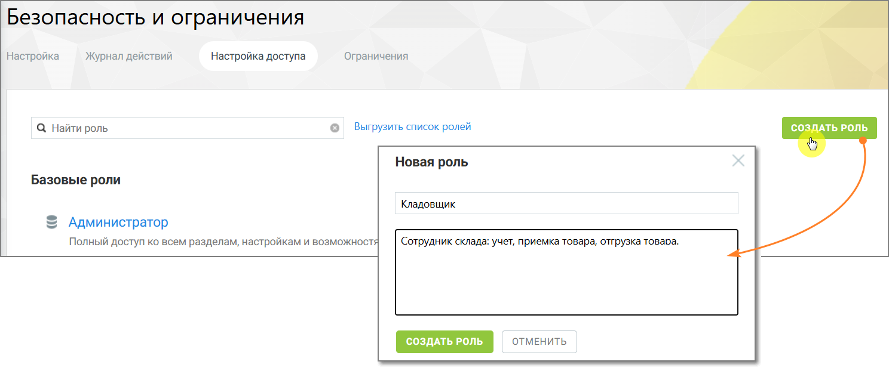

# 3.2. Создание роли

> Трассировка: PDF §3.2 · сквозные стр. 8-9 · источники: ч.1 `kb/mango-product-docs/sources/Rolevaya-model-vats/Rolevaya-model-VATS_1_26_08.pdf` с.8-9.

Создание роли позволяет определить новый набор прав доступа для пользователей системы. внимание Создавать роли могут только пользователи, обладающие правом доступа «Создать роль». Создать пользовательскую роль можно с помощью кнопки «Создать роль». Этот способ используется, если требуется создать роль с полностью уникальным набором прав. внимание Роль, созданная таким образом, изначально не имеет никаких прав доступа. После создания необходимо включить нужные права, чтобы пользователи могли выполнять свои задачи.

Рисунок 2. Как работает кнопка «Создать роль» Чтобы создать роль: • откройте раздел Настройки АТС → Безопасность и ограничения • нажмите кнопку Создать роль • укажите название роли • при необходимости укажите описание роли • настройте права доступа роли • нажмите Сохранить Роли и права доступа | v. 1.26.08 8

| 8 800 555 55 22, mango-office.ru |  |
| --- | --- |
|  | mango@mangotele.com |
