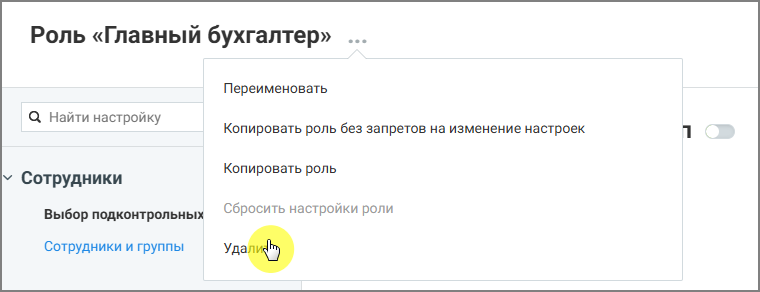

# 3.4. Удаление роли

> Трассировка: PDF §3.4 · сквозные стр. 12 · источники: ч.1 `kb/mango-product-docs/sources/Rolevaya-model-vats/Rolevaya-model-VATS_1_26_08.pdf` с.12.

Удалить можно только пользовательские роли. Системные роли удалить нельзя. Чтобы удалить роль: • откройте список ролей • выберите роль, которую необходимо удалить • выберите действие Удалить роль • подтвердите удаление

Рисунок 7. Удаление роли После удаления роль становится недоступной для назначения пользователям.
