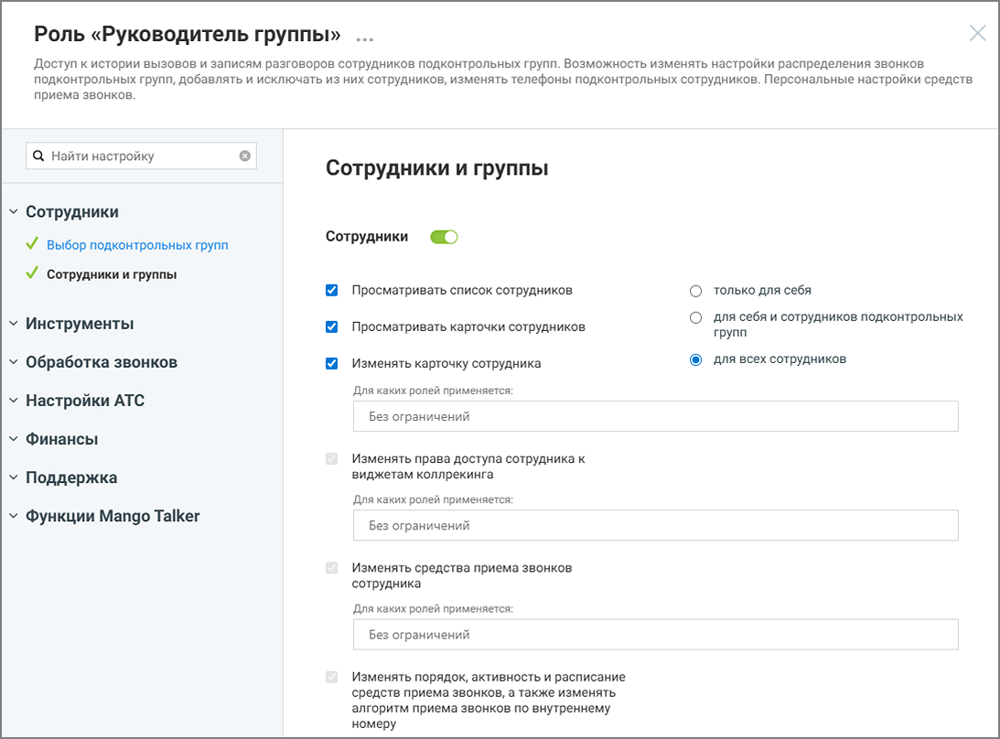

# 4. Настройка прав доступа роли

> Трассировка: PDF §4 · сквозные стр. 14-16 · источники: ч.1 `kb/mango-product-docs/sources/Rolevaya-model-vats/Rolevaya-model-VATS_1_26_08.pdf` с.14-16.

роли Права доступа роли определяют, какие действия доступны пользователям с этой ролью и к каким разделам системы они могут получить доступ. Если право включено - выполнение соответствующего действия разрешено. Если право отключено - выполнение функции недоступно. При настройке некоторых прав доступа также можно указать, над сотрудниками с какими ролями разрешено выполнение действия. Для этого выбираются роли целевых сотрудников — действие будет доступно только в том случае, если сотрудник, на которого оно направлено, обладает ролью из списка ролей параметра доступа. Если установлено значение «Без ограничений», то принадлежность роли сотрудника, над которым производится действие не проверяется. Настройка прав доступа выполняется при создании роли или при редактировании существующей роли.

Рисунок 9. Настройка прав доступа для роли Чтобы изменить права доступа роли: • откройте раздел Настройки АТС → Безопасность и ограничения → Настройка доступа Роли и права доступа | v. 1.26.08 14

| 8 800 555 55 22, mango-office.ru |  |
| --- | --- |
|  | mango@mangotele.com |

• выберите роль, права доступа которой необходимо изменить • включите или отключите необходимые права доступа и ограничения • настройте параметры прав доступа (при необходимости) • нажмите Сохранить. внимание После сохранения изменения применяются ко всем пользователям, которым назначена эта роль. Некоторые права доступа могут зависеть от других прав. В этом случае изменение одного права может автоматически изменить состояние другого права. При редактировании прав в интерфейсе Личного кабинета ВАТС в таких случаях отображаются подсказки. Также часть прав может быть недоступна для изменения и отображаться в режиме только чтения. Такие права устанавливаются системой и не могут быть изменены вручную. Статусы прав доступа в разрезе возможностей подключения:

- право доступно, но не подключено

- право доступно и подключено

- возможность подключения зависит от активности какого-либо из предыдущих прав доступа

- право недоступно для подключения

- право подключено и недоступно для отключения

Иконка рядом с названием раздела означает, что для роли включена возможность доступа хотя бы к одной функции этого раздела. Если иконка отсутствует, доступ к функциям раздела для данной роли не предоставлен.

Рисунок 10. Иконки доступа к разделам Роли и права доступа | v. 1.26.08 15

| 8 800 555 55 22, mango-office.ru |  |
| --- | --- |
|  | mango@mangotele.com |

Переключатель состояния прав доступа раздела может иметь следующий вид:

- все права доступа к разделу для данной роли отключены

- права доступа доступны для подключения

- все права доступа отключены и недоступны для подключения

- все права доступа включены и недоступны для отключения
