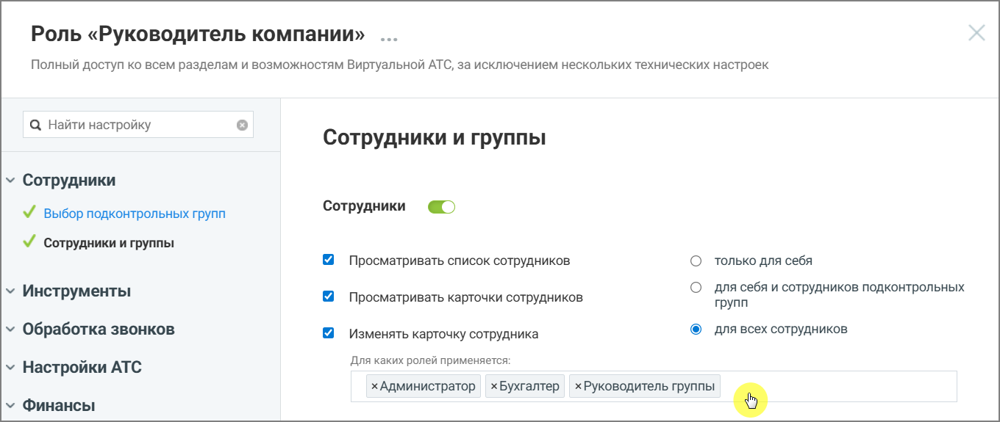
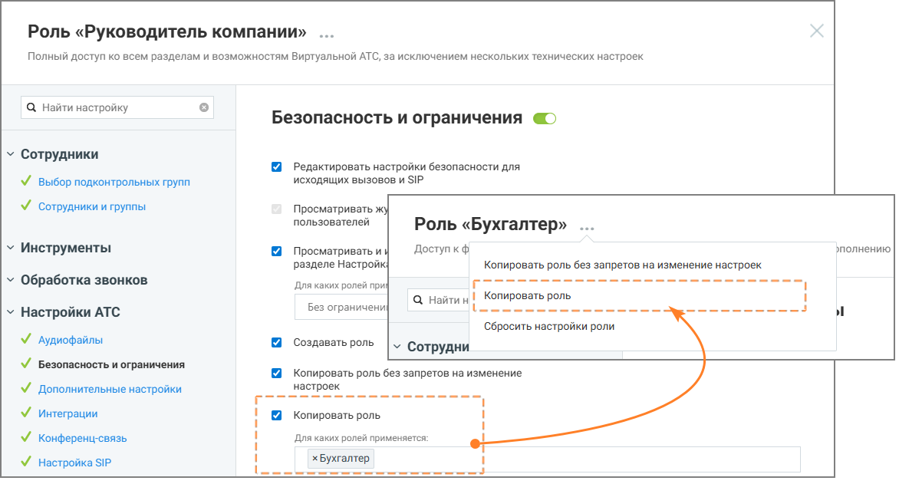

# 4.1. Гибкая настройка прав доступа с учетом ролей объекта

> Трассировка: PDF §4.1 · сквозные стр. 16-19 · источники: ч.1 `kb/mango-product-docs/sources/Rolevaya-model-vats/Rolevaya-model-VATS_1_26_08.pdf` с.16-19.

учетом ролей объекта Существует возможность тонкой настройки для ряда существующих опций. При активации некоторых разрешений можно ограничить их действие не только уровнем влияния (на себя, подчиненных или всех), но и конкретным списком ролей объекта. Под объектом подразумевается роль пользователя, над которым производится действие, ограниченное доступом. Как это работает: вы включаете настройку (например, «Изменять карточку сотрудника») и выбираете уровень влияния «Для всех сотрудников». Дополнительно вы можете указать, для сотрудников с какими ролями будет доступно это действие. При настройке вам доступны следующие варианты: • Без ограничений — настройка активна для всех сотрудников, независимо от их роли. • Выбор одной или нескольких ролей из списка — действие будет разрешено только в случае, если сотрудник, в отношении которого выполняется действие, обладает ролью из заданного списка параметров права доступа. Для сотрудников с другими ролями данное действие будет запрещено.

Рисунок 11. Роль «Руководитель компании», настройка «Изменять карточку сотрудника» На рисунке 11 показан пример настройки прав доступа: пользователь с ролью Руководитель компании может изменять карточки только тех сотрудников, чьи роли указаны в настройках (Администратор, Бухгалтер, Руководитель группы). Изменение карточек сотрудников с иными ролями для него недоступно. Роли и права доступа | v. 1.26.08 16

| 8 800 555 55 22, mango-office.ru |  |
| --- | --- |
|  | mango@mangotele.com |

Рисунок 12. Роль «Руководитель компании». Настройка «Копировать роль» доступна для изменения Руководителем компании только для роли «Бухгалтер» На рисунке 12 показан пример настройки роли «Руководитель компании». У этой роли есть полный доступ ко всем разделам системы, а в блоке настроек «Копировать роль» задано ограничение: руководитель может копировать только роль Бухгалтер. Это означает, что сотрудник с ролью «Руководитель компании»: • сможет создать копию роли «Бухгалтер» (кнопка копирования будет активна); • не сможет скопировать никакие другие роли — при попытке это сделать система покажет уведомление об отсутствии прав. Роли и права доступа | v. 1.26.08 17

| 8 800 555 55 22, mango-office.ru |  |
| --- | --- |
|  | mango@mangotele.com |

Рисунок 13. Роль «Руководитель компании», настройки. На рисунке 13 пользователь с ролью Руководитель кампании имеет доступ к редактированию карточки сотрудника пользователям только с ролью Руководитель группы. Данная настройка (задание списка ролей) позволяет ограничивать не только список прав доступа, но и уточнять роль или перечень ролей объекта, над которым планируются действия, ограниченные правом доступа. . Роли и права доступа | v. 1.26.08 18

| 8 800 555 55 22, mango-office.ru |  |
| --- | --- |
|  | mango@mangotele.com |
