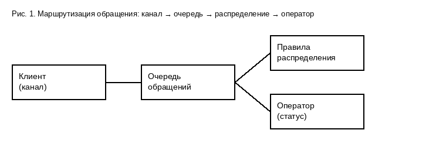

# 4. Обработка обращений

> Трассировка: PDF §4 · сквозные стр. 5 · источники: ч.1 `kb/mango-product-docs/sources/contact-center-manual-sample/CC_manual_sample.fixture.pdf` с.5.

## 4.1 Контроль обращений

Контроль ведётся в разрезе вызовов и текстовых обращений на панели очереди.

## 4.2 Правила распределения

Задаётся максимальное количество текстовых обращений, которые может обрабатывать один сотрудник. При достижении показателя обращения не распределяются на сотрудника, пока он не закроет одно из текущих. Если указан 0 — обращения распределяются всегда. Доступны алгоритмы «на наименее загруженного оператора» и «равномерное распределение». Чекбокс «Не распределять текстовые обращения на операторов, которые находятся в звонке» — единственная сегодня кросс-канальная связь между голосом и текстом. Сквозного межканального счётчика и приоритета каналов нет.

## 4.3 Каналы обращений

Перечень подключённых каналов и их настройки задаются в Личном кабинете ВАТС.
