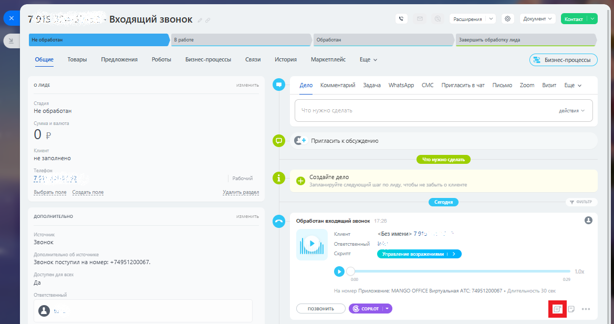
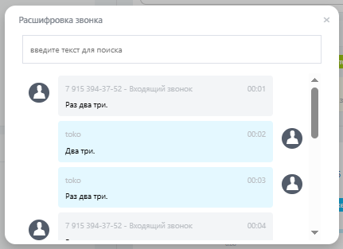

# Как посмотреть распознанный текст

> Трассировка: PDF §2.10 · сквозные стр. 86-87 · источники: ч.1 `kb/mango-product-docs/sources/integration-bitrix24/Mango_office_integration_Bitrix24.pdf` с.86-87.

Чтобы вывести на экран распознанный текст того или иного разговора, в Битрикс24 следует: 1) открыть лид; 2) кликнуть на ссылку "Показать расшифровку звонка":

3) посмотреть текст Речевой аналитики:

Интеграция Виртуальной АТС MANGO OFFICE и Битрикс24 | Версия от 03.03.2026
