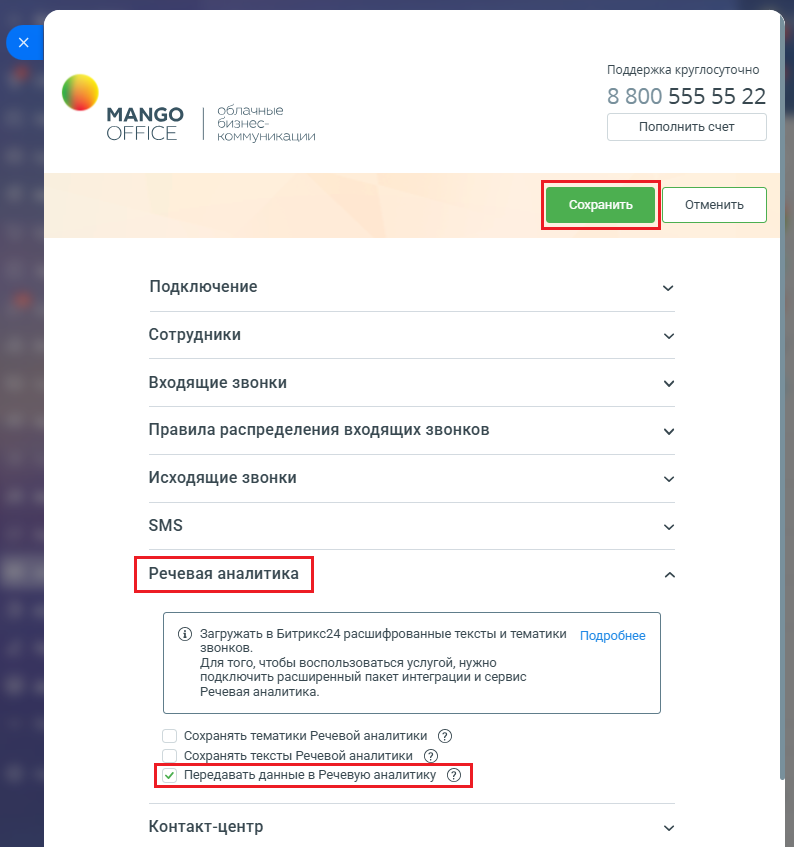

# Передача данных в Речевую аналитику

> Трассировка: PDF §2.10 · сквозные стр. 87-88 · источники: ч.1 `kb/mango-product-docs/sources/integration-bitrix24/Mango_office_integration_Bitrix24.pdf` с.87-88.

В отчетах сервиса "Речевая аналитика" MANGO OFFICE содержатся данные о звонках с записями разговоров, прошедших через вашу Виртуальную АТС. Если вы включите данную настройку, то в отчетах речевой аналитики в данных о звонках появится ссылки на соответствующие им сущности (контакт/компания/лид), созданные в вашем Битрикс24. Связанные записи отчетов речевой аналитики с сущностями Битрикс24, позволят вашим сотрудникам объединить все необходимые данные о звонках для анализа и работы с ними. Чтобы включить настройку, в вашем Битрикс24 необходимо: 1) откройте форму настройки приложения интеграции; 2) откройте блок "Речевая аналитика"; 3) установите галочку "Передавать данные в Речевую аналитику"; 4) нажмите кнопку "Сохранить" в верхней части формы настройки приложения интеграции:

Интеграция Виртуальной АТС MANGO OFFICE и Битрикс24 | Версия от 03.03.2026
