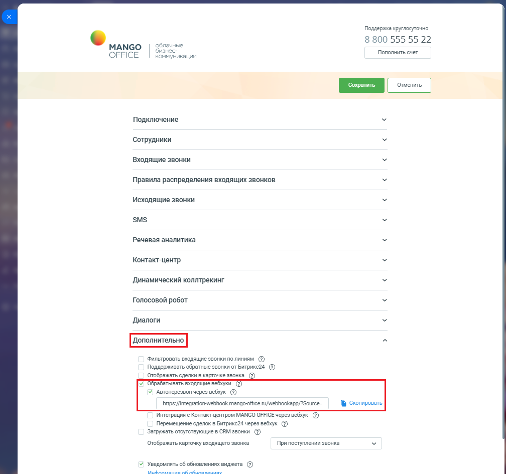

# Как включить автоперезвон через вебхук

> Трассировка: PDF §2.11 · сквозные стр. 89-90 · источники: ч.1 `kb/mango-product-docs/sources/integration-bitrix24/Mango_office_integration_Bitrix24.pdf` с.89-90.

В настройках интеграции MANGO OFFICE в блоке "Дополнительно", выполните следующие действия: 1) активируйте переключатель "Обрабатывать входящие вебхуки". Появятся дополнительные поля, в которых перечислены все входящие вебхуки; 2) активируйте переключатель "Автоперезвон через вебхук"; 3) нажмите на ссылку "Скопировать" в строке с данными вебхуков, чтобы скопировать URL-адрес вебхуков. Сохраните полученный URL (например, в блокнот); 4) сохраните настройки интеграции, нажав на кнопку "Сохранить" (расположена вверху окна настроек интеграции MANGO OFFICE):

Примечание. Теперь вам нужно настроить робота Битрикс24 на отправку вебхуков в приложение интеграции. Интеграция Виртуальной АТС MANGO OFFICE и Битрикс24 | Версия от 03.03.2026
