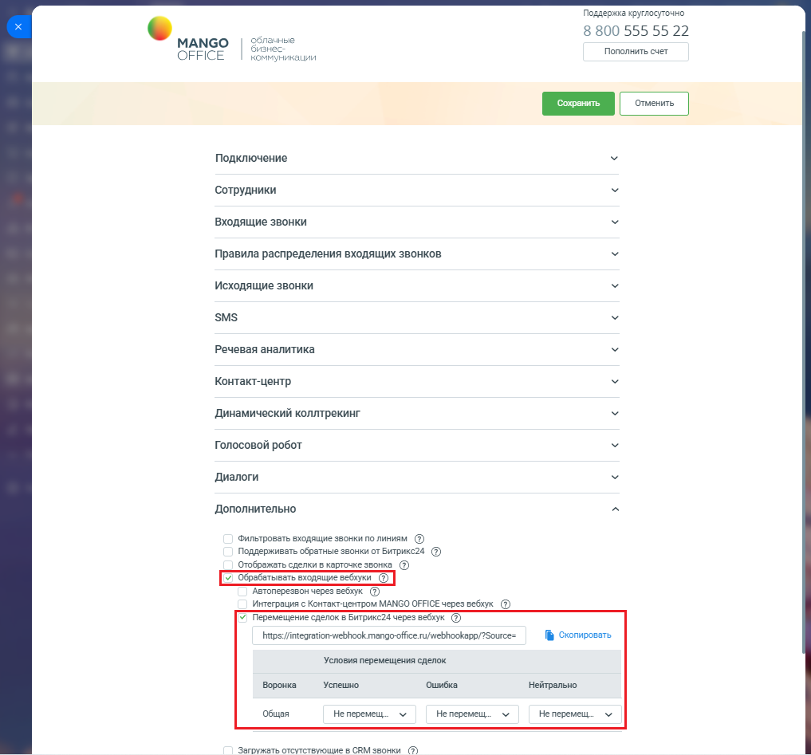
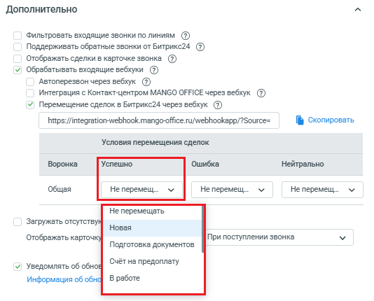
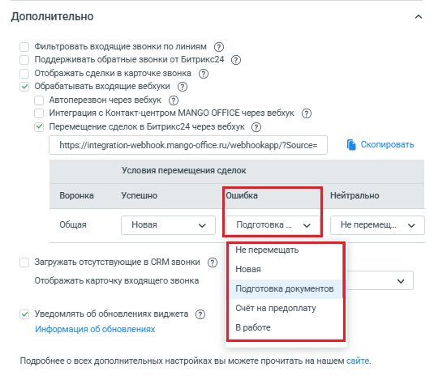
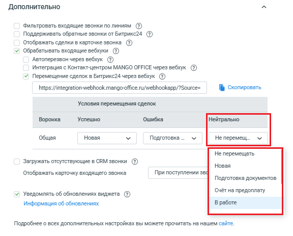
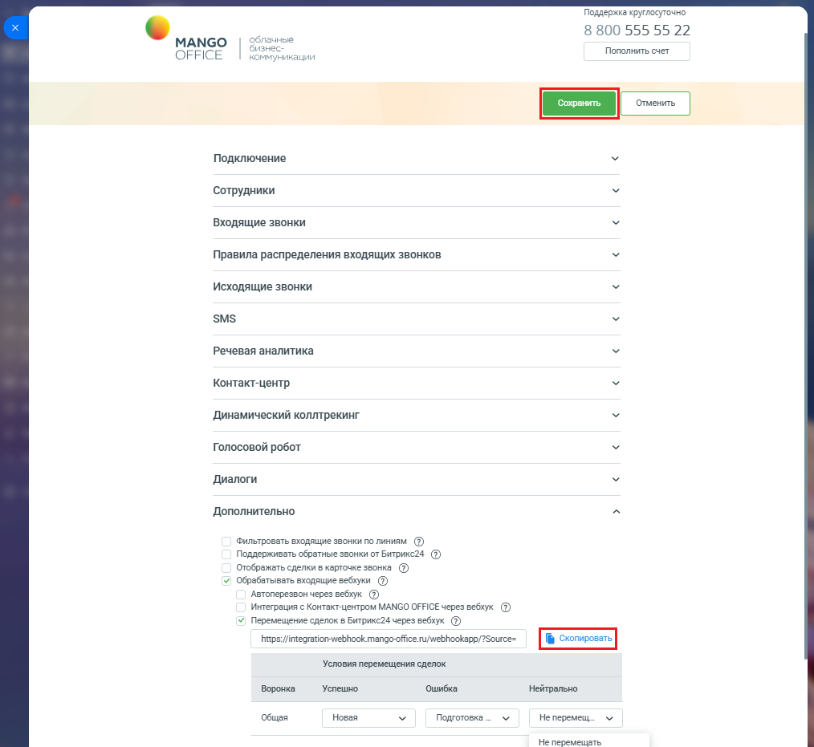

# Настройка вебхука в приложении интеграции Битрикс24

> Трассировка: PDF §2.11 · сквозные стр. 91-94 · источники: ч.1 `kb/mango-product-docs/sources/integration-bitrix24/Mango_office_integration_Bitrix24.pdf` с.91-94.

Для этого, в форме настройки приложения интеграции в блоке "Дополнительно" необходимо: 1) активировать переключатель "Перемещение сделок в Битрикс24 через вебхук". В форме настройки приложения появится поле, содержащее URL- адрес вебхука, и таблица "Условия перемещения сделок"; 2) в таблице "Условия перемещения сделок" будут перечислены все воронки продаж, имеющиеся в вашем Битрикс24. Вам нужно найти строку с названием воронки продаж, внутри которой будет перемещаться сделка, и в этой строке настроить правило перемещения сделки.

Интеграция Виртуальной АТС MANGO OFFICE и Битрикс24 | Версия от 03.03.2026 Чтобы настроить правило перемещения сделки, необходимо: 1) в таблице найти строку с названием воронки продаж, внутри которой будет перемещаться сделка; 2) если ваша внешняя система будет передавать в приложение интеграции вебхук с параметром "Result=POSITIVE", то в раскрывающемся списке столбца "Успешно" выберите название этапа, в который должна быть перемещена сделка;

3) если ваша внешняя система будет передавать в приложение интеграции вебхук с параметром "Result=NEGATIVE", то в раскрывающемся списке столбца "Ошибка" выберите название этапа, в который должна быть перемещена сделка;

Интеграция Виртуальной АТС MANGO OFFICE и Битрикс24 | Версия от 03.03.2026 4) если ваша внешняя система будет передавать в приложение интеграции вебхук с параметром "Result=NEUTRAL", то в раскрывающемся списке столбца "Нейтрально" выберите название этапа, в который должна быть перемещена сделка;

Примечания: - Вы можете настроить правило перемещения сделок для одной, нескольких или всех воронок, указанных в таблице "Условия перемещения сделок"; - в результате настройки правила перемещения сделки, будет изменена структура URL-адреса вебхука. 3) нажмите кнопку "Скопировать", чтобы скопировать URL-адрес вебхука. Сохраните полученный URL, например в Блокнот; 4) нажмите на кнопку "Сохранить" в верхней части формы настройки приложения интеграции и переходите к добавлению во внешнюю систему URL-адреса вебхука перемещения сделок. Интеграция Виртуальной АТС MANGO OFFICE и Битрикс24 | Версия от 03.03.2026

