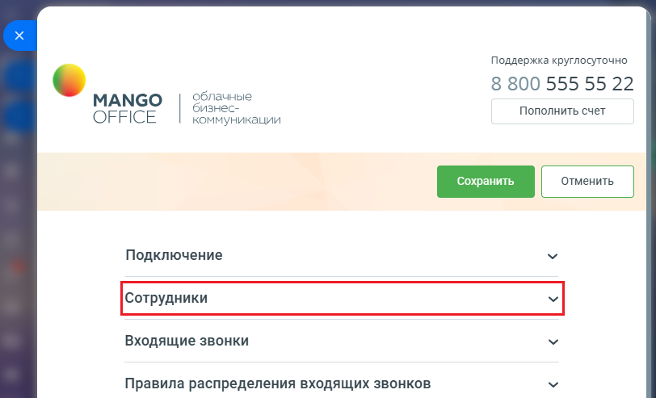
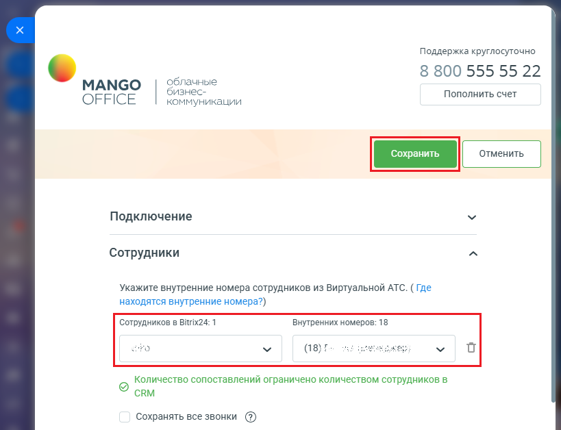

# Как настроить сопоставление сотрудников

> Трассировка: PDF §1.1 · сквозные стр. 11-13 · источники: ч.1 `kb/mango-product-docs/sources/integration-bitrix24/Mango_office_integration_Bitrix24.pdf` с.11-13.

Для этого в форме настройки приложения: 1) откройте блок "Сотрудники";

2) будет показана таблица сопоставления сотрудников, в которой: - в столбце “Сотрудников в Bitrix24:" показан список сотрудников, настроенных в Битрикс24, в том числе уволенных. При этом в названии столбца после двоеточия указано количество сотрудников в вашем Битрикс24; - в столбце "Внутренних номеров" отображается список сотрудников Виртуальной АТС, которым выданы внутренние номера телефонов. При этом в названии столбца после двоеточия указано количество сотрудников в вашей Виртуальной АТС; Интеграция Виртуальной АТС MANGO OFFICE и Битрикс24 | Версия от 03.03.2026 3) укажите соответствие сотрудников Виртуальной АТС и Битрикс24, путем выбора номера из списка или ввода внутреннего номера; 4) нажмите на кнопку "Сохранить" (зеленая кнопка в верхней части формы настройки приложения). После успешной настройки сопоставления сотрудников, будет завершена базовая настройка приложения интеграции.

Интеграция Виртуальной АТС MANGO OFFICE и Битрикс24 | Версия от 03.03.2026
