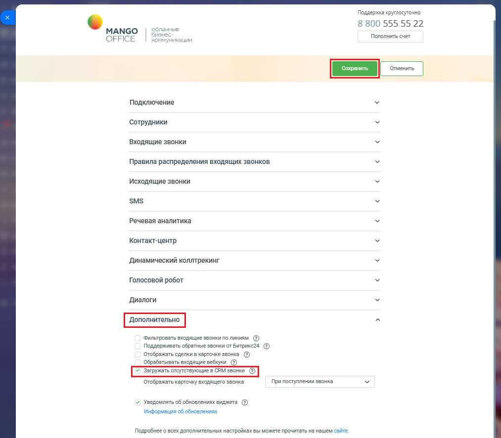

# 2.12. Загружать отсутствующие звонки в CRM

> Трассировка: PDF §2.12 · сквозные стр. 98-99 · источники: ч.1 `kb/mango-product-docs/sources/integration-bitrix24/Mango_office_integration_Bitrix24.pdf` с.98-99.

Если настройка "Загружать отсутствующие звонки в CRM" включена, то для вашей интеграции ежедневно в 01:00 МКС будет проводиться процедура поиска и восстановления отсутствующих звонков. Имеющиеся звонки в Битрикс24 будут сверяться со звонками в Виртуальной АТС. Поиск потерянных звонков происходит за полный прошедший день. Примечание. Данная возможность доступна только пользователям расширенного пакета интеграции. Чтобы включить функцию загрузки отсутствующих звонков, в настройках интеграции MANGO OFFICE в блоке "Дополнительно", выполните следующие действия: 1) активировать переключатель "Загружать отсутствующие звонки в CRM"; 2) нажать на кнопку "Сохранить" (расположена вверху окна настроек интеграции MANGO OFFICE):

Интеграция Виртуальной АТС MANGO OFFICE и Битрикс24 | Версия от 03.03.2026
