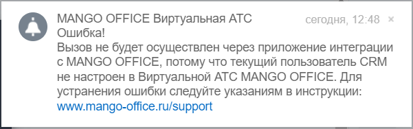

# 2.13. Всплывающие сообщения об ошибках в интерфейсе Битрикс24

> Трассировка: PDF §2.13 · сквозные стр. 99 · источники: ч.1 `kb/mango-product-docs/sources/integration-bitrix24/Mango_office_integration_Bitrix24.pdf` с.99.

Битрикс24 Можно самостоятельно устранить некоторые ошибки, связанные с интеграцией Битрикс24 и виртуальной АТС MANGO OFFICE, или отправить заявку на исправление этих ошибок в службу поддержки Клиентов MANGO OFFICE. При возникновении ошибки, в правом верхнем углу экрана Битрикс24 появляется специальное сообщение, которого отображается менее 5 секунд:

Затем, это же сообщение вы можете увидеть в разделе "Уведомления" Битрикс24. Текст каждого уведомления содержит краткое описание ошибки. При нажатии на уведомление, в зависимости от ошибки, будет открыта новая вкладка браузера, в которой показано подробное описание варианта решения проблемы ИЛИ будет открыта страница "Поддержка" сайта www.mango-office.ru
