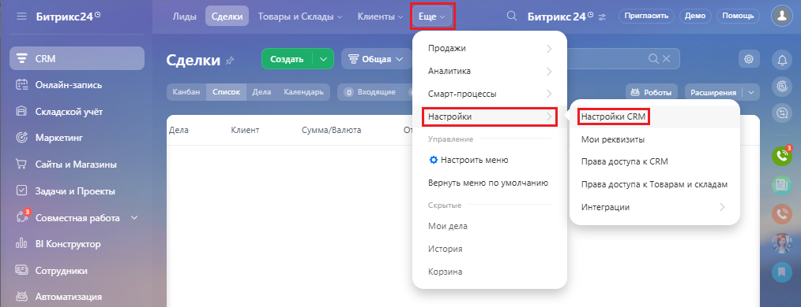
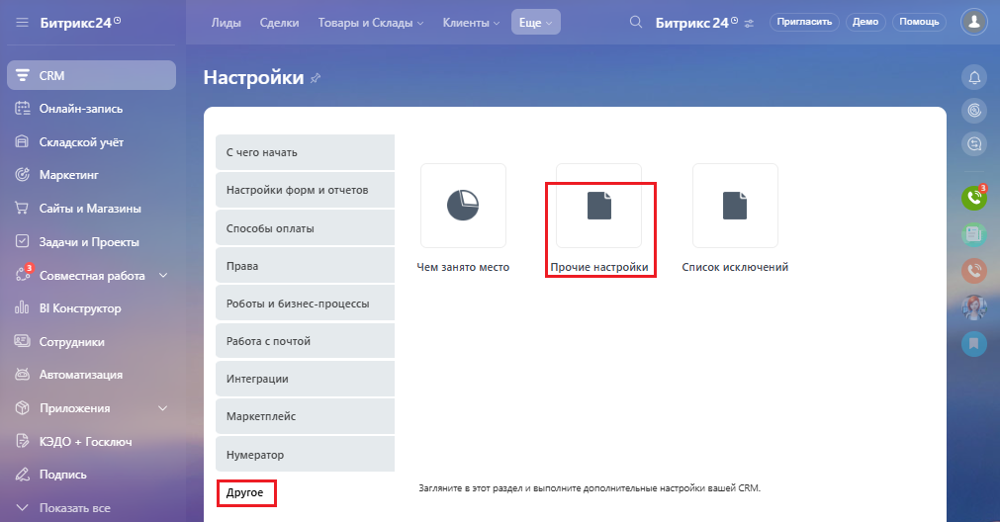
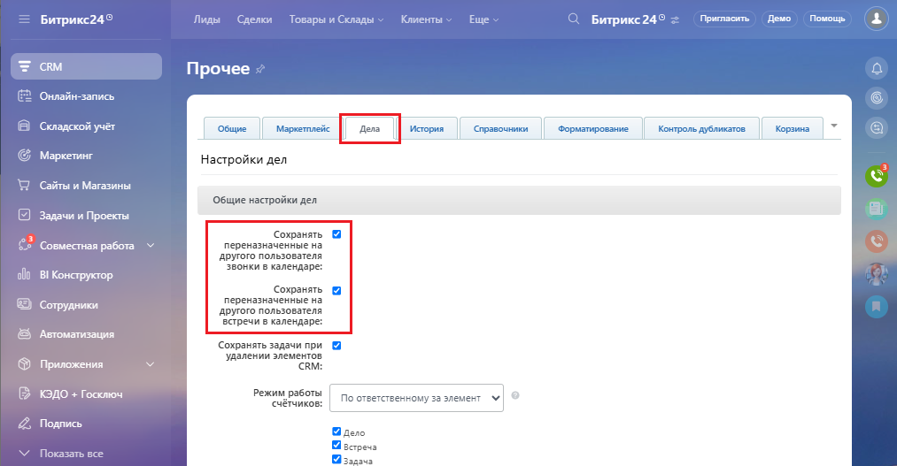
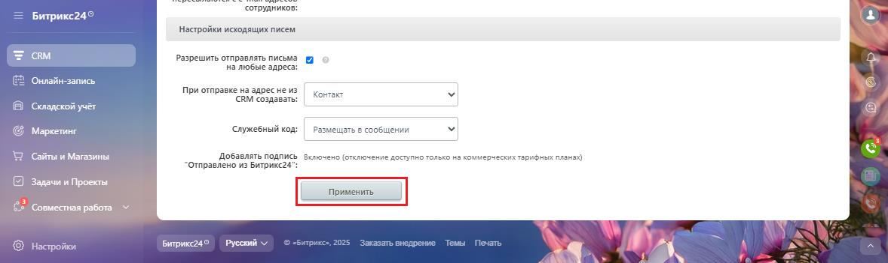

# 2.14. Как включить или выключить показ звонков в календаре

> Трассировка: PDF §2.14 · сквозные стр. 99-101 · источники: ч.1 `kb/mango-product-docs/sources/integration-bitrix24/Mango_office_integration_Bitrix24.pdf` с.99-101.

При регистрации звонка в календаре Битрикса24 создается соответствующая отметка. Эта функция по умолчанию включена. Если позже вам понадобиться отключить или включить появление звонков в календаре, выполните следующие действия: 1) выберите "CRM", затем выберите "Настройки", затем "Настройки CRM":

Интеграция Виртуальной АТС MANGO OFFICE и Битрикс24 | Версия от 03.03.2026 2) нажмите "Другое"; 3) нажмите "Прочие настройки":

4) перейдите на закладку "Дела"; 5) чтобы выключить показ звонков в календаре, снимите флаги "Сохранять совершенные звонки в календаре", "Сохранять переназначенные на другого пользователя звонки в календаре". А чтобы включить показ звонков – установите эти флаги;

Интеграция Виртуальной АТС MANGO OFFICE и Битрикс24 | Версия от 03.03.2026 6) нажмите кнопку "Применить":

