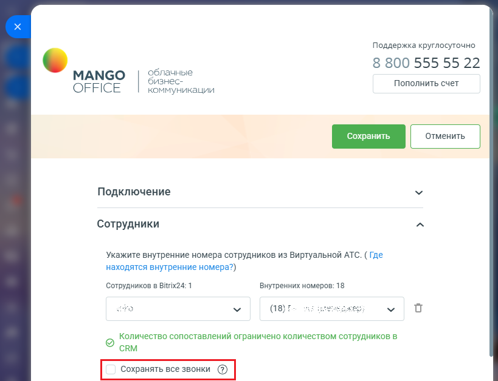

# Как сохранять все звонки в Битрикс24. Обобщенно

> Трассировка: PDF §1.1 · сквозные стр. 13-14 · источники: ч.1 `kb/mango-product-docs/sources/integration-bitrix24/Mango_office_integration_Bitrix24.pdf` с.13-14.

По умолчанию, приложение интеграции сохраняет в Битрикс24 данные о звонках только “сопоставленных” сотрудников, то есть сотрудников, указанных в таблице сопоставления. При этом, звонки “не сопоставленных сотрудников” не сохраняются. Вы можете поменять эту настройку, при подключении расширенного пакета интеграции. Вы можете включить настройку “Сохранять все звонки” и указать нужного вам сотрудника. Тогда все разговоры сотрудников в Клиентами будут сохранятся в Битрикс24. Важно! Перед тем как включать данную настройку, узнайте больше о принципе ее работы в этом параграфе.

Интеграция Виртуальной АТС MANGO OFFICE и Битрикс24 | Версия от 03.03.2026
