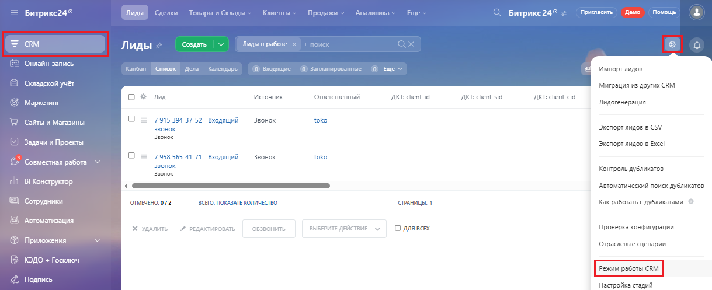
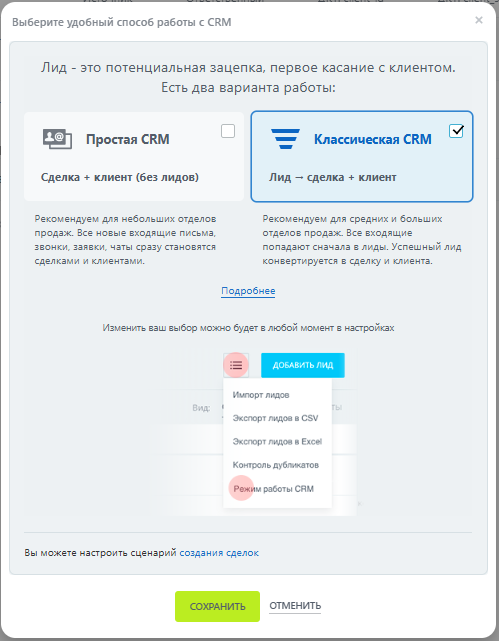
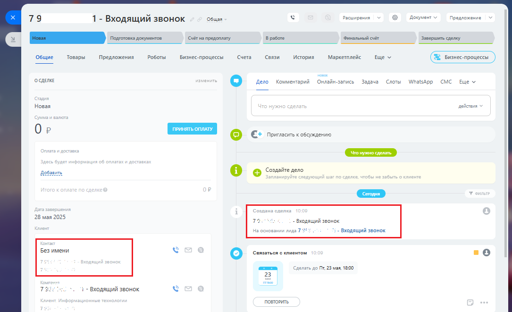

# 2.19. Переключение между режимами работы Битрикс24

> Трассировка: PDF §2.19 · сквозные стр. 102-104 · источники: ч.1 `kb/mango-product-docs/sources/integration-bitrix24/Mango_office_integration_Bitrix24.pdf` с.102-104.

Приложение интеграции поддерживает разные режимы работы: - классическая CRM Сделка + клиент (без лидов); - простая CRM Лид -> сделка + клиент. Важным различием режима работы является использование лидов в классическом режиме (в режиме простой CRM лиды не используются). Вы можете переключаться между режимами работы: 1) выберите "CRM"; 2) перейдите в раздел "Лиды";

3) нажмите пиктограмму "Настройки" 4) выберите "Режим работы CRM":

Интеграция Виртуальной АТС MANGO OFFICE и Битрикс24 | Версия от 03.03.2026 5) выберите режим работы и нажмите кнопку "Сохранить":

В упрощенном режиме работы вместо лидов - автоматически создаются контакты и связанные с ними сделки. Звонки фиксируются в контактах, для звонка указывается номер, на который звонил Клиент:

Обратите внимание, замечено, что Битрикс24 в этом режиме автоматически создает лиды, но не отображает их в приложении. Интеграция Виртуальной АТС MANGO OFFICE и Битрикс24 | Версия от 03.03.2026
