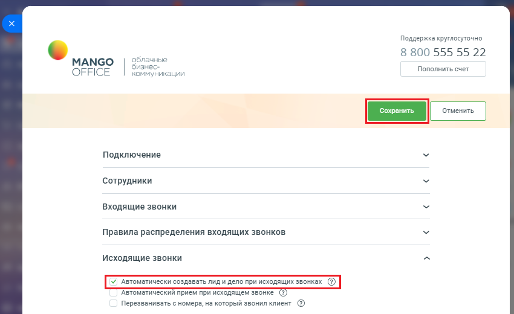
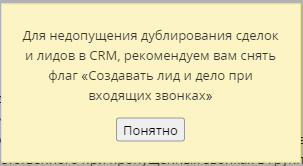
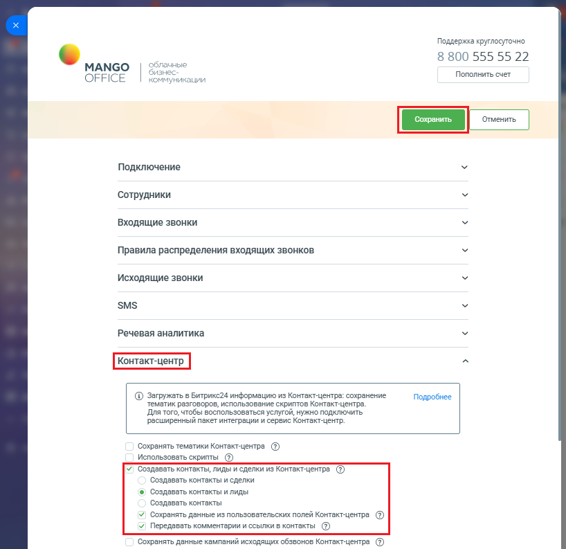

# Как включить автоматическое создание контактов и сделок в Битрикс24

> Трассировка: PDF §2.22 · сквозные стр. 111-113 · источники: ч.1 `kb/mango-product-docs/sources/integration-bitrix24/Mango_office_integration_Bitrix24.pdf` с.111-113.

Для этого необходимо: 1) открыть форму настройки приложения интеграции; 2) открыть блок "Исходящие звонки"; 3) снять "галочку" в пункте "Автоматически создавать лид и дело при входящих звонках", чтобы избежать дублирования сделок при получении данных из Контакт-центра MANGO OFFICE; 4) нажмите кнопку "Сохранить".

Примечание. Если вы не снимите "галочку" в пункте "Автоматически создавать лид и дело при входящих звонках", то будет выдано следующее сообщение:

Настоятельно рекомендуем, снять "галочку" в пункте "Автоматически создавать лид и дело при входящих звонках". Интеграция Виртуальной АТС MANGO OFFICE и Битрикс24 | Версия от 03.03.2026 5) открыть блок "Контакт-центр" в настройках интеграции; 6) установить в нем галочку "Создавать контакты, лиды и сделки из Контакт- Центра MANGO OFFICE". Будут открыты дополнительные поля; 7) выберите один из вариантов: - Создавать контакты и сделки: при выборе данного пункта в Битрикс24 будут создаваться контакты и сделки по обращениям из Контакт-центра MANGO OFFICE. Лиды создаваться не будут; - Создавать контакты и лиды: в Битрикс24 будут создаваться контакты и лиды. Примечание. Для создания лидов, ваш Битрикс24 должен работать в режиме "Классическая CRM". Если в ваш Битрикс24 работает в другом режиме, то будет выдано соответствующее сообщение: 8) установите галочку "Сохранять данные из пользовательских полей Контакт- Центра MANGO OFFICE", если хотите импортировать данные из пользовательских полей Контакт-центра MANGO OFFICE; 9) установите галочку "Передавать комментарии и ссылки в контакте", если вы хотите, чтобы в ваш Битрикс24 из Контакт-Центра MANGO OFFICE передавалась история коммуникаций; 10) нажмите кнопку "Сохранить" в верху формы настройки приложения интеграции. Интеграция Виртуальной АТС MANGO OFFICE и Битрикс24 | Версия от 03.03.2026

