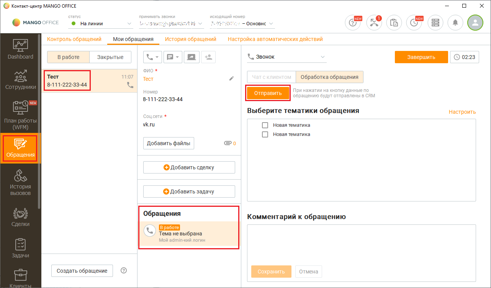
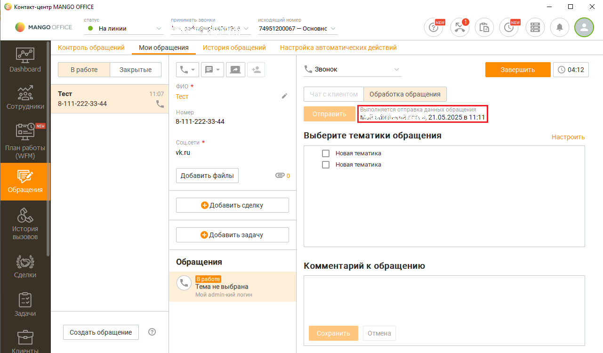

# Как отправить данные о лидах в Битрикс24

> Трассировка: PDF §2.22 · сквозные стр. 113-115 · источники: ч.1 `kb/mango-product-docs/sources/integration-bitrix24/Mango_office_integration_Bitrix24.pdf` с.113-115.

Чтобы из Контакт-центра MANGO OFFICE в Битрикс24 отправить обращение Клиента, нужно: 1) создать новое обращение Клиента, либо найти ранее созданное обращение Клиента; 2) если по Клиенту зафиксировано несколько обращений, то выбрать обращение, которое надо отправить; 3) нажать кнопку "Отправить": Интеграция Виртуальной АТС MANGO OFFICE и Битрикс24 | Версия от 03.03.2026

Данные об обращении будут отправлены в ваш Битрикс24, при этом в Контакт- центре MANGO OFFICE будет выдано сообщение о том, кто и когда отправил обращение:

Интеграция Виртуальной АТС MANGO OFFICE и Битрикс24 | Версия от 03.03.2026
