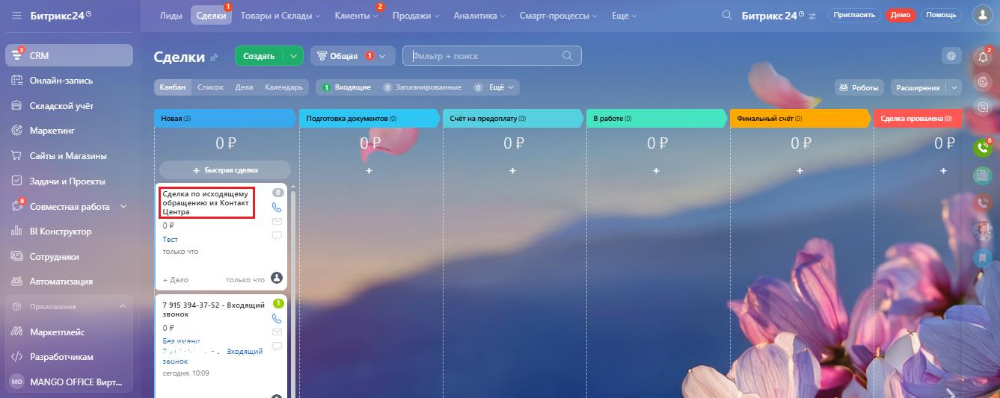
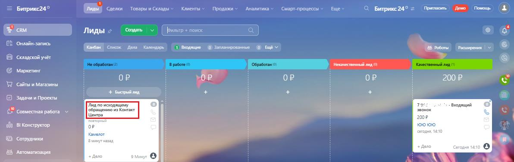

# Как в Битрикс24 посмотреть контакты и сделки, созданные по входящему обращению Контакт-центра MANGO OFFICE

> Трассировка: PDF §2.22 · сквозные стр. 115-116 · источники: ч.1 `kb/mango-product-docs/sources/integration-bitrix24/Mango_office_integration_Bitrix24.pdf` с.115-116.

обращению Контакт-центра MANGO OFFICE После отправки данных об обращениях из Контакт-центра MANGO OFFICE, в вашем Битрикс24 вы увидите: • новый контакт в разделе "Контакты". Этот контакт будет добавлен в список всех ранее созданных контактов; • новую сделку в группе "Новая" в разделе "Сделки". Новая сделка всегда добавляется в группу "Новая". Чтобы увидеть сделки, относящиеся к Контакт-центру MANGO OFFICE, нужно открыть раздел "Сделки". Сделки, созданные по данным из Контакт-центра, будут иметь название "Сделка по исходящему обращению из Контакт-центра":

Чтобы увидеть лиды, относящиеся к Контакт-центру MANGO OFFICE, нужно открыть раздел "Лиды". Лиды, созданные по данным из Контакт-центра, будут иметь название "Лид по исходящему обращению из Контакт-центра":

Интеграция Виртуальной АТС MANGO OFFICE и Битрикс24 | Версия от 03.03.2026
