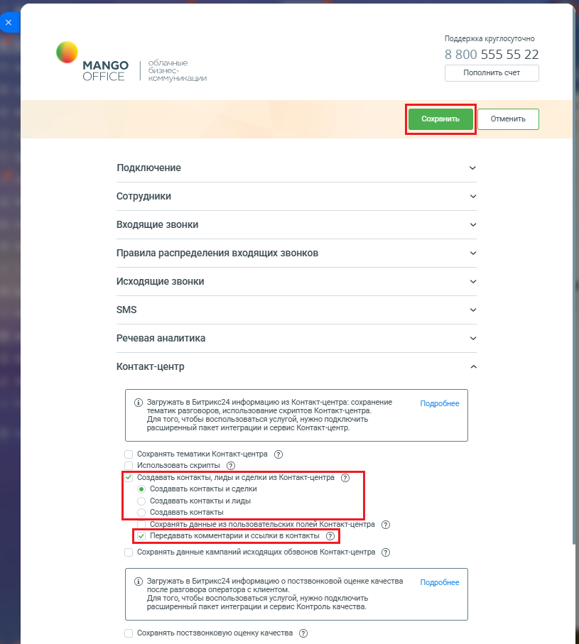

# Порядок действий

> Трассировка: PDF §2.22 · сквозные стр. 117-118 · источники: ч.1 `kb/mango-product-docs/sources/integration-bitrix24/Mango_office_integration_Bitrix24.pdf` с.117-118.

Чтобы включить настройку, необходимо: 1) откройте форму настройки приложения интеграции; 2) откройте блок "Контакт-центр"; 3) настройте функцию автоматического созданий контакта, лида и сделки, включив соответствующие переключатели; 4) установите флаг "Передавать комментарии и ссылки в контакты”; 5) нажмите кнопку "Сохранить" в верхней части формы настройки приложения интеграции: Интеграция Виртуальной АТС MANGO OFFICE и Битрикс24 | Версия от 03.03.2026

