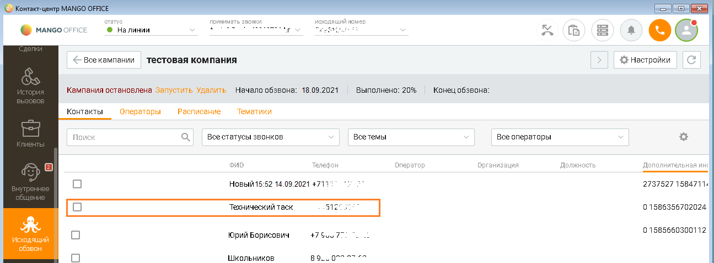

# Понятие "Технический таск" в кампании исходящего обзвона

> Трассировка: PDF §2.22 · сквозные стр. 121-122 · источники: ч.1 `kb/mango-product-docs/sources/integration-bitrix24/Mango_office_integration_Bitrix24.pdf` с.121-122.

После того как вы настроили интеграцию с Контакт-центром MANGO OFFICE через вебхуки и первый номер Клиента был добавлен выбранную вам кампанию исходящего обзвона, вы можете, открыв карточку кампании в Контакт-центре MANGO OFFICE, увидеть технический таск. Вот так:

Технический таск – это служебная задача кампании исходящего обзвона, согласно которой ваша Виртуальная АТС должна выполнить автозвонок (звонок самое себе). Этот автозвонок необходим, чтобы кампания исходящего обзвона не была завершена автоматически (не перешла в статус "Завершена"). Примечание. Статус "Завершена" означает, что кампания исходящего обзвона полностью остановлена, вы не можете добавлять в нее номера Клиентов, не можете повторно ее запустить. Подробнее о статусах кампаний вы можете прочитать в Руководстве пользователя КЦ. Интеграция Виртуальной АТС MANGO OFFICE и Битрикс24 | Версия от 03.03.2026 Автозвонок создается автоматически при первом добавлении номера в кампанию исходящего обзвона через вебхуки. При втором и последующих добавлениях номеров, такой таск не создается (потому что он там уже есть).
