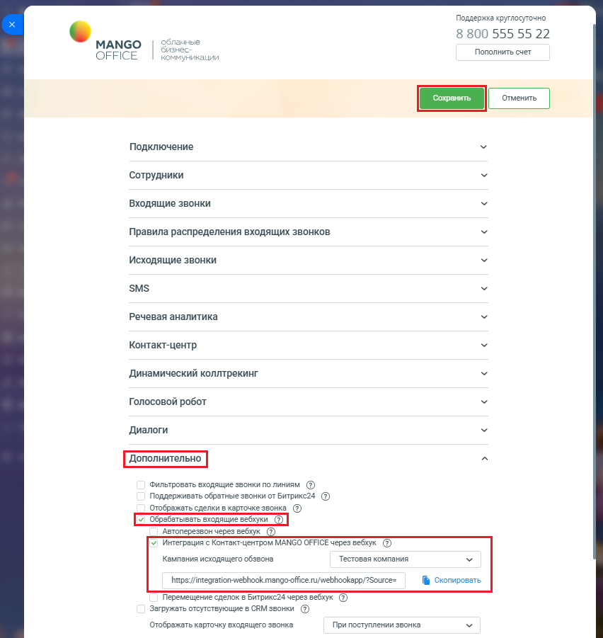

# Как настроить интеграцию в Контакт-центром MANGO OFFICE через вебхуки

> Трассировка: PDF §2.22 · сквозные стр. 122-124 · источники: ч.1 `kb/mango-product-docs/sources/integration-bitrix24/Mango_office_integration_Bitrix24.pdf` с.122-124.

вебхуки Для этого нужно подключить Контакт-центр MANGO OFFICE к вашей Виртуальной АТС, руководствуясь этой инструкцией. Затем, в приложении интеграции следует: 1) открыть блок "Дополнительно"; 2) активировать переключатель "Обрабатывать входящие вебхуки", если этого не было сделано ранее. Появятся дополнительные поля, в которых перечислены все входящие вебхуки; 3) активировать переключатель "Интеграция с Контакт-центром MANGO OFFICE через вебхук"; 4) выбрать кампанию исходящего обзвона; 5) нажать на ссылку "Скопировать" в строке с данными вебхуков, чтобы скопировать URL-адрес вебхуков. Сохранить полученный URL (например, в текстовый файл, для создания которого используйте, например, программу "Блокнот"); 6) нажать на кнопку "Сохранить" (расположена вверху окна настроек интеграции MANGO OFFICE): Интеграция Виртуальной АТС MANGO OFFICE и Битрикс24 | Версия от 03.03.2026

Примечание. Теперь вам нужно настроить робота Битрикс24 на отправку вебхуков в приложение интеграции. Интеграция Виртуальной АТС MANGO OFFICE и Битрикс24 | Версия от 03.03.2026
