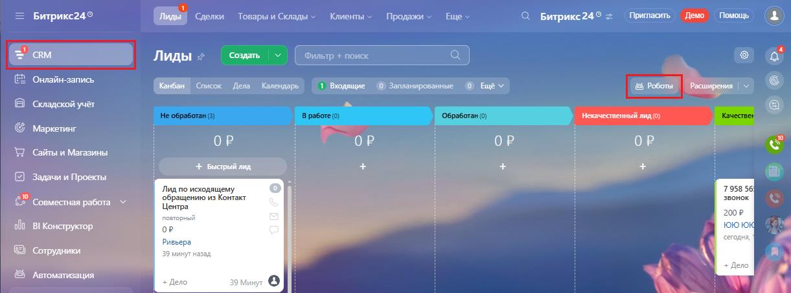
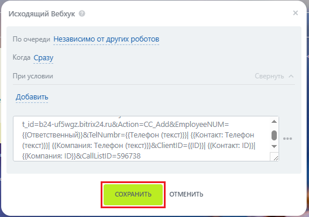

# Как добавить вебхуки интеграции в робота в Битрик24

> Трассировка: PDF §2.22 · сквозные стр. 124-126 · источники: ч.1 `kb/mango-product-docs/sources/integration-bitrix24/Mango_office_integration_Bitrix24.pdf` с.124-126.

В Битрикс24 выполните следующие действия: 1) выберите пункт "CRM"; 2) выберите пункт "Роботы:

3) выберите этап воронки продаж, в котором нужно создать робота и нажмите кнопку "Добавить" (плюс);

Интеграция Виртуальной АТС MANGO OFFICE и Битрикс24 | Версия от 03.03.2026 4) выберите пункт "Другие роботы"; 5) в строке "Исходящий вебхук" нажмите "Добавить":

6) в поле "Хендлер" вставьте ранее скопированный вами вебхуки;

7) нажмите кнопку "Сохранить":

Настройка робота завершена. Интеграция Виртуальной АТС MANGO OFFICE и Битрикс24 | Версия от 03.03.2026
