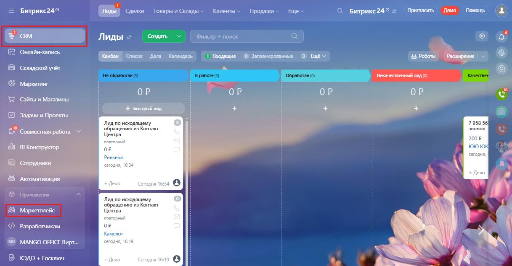
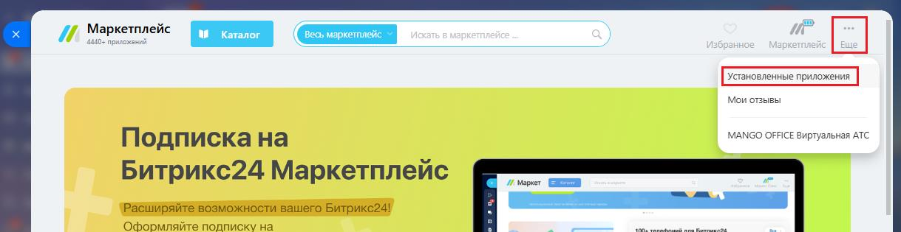
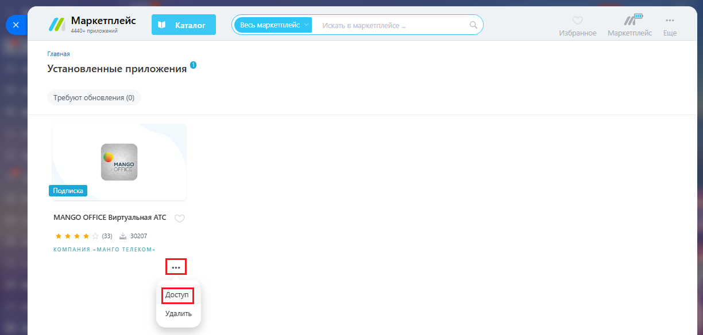
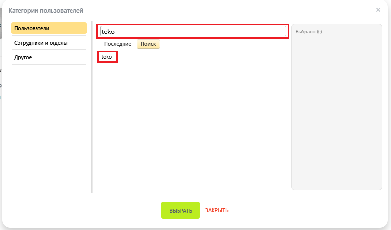
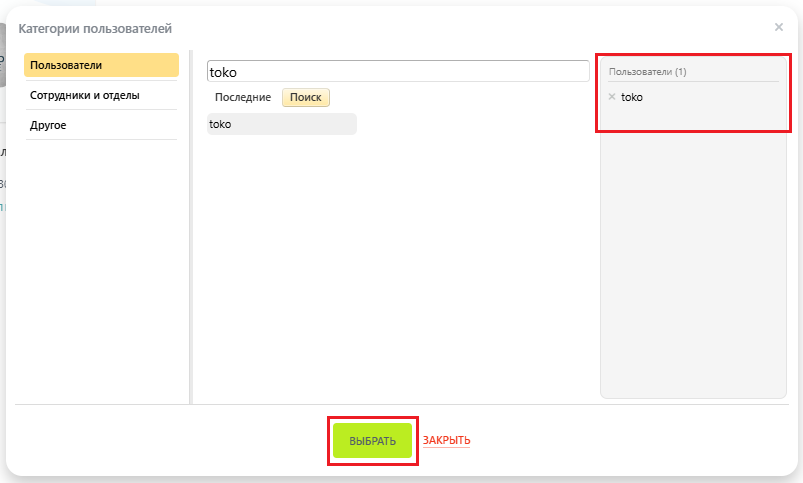

# Как выдать или снять права доступа к приложению интеграции

> Трассировка: PDF §2.22 · сквозные стр. 128-130 · источники: ч.1 `kb/mango-product-docs/sources/integration-bitrix24/Mango_office_integration_Bitrix24.pdf` с.128-130.

Для этого, в вашем Битрикс24 выполните следующие действия: 1) нажмите на пункт "Маркетплейс" в блоке "Приложения":

2) нажмите на пункт "Еще", затем выберите пункт "Установленные приложения":

Интеграция Виртуальной АТС MANGO OFFICE и Битрикс24 | Версия от 03.03.2026 3) нажмите на кнопку с тремя точками, затем нажмите на пункт "Доступ":

4) введите имя сотрудника или отдела, которым будет предоставлен доступ к приложению интеграции. Будет показан список соответствующих сотрудников; 5) нажмите на имя сотрудника, которому будет предоставлен доступ;

Интеграция Виртуальной АТС MANGO OFFICE и Битрикс24 | Версия от 03.03.2026 6) выбранный сотрудник будет показан в списке "Пользователи"; 7) нажмите кнопку "Выбрать":

