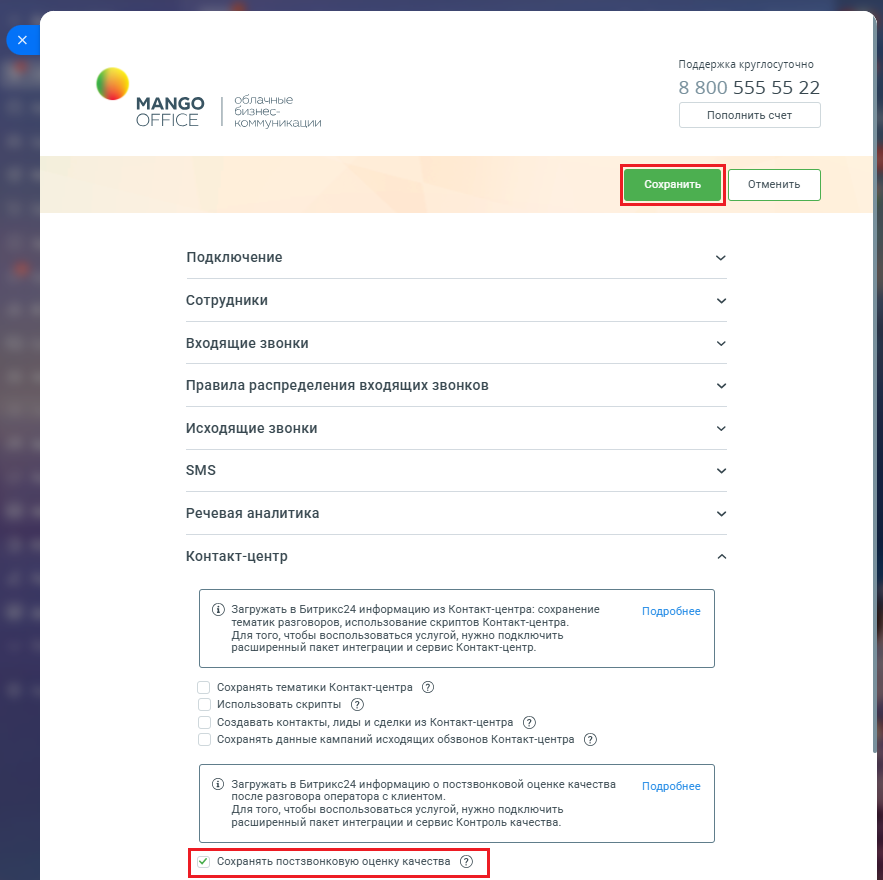

# Сохранять постзвонковую оценку качества

> Трассировка: PDF §2.22 · сквозные стр. 132-133 · источники: ч.1 `kb/mango-product-docs/sources/integration-bitrix24/Mango_office_integration_Bitrix24.pdf` с.132-133.

После разговора Клиент может оценить качество диалога с оператором, эта информация автоматически сохраняется в Контакт-центре MANGO OFFICE. А если вы включите настройку "Сохранять постзвонковую оценку качества", то оценка, которую поставил Клиент будет автоматически загружаться в информацию о звонке в Битрикс24. Чтобы включить загрузку оценки диалога с оператором, выданную Клиентом, в вашем Битрикс24 необходимо: 1) откройте форму настройки приложения интеграции; 2) откройте блок "Контакт-центр"; 3) установите флаг "Сохранять постзвонковую оценку качества"; 4) нажмите кнопку "Сохранить" в верхней части формы настройки приложения интеграции:

Интеграция Виртуальной АТС MANGO OFFICE и Битрикс24 | Версия от 03.03.2026
