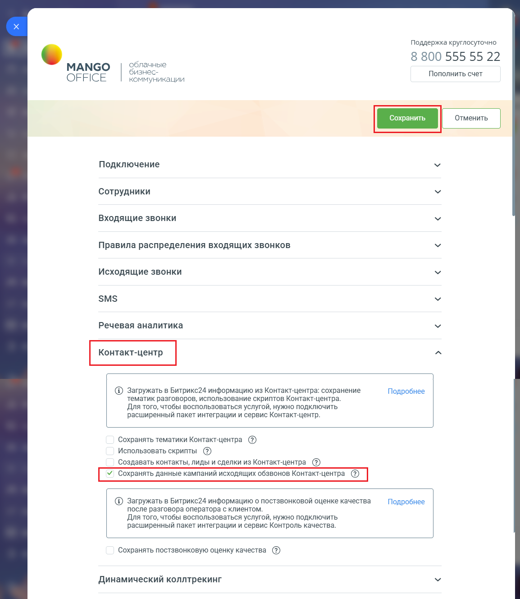

# Сохранять данные кампаний исходящих обзвонов Контакт-центра

> Трассировка: PDF §2.22 · сквозные стр. 133-134 · источники: ч.1 `kb/mango-product-docs/sources/integration-bitrix24/Mango_office_integration_Bitrix24.pdf` с.133-134.

Если данная настройка включена, то интеграция в вашем Битрикс24 будет автоматически создавать лиды и контакты, в которые будет сохранять данные о клиентах, указанных в кампании исходящего обзвона в Контакт-центра. Эти лиды и контакты создаются в момент проведения кампании исходящего обзвона в Контакт-центре. Важно. Если вы включили данную настройку, то создание лидов и контактов выполняется независимо от статуса настройки "Автоматически создавать лид и дело при исходящих звонках" (включена \ выключена). Чтобы включить данную настройку, в вашем Битрикс24 необходимо: 1) откройте форму настройки приложения интеграции; 2) откройте блок "Контакт-центр"; 3) установите флаг "Сохранять данные кампаний исходящих обзвонов Контакт- центра"; 4) нажмите кнопку "Сохранить" в верхней части формы настройки приложения интеграции:

Интеграция Виртуальной АТС MANGO OFFICE и Битрикс24 | Версия от 03.03.2026
