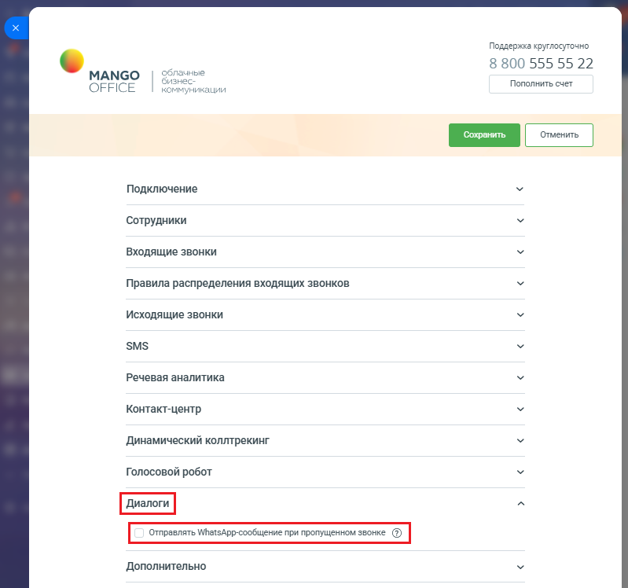
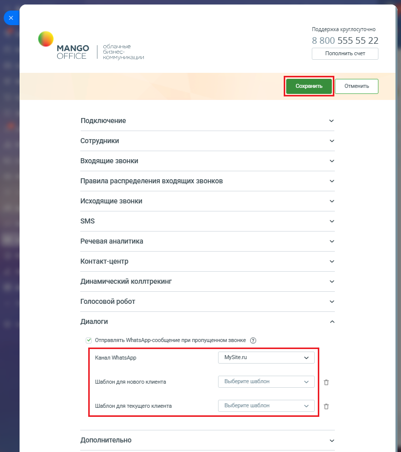

# Как включить

> Трассировка: PDF §2.23 · сквозные стр. 135-137 · источники: ч.1 `kb/mango-product-docs/sources/integration-bitrix24/Mango_office_integration_Bitrix24.pdf` с.135-137.

Перед тем как отправлять Клиенту в WhatsApp сообщения по какому-либо шаблону прочитайте статью "Шаблоны WhatsApp". В ней описано что такое и как настраивать шаблон WhatsApp. Чтобы включить настройку, в вашем Битрикс24 необходимо: 1) откройте форму настройки приложения интеграции; 2) откройте блок "Диалоги"; 3) установите флаг "Отправлять WhatsApp-сообщение при пропущенном звонке":

Интеграция Виртуальной АТС MANGO OFFICE и Битрикс24 | Версия от 03.03.2026 4) выберите канал коммуникаций WhatsApp, настроенный вами ранее в Манго Диалогах; 5) выберите: - Шаблон для нового клиента: укажите шаблон сообщения по пропущенным звонкам с новых номеров; - Шаблон для текущего клиента: укажите шаблон сообщения по пропущенным звонкам от Клиентов, зарегистрированных в Битрикс24; 6) нажмите кнопку "Сохранить" в верхней части формы настройки приложения интеграции:

Интеграция Виртуальной АТС MANGO OFFICE и Битрикс24 | Версия от 03.03.2026
