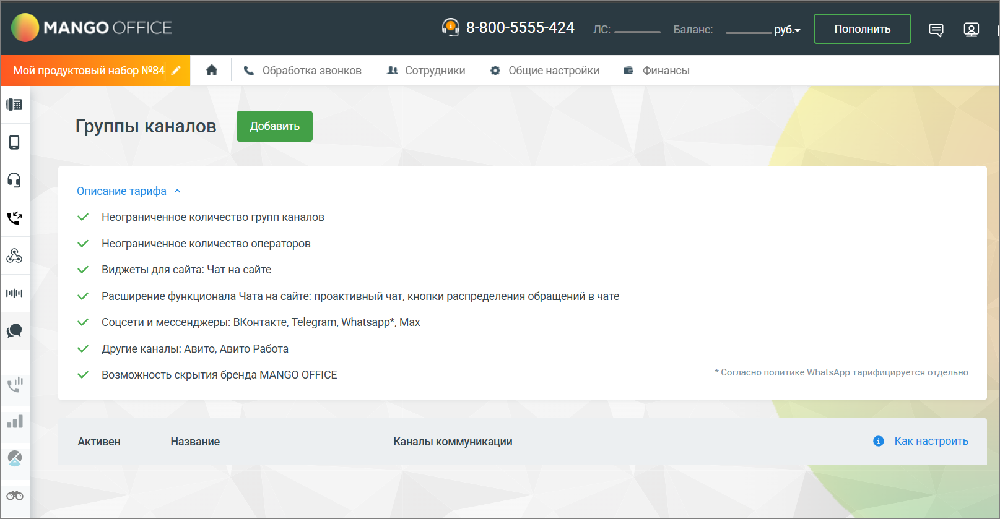

# 2.24.3. Подключение каналов «Манго Диалоги» в ЛК ВАТС

> Трассировка: PDF §2.24.3 · сквозные стр. 137-139 · источники: ч.1 `kb/mango-product-docs/sources/integration-bitrix24/Mango_office_integration_Bitrix24.pdf` с.137-139.

Тарифный план «Контакт-центр Манго Диалоги Интеграция» предоставляет доступ к следующим каналам связи: Чат на сайте, Telegram, WhatsApp, ВКонтакте, MAX, Авито, Авито Работа. Интеграция Виртуальной АТС MANGO OFFICE и Битрикс24 | Версия от 03.03.2026

Подключите и настройте группу каналов. Инструкция по подключения доступна по ссылке Как настроить. Таблица 1 В текущей версии интеграции Манго Диалогов с Открытыми линиями Битрикс24 сообщения переадресованные в Манго Диалогах на группу пользователей Манго Диалогов (ВАТС MANGO OFFICE) не передаются в Открытые Линии Битрикс24. Поэтому, если вы общаетесь с пользователями преимущественно в Битрикс24, то крайне не рекомендуется настраивать маршрутизацию обращений в Личном кабинете ВАТС. Выберите и подключите необходимые каналы: • Чат на сайте • MAX • ВКонтакте • WhatsApp • Telegram • Авито • Авито Работа После подключения каналов переходите к настройке интеграции в Битрикс24. На данный момент в настройках каналов еще не доступны функции автоматического распределения диалогов, контроля качества и сбора оценок. Но мы уже активно работаем над этим, чтобы добавить весь функционал в одном из ближайших обновлений. Обработка обращений группой сотрудников реализуется в Открытых линиях Битрикс24. Интеграция Виртуальной АТС MANGO OFFICE и Битрикс24 | Версия от 03.03.2026 Очередь и автоматическая переадресация обращений - для настройки очереди обращений используйте настройки Открытых Линий на стороне Битрикс24.
