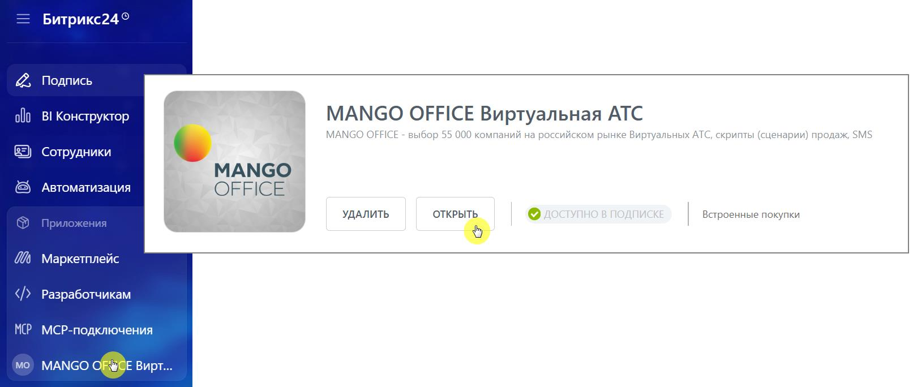
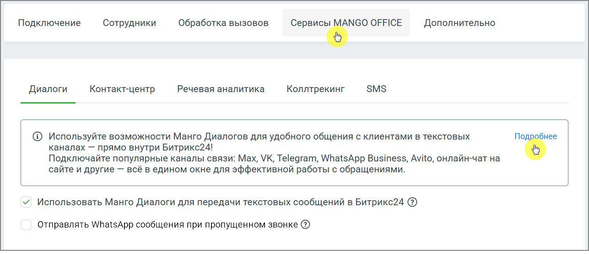

# 2.24.4. Активируйте использование Манго Диалогов для передачи текстовых сообщений

> Трассировка: PDF §2.24.4 · сквозные стр. 139-140 · источники: ч.1 `kb/mango-product-docs/sources/integration-bitrix24/Mango_office_integration_Bitrix24.pdf` с.139-140.

сообщений Для включения работы диалогов: • В блоке Приложения меню Битрикс24 выберите MANGO OFFICE Виртуальная АТС. • Нажмите кнопку Открыть на виджете ВАТС.

• Откроется меню настроек виджета. В меню настроек перейдите на вкладку Сервисы MANGO OFFICE → Диалоги. • Установите флажок: Использовать Манго Диалоги для передачи текстовых сообщений в Битрикс24. • Нажмите Применить.

Интеграция Виртуальной АТС MANGO OFFICE и Битрикс24 | Версия от 03.03.2026 Нажатие на кнопку Подробнее открывает Личный кабинет ВАТС, раздел Диалоги.
