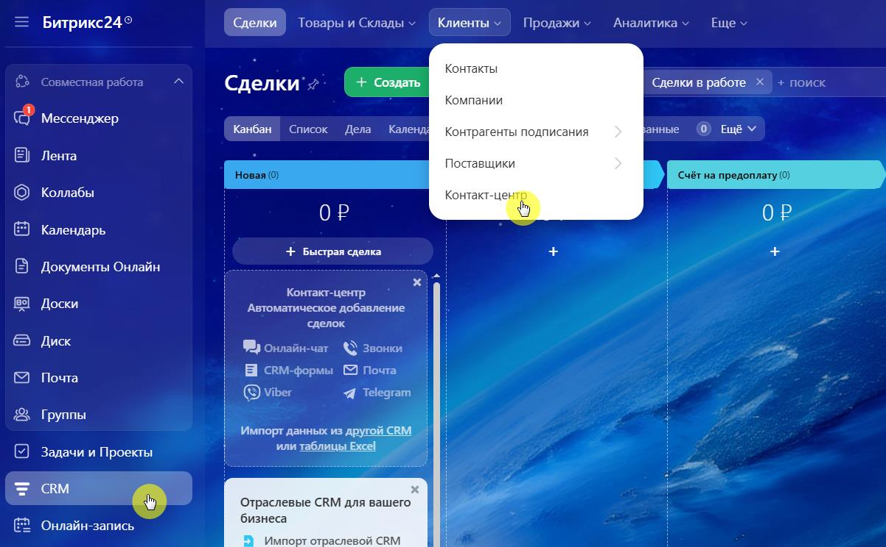
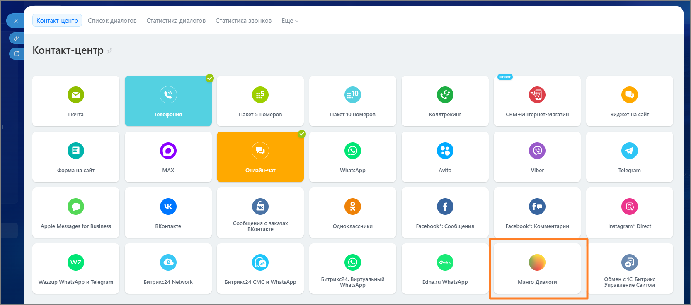
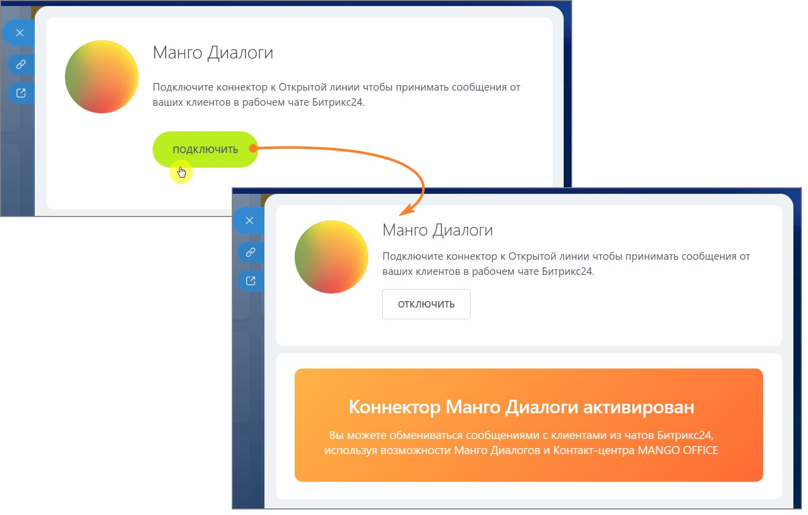
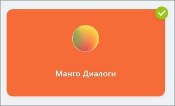

# 2.24.5. Проверьте подключение виджета Манго Диалоги в Битрикс24

> Трассировка: PDF §2.24.5 · сквозные стр. 140-141 · источники: ч.1 `kb/mango-product-docs/sources/integration-bitrix24/Mango_office_integration_Bitrix24.pdf` с.140-141.

В Битрикс24: • Откройте раздел CRM → Клиенты → Контакт-центр.

• Убедитесь, что подключенный виджет Манго Диалоги отображается в списке виджетов.

• Нажмите на иконку виджета и в открывшемся окне нажмите кнопку Подключить. Интеграция Виртуальной АТС MANGO OFFICE и Битрикс24 | Версия от 03.03.2026

В списке виджетов иконка виджета «Манго Диалоги» станет активной.

Вы активировали коннектор «Манго Диалоги» в Битрикс24. Далее переходите к настройкам Открытой линии.
