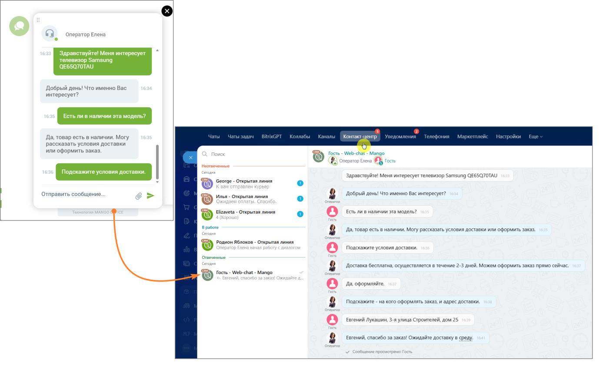
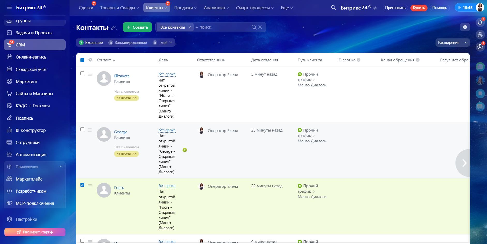
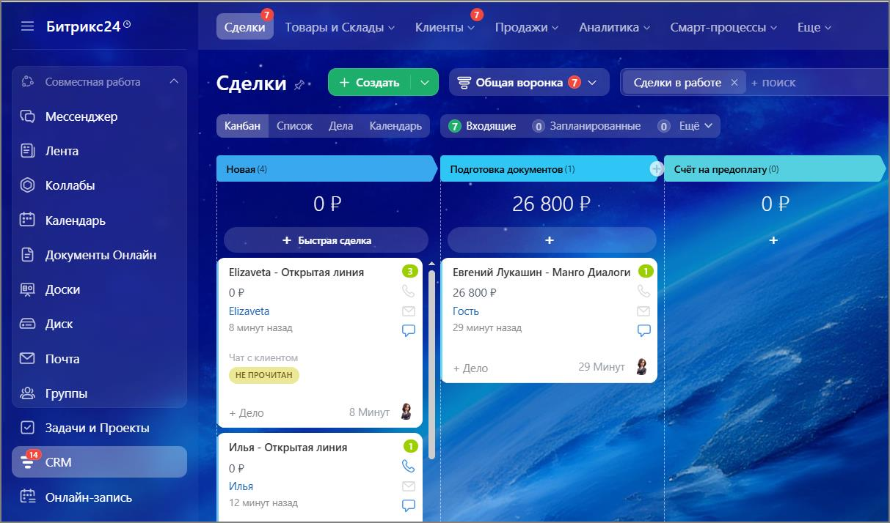
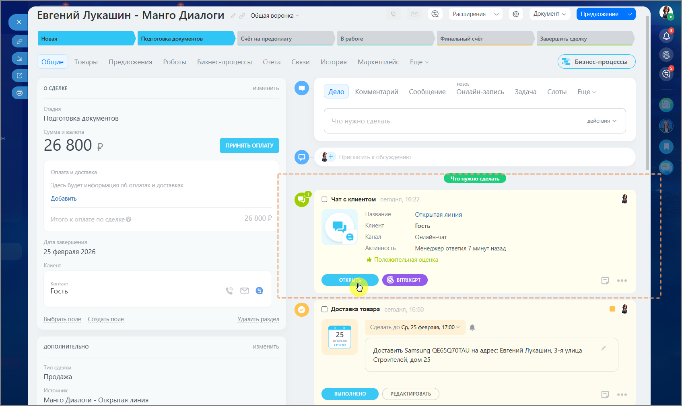
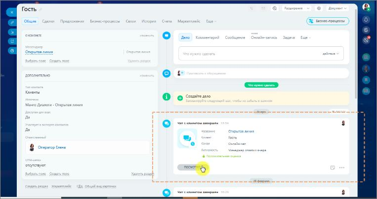

# 2.24.7. Как обрабатывать чаты в Контакт-центре Битрикс24

> Трассировка: PDF §2.24.7 · сквозные стр. 143-146 · источники: ч.1 `kb/mango-product-docs/sources/integration-bitrix24/Mango_office_integration_Bitrix24.pdf` с.143-146.

Как это работает: • Посетитель сайта открывает виджет «Манго Диалоги» и выбирает способ связи из каналов Диалогов, подключенных вами в разделе Подключение каналов «Манго Диалоги» (например, MAX или Чат на сайте).

Интеграция Виртуальной АТС MANGO OFFICE и Битрикс24 | Версия от 03.03.2026 • После отправки сообщения обращение мгновенно попадает в Контакт- центр Битрикс24. • Оператор получает уведомление и отвечает клиенту прямо из окна Мессенджер → Контакт-центр на портале - без переключения между приложениями.

Чат с клиентом автоматически привязывается к контакту клиента в окне CRM → Клиенты → Контакты.

Интеграция Виртуальной АТС MANGO OFFICE и Битрикс24 | Версия от 03.03.2026 Также автоматически создается сделка в окне CRM → Сделки, которую далее можно передвигать по воронке продаж.

Просмотреть сообщения чата можно из окна сделки. К просмотру сообщения чата также можно перейти из карточки клиента.

Благодаря интеграции Манго Диалоги с Битрикс24 все обращения с сайта попадают напрямую операторам Контакт-центра Битрикс24. Клиент пишет сообщение в виджете на сайте, а сотрудник компании отвечает ему уже в знакомом интерфейсе Битрикс24 - на компьютере или в мобильном приложении. Единое окно для всех каналов связи. Интеграция Виртуальной АТС MANGO OFFICE и Битрикс24 | Версия от 03.03.2026
