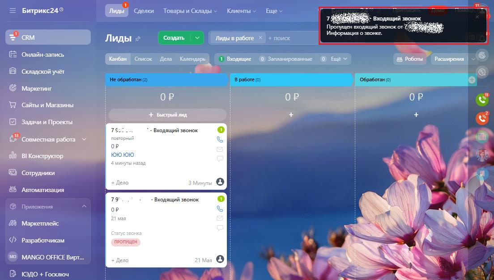
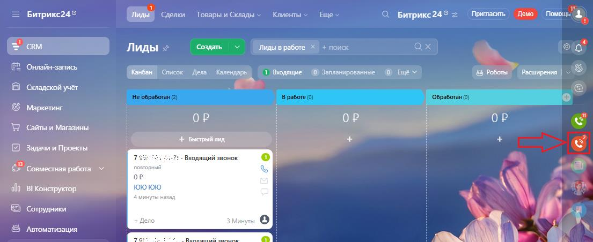
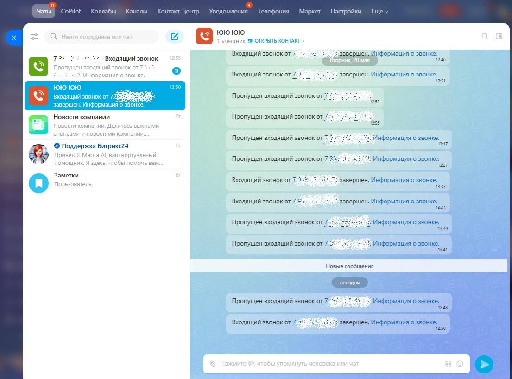
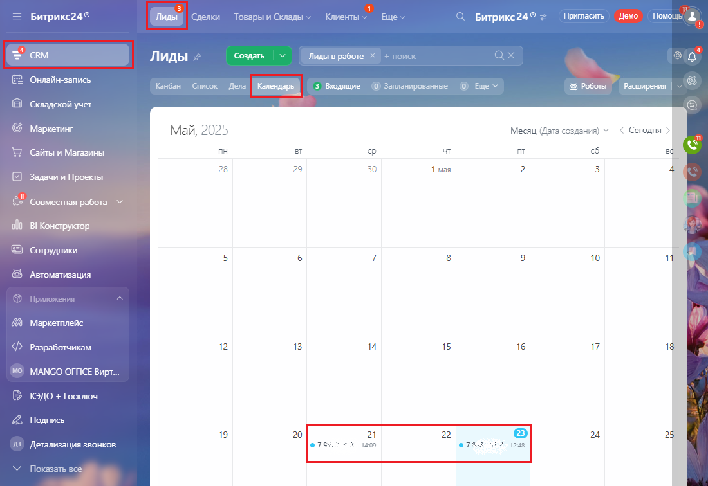

# 3.3. Пропущенные звонки

> Трассировка: PDF §3.3 · сквозные стр. 150-152 · источники: ч.1 `kb/mango-product-docs/sources/integration-bitrix24/Mango_office_integration_Bitrix24.pdf` с.150-152.

Если сотрудник отсутствовал на рабочем месте и были пропущенные звонки, то вне зависимости, был открыт Битрикс24 у него или не был открыт, в Битрикс24 попадет информация о пропущенных звонках. Сначала информация о пропущенном звонке видна в окне уведомления в углу экрана. Примечание. Если в вашем браузере или на мобильном устройстве с установленным приложением Битрикс24 разрешен показ всплывающих сообщений, то информация о пропущенном звонке будет видна во всплывающем сообщении.

Если есть пропущенные звонки, то на значке "красный телефон" в углу будет указано количество звонков, в том числе пропущенных:

Интеграция Виртуальной АТС MANGO OFFICE и Битрикс24 | Версия от 03.03.2026 Чтобы увидеть все пропущенные звонки, необходимо кликнуть на этот значок:

Также, вы можете посмотреть информацию о звонках в календаре, только если в вашем Битрикс24 включена соответствующая настройка. Чтобы посмотреть звонки в календаре, выполните: 1) перейдите в раздел "CRM", выберите "Лиды", затем нажмите ссылку "Календарь"; 2) в открывшемся календаре будут отмечены звонки:

Интеграция Виртуальной АТС MANGO OFFICE и Битрикс24 | Версия от 03.03.2026 Кроме этого, вы можете открыть отчет телефонии "Детализация звонков" и посмотреть информацию о пропущенных звонках. Подробнее о том, как открыть отчет описано в Приложении А.
