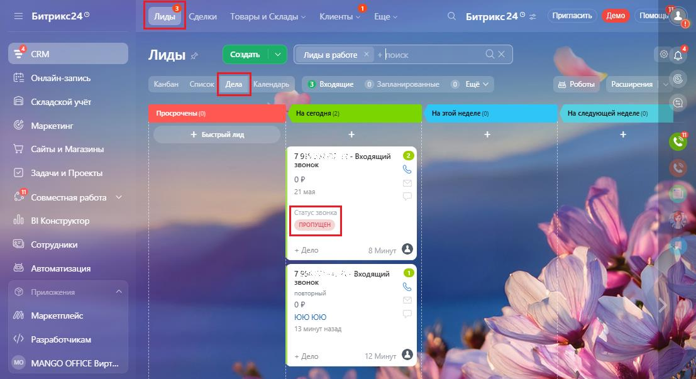
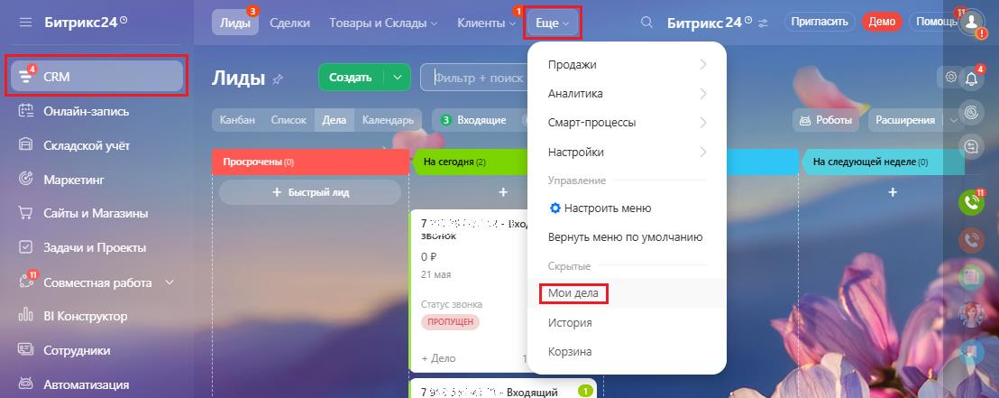
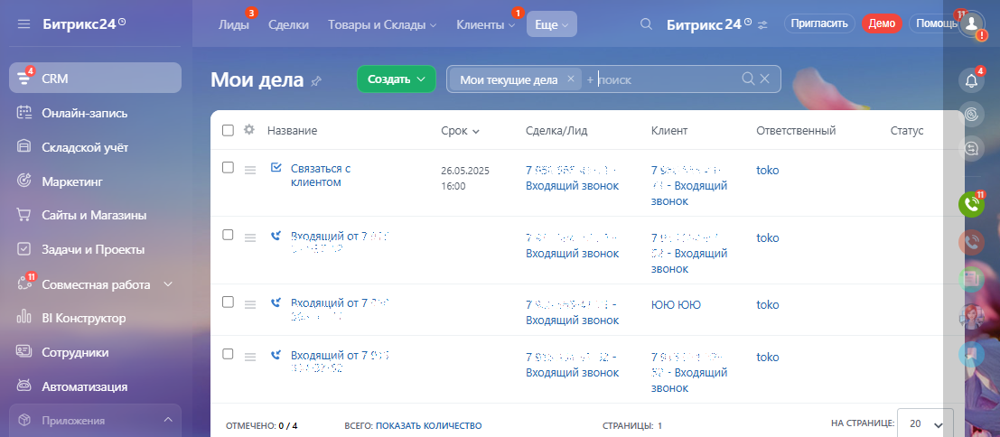

# Обзор

> Трассировка: PDF §3.4 · сквозные стр. 152-154 · источники: ч.1 `kb/mango-product-docs/sources/integration-bitrix24/Mango_office_integration_Bitrix24.pdf` с.152-154.

Чтобы отслеживать и обрабатывать пропущенные звонки, вам нужно включить функцию автоматического создания лида и дела при входящих звонках. Тогда при входящем звонке в Битрикс24 будет создано дело, содержащее следующую информацию: название, срок, имя Клиента, а также текущий статус и ФИО ответственного за обработку звонка. В Битрикс24 лид и дело, прикрепленное к нему, отображаются следующим образом:

Интеграция Виртуальной АТС MANGO OFFICE и Битрикс24 | Версия от 03.03.2026 В Битрикс24 есть раздел "Мои дела", в котором вы можете увидеть все дела, по которым вы назначены ответственным. Чтобы перейти в раздел "Мои дела", в вашем Битрикс24 выполните: 1) перейдите в раздел "CRM"; 2) выберите пункт "Еще"; 3) нажмите на ссылку "Мои дела":

В этом разделе вы можете видеть дела по пропущенным звонкам, а также по сделкам, запланированным звонкам и прочее. Также, в разделе "Мои дела" вы можете смотреть отчетность по эффективности вашей работы с делами. Общий вид раздела "Мои дела" показан на рисунке:

Ваш руководитель может смотреть отчеты о выполнении вами ваших дел, в том числе о количестве пропущенных звонков и результатах их обработки. Примечание. При наличии прав доступа, вы можете посмотреть дела других сотрудников. Интеграция Виртуальной АТС MANGO OFFICE и Битрикс24 | Версия от 03.03.2026
