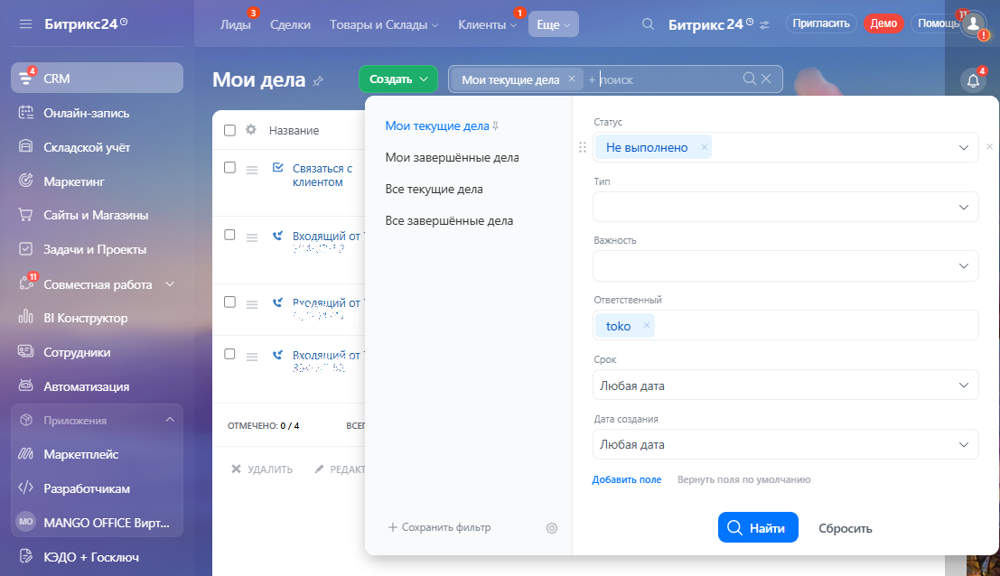
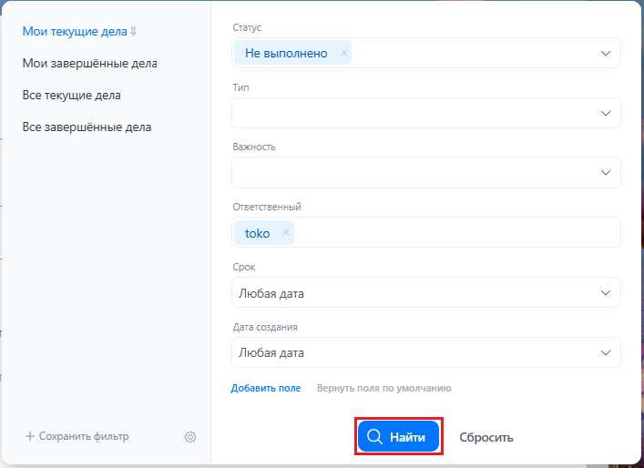
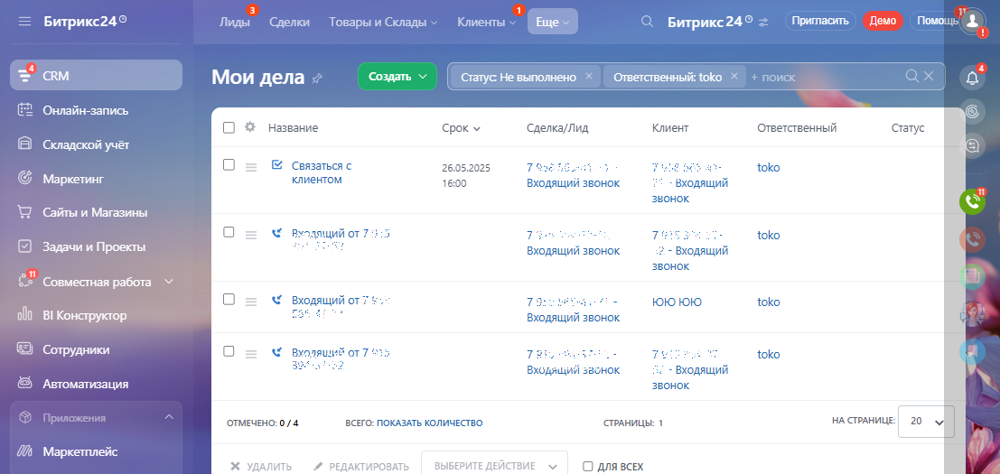
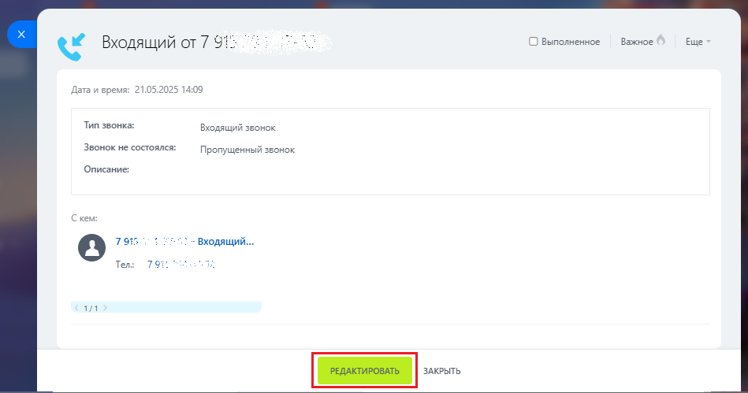
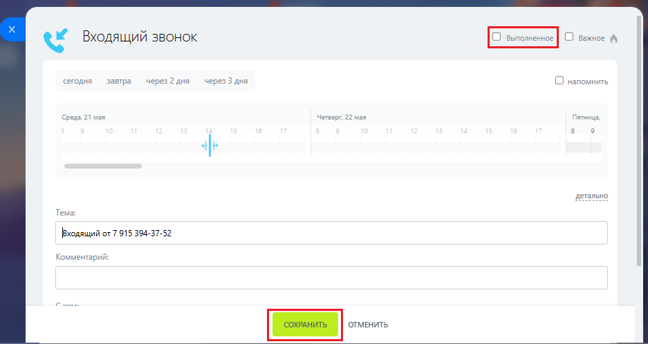
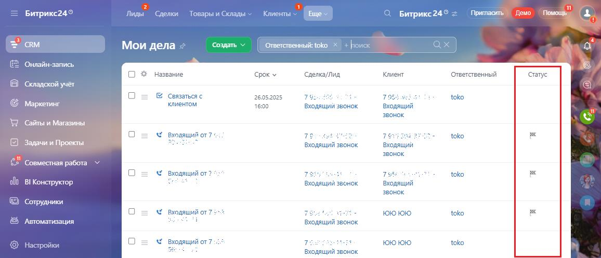

# Как обработать пропущенный звонок

> Трассировка: PDF §3.4 · сквозные стр. 154-157 · источники: ч.1 `kb/mango-product-docs/sources/integration-bitrix24/Mango_office_integration_Bitrix24.pdf` с.154-157.

Для этого, вам нужно открыть ранее созданное дело о входящем звонке, затем позвонить по номеру, указанному в деле, и поговорить со звонившим. При этом результаты переговоров нужно занести в дело в поле "Описание". Закрытие дел выполняется вручную. Чтобы найти дело по пропущенному звонку, в вашем Битрикс24 выполните: 1) перейдите в раздел "CRM", затем выберите пункт "Еще" и нажмите на ссылку "Мои дела":

2) в открывшемся окне вы видите список ваших дел, которые вам нужно выполнить в Битрикс24. Чтобы отфильтровать дела по входящим звонкам, нажмите на поле "Фильтр":

Интеграция Виртуальной АТС MANGO OFFICE и Битрикс24 | Версия от 03.03.2026 3) в открывшемся окне настройте фильтр для поиска дел по входящим звонкам. Для этого укажите следующие параметры поиска: - Статус: не выполнено; - Тип: Звонок (входящий); - Ответственный: выберите себя; 4) нажмите кнопку "Найти". Будет выполнена фильтрация ваших дел по входящим звонкам, а результаты показаны на странице "Мои дела":

Далее, откройте карточку дела, нажав на его название:

Интеграция Виртуальной АТС MANGO OFFICE и Битрикс24 | Версия от 03.03.2026 В открывшейся карточке звонка вы можете: - открыть карточку лида, нажав на ссылку: - позвонить Клиенту, кликнув по номеру телефона. Чтобы добавить комментарий в дело и/или в деле запланировать те или иные действия на будущее (например, перезвонить Клиенту через 2 часа), выполните: 1) нажмите кнопку "Редактировать" в карточке лида. Будет открыто окно редактирования дела;

2) при необходимости, настройте уведомление о выполнении тех или иных действий в деле, добавьте комментарий в дело по результатам звонка этому Клиенту, пометьте дело как важное; 3) чтобы закрыть дело, установите флаг "Выполненное"; 4) нажмите кнопку "Сохранить" чтобы сохранить правки в деле:

Интеграция Виртуальной АТС MANGO OFFICE и Битрикс24 | Версия от 03.03.2026

Закрытые дела помечаются пиктограммой в разделе "Мои дела":

