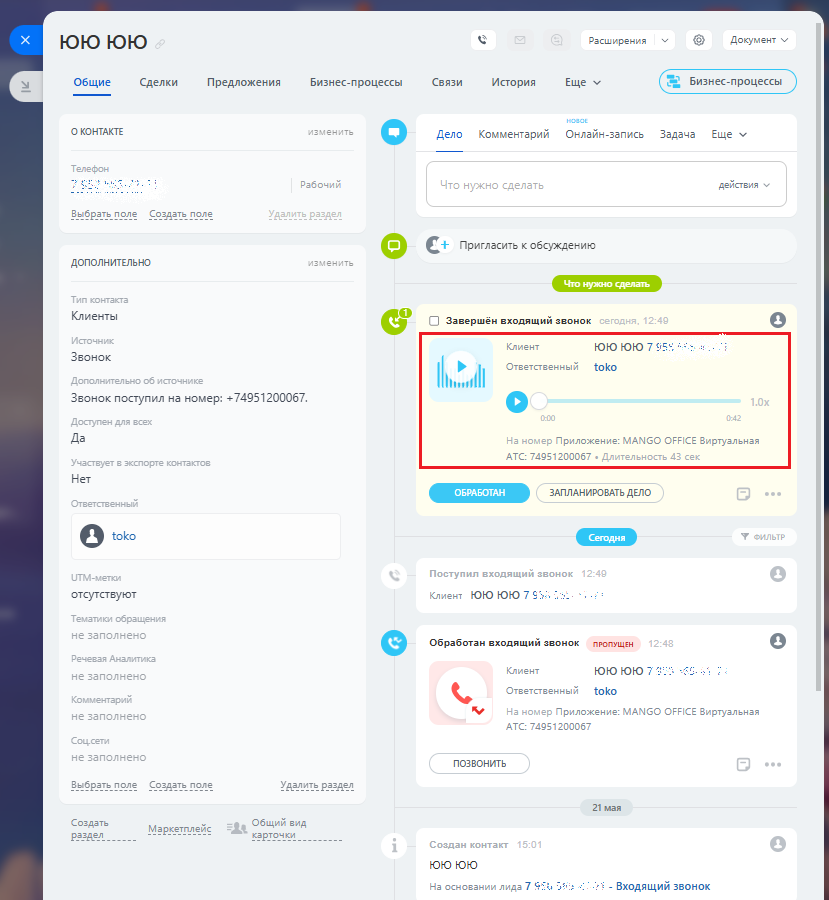

# 3.7. Запись разговоров

> Трассировка: PDF §3.7 · сквозные стр. 159-160 · источники: ч.1 `kb/mango-product-docs/sources/integration-bitrix24/Mango_office_integration_Bitrix24.pdf` с.159-160.

Если в Виртуальной АТС подключена услуга записи разговоров и в настройках API включен флаг "Предоставлять возможность генерации и использования ссылок" (см. Настройка Виртуальной АТС MANGO OFFICE, п.4), то при наличии записи разговора ее можно прослушать в Битрикс24:

Примечания: 1. Запись разговора может отобразиться в карточке контакта с небольшой задержкой. 2. Если длительность разговора менее 6 сек, то запись разговора не сохранится в Виртуальной АТС и соответственно не отобразится в Битрикс24. Если в ходе обработки вызова, сотрудники переводили его на других сотрудников, то в Битрикс24 будет сохранены все записи разговоров Клиентам с каждым из сотрудников. Интеграция Виртуальной АТС MANGO OFFICE и Битрикс24 | Версия от 03.03.2026
