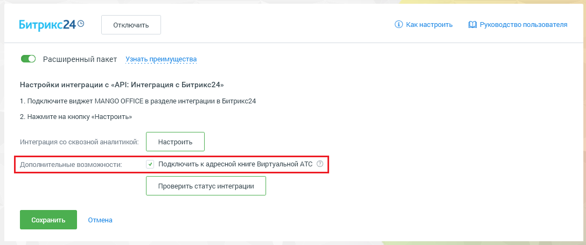
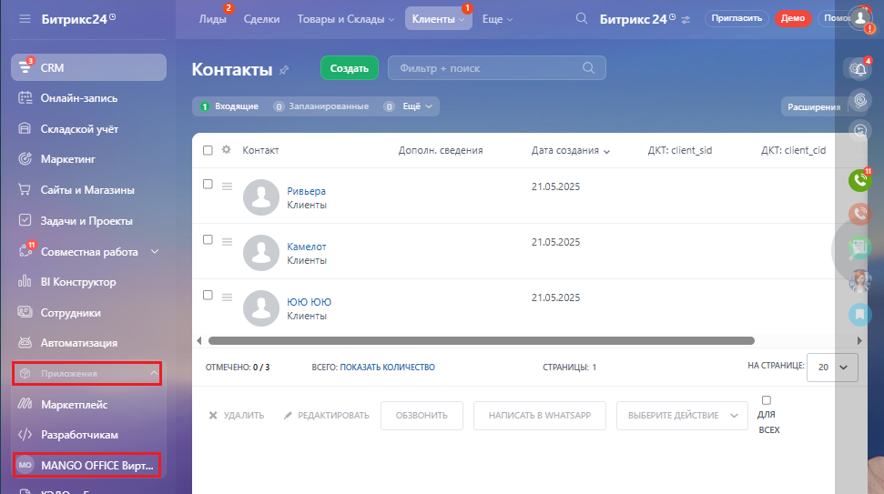
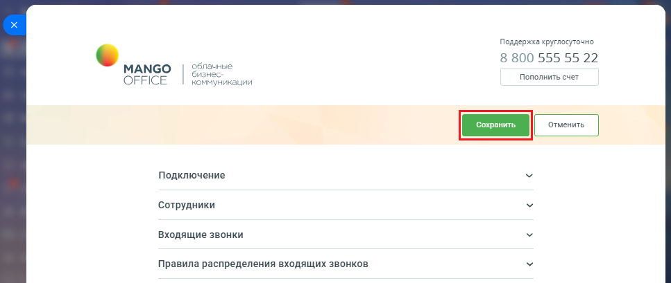
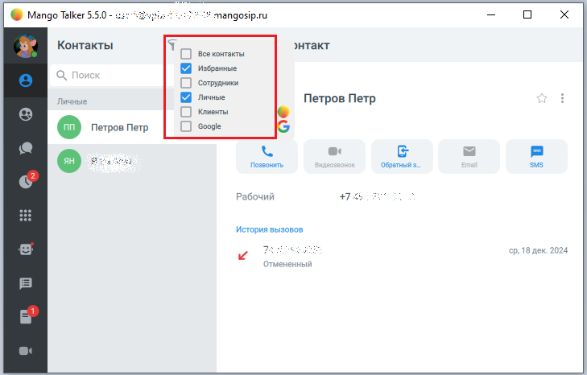
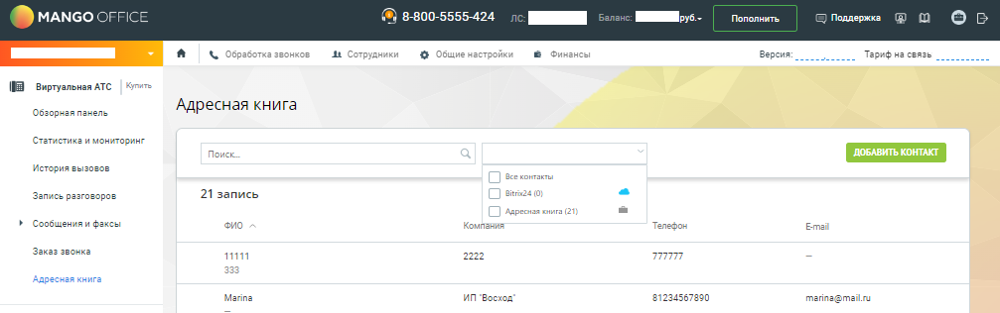

# 4. Интеграция с адресной книгой Виртуальной АТС

> Трассировка: PDF §4 · сквозные стр. 160-163 · источники: ч.1 `kb/mango-product-docs/sources/integration-bitrix24/Mango_office_integration_Bitrix24.pdf` с.160-163.

Если вы используете расширенный пакет интеграции, то в Личном кабинете вы можете подключить Битрикс24 как внешний источник контактов в адресную книгу MANGO OFFICE. Установите флаг "Подключить к адресной книге Виртуальной АТС" и нажмите "Сохранить". Начнется отображение лидов, контактов и компаний из Битрикс24 в адресной книге Виртуальной АТС:

После установки флага "Подключить к адресной книге Виртуальной АТС" пересохраните настройки приложения интеграции. Это необходимо, чтобы номера контактов из Битрикс24 стали доступны в адресной книге Виртуальной АТС. Вот как это сделать: 1) открыть ваш Битрикс24; 2) нажать на ссылку "MANGO OFFICE Виртуальная АТС". Будут открыты настройки приложения интеграции: Интеграция Виртуальной АТС MANGO OFFICE и Битрикс24 | Версия от 03.03.2026

3) нажать кнопку "Сохранить":

Теперь, лиды, контакты и компании из Битрикс24 будут видны: - в Личном кабинете Виртуальной АТС в разделе "Адресная книга"; - в Mango Talker; - в Контакт-Центре. Интеграция Виртуальной АТС MANGO OFFICE и Битрикс24 | Версия от 03.03.2026 В MANGO TALKER:

В Личном кабинете Виртуальной АТС:

Внимание! В адресной книге Виртуальной АТС, ЦОВ, MANGO TALKER вы можете просматривать карточку лида/контакта/компании, но не можете редактировать. Редактировать ее можно только из Битрикс24. Интеграция Виртуальной АТС MANGO OFFICE и Битрикс24 | Версия от 03.03.2026
