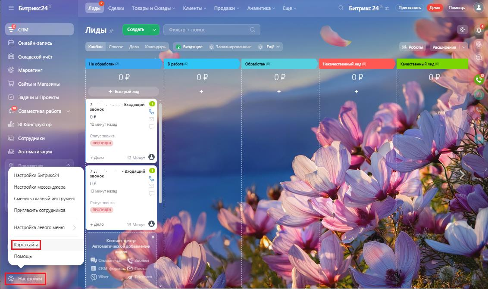
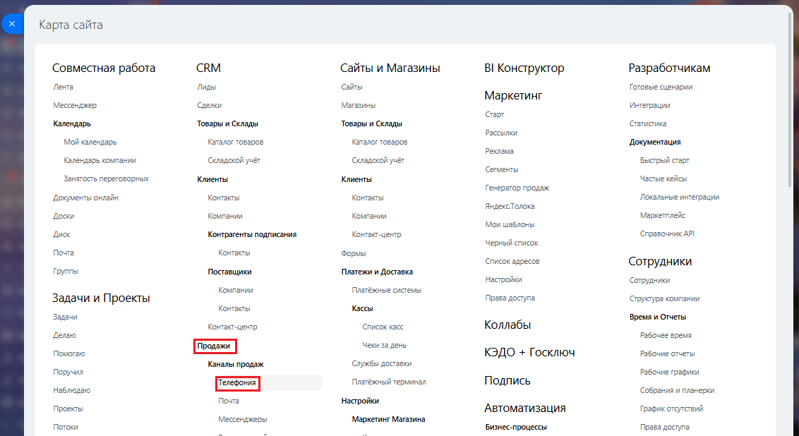
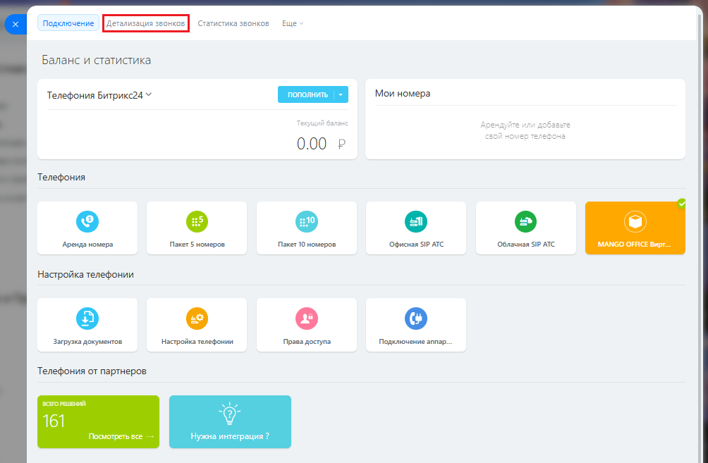
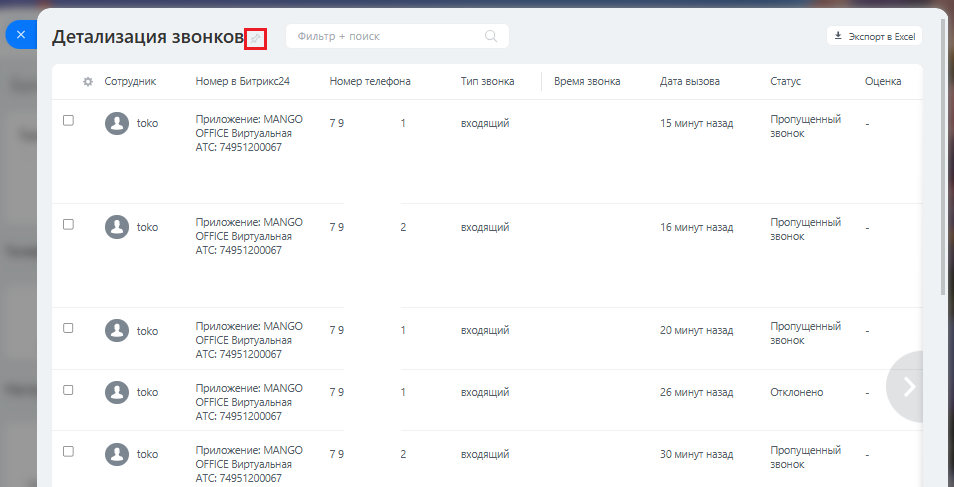

# А. Как открыть отчет "Детализация звонков" в Битрикс24

> Трассировка: PDF §— · сквозные стр. 170-172 · источники: ч.1 `kb/mango-product-docs/sources/integration-bitrix24/Mango_office_integration_Bitrix24.pdf` с.170-172.

Чтобы открыть отчет "Детализация звонков", в вашем Битсрикс24 выполните: 1) нажмите "Настройки"; 2) выберите пункт "Карта сайта"

3) нажмите "Телефония" в блоке "Продажи":

4) нажмите на пункт "Детализация звонков"; Интеграция Виртуальной АТС MANGO OFFICE и Битрикс24 | Версия от 03.03.2026

5) будет открыт отчет "Детализация звонков";

6) чтобы этот отчет отображался постоянно в меню Битрикс24, нажмите на

кнопку около названия отчета. Интеграция Виртуальной АТС MANGO OFFICE и Битрикс24 | Версия от 03.03.2026
