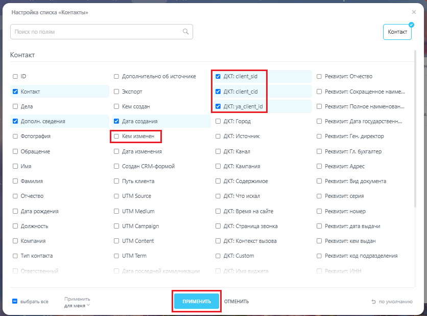
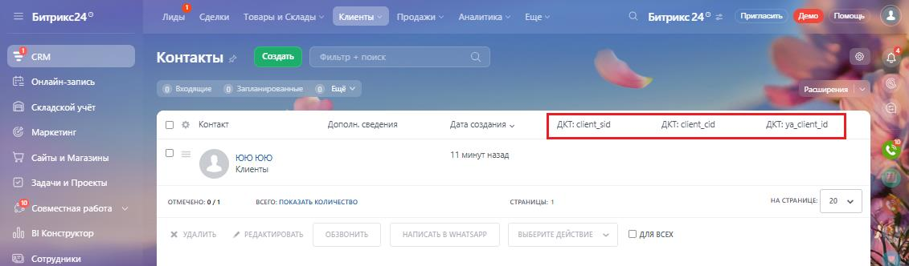

# Б. Настройка отображения колонок в списке лидов, сделок, контактов

> Трассировка: PDF §— · сквозные стр. 172-174 · источники: ч.1 `kb/mango-product-docs/sources/integration-bitrix24/Mango_office_integration_Bitrix24.pdf` с.172-174.

контактов Чтобы настроить отображение колонок в списке "Контакты" \ "Лиды \ "Контакты", в вашем Битрикс24 следует: 1) откройте нужный раздел: "Контакты" \ "Лиды \ "Контакты;

2) нажмите на кнопку "Шестеренка" в заголовке списка;

3) настройте отображение колонок: - активируйте "галочки" в названии тех колонок, которые надо показать (например, в колонках "ДКТ:…"); - деактивируйте "галочки" в названии тех колонок, которые надо скрыть (например, в колонке "Кем изменен"); 4) нажмите кнопку "Применить"; Интеграция Виртуальной АТС MANGO OFFICE и Битрикс24 | Версия от 03.03.2026

5) будут отображены выбранные вами колонки (например, в колонках "ДКТ:…").

Интеграция Виртуальной АТС MANGO OFFICE и Битрикс24 | Версия от 03.03.2026
